# Diagram 02 — 15 Strategic Threads × Concept Docs × NCs

```mermaid
graph TD
    KEY[KEYSTONE audio_686<br/>18.05 15:22]:::keystone
    KEY --> T8[T8 Engineer Workshop<br/>STOPPER F5]:::stopper
    KEY --> T13[T13 EOY 2026 Targets<br/>1M/$1B/100M]
    KEY --> T14[T14 6-Resource Investor<br/>5+1 GAP]
    KEY --> T10[T10 Table-of-Hundreds<br/>150-300 contacts]

    A684[audio_684 anti-Sisyphus] --> T7[T7 Anti-Sisyphus +<br/>Responsibility-Era H9]:::pending
    A684 --> T12[T12 5-Step Pizdaty<br/>Pattern]
    A687[audio_687 responsibility-era] --> T7
    A687 --> T11[T11 Brain Extension<br/>Skill Test]
    A687 --> T9[T9 BFG Workshop<br/>6-element]

    A685[audio_685 two-stage launch] --> T6[T6 Two-Stage Launch<br/>elite → mass]
    T008[text_008 hackathon push] --> T1[T1 Hackathon Platform<br/>Primary Growth Vehicle]
    T009[text_009 10+ threads] --> T2[T2 Recursive Engine<br/>IP-1 STRICT]
    T009 --> T3[T3 System Merger<br/>FPF Protocol H9-root]
    T009 --> T4[T4 Outreach Scalable<br/>10→100→personalized]
    T009 --> T5[T5 Education Layer<br/>Master-Apprentice]

    T007[text_007 Buterin Ethereum] --> T15[T15 Ethereum Substrate +<br/>R12 Programmable]:::locked

    T8 -.blocks.-> T1
    T8 -.blocks.-> T5
    T8 -.blocks.-> T2

    T7 --> H9P[H9 LOCK Packet<br/>Pending Ruslan ack]:::pending
    T15 --> H8L[H8 Octagon LOCKED<br/>17.05 evening]:::locked

    T13 --> PD[Pitch Deck v1<br/>C.2 P1]:::todo
    T14 --> PD
    T10 --> OQ[Outreach Queue v1<br/>C.9 P1]:::todo
    T1 --> H6[H6 Hackathon Pre-eminent<br/>AWAITING-APPROVAL]:::pending

    classDef keystone fill:#fc9,stroke:#000,stroke-width:3px
    classDef stopper fill:#f99,stroke:#000,stroke-width:2px
    classDef locked fill:#9f9
    classDef pending fill:#ff9
    classDef todo fill:#cdf
```

---

## 15 Threads — F-grade summary

| # | Thread | F | NC / wiki path | Cross-ref |
|---|---|---|---|---|
| T1 | Hackathon Platform — primary growth vehicle | F2 / F3-candidate | O-25 | `decisions/strategic/JETIX-AS-HACKATHON-PLATFORM-2026-05-18.md` |
| T2 | Recursive Self-Development Engine (IP-1 STRICT) | F2 | O-27 | `decisions/strategic/JETIX-RECURSIVE-SELF-DEVELOPMENT-ENGINE-2026-05-18.md` |
| T3 | System Merger Protocol FPF (H9 root) | F2 | O-28 | `decisions/strategic/JETIX-SYSTEM-MERGER-PROTOCOL-FPF-2026-05-18.md` |
| T4 | Outreach Scalable (10→100→personalized) | F2 | O-29 | `decisions/strategic/JETIX-OUTREACH-SYSTEM-SCALABLE-2026-05-18.md` |
| T5 | Education Layer (4 Cs + Master-Apprentice) | F2 | O-26 | `decisions/strategic/JETIX-EDUCATION-LAYER-SYSTEM-THINKING-2026-05-18.md` |
| T6 | Two-Stage Launch Protocol | F4 | O-34 | `wiki/concepts/two-stage-launch-protocol.md` |
| T7 | Anti-Sisyphus + Responsibility-Era (H9 candidate) | F3 | O-33 + O-39 | `wiki/ideas/anti-sisyphus-meaning-substrate.md` + `wiki/ideas/responsibility-era-thesis.md` |
| T8 | Engineer Workshop STOPPER | F5 | O-38 | (BL-1 immediate; всё blocks) |
| T9 | BFG-style Workshop 6-element | F4 | O-30 | `wiki/concepts/offline-workspace-6-elements.md` |
| T10 | Table-of-Hundreds Outreach | F4 | O-31 | `wiki/concepts/table-of-hundreds-outreach.md` |
| T11 | Brain Extension Skill Test | F4 | O-41 | `wiki/ideas/brain-extension-skill-test.md` |
| T12 | 5-Step Pizdaty Pattern (methodology unit) | F3 | O-33-companion | `wiki/ideas/5-step-pizdaty-pattern.md` |
| T13 | EOY 2026 Numerical Targets (1M / $1B / 100M) | F2 aspirational + F4 cascade | O-36 | `wiki/concepts/numerical-targets-eoy-2026.md` |
| T14 | 6-Resource Investor Model (5 + GAP) | F3 | O-37 | `wiki/ideas/6-resource-investor-model.md` |
| T15 | Ethereum Substrate + R12 Programmable | Ack'd Option A + D | (H8 overlay) | `swarm/awaiting-approval/h8-ethereum-substrate-extension-2026-05-18.md` + `r12-programmable-ethereum-2026-05-18.md` |

## Dependencies highlight (T8 = STOPPER)

T8 (Engineer Workshop) blocks:
- T1 Hackathon Platform (Q3 2026 first event needs engineer cohort)
- T2 Recursive Engine (substrate built by engineers)
- T5 Education Layer (Master Workshop founding cohort)

→ **BL-1 unblock = critical path start.** Doc 2 §1 details 7-step cascade.

---

*Mermaid diagram 02 for Doc 1 §7 sprint-synthesis-2026-05-19.*
