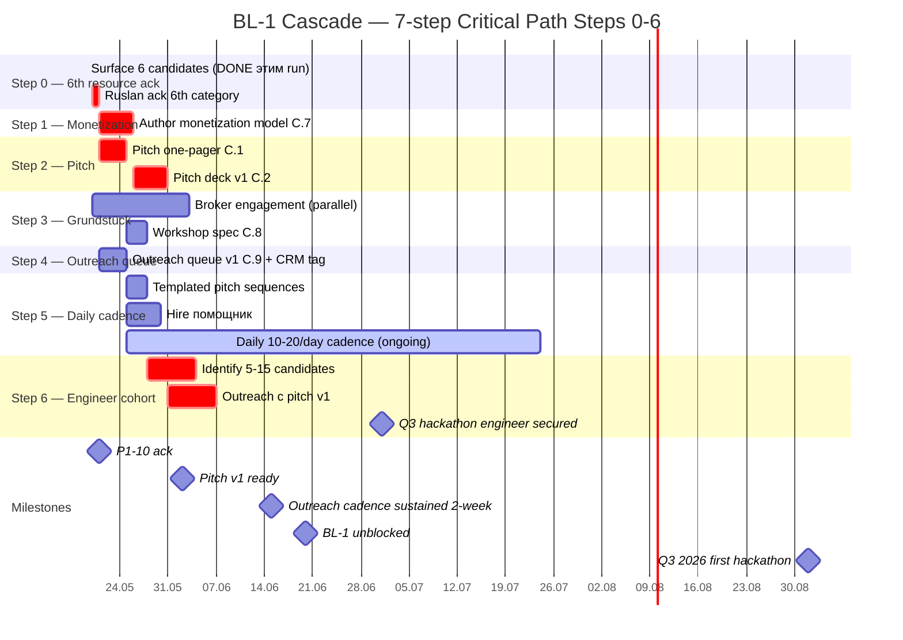

# Diagram 03 — Critical Path 7-14 day Gantt

---

## Critical path commentary

- **Step 0 (1-day blocker)** unblocks Steps 1, 5: 6-resource clarity → monetization category + outreach queue tagging
- **Steps 1+2 sequential** — monetization → pitch (pitch needs unit econ)
- **Steps 3+4 parallel** — Grundstück broker + outreach queue (independent)
- **Step 5 ongoing** — daily cadence starts after pitch artifact ready
- **Step 6 = STOPPER UNBLOCK** — engineer cohort identification + outreach с pitch v1; 7d sprint after Step 2 done
- **Q3 2026 milestone** — first hackathon event (Berlin or adjacent; €23K budget; 30 participants 5-7 teams)

## F-grade per step

| Step | F | Aspirational vs operational |
|---|---|---|
| 0 | F2 (gap question) | Operational ack |
| 1 | F2 (aspirational $1B target) + F4 (unit econ math) | Mixed |
| 2 | F3 (pitch quality) | Operational |
| 3 | F4 (2-month timeline anchor) | Operational |
| 4 | F4 (150-300 contacts cascade math) | Operational |
| 5 | F3 (sustained cadence; depends on помощник + execution) | Operational |
| 6 | **F5 STOPPER** (Ruslan-explicit; primary blocker) | Critical |
| Q3 milestone | F2 aspirational | Aspirational |

---

*Mermaid diagram 03 for Doc 2 §1 sprint-synthesis-2026-05-19.*
