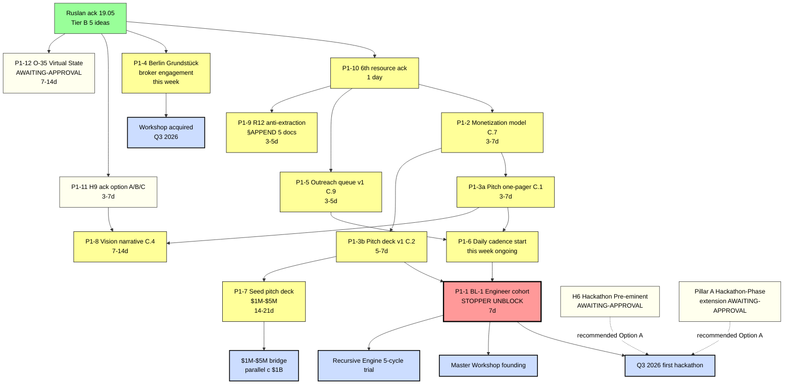

# Diagram 04 — 12 P1 Decisions Flow + Blockers

---

## Decision tree summary

12 P1 + 3 AWAITING-APPROVAL packets:

### P1 cluster A — promotion package + monetization (Steps 1-2)
- P1-2 monetization → P1-3a one-pager → P1-3b deck
- Blocks: outreach cadence Step 5

### P1 cluster B — outreach substrate (Steps 4-5)
- P1-5 queue → P1-6 cadence
- Depends: P1-10 (6-resource tagging)

### P1 cluster C — workshop substrate (Step 3)
- P1-4 broker engagement (independent timeline; 2-month acquisition)

### P1 cluster D — BL-1 STOPPER unblock (Step 6)
- P1-1 engineer cohort — DEPENDS on all clusters A+B

### P1 cluster E — strategic narrative (parallel)
- P1-8 Vision narrative C.4
- P1-11 H9 ack
- P1-12 O-35 AWAITING-APPROVAL

### P1 cluster F — capital substrate (parallel)
- P1-7 Seed deck $1M-$5M (parallel с C.2 $1B pitch)

### P1 cluster G — constitutional alignment
- P1-9 R12 anti-extraction §APPEND 5 concept docs (before outreach scaling)

---

*Mermaid diagram 04 for Doc 2 §3 sprint-synthesis-2026-05-19.*
