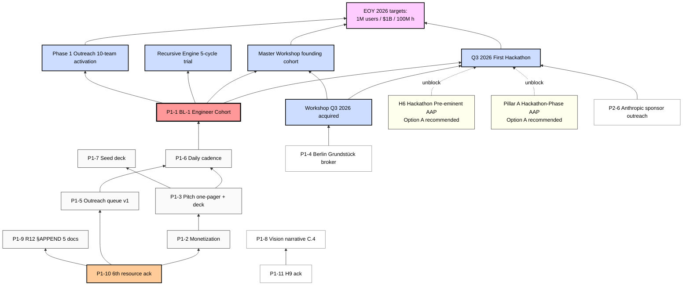

# Diagram 05 — Dependency Map

---

## Dependency analysis

### Critical path (BL-1 cascade)
**Root (Step 0)** → P1-10 6th resource ack (1d)
↓
**Substrate (Steps 1-2)** → P1-2 monetization (3-7d) → P1-3 pitch (3-7d each)
↓
**Operational (Steps 4-5)** → P1-5 outreach queue (3-5d) → P1-6 daily cadence
↓
**STOPPER unblock (Step 6)** → P1-1 engineer cohort identification (7d)
↓
**Q3 2026 cluster:** First hackathon + Master Workshop founding + Recursive Engine trial + Phase 1 outreach 10-team

### Parallel paths (non-blocking critical path)
- P1-4 Grundstück broker → Workshop Q3 2026 acquired (2-month timeline)
- P1-11 H9 ack → P1-8 Vision narrative (L3 audience pitch substrate)
- P1-7 Seed deck → $1M-$5M bridge (near-term capital для Steps 1-6 funding)
- P1-9 R12 §APPEND 5 docs → constitutional alignment before outreach scaling

### AWAITING-APPROVAL gates
- AAP-H6 (Hackathon Pre-eminent) → unblocks formal Q3 hackathon prioritization framing
- AAP-Pillar A (Hackathon-Phase) → unblocks Year-1 calendar formalization
- AAP-H9 (Responsibility-Era) → enables L3 vision narrative C.4 LOCKED framing (optional; R1 surface alternative)

### Aspirational EOY target
- 1M users / $1B raise / 100M user-hours by 31.12.2026 = F2 aspirational
- Depends on Q3 2026 cluster + sustained Stage 1 plan-mode (audio_685) → Stage 2 mass-spread post Q1 2027

---

*Mermaid diagram 05 for Doc 2 §8 sprint-synthesis-2026-05-19.*
