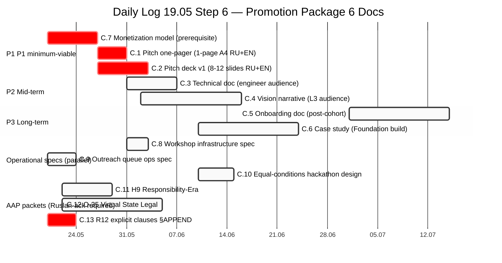

# Diagram 06 — Promotion Package 6-Doc Roadmap

---

## Package summary (13 docs total — 6 promotion + 4 operational specs + 3 AAP)

### 6 promotion package (Daily Log 19.05 Step 6 цель)

| # | Doc | Priority | Owner | Time |
|---|---|---|---|---|
| C.1 | Pitch one-pager (1-page A4 RU+EN) | P1 | Ruslan-drafted; brigadier-compile | 3-7d |
| C.2 | Pitch deck v1 (8-12 slides RU+EN) | P1 | Ruslan-drafted; brigadier-compile | 5-7d |
| C.3 | Technical doc (engineer audience) | P2 | Brigadier-authored; Ruslan-ack | 7-14d |
| C.4 | Vision narrative (long-form L3) | P2 | Ruslan-drafted; brigadier-philosophy assist | 7-14d |
| C.5 | Onboarding doc (new cohort) | P3 | Brigadier-authored; Ruslan-ack | post-Step 6 |
| C.6 | Case study (Foundation build) | P3 | Brigadier-compiled; Ruslan-ack | 14-21d |

### 4 operational specs (Daily Log Step 5 substrate)

| # | Doc | Priority | Owner | Time |
|---|---|---|---|---|
| C.7 | Monetization model | **P1 (critical path)** | Ruslan + brigadier | 3-7d |
| C.8 | Workshop infrastructure spec | P1 | Brigadier; Ruslan-ack | 3-5d |
| C.9 | Outreach queue ops spec | P1 | Brigadier-build; Ruslan-ack | 3-4d |
| C.10 | Equal-conditions hackathon design (€300K cost test) | P2 | Brigadier; Ruslan-ack | 5d |

### 3 AWAITING-APPROVAL packets

| # | Packet | Recommendation |
|---|---|---|
| C.11 | H9 Responsibility-Era (Octagon LOCK candidate) | Option A — surface 3 candidates; NO LOCK by brigadier |
| C.12 | O-35 Virtual State Legal (Balaji deferred trigger) | Defer or fold into legal substrate research run |
| C.13 | R12 explicit clauses §APPEND 5 concept docs (voluntary + fork-and-leave) | **P1 critical — before outreach scaling** |

---

## Critical sequencing для outreach Step 5

C.7 monetization → C.1 one-pager → C.2 deck v1 → outreach cadence start

C.13 R12 clauses must be §APPEND'd to 5 concept docs BEFORE Step 5 outreach scaling (constitutional alignment + R12 «all-in» tension mitigation).

---

*Mermaid diagram 06 for Doc 2 §2 sprint-synthesis-2026-05-19.*
