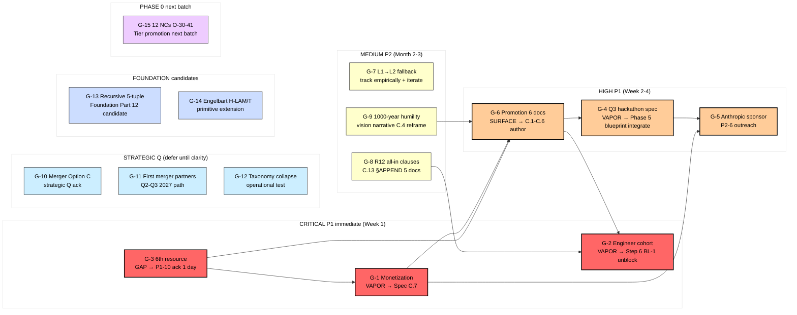

# Diagram 08 — Gap Closure Flow

---

## Gap closure sequencing

### Week 1 (next 7d) — 3 critical gaps
- G-3 6th resource (1-day ack — unblock G-1 + G-6)
- G-1 Monetization C.7 (3-7d) — blocks G-5/G-6
- G-2 Engineer cohort substrate (start identification process)

### Week 2-4 — 3 high gaps
- G-4 Q3 hackathon spec (integrate `research/hackathon-platform-deep-2026-05-18/` Phase 5)
- G-5 Anthropic sponsor outreach (after G-1 monetization clear)
- G-6 Promotion 6 docs (C.1-C.6 — Daily Log Step 6)

### Month 2-3 — 3 medium gaps
- G-7 L1→L2 fallback (empirical tracking начало; iterate pitch)
- G-8 R12 all-in clauses (C.13 §APPEND before outreach scaling)
- G-9 1000-year humility reframe (vision narrative C.4)

### Strategic Q (defer)
- G-10/11/12 — System Merger Option C + first merger partners + taxonomy operational test (Q2-Q3 2027)

### Foundation candidates (next deep research batch)
- G-13/14 — Recursive 5-tuple + Engelbart extension → potential Foundation Part 12 / Foundation primitive extension (AWAITING-APPROVAL packet path)

### Phase 0 next batch
- G-15 — 12 NCs O-30-41 Tier promotion: re-evaluate based on operational evidence (Tier B → Tier A possible if voice-corroborated; Tier C → Tier B possible if subsumption breaks)

---

## Foundation impact matrix

| Gap | Foundation impact | Octagon impact | Strategic Layer impact |
|---|---|---|---|
| G-1 Monetization | none (RUSLAN-LAYER) | H2 Capital cross-ref | Pillar A direction-card |
| G-2 Engineer | none direct | H5 People cross-ref | direction-card recruitment |
| G-3 6th resource | none | H2 cross-ref | direction-card resource |
| G-13 Recursive 5-tuple | Part 12 candidate | none direct | Pillar A 7th doc-type? |
| G-14 Engelbart | primitive extension | none | Pillar A 8th doc-type? |

---

*Mermaid diagram 08 for Doc 3 §8 sprint-synthesis-2026-05-19.*
