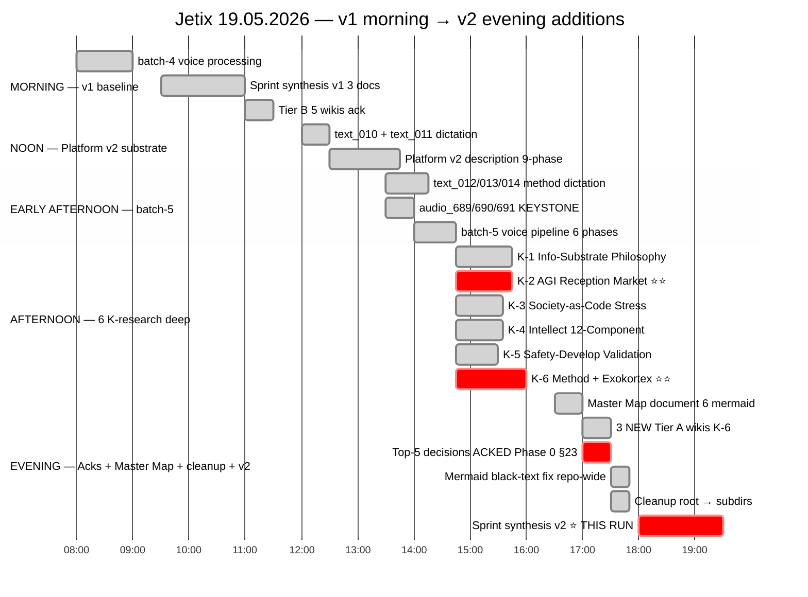

# Diagram 01 — 19.05 day-of additions timeline (v1 → v2)

```mermaid
%%{init: {'theme':'base', 'themeVariables': {'primaryTextColor':'#000000','textColor':'#000000','lineColor':'#333333','primaryBorderColor':'#333333','primaryColor':'#fafafa','noteTextColor':'#000000','noteBkgColor':'#fff8d5','edgeLabelBackground':'#ffffff'}}}%%
gantt
    title Jetix 19.05.2026 — v1 morning → v2 evening additions
    dateFormat HH:mm
    axisFormat %H:%M

    section MORNING — v1 baseline
    batch-4 voice processing            :done, b4, 08:00, 60m
    Sprint synthesis v1 3 docs          :done, ss1, 09:30, 90m
    Tier B 5 wikis ack                  :done, tb, 11:00, 30m

    section NOON — Platform v2 substrate
    text_010 + text_011 dictation       :done, t1011, 12:00, 30m
    Platform v2 description 9-phase     :done, pv2, 12:30, 75m

    section EARLY AFTERNOON — batch-5
    text_012/013/014 method dictation   :done, t1214, 13:30, 45m
    audio_689/690/691 KEYSTONE          :done, k, 13:30, 30m
    batch-5 voice pipeline 6 phases     :done, b5, 14:00, 45m

    section AFTERNOON — 6 K-research deep
    K-1 Info-Substrate Philosophy        :done, k1, 14:45, 60m
    K-2 AGI Reception Market ⭐⭐         :crit, k2, 14:45, 60m
    K-3 Society-as-Code Stress           :done, k3, 14:45, 50m
    K-4 Intellect 12-Component           :done, k4, 14:45, 50m
    K-5 Safety-Develop Validation        :done, k5, 14:45, 45m
    K-6 Method + Exokortex ⭐⭐           :crit, k6, 14:45, 75m

    section EVENING — Acks + Master Map + cleanup + v2
    Master Map document 6 mermaid       :done, mm, 16:30, 30m
    3 NEW Tier A wikis K-6              :done, ta, 17:00, 30m
    Top-5 decisions ACKED Phase 0 §23   :crit, ack, 17:00, 30m
    Mermaid black-text fix repo-wide    :done, fix, 17:30, 20m
    Cleanup root → subdirs              :done, cl, 17:30, 20m
    Sprint synthesis v2 ⭐ THIS RUN      :crit, ss2, 18:00, 90m
```
