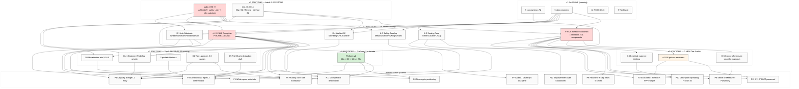

# Diagram 02 — 13 cross-stream patterns × v1→v2 additions concept map

```mermaid
%%{init: {'theme':'base', 'themeVariables': {'primaryTextColor':'#000000','textColor':'#000000','lineColor':'#333333','primaryBorderColor':'#333333','primaryColor':'#fafafa','noteTextColor':'#000000','noteBkgColor':'#fff8d5','edgeLabelBackground':'#ffffff'}}}%%
graph TB
    subgraph "v1 BASELINE (morning)"
        V1A[5 concept docs F2]
        V1B[5 deep research]
        V1C[12 NC O-30-41]
        V1D[5 Tier B wiki]
    end

    subgraph "v2 ADDITIONS — Platform v2 substrate"
        P[Platform v2<br/>22p × 32r × 15m × 20o]
    end

    subgraph "v2 ADDITIONS — batch-5 KEYSTONE"
        B5A[audio_690 ⭐⭐<br/>AGI redef + safety→dev + info-substrate]
        B5B[text_010-014<br/>22p / 32r / Reveal / Method 31]
    end

    subgraph "v2 ADDITIONS — 6 K-research deep"
        K1[K-1 Info-Substrate<br/>Wheeler/Wolfram/Floridi/Bateson]
        K2[⭐⭐ K-2 AGI Reception<br/>PITCH-BLOCKING]
        K3[K-3 Society-Code<br/>Toffler/Castells/Lessig]
        K4[K-4 Intellect 12<br/>Sternberg/CHC/Gardner]
        K5[K-5 Safety-Develop<br/>Maslow/SRE/TPS/Knight/Taleb]
        K6[⭐⭐ K-6 Method+Exokortex<br/>10 thinkers × 31 components]
    end

    subgraph "v2 ADDITIONS — 3 NEW Tier A wikis"
        TA1[O-52 method-systems-thinking]
        TA2[⭐ O-56 jetix-as-exokortex]
        TA3[O-53 sense-of-measure-scientific-approach]
    end

    subgraph "v2 ADDITIONS — Top-5 ACKED 19.05 evening"
        D1[D1 Monetization mix V1-V5]
        D2[BL-1 Engineer Workshop priority]
        D3[3 packets Option A]
        D4[D2 Tier-1 partners 2-3 names]
        D5[D5 R12 Charter brigadier-draft]
    end

    subgraph "13 cross-stream patterns"
        PP1[P1 White-space substrate]
        PP2[P2 Exokortex × Method × FPF triangle]
        PP3[P3 Constitutional triple L3 differentiator]
        PP4[P4 Karpathy lineage L1 entry]
        PP5[P5 Plurality cross-cite mandatory]
        PP6[P6 Non-crypto positioning]
        PP7[P7 Safety→Develop 5-discipline]
        PP8[P8 Sense-of-Measure ≈ Parsimony]
        PP9[P9 Recursive 8-step nests 5-cycles]
        PP10[P10 Description-spreading H-MST-26]
        PP11[P11 IP-1 STRICT preserved]
        PP12[P12 Empowerment over Solutionism]
        PP13[P13 Composition defensibility]
    end

    B5A --> K1 & K2 & K5
    B5A --> D1 & D2
    B5B --> P
    B5B --> K4 & K6
    
    P --> PP1 & PP6 & PP13
    K2 --> PP1 & PP3 & PP4 & PP5 & PP6 & PP13
    K6 --> PP2 & PP8 & PP9 & PP10 & PP11
    K1 --> PP3 & PP4 & PP5
    K3 --> PP3 & PP5 & PP12
    K4 --> PP4
    K5 --> PP7
    
    K6 --> TA1 & TA2 & TA3
    K2 --> D1 & D2
    
    V1A --> P
    V1B --> K1 & K2 & K3 & K4 & K5 & K6
    
    TA1 --> PP10
    TA2 --> PP2 & PP11
    TA3 --> PP8
    
    D1 --> PP13
    D2 --> PP4
    D3 --> PP3
    D4 --> PP4 & PP5
    D5 --> PP3

    style K2 fill:#ffd6d6,color:#000
    style K6 fill:#ffd6d6,color:#000
    style B5A fill:#ffd6d6,color:#000
    style TA2 fill:#fff4e6,color:#000
    style P fill:#d6f0d6,color:#000
```
