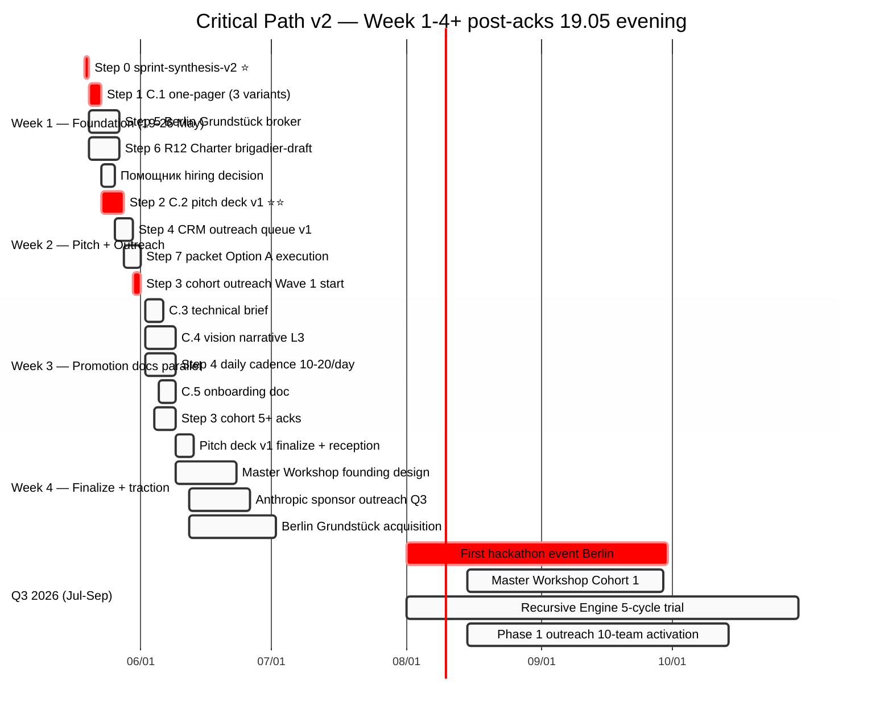

# Diagram 03 — Critical Path 7-14d v2 Gantt (acks-driven sequencing)

```mermaid
%%{init: {'theme':'base', 'themeVariables': {'primaryTextColor':'#000000','textColor':'#000000','lineColor':'#333333','primaryBorderColor':'#333333','primaryColor':'#fafafa','noteTextColor':'#000000','noteBkgColor':'#fff8d5','edgeLabelBackground':'#ffffff'}}}%%
gantt
    title Critical Path v2 — Week 1-4+ post-acks 19.05 evening
    dateFormat YYYY-MM-DD
    axisFormat %m/%d

    section Week 1 — Foundation (19-26 May)
    Step 0 sprint-synthesis-v2 ⭐         :crit, s0, 2026-05-19, 1d
    Step 1 C.1 one-pager (3 variants)   :crit, s1, 2026-05-20, 3d
    Step 5 Berlin Grundstück broker      :s5, 2026-05-20, 7d
    Step 6 R12 Charter brigadier-draft   :s6, 2026-05-20, 7d
    Помощник hiring decision             :ph, 2026-05-23, 3d

    section Week 2 — Pitch + Outreach
    Step 2 C.2 pitch deck v1 ⭐⭐         :crit, s2, after s1, 5d
    Step 4 CRM outreach queue v1         :s4a, 2026-05-26, 4d
    Step 7 packet Option A execution    :s7, 2026-05-28, 4d
    Step 3 cohort outreach Wave 1 start :crit, s3a, 2026-05-30, 2d

    section Week 3 — Promotion docs parallel
    C.3 technical brief                  :s8, 2026-06-02, 4d
    C.4 vision narrative L3              :s9, 2026-06-02, 7d
    Step 4 daily cadence 10-20/day       :s4b, 2026-06-02, 7d
    C.5 onboarding doc                   :s10, 2026-06-05, 4d
    Step 3 cohort 5+ acks                :s3b, 2026-06-04, 5d

    section Week 4 — Finalize + traction
    Pitch deck v1 finalize + reception   :s11, 2026-06-09, 4d
    Master Workshop founding design      :s12, 2026-06-09, 14d
    Anthropic sponsor outreach Q3       :s13, 2026-06-12, 14d
    Berlin Grundstück acquisition       :s14, 2026-06-12, 20d

    section Q3 2026 (Jul-Sep)
    First hackathon event Berlin        :crit, q3a, 2026-08-01, 60d
    Master Workshop Cohort 1            :q3b, 2026-08-15, 45d
    Recursive Engine 5-cycle trial      :q3c, 2026-08-01, 90d
    Phase 1 outreach 10-team activation :q3d, 2026-08-15, 60d
```
