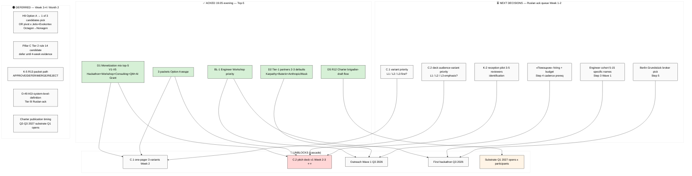

# Diagram 04 — Decision Flow v2 (Top-5 ACKED + remaining decisions)

```mermaid
%%{init: {'theme':'base', 'themeVariables': {'primaryTextColor':'#000000','textColor':'#000000','lineColor':'#333333','primaryBorderColor':'#333333','primaryColor':'#fafafa','noteTextColor':'#000000','noteBkgColor':'#fff8d5','edgeLabelBackground':'#ffffff'}}}%%
graph TB
    subgraph "✅ ACKED 19.05 evening — Top-5"
        A1[D1 Monetization mix top-5<br/>V1-V5 Hackathon+Workshop+Consulting+QM+AI Grant]
        A2[BL-1 Engineer Workshop priority]
        A3[3 packets Option A везде]
        A4[D2 Tier-1 partners 2-3 defaults<br/>Karpathy+Buterin+Anthropic/Musk]
        A5[D5 R12 Charter brigadier-draft flow]
    end

    subgraph "⏳ NEXT DECISIONS — Ruslan ack queue Week 1-2"
        N1[«Помощник» hiring + budget<br/>Step 4 cadence prereq]
        N2[Engineer cohort 5-15 specific names<br/>Step 3 Wave 1]
        N3[Berlin Grundstück broker pick<br/>Step 5]
        N4[C.1 variant priority<br/>L1 / L2 / L3 first?]
        N5[C.2 deck audience-variant priority<br/>L1 / L2 / L3 emphasis?]
        N6[K-2 reception pilot 3-5 reviewers<br/>identification]
    end

    subgraph "🟠 DEFERRED — Week 3-4 / Month 2"
        D1[H9 Option A → 1 of 3 candidates pick<br/>OR pivot к Jetix=Exokortex Octagon→Nonagon]
        D2[Pillar C Tier 2 rule 14 candidate<br/>defer until 4-week evidence]
        D3[K-5 R13 packet path<br/>APPROVE/DEFER/MERGE/REJECT]
        D4[O-49 AGI-system-level-definition<br/>Tier B Ruslan-ack]
        D5[Charter publication timing<br/>Q2-Q3 2027 substrate Q1 opens]
    end

    subgraph "🎯 UNBLOCKS (cascade)"
        U1[C.1 one-pager 3 variants Week 2]
        U2[C.2 pitch deck v1 Week 2-3 ⭐⭐]
        U3[Outreach Wave 1 Q3 2026]
        U4[First hackathon Q3 2026]
        U5[Substrate Q1 2027 opens к participants]
    end

    A1 --> U1 & U2
    A2 --> U3 & U4
    A3 --> U1 & U2
    A4 --> U3
    A5 --> U5
    
    N1 --> U3
    N2 --> U4
    N3 --> U4
    N4 --> U1
    N5 --> U2
    N6 --> U2

    style A1 fill:#d6f0d6,color:#000
    style A2 fill:#d6f0d6,color:#000
    style A3 fill:#d6f0d6,color:#000
    style A4 fill:#d6f0d6,color:#000
    style A5 fill:#d6f0d6,color:#000
    style U2 fill:#ffd6d6,color:#000
    style U5 fill:#fff4e6,color:#000
```
