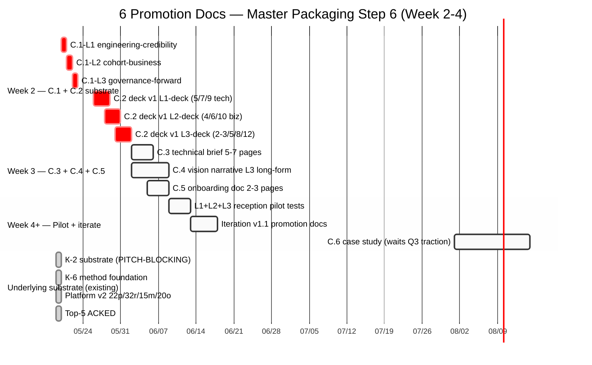

# Diagram 06 — Promotion Package Roadmap v2 (6 docs × audience × week)

```mermaid
%%{init: {'theme':'base', 'themeVariables': {'primaryTextColor':'#000000','textColor':'#000000','lineColor':'#333333','primaryBorderColor':'#333333','primaryColor':'#fafafa','noteTextColor':'#000000','noteBkgColor':'#fff8d5','edgeLabelBackground':'#ffffff'}}}%%
gantt
    title 6 Promotion Docs — Master Packaging Step 6 (Week 2-4)
    dateFormat YYYY-MM-DD
    axisFormat %m/%d

    section Week 2 — C.1 + C.2 substrate
    C.1-L1 engineering-credibility       :crit, c1l1, 2026-05-20, 1d
    C.1-L2 cohort-business               :crit, c1l2, 2026-05-21, 1d
    C.1-L3 governance-forward            :crit, c1l3, 2026-05-22, 1d
    C.2 deck v1 L1-deck (5/7/9 tech)    :crit, c2l1, 2026-05-26, 3d
    C.2 deck v1 L2-deck (4/6/10 biz)    :crit, c2l2, 2026-05-28, 3d
    C.2 deck v1 L3-deck (2-3/5/8/12)    :crit, c2l3, 2026-05-30, 3d

    section Week 3 — C.3 + C.4 + C.5
    C.3 technical brief 5-7 pages        :c3, 2026-06-02, 4d
    C.4 vision narrative L3 long-form    :c4, 2026-06-02, 7d
    C.5 onboarding doc 2-3 pages         :c5, 2026-06-05, 4d

    section Week 4+ — Pilot + iterate
    L1+L2+L3 reception pilot tests       :pi, 2026-06-09, 4d
    Iteration v1.1 promotion docs        :it, 2026-06-13, 5d
    C.6 case study (waits Q3 traction)   :c6, 2026-08-01, 14d

    section Underlying substrate (existing)
    К-2 substrate (PITCH-BLOCKING)       :done, k2, 2026-05-19, 1d
    К-6 method foundation                :done, k6, 2026-05-19, 1d
    Platform v2 22p/32r/15m/20o          :done, pv, 2026-05-19, 1d
    Top-5 ACKED                          :done, ack, 2026-05-19, 1d
```
