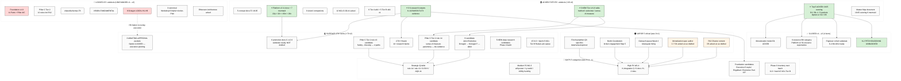

# Diagram 07 — State Map v2 (5-tier UPDATED 19.05 evening)

```mermaid
%%{init: {'theme':'base', 'themeVariables': {'primaryTextColor':'#000000','textColor':'#000000','lineColor':'#333333','primaryBorderColor':'#333333','primaryColor':'#fafafa','noteTextColor':'#000000','noteBkgColor':'#fff8d5','edgeLabelBackground':'#ffffff'}}}%%
graph TB
    subgraph "🔴 LOCKED 25+ artefacts (UNCHANGED v1→v2)"
        L1[Foundation v1.0<br/>11 Parts + Pillar A/C]
        L2[Pillar C Tier 2<br/>12 rules incl R12]
        L3[shared/schemas F8]
        L4[VISION-FUNDAMENTAL]
        L5[8 Octagon LOCKs H1-H8]
        L6[3 canonical Workshop+Charter+Action-Plan]
        L7[Ethereum Architecture acked]
    end

    subgraph "🟢 ACKED F2/F3 55+ artefacts (+20 v2)"
        A1[5 concept docs F2 18.05]
        A2[⭐ Platform v2 11 docs + 7 mermaid<br/>22p × 32r × 15m × 20o]
        A3[9 vision/ companions]
        A4[12 NCs O-30-41 acked]
        A5[6 Tier A wiki + 5 Tier B wiki v1]
        A6[⭐ 6 K-research outputs<br/>K-1/2/3/4/5/6 F2-F3 evidence]
        A7[⭐ 3 NEW Tier A K-6 wikis<br/>method / exokortex / sense-of-measure]
        A8[⭐ Top-5 ACKED 19.05 evening<br/>D1 / BL-1 / 3 packets Option A / D2 / D5]
        A9[Master Map document<br/>19.05 evening 6 mermaid]
    end

    subgraph "🟡 SURFACE 270+ items (+70 v2)"
        S1[3 AWAITING-APPROVAL packets<br/>Option A ACKED — execution pending]
        S2[Pillar C Tier 2 rule 14 candidate<br/>sense-of-measure parsimony — 4w evidence]
        S3[Pillar C Tier 2 rule 13 candidate<br/>Safety→Develop — 4 paths]
        S4[H-candidate Jetix=Exokortex<br/>Octagon → Nonagon? — defer]
        S5[6 promotion docs C.1-C.6<br/>substrate ready; NOT drafted]
        S6[270+ H bank<br/>11+ research banks]
        S7[5 NEW deep research candidates<br/>Phase 4 batch]
        S8[15 K-6 + batch-5 NCs<br/>Tier B Ruslan-ack queue]
    end

    subgraph "🟠 VAPOR 5 critical (was 9 v1)"
        V1[First hackathon Q3 specifics<br/>date/venue/sponsor]
        V2[Berlin Grundstück<br/>broker engagement Step 5]
        V3[Outreach queue Week 2<br/>помощник hiring]
        V4[Monetization spec author<br/>C.7 D1 acked но не drafted]
        V5[R12 Charter content<br/>D5 acked но не drafted]
    end

    subgraph "✅ CLOSED v1→v2 (4 items)"
        C1[Monetization model D1 ACKED]
        C2[6-resource 6th category<br/>Platform v2 32-resource supersedes]
        C3[Engineer cohort substrate<br/>K-4 M1-M12 ready]
        C4[K-2 PITCH-BLOCKING UNBLOCKED]
    end

    subgraph "🔵 GAPS 5 categories (was 6 v1; -1)"
        G1[High P1 W2-4<br/>K-integration § / 6 docs / K-2 risks]
        G2[Medium P2 M2-3<br/>will-power / 1y world / 1000y humility]
        G3[Strategic Q defer<br/>rule 14 / rule 13 / O-56 H / AQX-11]
        G4[Foundation candidates<br/>Recursive 5-tuple / Engelbart / Exokortex Part 13?]
        G5[Phase 0 inventory next batch<br/>K-6 + batch-5 NCs Tier B]
    end

    L5 -.H6 Option A overlay execution.-> S1
    A2 --> S5
    A6 --> S5 & S6
    A7 --> S2 & S4
    A8 --> C1 & C2 & C3 & C4
    V1 & V2 & V3 & V4 & V5 --> G1
    S2 & S3 & S4 --> G3
    A6 --> G4

    style L1 fill:#ffd6d6,color:#000
    style L5 fill:#ffd6d6,color:#000
    style A2 fill:#d6f0d6,color:#000
    style A6 fill:#d6f0d6,color:#000
    style A7 fill:#d6f0d6,color:#000
    style A8 fill:#d6f0d6,color:#000
    style C4 fill:#d6f0d6,color:#000
    style V4 fill:#fff4e6,color:#000
    style V5 fill:#fff4e6,color:#000
```
