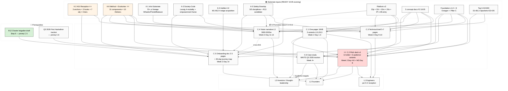

# Diagram 09 — 6 Promotion Docs Dependency Map

```mermaid
%%{init: {'theme':'base', 'themeVariables': {'primaryTextColor':'#000000','textColor':'#000000','lineColor':'#333333','primaryBorderColor':'#333333','primaryColor':'#fafafa','noteTextColor':'#000000','noteBkgColor':'#fff8d5','edgeLabelBackground':'#ffffff'}}}%%
graph TB
    subgraph "📚 Substrate inputs (READY 19.05 evening)"
        I1[К-2 AGI Reception ⭐⭐<br/>3 anchors × 3 hooks × 7 obj × 3 tiers]
        I2[К-6 Method + Exokortex ⭐⭐<br/>31 components × 10 thinkers]
        I3[К-1 Info-Substrate<br/>70+ yr lineage Wheeler/Floridi/Bateson]
        I4[К-3 Society-Code<br/>Lessig 4-modality + empowerment frame]
        I5[К-4 Intellect 12<br/>M1-M12 4-stage acquisition]
        I6[К-5 Safety-Develop<br/>5/5 disciplines + R13 candidate]
        I7[Platform v2<br/>22p × 32r × 15m × 20o + IP-1 28-entry]
        I8[5 concept docs F2 18.05]
        I9[Foundation v1.0 + 8 Octagon + Pillar C]
        I10[Top-5 ACKED<br/>D1+BL1+3packets+D2+D5]
    end

    subgraph "📦 6 Promotion docs C.1-C.6"
        C1[C.1 One-pager 10KB<br/>3 variants L1/L2/L3<br/>Week 2 Day 1-3]
        C2[⭐⭐ C.2 Pitch deck v1<br/>12-slide × 3 audience variants<br/>Week 2 Day 4-8 + W3 Day 8]
        C3[C.3 Technical brief 5-7 pages<br/>Week 3 Day 9-10]
        C4[C.4 Vision narrative L3<br/>3000-5000w<br/>Week 3 Day 11-13]
        C5[C.5 Onboarding doc 2-3 pages<br/>+ 30-day journey map<br/>Week 3 Day 14]
        C6[C.6 Case study<br/>WAITS Q3 2026 traction<br/>Week 4+]
    end

    subgraph "🎯 Audience targets"
        L1[L1 Engineers<br/>per К-2 reception]
        L2[L2 Founders]
        L3[L3 Investors / thought-leadership]
    end

    subgraph "🔗 Prerequisites"
        P1[R12 Charter brigadier-draft<br/>Step 6 — prereq C.5]
        P2[Q3 2026 First Hackathon traction<br/>— prereq C.6]
    end

    I1 --> C1 & C2
    I2 --> C1 & C2 & C3 & C4 & C5
    I3 --> C4
    I4 --> C4 & C5
    I5 --> C5
    I6 --> C3 & C4 & C5
    I7 --> C1 & C2 & C3 & C5
    I8 --> C1 & C2 & C3 & C4 & C6
    I9 --> C2 & C3 & C4 & C5 & C6
    I10 --> C1 & C2

    C1 --> L1 & L2 & L3
    C2 --> L1 & L2 & L3
    C3 --> L1
    C4 --> L3
    C5 --> L2
    C6 --> L2 & L3

    P1 --> C5
    P2 --> C6
    
    C1 --> C2
    C4 -.cross-link.-> C5
    
    style C2 fill:#ffd6d6,color:#000
    style I1 fill:#fff4e6,color:#000
    style I2 fill:#fff4e6,color:#000
    style P1 fill:#d6f0d6,color:#000
```
