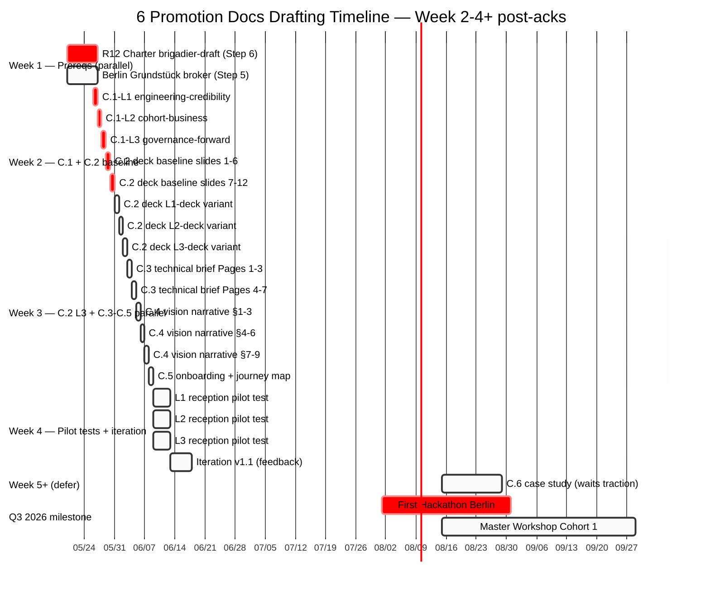

# Diagram 10 — Drafting Timeline Gantt (Week 2-4+ promotion docs)

```mermaid
%%{init: {'theme':'base', 'themeVariables': {'primaryTextColor':'#000000','textColor':'#000000','lineColor':'#333333','primaryBorderColor':'#333333','primaryColor':'#fafafa','noteTextColor':'#000000','noteBkgColor':'#fff8d5','edgeLabelBackground':'#ffffff'}}}%%
gantt
    title 6 Promotion Docs Drafting Timeline — Week 2-4+ post-acks
    dateFormat YYYY-MM-DD
    axisFormat %m/%d

    section Week 1 — Prereqs (parallel)
    R12 Charter brigadier-draft (Step 6)  :crit, p1, 2026-05-20, 7d
    Berlin Grundstück broker (Step 5)     :p2, 2026-05-20, 7d

    section Week 2 — C.1 + C.2 baseline
    C.1-L1 engineering-credibility        :crit, c1l1, 2026-05-26, 1d
    C.1-L2 cohort-business                :crit, c1l2, 2026-05-27, 1d
    C.1-L3 governance-forward             :crit, c1l3, 2026-05-28, 1d
    C.2 deck baseline slides 1-6          :crit, c2b1, 2026-05-29, 1d
    C.2 deck baseline slides 7-12         :crit, c2b2, 2026-05-30, 1d
    C.2 deck L1-deck variant              :c2l1, 2026-05-31, 1d
    C.2 deck L2-deck variant              :c2l2, 2026-06-01, 1d

    section Week 3 — C.2 L3 + C.3-C.5 parallel
    C.2 deck L3-deck variant              :c2l3, 2026-06-02, 1d
    C.3 technical brief Pages 1-3         :c3a, 2026-06-03, 1d
    C.3 technical brief Pages 4-7         :c3b, 2026-06-04, 1d
    C.4 vision narrative §1-3             :c4a, 2026-06-05, 1d
    C.4 vision narrative §4-6             :c4b, 2026-06-06, 1d
    C.4 vision narrative §7-9             :c4c, 2026-06-07, 1d
    C.5 onboarding + journey map          :c5, 2026-06-08, 1d

    section Week 4 — Pilot tests + iteration
    L1 reception pilot test               :pi1, 2026-06-09, 4d
    L2 reception pilot test               :pi2, 2026-06-09, 4d
    L3 reception pilot test               :pi3, 2026-06-09, 4d
    Iteration v1.1 (feedback)             :it, 2026-06-13, 5d

    section Week 5+ (defer)
    C.6 case study (waits traction)       :c6, 2026-08-15, 14d

    section Q3 2026 milestone
    First Hackathon Berlin                :crit, q3, 2026-08-01, 30d
    Master Workshop Cohort 1              :q3b, 2026-08-15, 45d
```
