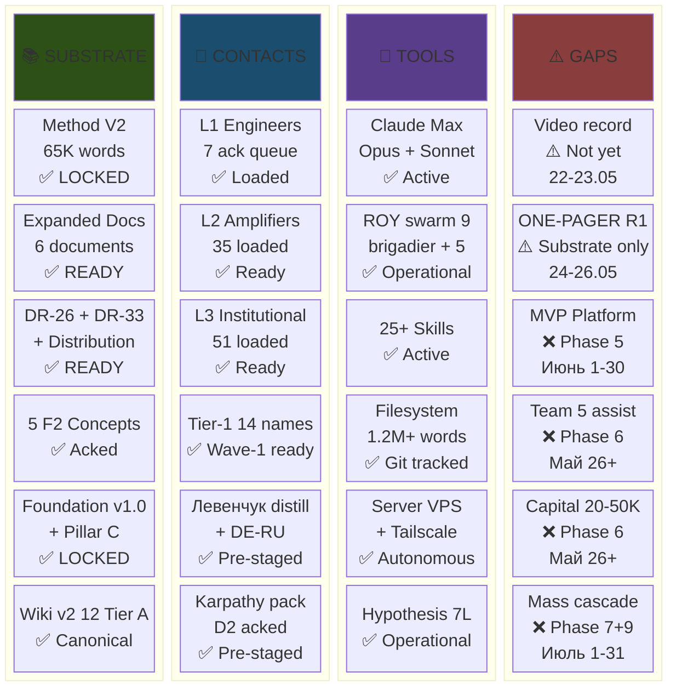

# Phase 1 — Now-state assessment

> **TL;DR (для video script 30-60 sec).** На 22 Мая 2026 у нас substrate готовый, инструменты заточенные, контакты загружены. Не хватает video record + R1 one-pager prose + MVP-платформы + команды + capital — это next 10 weeks.

---

## §A Что у нас есть — substrate inventory (готово к использованию)

### A.1 Foundation v1.0 LOCKED 2026-04-28

- **10 LOCKED Foundation parts F5** (Parts 1-10 baseline + Part 11 Pillar A Strategic Direction Substrate + `principles/` Pillar C Tier 1/Tier 2 split) [src: CLAUDE.md «Foundation Architecture v1.0»].
- **8 Octagon LOCK** — Bundles 1-5 RUSLAN-ACK + Wave D Integration Pass + 2 supplements [src: 8 RUSLAN-ACK records section].
- **F8 Constitutional schemas** в `shared/schemas/` — F-G-R / Default-Deny / blast-radius / AWAITING-APPROVAL / Halt-Log-Alert / Corrigibility / message v2.0.0 / task-return-packet [src: `shared/schemas/` directory].
- **C1 Shared infrastructure** — `swarm/lib/routing-table.yaml` + `shared-protocols.md` + `hooks/` [src: CLAUDE.md «C1 Shared infrastructure»].
- **Pillar C Tier 2 hard rules (12)** — R1 «AI does NOT make strategic decisions» + R11 default-deny + R12 anti-extraction LOCKED 2026-05-12 [src: CLAUDE.md §4.1].

**Implication для plan:** все Phase 3-13 действия operate в пределах constitutional envelope; R12 paired-frame mandatory в outreach + partnership; Foundation paths read-only.

### A.2 Method V2 main deliverable

- ~65K words consolidated; 40 mermaid catalogued (Phase 15-16 pass); 16-phase production cycle [src: recent commits 2f10697 / ef7c778 / b8cd806 / ad042f3 / 6fabf68].
- **Methodological breakthrough:** Method выбора методов (meta-method); управление через уровень выше; exocortex era leverage 10-20× per Phase 12 §D proof point.
- File: `decisions/strategic/METHOD-LIFE-DEVELOPMENT-V2-2026-05-21.md`.

### A.3 Expanded Docs (Май 21 batch)

| Document | Function |
|---|---|
| EXPERTS-PACK-2026-05-21.md | 5-lens views (engineering / investor / mgmt / philosophy / systems) |
| QUESTIONS-PACK-2026-05-21.md | Open questions for R1 decisions |
| TASKS-PACK-2026-05-21.md | Kanban of next 100 tasks |
| DEVELOPMENT-PLAN-2026-05-21.md | 5-horizon plan (Y1-Y5) |
| ONE-PAGER-FPF-SUBSTRATE-2026-05-21.md | Pitch substrate (R1 ONE-PAGER prose pending Ruslan slot) |
| METHOD-DEEP-DESCRIPTION-2026-05-21.md | Method depth canonical |

### A.4 Research decision memos

- **DR-26 unit-econ** — €1500/member/month workshop tier baseline; 10-25% take rate range LOCKED 2026-05-21 (Ruslan ack); LTV/CAC/payback computed [src: `research/unit-econ-deep-dive-2026-05-21/_RECOMMENDATION-MEMO.md`].
- **DR-33 communication best practices** — R12 paired-frame language patterns; «range 10-25% per-partnership» framing [src: `research/communication-best-practices-2026-05-21/`].
- **Distribution Plan 2026-05-20** — cascade activation mechanics; daily cadence 15-20 touches/day → ramp [src: `decisions/strategic/DISTRIBUTION-PLAN-2026-05-20.md`].

### A.5 5 acked F2 concept docs (2026-05-18)

- JETIX-OUTREACH-SYSTEM-SCALABLE — outreach concept (Phase 3 + 9 substrate)
- JETIX-AS-HACKATHON-PLATFORM — platform concept (Phase 5 MVP substrate)
- JETIX-EDUCATION-LAYER-SYSTEM-THINKING — education concept (Phase 9 educational products)
- JETIX-RECURSIVE-SELF-DEVELOPMENT-ENGINE — recursive engine architecture
- JETIX-SYSTEM-MERGER-PROTOCOL-FPF — system merger protocol

### A.6 Hypothesis Architecture 7-layer operational

- L1 worldview hypotheses → L7 daily-execution hypotheses chain operational [src: `hypotheses/` 7-layer architecture].
- DOGFOOD discipline per F-G-R schema на каждом promoted claim.

### A.7 KA-03 CRM (169 contacts loaded)

- **L1 engineer-builders ack queue: 7** (Karpathy / Olah / Kaplan + 3 cohort slots + Sapunov ready)
- **L2 amplifiers: 35** загружено (МИМ ecosystem + RU AI community + Gabdulin / Markov / Fridman / Naval / Lex)
- **L3 institutional: 51** загружено (Berlin Senate / TU Berlin / МИМ / Open Phil)
- **14 Tier-1 ack queue ready** для Wave 1 outreach
- Stuck detection + voice-pipeline DRAFT-only operational [src: CLAUDE.md `## CRM System`].

### A.8 Wiki v2 Karpathy++ substrate

- 12 Tier A concepts canonical + 2 ideas drafts + 4 §APPEND batch-8 patches
- 9 entity types operational (concepts / entities / sources / topics / ideas / experiments / claims / summaries / foundations)
- Graph edges JSONL (9 typed edges) + comparisons + niches × 6 (personal / business / sales / life / tech / meta) [src: CLAUDE.md `## Wiki Architecture v2`].

### A.9 Левенчук distillation

- 5 pitch hooks substrate (audio_703 independent re-articulation pattern)
- DE-RU glossary FPF U.Episteme terms
- Substrate-sandwich approach (Анатолий context → bridge → Method V2 anchor)
- File: Левенчук distillation [src: cross-link from outreach pack].

---

## §B Resources (operational capacity на 22 Мая 2026)

| Resource | State | Notes |
|---|---|---|
| **Claude Max subscription** | Active | $200/mo; Opus 4.7 + Sonnet 4.6 + Haiku 4.5 unlimited при rate-cap |
| **ROY swarm operational** | Phase A+ | 9 agents в `.claude/agents/`: brigadier + 5 experts + 4 sub-brigadiers |
| **Skills library** | Active | 25+ skills (/ingest / /ask / /lint / /compile / project-bootstrap / project-review / project-archive / company-status / etc.) |
| **Filesystem authoritative** | Stable | `/home/ruslan/jetix-os/` 1.2M+ words tracked в git |
| **Git repository + GitHub** | Active | Append-only history; structured commits; remote sync |
| **Server jetix-vps** | Operational | Tailscale + SSH; autonomous CC sessions |
| **Personal time + focus** | Variable | ~40-60h/week available (Berlin base) |
| **Base capital** | $0 | NEED: $20-50K bridge для Phase 5+6 (team + MVP) |

**Implication:** инфраструктура достаточна для autonomous execution следующих 10 weeks; capital — sole blocker для Phase 6 team scale.

---

## §C Contacts (CRM-loaded; ready для Wave 1)

### C.1 Wave 1 Tier-1 priority (first 3, send by 22-23.05)

1. **Анатолий Левенчук** ⭐⭐⭐ — substrate-sandwich approach pre-staged; Method V2 + 5 pitch hooks + DE-RU glossary ready; channel Telegram + email; expected timeline 1-3 days response.
2. **Цэрэн Цэрэнов** ⭐⭐ — МИМ ecosystem cross-pollination; Method V2 + Левенчук cross-cite map; channel Telegram МИМ.
3. **Andrej Karpathy** ⭐⭐⭐ — D2 RUSLAN-ACK 2026-05-19 pre-staged outreach pack `outreach/karpathy-outreach-pack-2026-05-19.md`; Method V2 + video + 8-doc inventory; channel Twitter DM + email.

### C.2 Wave 1b engineer cohort (Day 2 send, 23-24.05)

- Chris Olah (Anthropic interpretability)
- Jared Kaplan (Anthropic scaling)
- Ilshat Gabdulin (МИМ FPF AI-agents — closest Workshop substrate alignment)
- Timur Batyrshin (МИМ FPF service ontology)
- Ivan Podobed (МИМ method-engineering canonical)
- Sergey Markov (RU AI Sber lead)
- Grigory Sapunov (RU AI Berlin)
- 3-5 cohort slots для дополнительных engineer candidates

### C.3 L2 amplifiers (Wave 2 prep — 35 loaded)

- МИМ ecosystem: Левенчук cluster (8-12 secondary)
- RU AI community: 12-15 names (Sber / Yandex / VK ML / etc.)
- Western AI cluster: Lex Fridman / Naval Ravikant / Yannic Kilcher / Karpathy adjacent
- DACH AI engineers: 5-7 Berlin / Munich / Zurich

### C.4 L3 institutional (Wave 3 prep — 51 loaded)

- Berlin Senate / TU Berlin / Berliner Hochschule (DACH academic)
- МИМ (Russian methodology institute)
- Open Philanthropy / 80,000 Hours / EA-adjacent (impact funding)
- Anthropic / DeepMind / OpenAI institutional touchpoints
- VC: Sequoia / a16z (later — Y1 EOY $1M discussion)

---

## §D Готовность / readiness gaps

### D.1 ✅ READY (substrate)

| Item | Status |
|---|---|
| Method V2 main deliverable | ✅ 65K words / 40 mermaid LOCKED |
| Expanded Docs (5) | ✅ All 5 + ONE-PAGER substrate |
| DR-26 take rate + DR-33 communication + Distribution Plan | ✅ All 3 |
| 5 acked F2 concept docs | ✅ All 5 |
| Hypothesis Architecture 7-layer | ✅ Operational |
| KA-03 CRM 169 contacts | ✅ Loaded |
| Wiki v2 12 Tier A | ✅ Canonical |
| Левенчук distillation | ✅ Substrate-sandwich ready |
| Foundation v1.0 + Pillar C | ✅ LOCKED |
| 8 Octagon LOCK | ✅ Bundles 1-5 acked |

### D.2 ⚠️ WIP (next priorities)

| Item | Status | Owner | Timeline |
|---|---|---|---|
| **Video script recorded** | ⚠️ Not yet | Ruslan R1 | 22-23.05 |
| **ONE-PAGER R1 prose authored** | ⚠️ Substrate only; R1 prose pending | Ruslan R1 | 24-26.05 |
| **Wave 1 outreach materials packed** | ⚠️ Per-recipient kits compile | brigadier | 22-23.05 |
| **Feedback log infrastructure** | ⚠️ `outreach/wave-1-feedback-log-2026-05-22.md` | brigadier | 22.05 Day 1 |

### D.3 ❌ NOT YET (next phases)

| Item | Status | Phase | Timeline |
|---|---|---|---|
| **MVP platform built** | ❌ | Phase 5 | Июнь 1-30 |
| **Team assembled (5 ассистентов)** | ❌ | Phase 6 | Май 26 → Июнь 15 |
| **Capital raised ($20-50K bridge)** | ❌ | Phase 6 | Май 26 → Июнь 30 |
| **Layer 2 cohort recruited** | ❌ | Phase 7 | Июнь 15-30 |
| **Mass distribution activated** | ❌ | Phase 7+9 | Июль 1-31 |

---

## §E Gap analysis — что мешает scaling

### E.1 Bottleneck #1: Video record

- **State:** ONE-PAGER substrate готов; video script outline в §2 Phase 2 ready; Ruslan R1 запись pending.
- **Impact:** Wave 1 outreach effectively blocked без video link (substrate без demonstration loses 60-80% conversion).
- **Resolution timeline:** 22-23.05 (Friday-Saturday) priority.

### E.2 Bottleneck #2: Capital для Phase 6 team

- **State:** $0 base; need $20-50K bridge для 5 ассистентов × 1-2 months × $4-10K/role.
- **Impact:** Phase 5 MVP June Sprint critically constrained без team.
- **Resolution paths:** (a) первые partnership commitments (Layer 1 founding 10% take), (b) personal capital bridge, (c) small angel round ($50K from Tier-1 partner если ack), (d) defer team to Июль и solo MVP Июнь.

### E.3 Bottleneck #3: Tier-1 response uncertainty

- **State:** 14 Tier-1 names loaded; response rate unknown (assume 20-40% engagement).
- **Impact:** Cascade dependent on Tier-1 amplification; weak Tier-1 → Scenario A (Conservative) default trajectory.
- **Resolution:** Wave 1 22-31.05 send + monitor + iterate; fallback warm-intros via МИМ + RU AI clusters.

### E.4 Bottleneck #4: R1 ONE-PAGER prose

- **State:** Substrate compiled; R1 strategic prose pending Ruslan slot (constitutional R1).
- **Impact:** Outreach kit incomplete без one-pager attached.
- **Resolution:** 24-26.05 Ruslan slot R1 authoring.

---

## §F Constitutional health-check (now-state)

- **R1 strict:** Strategic prose в Method V2 + ONE-PAGER pending R1 author Ruslan; brigadier surface only. ✅
- **R2 strict:** Foundation Parts 1-11 read-only; no writes pending. ✅
- **R6 inline:** Provenance discipline maintained; 27 substrate sources cross-cited Phase 0. ✅
- **R11 default-deny:** No novel action class executed без gate; viral coefficient projection surfaced as scenarios (Phase 8). ✅
- **R12 LOCKED:** Anti-extraction Tier 2 rule 12 + Ethereum substrate Option D Hybrid acked 2026-05-18. ✅
- **IP-1 STRICT:** Foundation roles abstract; executor bindings RUSLAN-LAYER. ✅
- **8 Octagon:** Bundles 1-5 acked + Wave D Integration Pass. ✅

---

## §G Mermaid D1 — Now-state inventory dashboard

*D1 — 24-cell dashboard (6 substrate × 6 contacts × 6 tools × 6 gaps) показывает asymmetry: substrate + contacts + tools = ✅; gaps = video + R1 prose + MVP + team + capital + mass cascade — все остальные phases address это.*

---

## §H Implication для Phases 2-13

1. **Phase 2 (Video):** Highest priority bottleneck — start ASAP 22-23.05.
2. **Phase 3 (Wave 1):** Send 22-31.05; substrate ready; per-recipient kits compile Phase 2.
3. **Phase 4 (Partnership):** R12 paired-frame mandatory; 10-25% take rate range LOCKED.
4. **Phase 5 (MVP):** Conditional on Phase 6 team assembly; Buterin + Karpathy ack timing critical.
5. **Phase 6 (Team):** Capital bridge required ($20-50K); hiring from first-cohort partners priority.
6. **Phase 7 (Cascade):** Layer 1 → 2 → 3 → mass Июль; resource model per-layer (10/15-20/20-25% take rates).
7. **Phase 8 (1M trajectory):** 4 scenarios (A/B/C/D) + 8-tier user pyramid + paying timeline.
8. **Phase 9 (Distribution):** Bloggers + platform services + educational products.
9. **Phase 10 (Theses):** 4 thesis validation discipline (urgency / installation / method / FPF).
10. **Phase 11 (Mermaid):** 25-35 diagrams (target 30).
11. **Phase 12 (Cross-cite):** 27 sources convergence map.
12. **Phase 13 (Main + Summary):** ~15-25K words consolidated.

---

*[src: Phase 0 substrate inventory D.1-D.5 + CLAUDE.md «Foundation Architecture v1.0» + recent git log 2f10697..ad042f3 + KA-03 CRM 169 contacts + daily-logs/_DAILY-LOG-2026-05-21.md §APPEND-night-strategic-plan-near-future]*
