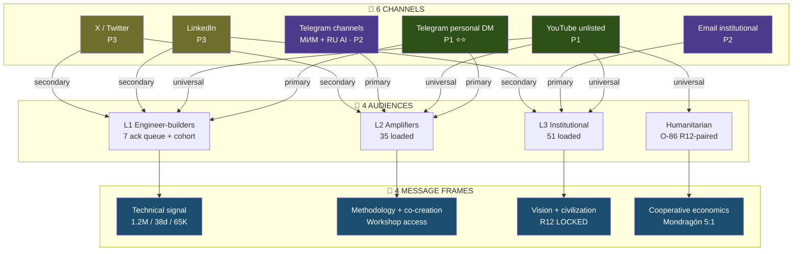
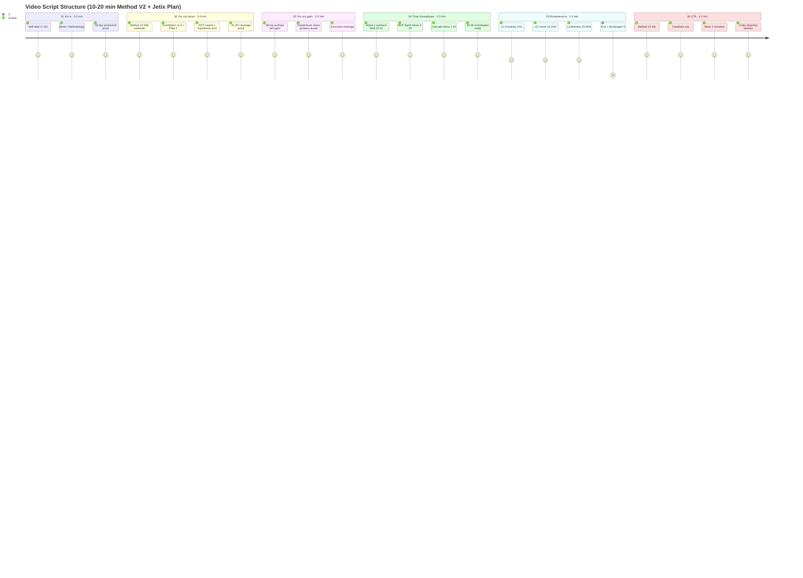

# Phase 2 — Video record + distribution channels

> **TL;DR (30-60 sec video).** Video длиной 10-20 min — 6-section structure: «Кто я → Что построил → Что это даёт → План → Возможности при работе → CTA». 6 каналов distribution (Telegram personal P1 / YouTube unlisted P1 / Telegram channels P2 / Email institutional P2 / LinkedIn P3 / X-Twitter P3). Per-audience messaging (L1 technical / L2 methodology / L3 vision / humanitarian R12-paired). R12 paired-frame: free учебник + Claude Code access + community + Hypothesis arch + Method V2 access ↔ feedback + (optional) partnership 10-25% take.

---

## §A Video script substrate breakdown (R1 Ruslan slot — substrate only)

> **R1 constitutional reminder:** Video script prose authoring = Ruslan slot. Brigadier compiles structure + bullet substrate + R12 discipline check; не authors R1 strategic prose.

### A.1 6-section structure (per Ruslan voice 21.05 night dictation)

#### Section 1 — «Кто я» (2-3 min)

**О-115 self-label** (per Ruslan voice batch processing 2026-05-17): «методологист философ изобретатель».

Substrate bullets:
- Berlin, Germany base — DACH + EU + RU bridge
- AI consulting / methodologist background
- 38 days production cycle (Apr 14 → May 21) compounded substrate: 1.2M words written, 40+ mermaid, 65K Method V2 deliverable
- Self-built infrastructure: ROY swarm 9 agents + 25+ skills + KA-03 CRM 169 contacts + Wiki v2 substrate

**Why это важно для viewer:** authority signal + proof-of-execution (что сделано — не обещание).

#### Section 2 — «Что построил» (3-4 min)

**Method V2 + Jetix-substrate анонс.**

Substrate bullets:
- Method V2: метод выбора методов — meta-methodology
- 65K words main deliverable + 40 mermaid catalogued
- Foundation v1.0 LOCKED 2026-04-28 (10 parts F5 + Pillar A + Pillar C)
- ROY swarm operational (5 ROY experts × 4 role-modes = 20 invocation cells + 4 sub-brigadiers)
- Hypothesis Architecture 7-layer (L1 worldview → L7 daily execution)
- 10-20× leverage proof (Phase 12 §D Method V2)

**Why это важно для viewer:** demonstration depth — substrate доказывает claim.

#### Section 3 — «Что это даёт» (2-3 min)

**Метод выбора методов; управление через уровень-выше; exocortex era leverage.**

Substrate bullets:
- **Метод выбора методов** — у каждого uniqueness; нужен персональный method-stack
- **Управление через уровень-выше** — не tactical → strategic; manage strategy через mission/values
- **Exocortex era leverage** — AI как cognitive amplifier 10-20× per properly-configured pipeline
- **Карпати's «vibe coding» analogue для life** — natural-language directing intelligent substrate

**Why это важно для viewer:** value-proposition framing — что viewer получает применяя.

#### Section 4 — «План на ближайшее» (2-3 min)

**Этот документ §3-§9** (Wave 1 outreach → MVP June Sprint → Cascade Июль).

Substrate bullets:
- Май 22-31: Wave 1 outreach (14 Tier-1 names; Левенчук + Карпати + Цэрэн + 10 engineers)
- Май 26-31: MVP planning + Layer 1 cohort recruit
- Июнь 1-30: MVP Platform build sprint (4 weeks; Layer 1 / 2 / 3 / Polish)
- Июль 1-31: Mass distribution + Workshop intake at scale
- 30 Июня: «ебейшая платформа ready» (Ruslan voice phrase)

**Why это важно для viewer:** concrete timeline — не «когда-нибудь», а dates.

#### Section 5 — «Возможности при работе» (2-3 min)

**R12 paired-frame; 10-25% take rate; partnership tiers.**

Substrate bullets:
- **Founding Partner (L4):** 10% take (founding stake); 6+ months hands-on commitment
- **Cohort Partner (L5):** 15-20% take; 3+ months
- **Cohort Member (L6):** 20-25% take; 1+ month; voting rights
- **Workshop User (L7):** €1500/month service fee per-engagement
- **R12 protection:** Mondragón 5:1 cap + fork-and-leave + 30-day opt-out
- **Programmable substrate Phase 2+:** Ethereum smart-contract (Option D Hybrid acked 2026-05-18)

**Why это важно для viewer:** trust + transparency — clear terms + exit guarantee.

#### Section 6 — «Call to action» (1-2 min)

**Изучить материалы + feedback + partnership consideration.**

Substrate bullets:
- Method V2 link (substrate depth)
- Hypothesis arch + Wiki v2 + ROY swarm access free для cohort
- Specific feedback ask (что хотим узнать)
- DM Telegram / email / GitHub link
- Wave 1 invitation explicit для engineer-builders (L1)

**Why это важно для viewer:** clear next step — не «think about it», а «here's the link + 3-day response window».

### A.2 Total target duration: 10-20 min

- **Shorter (10-13 min):** L1 engineer audience — high information density, technical signal
- **Standard (13-17 min):** L2 amplifier — methodology depth + community ask
- **Longer (17-20 min):** L3 institutional + humanitarian — vision framing + R12 paired-frame depth

**Recommendation per DR-33 communication:** record TWO versions (short L1-cut 12 min + long L2-L3 cut 18 min) для channel-targeting.

---

## §B Distribution channels — 6-channel matrix

### B.1 Priority breakdown

| # | Channel | Audience | Format | Priority | Effort | Reach |
|---|---|---|---|---|---|---|
| 1 | **Telegram personal (DM)** | L1 + L2 + Wave 1 cohort | Video link + brief intro | **P1 ⭐⭐** | Low (per-recipient ~10 min) | High intimacy / low scale |
| 2 | **YouTube unlisted** | All audiences | Long-form 10-20 min video | **P1** | Medium (one-time upload + edit) | Universal viewer base |
| 3 | **Telegram channels (МИМ + AI RU)** | L2 amplifiers + RU AI community | Public post + video link | P2 | Low (3-5 channel posts) | Medium scale (10-50K reach) |
| 4 | **Email** | L3 institutional + formal | Formal letter + video link | P2 | Medium (per-recipient custom) | Low scale / high signal |
| 5 | **LinkedIn** | DACH + international engineers | Post + video link + tags | P3 | Low (1-2 posts) | Medium (2-10K Berlin AI cluster) |
| 6 | **X / Twitter** | Western AI / Karpathy cluster | Thread + video | P3 | Low (1 thread) | High variance (viral potential) |

### B.2 Channel deep-dive

#### B.2.1 Telegram personal (P1 ⭐⭐)

- **Why P1:** intimate trust signal; per-recipient custom intro; 14 Tier-1 ack queue ready
- **Format:** brief 2-3 sentence intro (custom per recipient) + video link + Method V2 link + specific ask
- **Mechanics:** R12 paired-frame mandatory per-message; CRM status update post-send (cold → contacted)
- **Risk:** Anatoly silent fallback (warm-intro via МИМ cluster)

#### B.2.2 YouTube unlisted (P1)

- **Why P1:** universal substrate — any channel links here; viewer-controlled pace
- **Format:** long-form 10-20 min с timestamps + description с links
- **Mechanics:** unlisted (not public) первые 2 weeks; gather feedback; iterate before public publish
- **Risk:** YouTube algorithm not amplifying unlisted (intentional — controlled distribution Wave 1)

#### B.2.3 Telegram channels (P2)

- **Targets:** МИМ ecosystem channels (Левенчук cluster) + RU AI community channels (Markov / Sapunov adjacent)
- **Format:** public post (200-300 words) + video link + Method V2 link + cohort invitation
- **Mechanics:** request permission from channel admin first; co-creation pattern (channel admin = potential L4 Founding Partner)
- **Risk:** spam perception если untargeted; mitigation = warm intro per channel

#### B.2.4 Email institutional (P2)

- **Targets:** L3 institutional 51 loaded (TU Berlin / МИМ / Open Phil / etc.)
- **Format:** formal letter (300-500 words) + video link + Method V2 attachment + specific institutional ask
- **Mechanics:** signature block from Ruslan personal email; signature design + bio formal
- **Risk:** institutional response cycle slow (4-8 weeks); not blocking для Phase 5-7

#### B.2.5 LinkedIn (P3)

- **Targets:** DACH AI engineers + Berlin senate + TU Berlin alumni
- **Format:** Long-form post (1000-1500 words) + video link + comment-driven engagement
- **Mechanics:** SEO-optimized title (AI methodology + Berlin + cohort building)
- **Risk:** LinkedIn audience cold; conversion rate low (0.5-2%)

#### B.2.6 X / Twitter (P3)

- **Targets:** Western AI cluster (Karpathy adjacent + Yannic Kilcher + Lex Fridman adjacent)
- **Format:** 8-12 tweet thread + video link + Method V2 link
- **Mechanics:** quote-tweet от Karpathy (if ack) = breakout potential Scenario D
- **Risk:** Twitter signal noisy; conversion depends on viral coefficient

### B.3 Timing — Phase 2 channel deployment schedule

| Date | Channel actions |
|---|---|
| **22.05 Fri** | Video record (R1 Ruslan); YouTube upload unlisted; Telegram DM 3 Tier-1 (Левенчук + Цэрэн + Карпати) |
| **23.05 Sat** | Telegram DM Wave 1b cohort (5-10 engineers); LinkedIn post 1; Telegram channels (МИМ + RU AI) — pending channel admin permissions |
| **24-25.05** | Email batch L3 institutional (15-20 names); X/Twitter thread post; monitor responses |
| **26-28.05** | Iterate messaging based on Day 1-3 feedback; Wave 1 follow-up reminders; KA-07 R12 weekend audit |
| **29-31.05** | Wave 1 feedback aggregation `outreach/wave-1-feedback-log-2026-05-22.md`; Wave 2 prep; consider public-publish YouTube |

---

## §C Messaging strategy per audience

### C.1 L1 engineer (Karpathy / Olah / Kaplan / cohort)

**Frame:** Technical signal + leverage proof point + cohort invitation.

**Hook:** «1.2M words / 38 days / 65K Method V2 / 10-20× leverage proof. Built ROY swarm + Foundation v1.0 + Pillar C constitutional. Looking for fundament cohort (10-15 engineers). Founding 10% take + 6 mo commitment.»

**Ask:** Feedback на LLM cognition / methodology intersection + interest founding-cohort.

**Avoid:** corporate pitch language; vague vision claims без proof points.

### C.2 L2 amplifier (Lex / Naval / Markov / Sapunov / МИМ channels)

**Frame:** Methodology signal + community ask + co-creation opportunity.

**Hook:** «Method выбора методов — testable framework. Method V2 65K substrate + Workshop intake mechanism. Looking для amplifier-partnerships — coverage / endorsement / co-creation. R12 paired-frame: free Workshop access для blogger + N followers + revenue share affiliate model.»

**Ask:** Coverage / endorsement / community amplification + optional partner equity (L4 Founding eligible).

**Avoid:** «promote my thing» framing; emphasize mutual value.

### C.3 L3 institutional (TU Berlin / МИМ / Open Phil)

**Frame:** Vision signal + civilization framing + R12 paired-frame.

**Hook:** «Exocortex era methodology infrastructure. Open-source Foundation layer + Pillar C constitutional + Wiki v2 substrate. Looking for institutional partnerships — strategic alignment / co-authored research / cohort sponsorship. Mondragón 5:1 ratio + R12 anti-extraction LOCKED.»

**Ask:** Strategic partnership / custom integration / sponsorship / Foundation-level alignment.

**Avoid:** speculative language; emphasize substrate готовность + constitutional posture.

### C.4 Humanitarian (O-86 frame + R12 paired)

**Frame:** Human flourishing + AI safety + cooperative economics.

**Hook:** «AI substrate без extraction — R12 LOCKED. Members fork-and-leave with proportional treasury + no penalty. Mondragón ratio cap 5:1. Programmable Ethereum substrate Option D Hybrid (acked 2026-05-18). Cooperative economic experiment in exocortex era.»

**Ask:** Endorsement + feedback на R12 mechanism design.

**Avoid:** «AI doomerism» / «AI saviorism» framing; emphasize cooperative + pragmatic.

---

## §D R12 paired-frame discipline в video (per DR-33 + audit 8-item checklist)

### D.1 Offer explicit (что Jetix предлагает)

1. **Free Method V2 учебник** (65K words methodology depth)
2. **Free Claude Code access** для cohort (via Anthropic Claude Max baseline)
3. **Free community access** (cohort + L4-L5 partners + Workshop slot)
4. **Free Hypothesis Architecture substrate** (7-layer template)
5. **Free Wiki v2 + ROY swarm setup** (configurable for personal use)
6. **Free public Foundation + R12 programmable substrate** (open-source Phase 5+)

### D.2 Ask explicit (что Jetix просит)

1. **Feedback** на substrate (substrate quality > 0 — even silent ack)
2. **Partnership consideration** (optional, voluntary, 10-25% range)
3. **Coverage / endorsement** (L2 amplifier ask, NOT mandatory)
4. **Cohort recruitment** (referrals, NOT mandatory)

### D.3 R12 protection guarantees

- **Voluntary opt-in** — никто не obligated после free access
- **Fork-and-leave** — exit anytime с proportional contribution share + treasury portion + no penalty
- **30-day opt-out window** at any tier transition
- **Mondragón 5:1 cap** — payout ratio between top + bottom enforced
- **No data extraction beyond agreed share** — R12 Tier 2 rule 12 LOCKED 2026-05-12
- **Programmable enforcement Phase 2+** — Ethereum smart-contract Option D Hybrid (acked 2026-05-18)

### D.4 R12 8-item pre-send checklist (per DR-33)

Before each video / outreach message:
1. ✅ Offer explicit (что бесплатно)
2. ✅ Ask explicit (что хочется в обмен)
3. ✅ Voluntary opt-in stated
4. ✅ Fork-and-leave protection mentioned
5. ✅ Take rate range (10-25%) framed as «cooperative share» NOT «extraction»
6. ✅ Mondragón ratio mentioned
7. ✅ No manipulation language («last chance» / «exclusive» / etc.)
8. ✅ Specific contact channel + response timeline expectation

---

## §E Mermaid D2 — Channel × audience matrix

*D2 — 6 channels × 4 audiences × 4 message frames. Цвет: зелёный=P1 / фиолетовый=P2 / оливковый=P3. Каждый channel mapped к 1-4 audiences; каждое audience → unique message frame per DR-33 communication.*

---

## §F Mermaid D3 — Video script structure (6-section journey)

*D3 — 6-section journey video script. Scores 5 = high-confidence substrate; 4 = R12-paired discipline checkpoint. Total duration target 10-20 min; tone лаконичный для video readiness per DR-33.*

---

## §G Phase 2 status + handoff

- ✅ 6-section video script substrate compiled (R1 prose pending Ruslan)
- ✅ 6 distribution channels prioritized (P1×2 / P2×2 / P3×2)
- ✅ 4-audience messaging strategy mapped
- ✅ R12 paired-frame 8-item checklist + offer + ask + protections documented
- ✅ 2 mermaid (D2 channel matrix + D3 video journey)
- ✅ Timing schedule Май 22-31 per channel

**Handoff to Phase 3:** Wave 1 outreach detail uses Phase 2 video substrate + channel priorities + R12 8-item checklist. Per-recipient kit compile depends on Phase 2 video record completion.

---

*[src: prompts/strategic-plan-near-future-2026-05-21.md §3 Phase 2 + daily-logs/_DAILY-LOG-2026-05-21.md §APPEND-night-strategic-plan-near-future + DR-33 `research/communication-best-practices-2026-05-21/` + ONE-PAGER-FPF-SUBSTRATE-2026-05-21.md + Method V2 §6 (R12 paired-frame discipline) + CLAUDE.md §4.2 R12 programmable Ethereum substrate Option D Hybrid acked 2026-05-18]*
