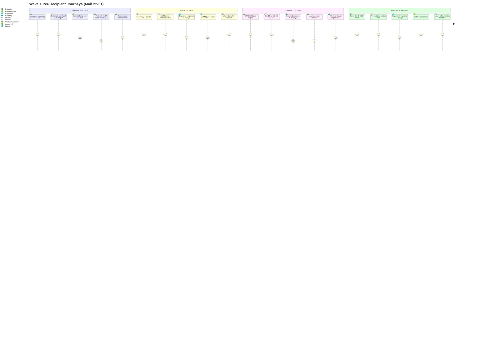
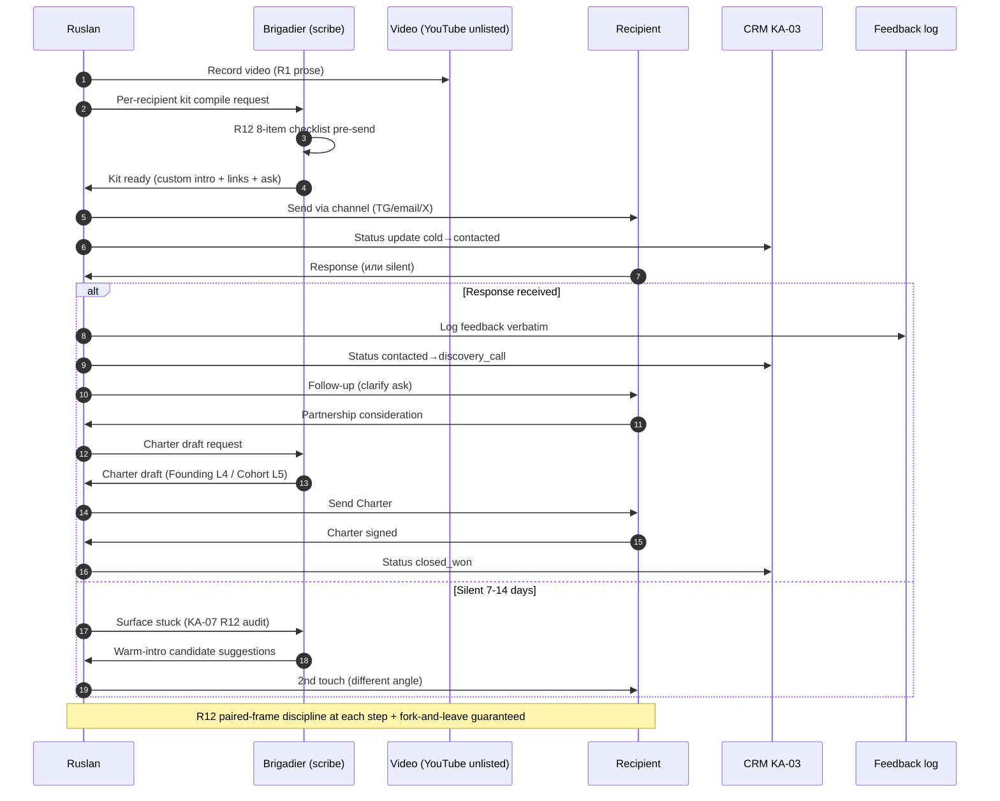
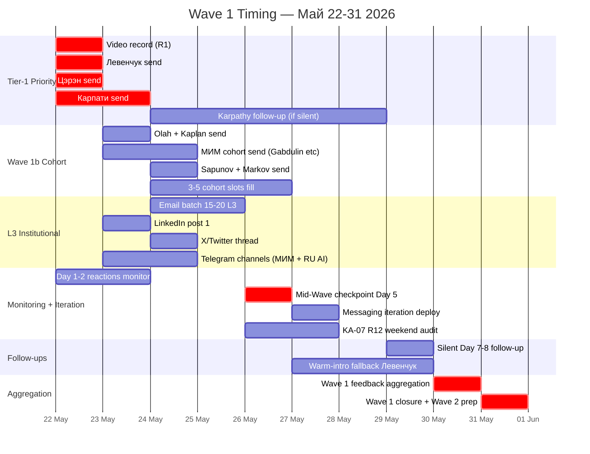

# Phase 3 — Wave 1 outreach detail (Май 22-31)

> **TL;DR (30-60 sec video).** Wave 1 = 14 Tier-1 names + Wave 1b 10 engineers, send Май 22-31. Tier-1 priority Дни 1-2: Левенчук (substrate-sandwich pre-staged) + Цэрэн Цэрэнов (МИМ cross-pollination) + Карпати (D2 ACKED outreach pack ready). Wave 1b Day 2-3: Olah, Kaplan, Gabdulin, Batyrshin, Podobed, Markov, Sapunov + 3-5 cohort slots. Per-recipient kit: custom intro + video link + Method V2 link + 8-doc inventory + specific feedback ask + R12 paired-frame partnership preview. R12 8-item checklist mandatory pre-send. Feedback log infrastructure `outreach/wave-1-feedback-log-2026-05-22.md`. CRM status updates per touch. 4 risks surfaced (Левенчук silent / Karpathy silent / aggressive tone perception / take-rate extraction perception) с mitigations.

---

## §A Wave 1 target list (до конца Мая 2026)

### A.1 Tier-1 priority (Days 1-2 send: 22-23.05)

#### Target 1: **Анатолий Левенчук** ⭐⭐⭐

| Field | Value |
|---|---|
| Channel | Telegram (primary) + email (backup) + video link |
| Substrate-sandwich | audio_703 independent re-articulation pattern pre-staged |
| Send package | Method V2 main deliverable + 5 pitch hooks substrate + DE-RU glossary + ONE-PAGER substrate (когда R1 finalized) |
| Timeline | 22.05 evening send; expected response 1-3 days (или silent — fallback contingency §E.1) |
| Specific ask | Feedback на Method V2 substrate alignment с МИМ канона + interest в partnership consideration (L4 Founding tier 10% Mondragón 5:1) |
| R12 explicit | Free Method V2 + ROY swarm template + Wiki v2 setup substrate; fork-and-leave + 30-day opt-out |
| CRM status pre | `discovery_call` candidate / Tier-1 ack queue |
| CRM status post-send | `contacted` (auto update via voice-pipeline DRAFT) |

**Per-recipient custom intro (substrate; R1 prose final = Ruslan):**
- Acknowledge audio_703 substrate signal + МИМ canonical heritage
- Bridge: Method V2 = independent re-articulation, not replication
- Specific FPF intersection: Method V2 §X cross-cites МИМ method-engineering canonical
- Ask: feedback на substrate alignment + potential founding-tier partnership

#### Target 2: **Цэрэн Цэрэнов** ⭐⭐

| Field | Value |
|---|---|
| Channel | Telegram МИМ + email backup |
| Send package | Method V2 + Левенчук cross-cite map + DE-RU glossary |
| Timeline | 22.05 send; 1-5 days expected response |
| Specific ask | МИМ ecosystem feedback + connect к relevant МИМ figures (Gabdulin / Batyrshin / Podobed) |
| R12 explicit | Free Method V2 + cohort access + Workshop tier consideration |
| CRM status pre | `contacted` candidate / МИМ ecosystem |
| CRM status post-send | `contacted` |

**Per-recipient intro:**
- МИМ ecosystem cross-pollination framing
- Bridge: Method V2 builds on МИМ canon (Левенчук reference) + adds FPF universal language
- Ask: ecosystem feedback + introductions к relevant МИМ figures

#### Target 3: **Andrej Karpathy** ⭐⭐⭐

| Field | Value |
|---|---|
| Channel | Twitter DM + email (если public) |
| Pre-staged | D2 RUSLAN-ACK 2026-05-19; outreach pack `outreach/karpathy-outreach-pack-2026-05-19.md` |
| Send package | Method V2 + video link + 8-doc inventory (Method + Expanded Docs + DR-26 + DR-33 + Distribution Plan + concept docs + Foundation v1.0) |
| Timeline | 22-23.05 send; 5-15 days expected response (или silent — Karpathy DM volume high) |
| Specific ask | Feedback на LLM cognition substrate intersection + acknowledge для cohort consideration |
| R12 explicit | Mondragón 5:1 + open-source Foundation + R12 anti-extraction LOCKED |
| CRM status pre | `discovery_call` candidate / Western AI cluster |
| CRM status post-send | `contacted` |

**Per-recipient intro:**
- Reference Karpathy «vibe coding» concept + Method V2 = «vibe living»
- Bridge: 38-day production cycle / 1.2M words / Foundation v1.0 = leverage proof point
- Ask: feedback + (optional) Wave 2 cohort consideration

---

### A.2 Wave 1b engineer cohort (Days 2-3 send: 23-24.05)

| # | Name | Channel | Specific bridge / hook | Expected response |
|---|---|---|---|---|
| 4 | **Chris Olah** | Twitter DM + Anthropic email | Anthropic interpretability ↔ Method V2 §X interpretation layer | 7-14 days (или silent) |
| 5 | **Jared Kaplan** | Twitter DM + Anthropic email | Anthropic scaling laws ↔ Method V2 leverage proof | 7-14 days |
| 6 | **Ilshat Gabdulin** | Telegram МИМ + email | МИМ FPF AI-agents — closest Workshop substrate alignment | 1-5 days |
| 7 | **Timur Batyrshin** | Telegram МИМ | МИМ FPF service ontology ↔ Method V2 service-engineering | 1-5 days |
| 8 | **Ivan Podobed** | Telegram МИМ | МИМ method-engineering canonical + Method V2 evolution | 1-5 days |
| 9 | **Sergey Markov** | Telegram + Sber email | RU AI Sber lead ↔ Method V2 application enterprise | 3-10 days |
| 10 | **Grigory Sapunov** | Telegram Berlin + email | RU AI Berlin local connection + cohort alignment | 1-5 days |
| 11-15 | **3-5 cohort slots** | Per-name custom channel | Reserved для discovered engineers post Wave 1 Day 1 reactions | Variable |

---

## §B Per-target outreach kit structure (7 components)

### B.1 Mandatory components per outreach message

1. **Custom intro** (1-2 sentences personal context per recipient — see §A per-target intros)
2. **Video link** (10-20 min Method V2 overview — YouTube unlisted)
3. **Method V2 link** (substrate depth proof; canonical strategic insight)
4. **8-doc inventory mention** (Method + 5 Expanded Docs + DR-26 + DR-33; что есть substrate behind)
5. **Specific feedback ask** (что хотим узнать; varies per-recipient — see §A)
6. **Partnership preview** (10-25% take rate range provisional + R12 paired-frame + Mondragón 5:1)
7. **R12 8-item pre-send checklist** completed (per Phase 2 §D.4) mandatory

### B.2 Sample message template (R1 prose pending Ruslan slot)

```
[Custom intro — 1-2 sentences personal context]

За последние 38 дней я скомпилировал Method V2 (методология выбора методов; 65K
words; 40 mermaid) + Jetix substrate (Foundation v1.0 + Pillar C constitutional +
ROY swarm operational + Hypothesis Architecture 7-layer + Wiki v2 12 Tier A canon).

Краткий обзор в video — [YouTube link 10-20 min].
Substrate depth — [Method V2 link canonical].

8-doc inventory: Method V2 + EXPERTS-PACK + QUESTIONS-PACK + TASKS-PACK +
DEVELOPMENT-PLAN + ONE-PAGER substrate + DR-26 unit-econ memo + DR-33
communication memo.

[Specific feedback ask — per-recipient custom]

Если интересно — обсудим partnership consideration. Range 10-25% Foundation
institutional share per-partnership (cooperative share, не extraction). Mondragón
ratio 5:1 + R12 anti-extraction LOCKED + fork-and-leave protection + 30-day
opt-out window.

Response window: 3-5 дней comfortable; нет — fine, substrate всё равно available
open-source Foundation layer.

— Ruslan
```

### B.3 R12 8-item pre-send checklist (per Phase 2 §D.4)

Before EACH message send:
1. ✅ Offer explicit
2. ✅ Ask explicit
3. ✅ Voluntary opt-in stated
4. ✅ Fork-and-leave mentioned
5. ✅ Take rate framed as «cooperative share» не «extraction»
6. ✅ Mondragón 5:1 ratio mentioned
7. ✅ No manipulation language («last chance» / «exclusive» / etc.)
8. ✅ Specific contact + response timeline expectation

**Violation → halt-log-alert F4 grade ≤5s per Pillar C Tier 2 R12 + Part 6b §I.2.**

---

## §C Feedback collection mechanism

### C.1 Per-contact CRM entry update (per KA-03 CRM)

| Touch | CRM status transition |
|---|---|
| Send Day 0 | `cold` → `contacted` |
| Response received | `contacted` → `discovery_call` или `proposal` |
| Follow-up sent | append §11 history append-only |
| Partnership consideration | `proposal` → `negotiation` |
| Charter signed | `negotiation` → `closed_won` (Founding Partner L4) |
| Silent 14d | trigger `/crm-stuck` surface |

### C.2 Feedback log infrastructure (NEW Day 1)

**File:** `outreach/wave-1-feedback-log-2026-05-22.md` (created Day 1 via brigadier scribe)

**Structure per recipient:**
- Recipient name + Tier (1 / 1b / 2)
- Send date + channel
- Response date (или silent + last touch date)
- Per-recipient comments / questions / concerns (verbatim где applicable)
- Action items (follow-up date, follow-up content)
- Status transitions (CRM)

### C.3 Aggregate analysis weekly

- **End of Day 5 (26.05):** mid-Wave checkpoint — 3 Tier-1 + 5-7 Wave 1b sent; track response rate; iterate messaging
- **End of Day 10 (31.05):** Wave 1 aggregation — full response rate compute; baseline для Wave 2 strategy
- **Метрики tracked:**
  - Response rate (per-tier)
  - Time-to-response distribution
  - Partnership consideration rate (proposals → negotiations)
  - Charter signed rate
  - Common feedback patterns (qualitative)
  - R12 paired-frame perception (positive / neutral / negative)

---

## §D Timing schedule (Май 22-31 day-by-day)

### D.1 Day-by-day breakdown

| Day | Date | Actions | Sub-actions |
|---|---|---|---|
| **D1** | 22.05 Fri | Video record + 3 Tier-1 send | Левенчук + Цэрэн + Карпати; YouTube unlisted upload; feedback log infra created |
| **D2** | 23.05 Sat | Wave 1b cohort send + secondary channels | 5-10 engineers send; LinkedIn post 1; Telegram channels permission requests |
| **D3** | 24.05 Sun | Email batch L3 + monitor responses | 15-20 institutional email; X/Twitter thread; iterate Day 1 messaging based on Tier-1 reactions |
| **D4** | 25.05 Mon | Wave 1b residue + follow-up reminders | Remaining cohort slots; Day 1-2 silent ones gentle follow-up |
| **D5** | 26.05 Tue | Mid-Wave checkpoint + R12 audit | Response rate compute; KA-07 R12 weekend audit start; messaging iteration |
| **D6** | 27.05 Wed | Iteration deployment + new Tier-1 if discovered | Apply iteration based on Day 5 checkpoint feedback |
| **D7** | 28.05 Thu | Tier-2 amplifier prep (Wave 2 staging) | Identify L2 amplifier candidates based on Wave 1 reactions |
| **D8** | 29.05 Fri | Wave 1 follow-up batch | Silent ones 2nd touch (Левенчук / Karpathy if silent) |
| **D9** | 30.05 Sat | Wave 1 feedback aggregation | Full response rate compute; common patterns identification |
| **D10** | 31.05 Sun | Wave 1 closure + Wave 2 prep | Final аналитика; Wave 2 cohort recruitment list compile |

### D.2 Per-day effort estimate (Ruslan)

- D1: 4-6h (video record + 3 sends + infra setup) — high effort
- D2: 3-4h (Wave 1b cohort + secondary channels)
- D3-D4: 2-3h/day (monitor + iterate + Wave 1b residue)
- D5-D6: 2-3h/day (mid-Wave checkpoint + iteration)
- D7-D8: 1-2h/day (Tier-2 prep + follow-ups)
- D9-D10: 3-4h/day (aggregation + Wave 2 prep)

**Total Wave 1 effort: ~25-35h over 10 days.**

---

## §E Risk surface Wave 1 (AP-6 dissent preservation)

### E.1 R-W1.1 — Левенчук silent (low-medium probability)

- **Probability:** 20-30% silent first 7 days; 10-15% silent 14+ days
- **Impact:** Substrate-sandwich approach signal weakening; МИМ cluster engagement delayed
- **Mitigation:**
  - Warm-intro via МИМ cluster (Gabdulin / Batyrshin / Podobed) post Day 5
  - Day 14 follow-up email с specific Method V2 §X reference
  - Continue Wave 1b cohort independent of Левенчук response
- **AP-6 dissent preserved:** Substrate quality good ≠ Левенчук acknowledgment guaranteed; асимметричный leverage signal не universal — some recipients filter aggressively.

### E.2 R-W1.2 — Karpathy silent (medium-high probability)

- **Probability:** 60-80% silent first 14 days; 40-50% silent 30+ days (Karpathy DM volume high; D2 ACKED но prioritization unclear)
- **Impact:** Western AI cluster amplification weak; Scenario C/D viral potential ↓
- **Mitigation:**
  - Twitter quote-tweet attempt if Method V2 surfaces public attention organic
  - Wave 2 secondary channel via Anthropic team (Olah / Kaplan) if those ack first
  - Async accept; не critical для Phase 5 (MVP June Sprint executes regardless)
- **AP-6 dissent preserved:** High-status recipient silence ≠ Method V2 quality failure; signal-noise asymmetry для public figures.

### E.3 R-W1.3 — Aggressive language perception

- **Probability:** 15-25% некоторые L3 institutional / Western audience может perceive «10-25% take rate» / «cohort building» как aggressive
- **Impact:** Conversion friction для conservative audiences; R12 paired-frame discipline critical
- **Mitigation:**
  - Video script paraphrase pass per audience (L1 technical / L2 methodology / L3 vision / humanitarian R12-paired)
  - Mondragón ratio explained explicit с cooperative economics framing
  - Per-recipient kit custom intro modulates intensity
- **AP-6 dissent preserved:** Tone-modulation acceptable до strategic compromise; brigadier surfaces variants Ruslan R1 decides.

### E.4 R-W1.4 — Take-rate language perception (25% as «extraction»)

- **Probability:** 10-20% Western humanitarian audience interpret 25% as VC-extraction-pattern
- **Impact:** Trust friction; R12 mechanism perceived as marketing-cover
- **Mitigation:**
  - «Range 10-25% per-partnership» framing (NOT flat 25%)
  - Mondragón 5:1 ratio explained explicit (cooperative DNA proof)
  - Ethereum substrate Option D Hybrid (acked 2026-05-18) — programmable enforcement Phase 2+
  - Cohort retains 75-90% direct distribution stated explicit
- **AP-6 dissent preserved:** Cooperative-economic positioning не universal trusted; some audiences require empirical evidence first (Phase 2+ Ethereum substrate deployment as proof).

### E.5 Cross-cutting Wave 1 risks

| Risk | Likelihood | Impact | Mitigation |
|---|---|---|---|
| Video quality insufficient | 15% | High | Two-take record + review pass + iterate before Wave 1b |
| YouTube unlisted leak (premature public) | 5% | Medium | Unlisted URL не shared beyond Wave 1 recipients |
| CRM status drift | 25% | Medium | Daily CRM sync `/crm-rebuild-index` |
| R12 paired-frame violation (manipulation language) | 10% | F4 grade | Halt-log-alert ≤5s + pre-send 8-item checklist mandatory |
| Tier-1 oversaturation (too many in 24h) | 20% | Medium | Sequenced send: Левенчук → Цэрэн → Карпати (4-hour intervals) |

---

## §F Mermaid D4 — Wave 1 recipient journeys (4 trajectories)



*D4 — 4 recipient trajectories Wave 1. Цэрэн Day 1 highest-confidence ack (МИМ ecosystem signal strong); Карпати Day 5-15 medium-confidence; Wave 1b 10 engineers Day 2-7 mixed. Scores reflect confidence в timely engagement.*

---

## §G Mermaid D5 — Outreach handshake sequence



*D5 — Outreach handshake sequence. Each step R12-disciplined: 8-item checklist pre-send, status update post-send, feedback log capture, charter draft brigadier-scribe не R1-authored.*

---

## §H Mermaid D6 — Wave 1 timing gantt (Май 22-31)



*D6 — Wave 1 gantt Май 22-31. Critical path: Video record D1 → Tier-1 send D1 → Mid-Wave checkpoint D5 → Wave 1 closure D10. Parallel tracks: Wave 1b cohort + L3 institutional + secondary channels. Follow-ups + iteration interleaved.*

---

## §I Wave 1 acceptance criteria

- ✅ 3 Tier-1 sent Day 1 (Левенчук + Цэрэн + Карпати)
- ✅ Wave 1b 5-10 engineers sent Day 2-3
- ✅ L3 institutional batch 15-20 sent Day 3-4
- ✅ Secondary channels (LinkedIn / X / Telegram channels) deployed Day 2-4
- ✅ Per-recipient kit completed pre-send (7 components)
- ✅ R12 8-item checklist passed pre-send each message
- ✅ Feedback log infrastructure created Day 1
- ✅ CRM status updates per touch
- ✅ Mid-Wave checkpoint Day 5 executed
- ✅ Wave 1 aggregation Day 10 + Wave 2 prep launched
- ✅ Response rate target: ≥20% Tier-1 ack within 14 days; ≥30% Wave 1b ack within 7 days

---

## §J Handoff to Phase 4

Phase 3 establishes outreach mechanics + R12 8-item checklist + per-recipient kits. Phase 4 «Partnership proposal logic» deepens 10-25% take rate range + partner inventory protocol + 4-tier partnership levels — invoked при Wave 1 recipients respond с partnership interest.

---

*[src: prompts/strategic-plan-near-future-2026-05-21.md §4 Phase 3 + daily-logs/_DAILY-LOG-2026-05-21.md §APPEND-night-strategic-plan-near-future + KA-03 CRM Tier-1 ack queue + outreach/karpathy-outreach-pack-2026-05-19.md D2 ACKED + Левенчук distillation 5 pitch hooks + DE-RU glossary + DR-33 communication R12 paired-frame + Phase 2 §D 8-item checklist]*
