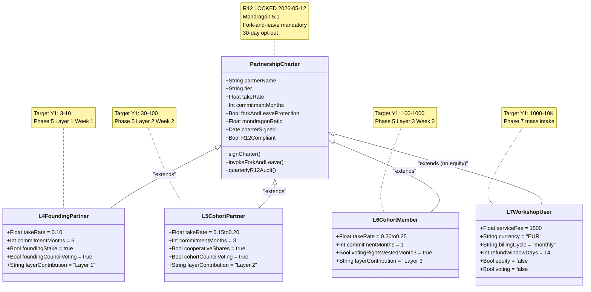

# Phase 4 — Partnership proposal logic

> **TL;DR (30-60 sec video).** Take rate 10-25% per-partnership (Ruslan R1 ack 21.05). Mondragón ratio cap 5:1. R12 anti-extraction LOCKED + fork-and-leave protection. 4 partnership levels: Founding L4 (10% / 6+ mo) → Cohort Partner L5 (15-20% / 3+ mo) → Cohort Member L6 (20-25% / 1+ mo) → Workshop User L7 (€1500/mo service fee). Partner inventory protocol per partner: what they have × what Jetix offers × synergy assessment × R12 paired-frame check. Pitch language pattern: «Jetix operates 10-25% Foundation institutional share per-partnership. Cohort members retain 75-90% direct distribution. Mondragón ratio cap 5:1. Fork-and-leave protection — exit anytime с preserved contribution + proportional treasury + no penalty.»

---

## §A Partnership tier structure (Ruslan R1 ack 21.05)

### A.1 LOCKED parameters (Ruslan R1 ack 2026-05-21)

| Parameter | Value | Source |
|---|---|---|
| **Take rate range** | 10-25% per-partnership (depends на partner contribution + tier) | DR-26 Ruslan R1 ack 21.05 |
| **Mondragón ratio cap** | 5:1 between top + bottom payout | CLAUDE.md §4.2 R12 programmable Ethereum Option D Hybrid |
| **R12 anti-extraction** | LOCKED 2026-05-12 Tier 2 rule 12 | CLAUDE.md §4.1 rule 12 |
| **Fork-and-leave protection** | Mandatory | FUNDAMENTAL §6.1 + R12 |
| **30-day opt-out window** | At any tier transition | Pillar C Tier 2 |
| **Programmable enforcement Phase 2+** | Ethereum smart-contract Option D Hybrid | Acked 2026-05-18 |

### A.2 Constitutional posture

- **R12 LOCKED 2026-05-12:** «AI / substrate cannot extract value from members beyond agreed share; members can fork-and-leave without penalty»
- **4 RUSLAN-LAYER action classes** в `.claude/config/default-deny-table.yaml`:
  - `extraction_beyond_share`
  - `wage_ratio_violation`
  - `non_consensual_distribution`
  - `fork_prevention_attempt`
- **Per-Clan opt-in via Charter** (foundation_generic preserved; instance-specific overrides RUSLAN-LAYER)

---

## §B Partner inventory protocol (4-step per partner)

### B.1 Step 1 — What partner has

Per-partner assessment matrix:

| Category | Sub-items | Assessment scale |
|---|---|---|
| **Information** | Domain expertise / knowledge / unique insights | 1-5 (depth) |
| **Resources** | Capital ($X) / time (hours/week) / network (contacts) | quantitative |
| **Reputation** | Audience size / authority / media weight | quantitative + qualitative |
| **Skills** | Technical / coordination / sales / writing / coding | per-skill 1-5 |

### B.2 Step 2 — What Jetix can offer partner

Per-partner offer mapping:

| Offer type | Sub-items | Value |
|---|---|---|
| **Substrate access** | Method V2 + Hypothesis arch + Wiki v2 | F3 substrate depth |
| **Tools** | ROY swarm + 25+ skills + voice pipeline | Operational templates |
| **Community** | Other partners + cohort + Workshop intake | Network multiplier |
| **Brand / positioning** | Jetix umbrella + amplifier feedback loop | Reputation leverage |
| **Future revenue share** | 10-25% range per tier | Cooperative economics |
| **Equity-like stake** | Founding L4 stake / Cohort cooperative shares | Long-term alignment |
| **Voting rights** | Cohort Member L6 + above | Governance participation |

### B.3 Step 3 — Synergy assessment

Per-partner synergy compute:
- **Where partner contribution × Jetix substrate = high leverage** — identify intersection
- **What partnership level appropriate** (L4 Founding / L5 Cohort Partner / L6 Cohort Member / L7 Workshop User / L8 Mass)
- **Effort × Impact quadrant placement** (per Phase 7 D16)
- **Confidence in synergy projection** (R-grade per FPF F-G-R schema)

### B.4 Step 4 — R12 paired-frame check (per Phase 2 §D 8-item)

1. ✅ Offer explicit (что Jetix предлагает этому partner)
2. ✅ Ask explicit (что Jetix просит)
3. ✅ Voluntary opt-in
4. ✅ Fork-and-leave protection
5. ✅ Take rate framed as «cooperative share»
6. ✅ Mondragón ratio mentioned
7. ✅ No manipulation
8. ✅ Specific Charter + response timeline

**Violation → halt-log-alert F4 grade ≤5s per Pillar C Tier 2 R12.**

---

## §C Partnership levels (4 tiers operational)

### C.1 Tier breakdown table

| Level | Take rate | Commitment | Equity-like | Voting | Target count Y1 |
|---|---|---|---|---|---|
| **L4 Founding Partner** | 10% (lower; symbolic) | 6+ months hands-on | Yes (founding stake) | Yes (Founding Council) | 3-10 |
| **L5 Cohort Partner** | 15-20% | 3+ months | Cooperative share | Yes (Cohort Council) | 30-100 |
| **L6 Cohort Member** | 20-25% | 1+ month | Voting rights | Yes (Cohort Council) | 100-1000 |
| **L7 Workshop User** | Service fee €1500/mo | Per-engagement | No | No | 1000-10K |

### C.2 L4 Founding Partner (3-10 первых)

**Profile:** L1 engineer-builders (Karpathy tier / Левенчук / Buterin / Olah / Kaplan tier) + early МИМ + Cycle commitment 6+ months.

**Offer:**
- 10% Foundation institutional share + founding stake (equity-like)
- Founding Council voting (governance decisions)
- Full substrate access + tool templates
- Co-branding на public-facing Foundation materials
- Recognition в Foundation Charter + permanent contributor list

**Ask:**
- 6+ months hands-on commitment (10-20 hours/week)
- Specific Foundation layer contribution (Layer 1 sprint Phase 5 §B)
- Public endorsement / amplification (optional, не mandatory)

**Charter terms (R12 paired):**
- 30-day opt-out при initial commitment
- Fork-and-leave anytime с preserved contribution history + proportional treasury share + no penalty
- Mondragón 5:1 ratio cap enforced
- Programmable substrate Phase 2+ (Ethereum smart-contract Option D Hybrid)

### C.3 L5 Cohort Partner (next 30-100)

**Profile:** L1 cohort + extended МИМ + RU AI community + Wave 2-3 cohort recruits + 3+ months commitment.

**Offer:**
- 15-20% cooperative share (per partner contribution)
- Cooperative shares (governance)
- Substrate access + tool templates
- Community membership + Workshop intake priority
- Recognition в Cohort Council list

**Ask:**
- 3+ months commitment (5-15 hours/week)
- Layer 2 platform contribution (Phase 5 §B Week 2)
- Wave 2/3 cohort referral (optional)

**Charter terms (R12 paired):**
- 30-day opt-out
- Fork-and-leave protection
- 15-20% range varies per contribution depth (assessed quarterly)
- Cooperative share dilution-resistant
- Mondragón 5:1 ratio

### C.4 L6 Cohort Member (100-1000)

**Profile:** Workshop intake graduates + community contributors + 1+ month commitment.

**Offer:**
- 20-25% take rate (highest range — most direct contribution)
- Voting rights в Cohort Council
- Substrate access + tool templates (configurable for personal use)
- Community membership + Workshop access
- Educational product co-creation opportunity

**Ask:**
- 1+ month commitment (3-10 hours/week)
- Layer 3 feature contribution (Phase 5 §B Week 3)
- Optional Workshop teaching role

**Charter terms (R12 paired):**
- 30-day opt-out + fork-and-leave protection
- Mondragón 5:1 ratio
- Voting rights vested at month 3+

### C.5 L7 Workshop User (1000-10K)

**Profile:** Per-engagement service customers; B2C + B2B mix.

**Offer:**
- Workshop access (€1500/month per acked 21.05 DR-26 baseline)
- Substrate consumption (Method V2 + Hypothesis arch templates)
- Educational products bundle
- No voting / no equity (paid tier — service relationship)

**Ask:**
- €1500/month service fee
- Optional: feedback / case study contribution

**Charter terms:**
- Per-engagement contract
- Standard refund window (14 days)
- No fork-and-leave needed (no contribution-stake to preserve)

---

## §D R12 audit per partnership type

### D.1 Per-partnership Charter explicit

Each partnership (L4 / L5 / L6) signs Charter document:
- Take rate explicit
- Commitment explicit
- Offer + ask explicit
- Fork-and-leave protection clause
- Mondragón ratio acknowledgment
- 30-day opt-out window
- Programmable substrate Phase 2+ commitment

### D.2 R12 8-item compliance audit (per partnership)

Audit at:
1. Initial Charter signing (pre-deployment)
2. Quarterly review (R12 weekend audit KA-07)
3. Tier transition (L5 → L4 promotion)
4. Off-boarding (fork-and-leave invocation)

### D.3 Programmable Ethereum substrate Phase 2+ (acked 2026-05-18 Option D Hybrid)

- **Phase 2+ overlay:** smart-contract patterns binding R12 anti-extraction
- **Mondragón ratio cap:** enforced via smart-contract payout logic
- **QF revenue distribution:** quadratic-funding pattern за treasury allocation
- **Fork-and-leave exit tokens:** member exit triggers proportional treasury share
- **Per-Clan opt-in via Charter:** instance-specific RUSLAN-LAYER overrides

**Timeline:** Phase 5 June Sprint Week 3-4 Buterin integration starts; Phase 2+ deployment Q3 2026 (Сентябрь-Октябрь).

---

## §E Pitch language pattern (R12 paired-frame)

### E.1 Canonical pitch language

> «Jetix operates 10-25% Foundation institutional share per-partnership. Cohort members retain 75-90% direct distribution. Mondragón ratio cap 5:1 between top + bottom payout. R12 fork-and-leave protection — exit anytime с preserved contribution history + proportional treasury share + no penalty. Programmable Ethereum substrate Phase 2+ overlay (Option D Hybrid acked 2026-05-18). 30-day opt-out window at any tier transition.»

### E.2 Per-tier pitch variations

**L4 Founding Partner pitch:**
> «Founding tier — symbolic 10% institutional share, founding stake equity-like, Founding Council voting. 6+ months hands-on commitment. Layer 1 fundament contribution (Phase 5 Week 1). Fork-and-leave anytime с preserved contribution + proportional treasury + no penalty. Mondragón 5:1 ratio.»

**L5 Cohort Partner pitch:**
> «Cohort Partner — 15-20% cooperative share. 3+ months commitment. Layer 2 platform contribution. Cooperative shares + Cohort Council voting. Fork-and-leave protection + Mondragón 5:1.»

**L6 Cohort Member pitch:**
> «Cohort Member — 20-25% take rate (highest direct contribution range). 1+ month commitment. Layer 3 feature contribution. Voting rights vested month 3+. Fork-and-leave + Mondragón 5:1.»

**L7 Workshop User pitch:**
> «Workshop access — €1500/month per-engagement. Substrate consumption + educational products. Standard service contract; 14-day refund window. No equity / no voting — paid service tier.»

### E.3 Anti-extraction framing discipline

- AVOID: «take», «extract», «collect» (extraction connotations)
- USE: «cooperative share», «institutional share», «Foundation share»
- AVOID: «exclusive», «last chance», «limited offer» (manipulation)
- USE: «voluntary opt-in», «fork-and-leave protection», «range varies per contribution»
- AVOID: implicit hierarchy of value extraction
- USE: explicit Mondragón ratio + R12 anti-extraction LOCKED references

---

## §F Decision flow для partnership consideration

### F.1 Decision tree

1. **Wave 1 outreach → recipient responds с interest**
2. **Brigadier scribe compiles partner inventory** (Step 1 + 2 + 3)
3. **Synergy assessment** → recommended tier (L4 / L5 / L6)
4. **R12 paired-frame check** (Step 4 — 8-item checklist)
5. **Pitch language pattern** generated per tier (§E.2)
6. **Ruslan R1 review + approval** (constitutional — strategic prose author final)
7. **Charter draft** brigadier-scribe (template-based; не R1 prose)
8. **Charter sent** к partner
9. **Partner signs OR opts out** (30-day window)
10. **Partnership deployed** + R12 quarterly audit registered

### F.2 R1 authority points

- Step 6 (Ruslan R1 review): MANDATORY — partnership tier assignment is strategic decision
- Step 1-5 + Step 7-10: brigadier-scribe operational; не R1 strategic prose

### F.3 Halt-log-alert triggers

- F8 grade: extraction beyond agreed share detected → halt ≤1s
- F4 grade: R12 8-item checklist violation → halt ≤5s
- F2 grade: Charter terms misalignment с pitch → halt ≤60s
- All emit to `swarm/approvals/log.jsonl` + Part 8 SLI alert

---

## §G Mermaid D7 — Partnership tier structure (4 levels с inheritance)

*D7 — 4 partnership tiers с class inheritance pattern. PartnershipCharter parent class enforces R12 + Mondragón + fork-and-leave + 30-day opt-out. L4-L7 child classes specialize по take rate / commitment / equity / voting. L7 explicitly no-equity service tier.*

---

## §H Mermaid D8 — Partner inventory + synergy flow

```mermaid
graph LR
    subgraph Step1["📊 STEP 1: Partner has"]
        S1a[Information<br/>Domain expertise]
        S1b[Resources<br/>$ / time / network]
        S1c[Reputation<br/>Audience / authority]
        S1d[Skills<br/>Technical / coord]
    end

    subgraph Step2["🎁 STEP 2: Jetix offers"]
        S2a[Substrate access<br/>Method V2 + Wiki v2]
        S2b[Tools<br/>ROY swarm + skills]
        S2c[Community<br/>Cohort + partners]
        S2d[Brand + reputation<br/>Jetix umbrella]
        S2e[Revenue share<br/>10-25% range]
        S2f[Equity-like<br/>Founding stake]
    end

    subgraph Step3["⚡ STEP 3: Synergy assessment"]
        S3a[Partner × Jetix<br/>= high leverage]
        S3b[Tier recommendation<br/>L4/L5/L6/L7]
        S3c[Effort × Impact<br/>quadrant]
        S3d[Confidence<br/>R-grade FPF]
    end

    subgraph Step4["🛡️ STEP 4: R12 paired-frame"]
        S4a[Offer explicit ✅]
        S4b[Ask explicit ✅]
        S4c[Voluntary opt-in ✅]
        S4d[Fork-and-leave ✅]
        S4e[Cooperative share framing ✅]
        S4f[Mondragón 5:1 ✅]
        S4g[No manipulation ✅]
        S4h[Charter + timeline ✅]
    end

    Step1 --> Step3
    Step2 --> Step3
    Step3 --> Step4
    Step4 -->|All ✅| Charter[Charter Draft<br/>brigadier-scribe]
    Step4 -->|Any ❌| Halt[Halt-Log-Alert<br/>F4 grade ≤5s]
    Charter --> R1Review[Ruslan R1 Review<br/>strategic prose author]
    R1Review --> Sent[Charter Sent<br/>30-day opt-out window]

    style Step1 fill:#1a4d6e,color:#fff
    style Step2 fill:#2d5016,color:#fff
    style Step3 fill:#5a3d8a,color:#fff
    style Step4 fill:#6e3d1a,color:#fff
    style Charter fill:#3d6e3d,color:#fff
    style Halt fill:#8a3d3d,color:#fff
    style R1Review fill:#b8860b,color:#fff
    style Sent fill:#2d5a5a,color:#fff
```

*D8 — 4-step partner inventory + synergy + R12 flow. Steps 1-3 brigadier-scribe; Step 4 R12 8-item gate; Charter draft brigadier-scribe; R1 Review Ruslan; Sent triggers 30-day opt-out window. Halt-log-alert F4 grade ≤5s при R12 violation.*

---

## §I Phase 4 acceptance criteria

- ✅ 10-25% take rate range LOCKED (Ruslan R1 ack 21.05)
- ✅ Mondragón 5:1 ratio enforced
- ✅ R12 anti-extraction Tier 2 LOCKED 2026-05-12 preserved
- ✅ 4 partnership levels (L4 / L5 / L6 / L7) operational
- ✅ Partner inventory protocol 4-step documented
- ✅ R12 8-item checklist mandatory
- ✅ Pitch language pattern canonical + per-tier variations
- ✅ Decision flow + R1 authority points + halt-log-alert triggers
- ✅ Programmable Ethereum substrate Phase 2+ committed (Option D Hybrid)
- ✅ 2 mermaid (D7 class diagram + D8 flow diagram)

---

## §J Handoff to Phase 5

Phase 4 establishes partnership economics + R12 paired-frame discipline. Phase 5 «MVP Platform June Sprint» uses Phase 4 L4 Founding Partner recruitment как Layer 1 Foundation builders Week 1.

---

*[src: prompts/strategic-plan-near-future-2026-05-21.md §5 Phase 4 + daily-logs/_DAILY-LOG-2026-05-21.md Ruslan R1 ack 10-25% range 21.05 + DR-26 unit-econ memo `research/unit-econ-deep-dive-2026-05-21/_RECOMMENDATION-MEMO.md` + CLAUDE.md §4.1 R12 + §4.2 Ethereum Option D Hybrid acked 2026-05-18 + Phase 2 §D 8-item checklist + FUNDAMENTAL §6.1 rule 12]*
