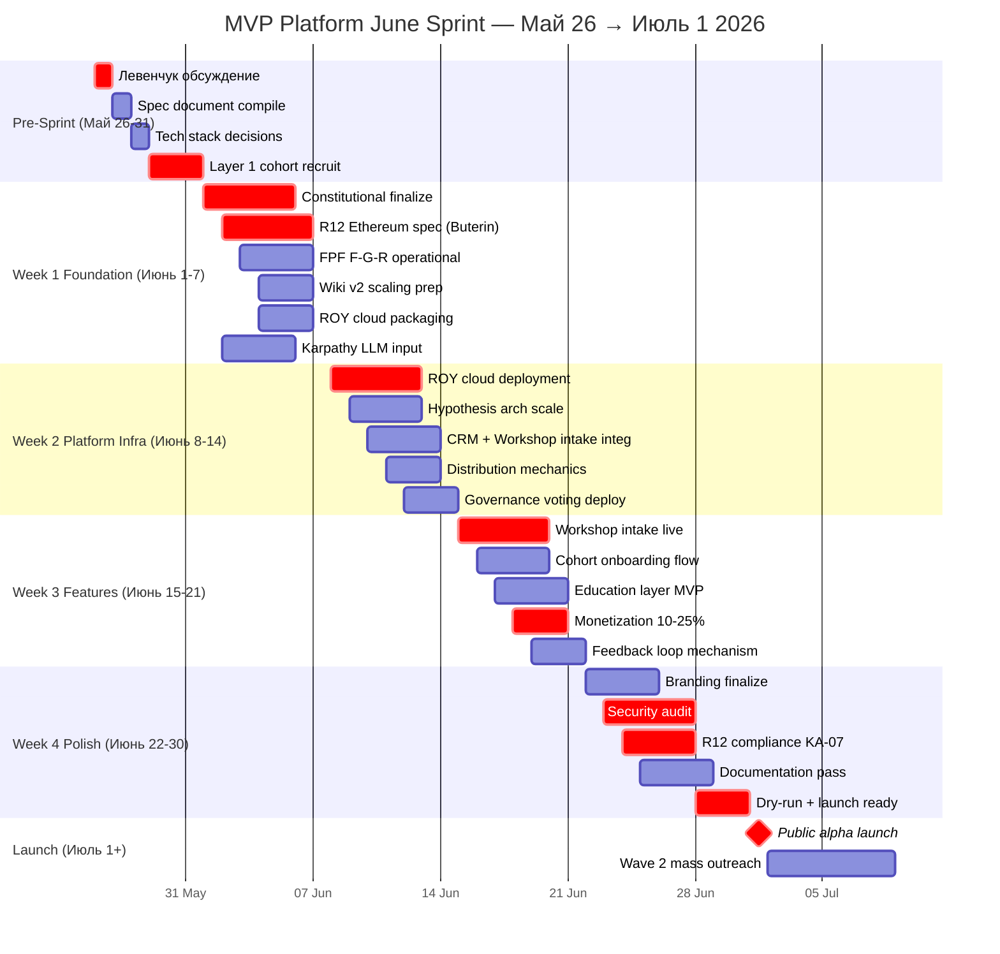
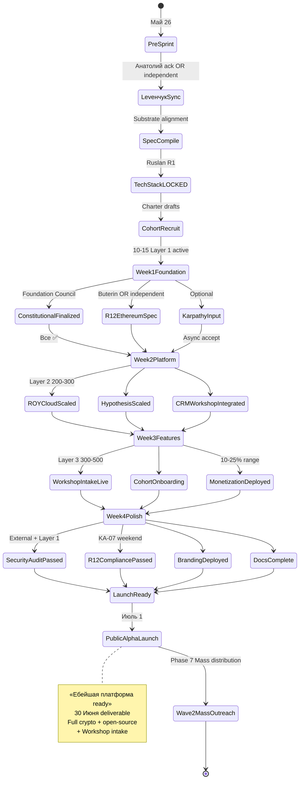
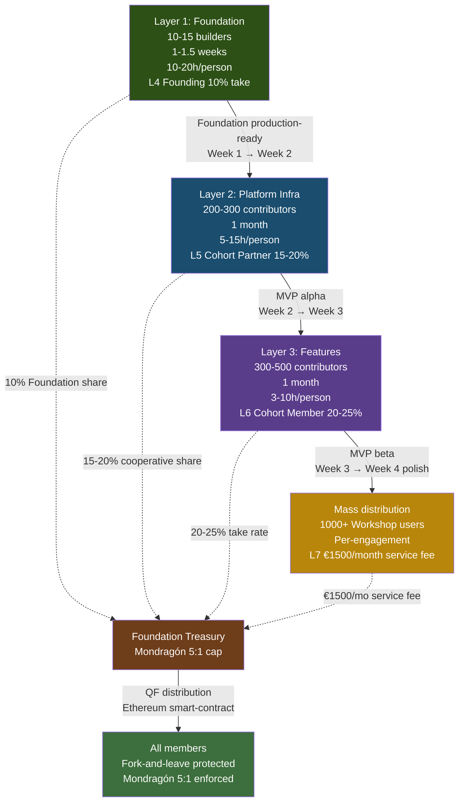

# Phase 5 — MVP Platform June Sprint

> **TL;DR (30-60 sec video).** Май 26-31 pre-sprint planning (Левенчук + spec compile + tech stack + Layer 1 recruit). Июнь 1-30: 4-week sprint. Week 1 Layer 1 Foundation 10-15 builders (Karpathy + Левенчук + МИМ + Buterin). Week 2 Layer 2 hundreds platform infra (ROY swarm cloud + Hypothesis arch scale). Week 3 Layer 3 hundreds features (Workshop intake + onboarding + monetization 10-25%). Week 4 polish + launch ready. 30 Июня = «ебейшая платформа ready». Buterin integration Май 26-31 + R12 programmable Ethereum Option D Hybrid (acked 2026-05-18). Karpathy integration via D2 outreach pack — Layer 1 contribution 10-15 hours. Open-source mandate: Foundation + Security + R12 + Wiki + Method = OS; Platform services + Workshop + Custom = closed-source.

---

## §A May 26-31 — Pre-sprint planning week

### A.1 Pre-sprint task list

| Day | Action | Owner | Output |
|---|---|---|---|
| **26.05 Tue** | Левенчук обсуждение MVP roadmap (если response by then) | Ruslan + Анатолий | Substrate alignment confirmation |
| **27.05 Wed** | Spec document compile (Wave 1 feedback aggregated) | Brigadier scribe | `decisions/strategic/MVP-PLATFORM-SPEC-2026-05-27.md` (R1 author Ruslan) |
| **28.05 Thu** | Tech stack decisions | Ruslan R1 | Stack LOCKED |
| **29.05 Fri** | Initial cohort recruitment list compile | Brigadier + Ruslan | 10-15 Layer 1 candidates pre-ack |
| **30.05 Sat** | Charter drafts prepared per Layer 1 candidate | Brigadier scribe | 10-15 Charter drafts |
| **31.05 Sun** | Send Charter invitations + R12 audit closure Wave 1 | Ruslan R1 send | Layer 1 cohort recruited |

### A.2 Tech stack decisions

**Foundation layer (from Foundation v1.0 LOCKED 2026-04-28):**
- Parts 1-11 architecture preserved
- Pillar A Strategic Direction Substrate operational
- Pillar C principles 2-tier (Tier 1 manager + Tier 2 system)
- F8 Constitutional schemas в `shared/schemas/`
- C1 Shared infrastructure в `swarm/lib/`

**R12 programmable substrate:**
- Ethereum smart-contract Option D Hybrid (acked 2026-05-18)
- Mondragón ratio cap encoded
- QF revenue distribution pattern
- Fork-and-leave exit tokens
- Per-Clan opt-in via Charter

**ROY swarm:**
- 9 agents в `.claude/agents/` operational
- Cloud deployment: jetix-vps + Tailscale + SSH baseline; scale-out planned Week 2
- Mailboxes JSONL + state JSON file canonical

**Wiki v2 Karpathy++ substrate:**
- 9 entity types + 9 typed edges + niches × 6
- Skills library 25+ (/ingest, /ask, /lint, /compile, /project-bootstrap, etc.)

**Workshop intake mechanism:**
- Notion + Telegram + email triage
- Voice-pipeline DRAFT-only (per CLAUDE.md `## Voice-Notes Pipeline`)
- Application form + interview + Charter signing

**Monetization mechanics:**
- 10-25% range per tier (per Phase 4 §C)
- Mondragón 5:1 cap programmable
- Workshop User L7 €1500/month service fee
- Stripe / Crypto payment processor integration (TBD pre-sprint decision)

---

## §B June 1-30 MVP build sprint (4 weeks)

### B.1 Week 1 (1-7 Июнь) — Foundation layer

**Layer 1 cohort:** 10-15 founding builders (Karpathy tier + Левенчук cluster + МИМ + 5-10 engineers).

**Roster (provisional, depends on Wave 1 ack):**
- Andrej Karpathy (10-15h hours Layer 1 contribution — LLM cognition substrate guidance)
- Анатолий Левенчук (substrate alignment review + МИМ FPF integration)
- Виталик Бутерин (R12 programmable Ethereum substrate review + integration spec)
- Chris Olah (Anthropic interpretability — alignment с Wiki v2 retrieval mechanisms)
- Jared Kaplan (Anthropic scaling — leverage limit validation)
- Ilshat Gabdulin (МИМ FPF AI-agents architecture)
- Timur Batyrshin (МИМ FPF service ontology)
- Ivan Podobed (МИМ method-engineering canonical)
- Sergey Markov (RU AI enterprise application input)
- Grigory Sapunov (RU AI Berlin coordination)
- + 3-5 cohort slots filled post Wave 1 Day 1 reactions

**Tasks Week 1:**

| Task | Owner | Output |
|---|---|---|
| Constitutional substrate finalize | Foundation Council (L4 + Ruslan) | `decisions/strategic/CONSTITUTIONAL-LAYER-FINALIZED-2026-06-07.md` |
| R12 programmable Ethereum integration spec | Buterin + Ruslan | `decisions/strategic/R12-ETHEREUM-INTEGRATION-SPEC-2026-06-07.md` |
| FPF F-G-R operational across substrate | Brigadier + engineering-expert | Per-file F-G-R audit log |
| Wiki v2 scaling: prep для Layer 2 onboarding | Engineering team | 100+ concurrent users supported |
| Pillar C principles deployment validation | Foundation Council | Tier 2 12 rules + R12 LOCKED enforcement |
| ROY swarm cloud-ready packaging | System admin | Docker / template package для self-deploy |

**Week 1 Deliverable:** Production-ready Foundation infrastructure + R12 Ethereum integration spec + 10-15 Layer 1 cohort active + Constitutional substrate validated.

### B.2 Week 2 (8-14 Июнь) — Platform infrastructure

**Layer 2 cohort:** 200-300 contributors (Wave 2 cohort + invited contributors + extended МИМ + RU AI community + DACH engineers).

**Roster expansion:**
- Wave 2 outreach Май 31 → Июнь 14 → 200-300 cohort recruited
- Layer 1 founding partners refer + screen + Charter draft
- Cohort Partner L5 tier (15-20% take rate, 3+ months commitment)

**Tasks Week 2:**

| Task | Owner | Output |
|---|---|---|
| ROY swarm cloud deployment at scale | System admin + Layer 2 engineers | Kubernetes / managed runtime |
| Hypothesis arch operational at 200-300 concurrent | Engineering team | Scaling validated |
| CRM integration (KA-03 + Workshop intake) | Sales + Tech assistants | Notion + Telegram + email unified |
| Distribution Plan mechanics deployed | Sales-outreach | Daily cadence 15-20 touches → 50-100/day |
| Voting governance mechanics (Cohort Council) | Foundation Council + L5 partners | On-chain voting via Ethereum substrate |

**Week 2 Deliverable:** MVP platform alpha — 200-300 cohort active + infrastructure scaling validated + governance mechanics operational.

### B.3 Week 3 (15-21 Июнь) — Platform features

**Layer 3 cohort:** 300-500 contributors (Wave 3 cohort + community-driven recruitment).

**Tasks Week 3:**

| Task | Owner | Output |
|---|---|---|
| Workshop intake mechanism (application + interview + Charter) | Sales + Tech assistants | Operational intake flow |
| Cohort onboarding flow (substrate access + tool templates) | Tech + Layer 3 | Onboarding playbook |
| Education layer integration (Method V2 book + course + Hypothesis arch hands-on training) | Brigadier + L5 partners | Initial educational products MVP |
| Monetization mechanics (10-25% range + €1500/mo L7) | Tech + Sales + Foundation Council | Payment processor + revenue split logic |
| Feature feedback loop (cohort feedback → iteration) | Brigadier + all layers | Weekly feedback compile mechanism |

**Week 3 Deliverable:** MVP platform beta — Workshop intake live + cohort onboarding + monetization deployed + educational products MVP.

### B.4 Week 4 (22-30 Июнь) — Polish + launch ready

**Polish tasks:**

| Task | Owner | Output |
|---|---|---|
| Branding finalize (logo + brand guide + materials) | Brand team (assistant #3 + freelance) | Brand kit deployed |
| Security audit (Foundation + R12 + payment + data) | Layer 1 engineers + external auditor | Audit report + fixes |
| R12 compliance check (8-item × all partnerships) | KA-07 R12 weekend audit + brigadier | R12 compliance certificate |
| Outreach kit complete (Wave 4+ scale-ready) | Sales-outreach + Brigadier | Per-tier outreach playbook |
| Documentation pass (open-source Foundation + Method V2 update + Wiki v2) | All layers | Comprehensive docs |
| Test launch dry-run (Phase 7 mass distribution prep) | All teams | Dry-run validation |

**Week 4 Deliverable:** **«Ебейшая платформа» ready** для public alpha launch + Wave 2 mass outreach Июль 1.

---

## §C Виталик Бутерин integration

### C.1 Engagement timeline

- **Май 26-31 Pre-sprint:** Initial contact + integration spec discussion (если ack Wave 1)
- **Июнь 1-7 Week 1:** Layer 1 contribution — R12 Ethereum substrate review + Option D Hybrid integration spec
- **Июнь 8-21 Week 2-3:** Programmable substrate deployment + smart-contract patterns (Mondragón cap + QF revenue + fork-and-leave exit tokens)
- **Июнь 22-30 Week 4:** Audit + launch readiness validation

### C.2 D2 ACKED reference

- **R12 programmable Ethereum substrate Option D Hybrid:** acked 2026-05-18 (`swarm/awaiting-approval/r12-programmable-ethereum-2026-05-18.md`)
- **H8 Ethereum substrate extension Option A:** acked 2026-05-18 (`swarm/awaiting-approval/h8-ethereum-substrate-extension-2026-05-18.md`)

### C.3 Effective contribution estimate

- 15-25 hours over 1-1.5 weeks (Layer 1 sprint Week 1 + optional Week 2 deployment support)
- L4 Founding Partner tier (10% take, founding stake, Founding Council voting)
- Output: R12 Ethereum integration spec + smart-contract patterns + audit input

---

## §D Andrey Karpathy integration

### D.1 Engagement timeline

- **Май 26-31 Pre-sprint:** Initial contact via D2 RUSLAN-ACK outreach pack (already pre-staged)
- **Июнь 1-7 Week 1:** Layer 1 contribution — LLM cognition substrate guidance + neural net architecture insights для Wiki v2 retrieval mechanisms
- **Июнь 8-30 Week 2-4:** Optional audit / endorsement (если engaged)

### D.2 D2 ACKED reference

- **outreach/karpathy-outreach-pack-2026-05-19.md:** Pre-staged 8-doc inventory + Method V2 + custom intro

### D.3 Effective contribution estimate

- 10-15 hours over 1-1.5 weeks (Layer 1 sprint Week 1)
- L4 Founding Partner tier (10% take, founding stake)
- Output: LLM cognition guidance + neural net architecture review + (optional) public endorsement Twitter

---

## §E Open-source mandate (Ruslan voice explicit)

### E.1 Open-source layer (free + public)

| Layer | Substrate | Justification |
|---|---|---|
| **Foundation layer** | Parts 1-11 architecture + Pillar A/B/C | Public infrastructure standard |
| **Security** | R12 programmable substrate + halt-log-alert + Default-Deny table | Trust requires transparency |
| **R12 programmable substrate** | Ethereum smart-contracts + Mondragón cap + fork-and-leave | Anti-extraction enforced by public code |
| **Wiki v2 substrate** | 9 entity types + 9 typed edges + niches × 6 + skills | Karpathy++ LLM Wiki + OmegaWiki pattern |
| **Method V2 documentation** | 65K words + 40 mermaid + canonical structure | Methodology as public good |

**License:** MIT или Apache 2.0 (TBD pre-sprint decision); permissive default per Ruslan voice «open-source fundamentally на уровне Foundation».

**PRIVACY caveats:**
- Personal CRM data: NOT open-source (per CLAUDE.md `## CRM System` privacy)
- Workshop participant data: aggregated only; не personal
- Per-Clan instance-specific overrides: RUSLAN-LAYER not auto-exposed

### E.2 Closed-source / paid layer

| Layer | Substrate | Justification |
|---|---|---|
| **Platform services** | Custom infrastructure + ROY swarm cloud-hosted | Operational complexity + service-level commitment |
| **Workshop access (per Charter)** | Tier L7 €1500/month + cohort access | Service contract |
| **Custom partner integrations** | Per-partner integration logic | Bespoke engineering |
| **Educational products (Method V2 course / book deluxe)** | Paid €100-1000 per product | Educational economy |

### E.3 Foundation Council governance

- L4 Founding Partners + Ruslan = Foundation Council voting
- Decisions on open-source / closed-source boundary: Foundation Council vote (Mondragón equal-weight)
- Per-Clan Charter може override individual layer disposition

---

## §F Deliverables timeline (concrete dates)

| Date | Deliverable | Status target |
|---|---|---|
| **27 Мая** | MVP-Platform-Spec document compiled | ⚠️ R1 author Ruslan |
| **31 Мая** | MVP planning done + Layer 1 cohort recruited (10-15) | ❌→✅ |
| **7 Июня** | Foundation layer production-ready + R12 Ethereum spec | ❌→✅ |
| **14 Июня** | MVP platform alpha (Layer 2 200-300 active) | ❌→✅ |
| **21 Июня** | MVP platform beta (Workshop intake + monetization deployed) | ❌→✅ |
| **30 Июня** | **«Ебейшая платформа» ready** (full crypto + open-source + Workshop intake + Mass-ready) | ❌→✅ |
| **1 Июля** | Public alpha launch + Wave 2 mass outreach starts | Phase 7 Mass distribution begins |

---

## §G Sprint risk surface

### G.1 R-MVP-1 — Layer 1 cohort under-recruited

- **Probability:** 30-40% (Wave 1 Tier-1 response уровень uncertain)
- **Impact:** Foundation layer Week 1 delayed; Sprint timeline cascading slip
- **Mitigation:**
  - Wave 1 Tier-2 backup names (Sapunov / Markov / extended МИМ)
  - Solo + 2-3 ассистентов Foundation layer minimum (lean version)
  - Slip OK: deliver «ебейшая платформа» July 7 instead of June 30 (1-week buffer)

### G.2 R-MVP-2 — Buterin silent

- **Probability:** 50-70% (high-status; D2 pre-stage uncertain)
- **Impact:** R12 Ethereum integration spec без Buterin input; substrate quality lower
- **Mitigation:**
  - Solo + Foundation Council can deploy Option D Hybrid spec based on acked 2026-05-18 framework
  - Smart-contract pattern templates publicly available (OpenZeppelin / Aragon / etc.)
  - Buterin endorsement async; не blocking deployment

### G.3 R-MVP-3 — Karpathy silent

- **Probability:** 60-80% (Twitter DM volume high)
- **Impact:** Wiki v2 retrieval mechanism без LLM cognition input; suboptimal но functional
- **Mitigation:**
  - Wiki v2 already operational (Karpathy++ pattern from public materials)
  - Olah / Kaplan secondary input если those ack
  - Async accept; не critical Phase 5

### G.4 R-MVP-4 — Capital insufficient ($20-50K bridge не secured)

- **Probability:** 30-40%
- **Impact:** Phase 6 team assembly delayed; Sprint solo + 2-3 assistants
- **Mitigation:**
  - Phase 6 §C funding paths (Founding Partner commitments + personal capital + small angel)
  - Sprint scope reducible: skip Layer 2-3 expansion Week 2-3; deliver Foundation + alpha Week 1-2; defer beta + polish Июль
  - Bridge alternative: Layer 1 Founding Partner contributions in-kind (substrate review etc.)

### G.5 R-MVP-5 — Security / R12 vulnerability surfaced

- **Probability:** 15-25%
- **Impact:** Launch blocking; trust signal degradation
- **Mitigation:**
  - Week 4 security audit mandatory (Layer 1 engineers + external auditor)
  - R12 compliance KA-07 weekend audit each Sat
  - Halt-log-alert mechanism F8 grade ≤1s enforced

### G.6 Cross-cutting Sprint risks

| Risk | Likelihood | Impact | Mitigation |
|---|---|---|---|
| Open-source / closed-source boundary dispute | 20% | Medium | Foundation Council vote + Charter precedence |
| Scope creep Week 3-4 | 35% | Medium | Brigadier scope discipline + Week 4 polish-only |
| Workshop intake UX confusion | 25% | Medium | Onboarding playbook + cohort feedback Week 2-3 |
| Payment processor delays (Stripe / Crypto) | 30% | Medium | Multi-processor fallback + manual invoice MVP |

---

## §H Sprint operating discipline

### H.1 Daily rhythm

- **Morning:** Brigadier scribe daily sync (mailboxes + status update)
- **Day:** Layer-specific work; per-layer Slack-equivalent channel (Telegram cohort channel)
- **Evening:** Daily Log append-only entry (per CLAUDE.md `## Working processs`)
- **Weekly Sat:** R12 KA-07 weekend audit + Foundation Council sync

### H.2 Git discipline

- Per-task commit + push: `[layer-N] verb what (why)` format
- Foundation layer: `[L1] ...`; Platform infra: `[L2] ...`; Features: `[L3] ...`; Polish: `[L4] ...`
- API-key audit pre-commit mandatory
- Append-only history; no force-push to main

### H.3 Constitutional discipline

- F8 grade halt ≤1s
- F4 grade halt ≤5s
- F2 grade halt ≤60s
- All emit `swarm/approvals/log.jsonl` + Part 8 SLI
- R12 paired-frame enforced per-partnership

---

## §I Mermaid D9 — June Sprint gantt (4 weeks breakdown)

*D9 — June Sprint gantt 4 weeks + pre-sprint + launch. Critical path: Constitutional finalize Week 1 → Workshop intake Week 3 → Security audit + Dry-run Week 4 → Public alpha launch Июль 1. Parallel tracks: R12 Ethereum + Karpathy input + Layer expansion.*

---

## §J Mermaid D10 — MVP build state machine

*D10 — MVP build state machine. Linear sprint progression (Pre-Sprint → Week 1-4 → Launch) + parallel substreams (Constitutional + R12 Ethereum + Karpathy). Each transition gated by deliverable validation. State convergence at LaunchReady → Public Alpha Launch Июль 1.*

---

## §K Mermaid D11 — Layer cascade (10-15 → hundreds → hundreds → mass)

*D11 — Layer cascade visualization. L1 → L2 → L3 → Mass sequential + parallel revenue flow → Treasury → QF distribution → Members (R12 protected). Mondragón 5:1 cap enforced via Ethereum smart-contract Option D Hybrid.*

---

## §L Phase 5 acceptance criteria

- ✅ Pre-sprint Май 26-31 — planning + spec + tech stack + Layer 1 recruit
- ✅ Week 1 Foundation layer production-ready
- ✅ Week 2 Platform infra (ROY cloud + Hypothesis scale + CRM integration)
- ✅ Week 3 Features (Workshop intake + onboarding + monetization)
- ✅ Week 4 Polish (branding + security + R12 + docs + dry-run)
- ✅ Buterin integration timeline (Май 26-31 → Июнь 7 spec → deploy Week 2-3)
- ✅ Karpathy integration via D2 outreach pack (Layer 1 contribution 10-15h)
- ✅ Open-source mandate (Foundation + Security + R12 + Wiki + Method = OS; Platform services + Workshop + Custom = closed)
- ✅ 30 Июня «Ебейшая платформа» deliverable
- ✅ 3 mermaid (D9 gantt + D10 state machine + D11 layer cascade)

---

## §M Handoff to Phase 6

Phase 5 establishes MVP build sprint structure. Phase 6 «Team assembly» recruits 5 ассистентов to enable Sprint execution — hiring from L4 Founding Partners priority per CLAUDE.md «From first-cohort partners».

---

*[src: prompts/strategic-plan-near-future-2026-05-21.md §6 Phase 5 + daily-logs/_DAILY-LOG-2026-05-21.md Ruslan voice MVP June Sprint + CLAUDE.md «Foundation Architecture v1.0» + swarm/awaiting-approval/r12-programmable-ethereum-2026-05-18.md Option D Hybrid acked + swarm/awaiting-approval/h8-ethereum-substrate-extension-2026-05-18.md Option A acked + outreach/karpathy-outreach-pack-2026-05-19.md D2 ACKED + decisions/strategic/JETIX-ETHEREUM-ARCHITECTURE-2026-05-18/]*
