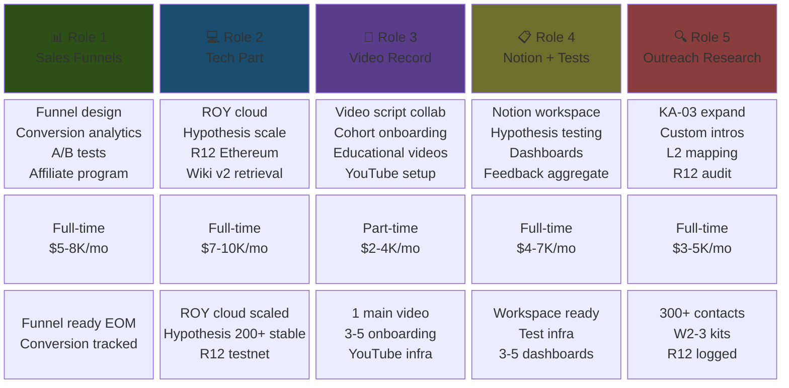
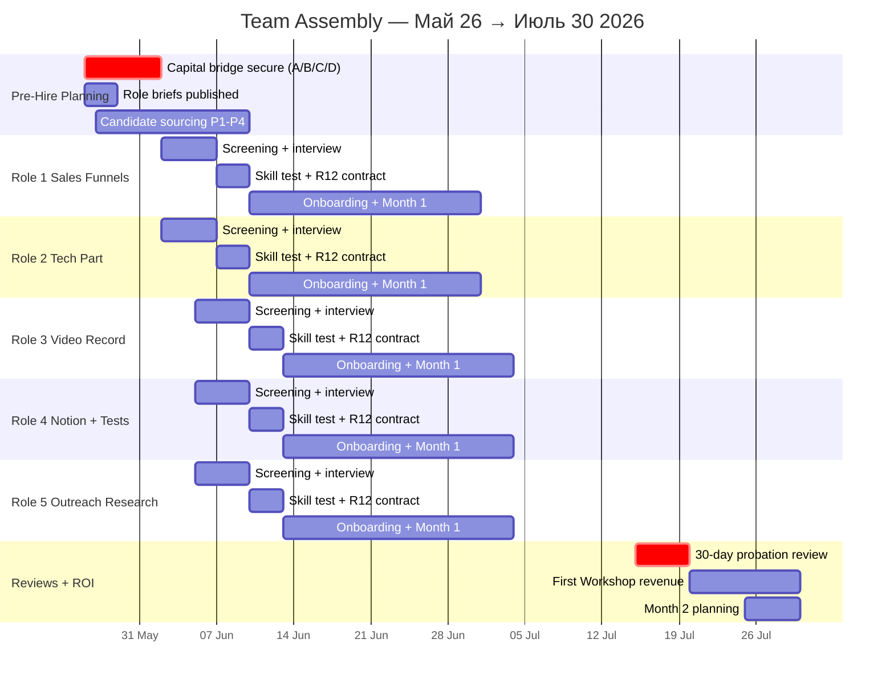

# Phase 6 — Team assembly

> **TL;DR (30-60 sec video).** 5 ассистентов roles per Ruslan voice 21.05: (1) Sales funnels tech-savvy; (2) Tech part engineering + Claude Code expert; (3) Video record content creation + camera; (4) Notion + hypothesis testing; (5) Outreach research communication. Budget $20-50K initial → $4-10K/role/month × 1-2 months runway. Hiring source priority: L4 Founding partners → МИМ ecosystem → RU AI community → public hiring. Capital bridge paths: Founding Partner commitments + personal capital + small angel round + defer-team-Июль fallback.

---

## §A 5 ассистентов roles (Ruslan voice explicit 21.05 night)

### A.1 Role definitions table

| # | Role | Skills required | Time commitment | Expected output |
|---|---|---|---|---|
| **1** | **Sales funnels** | Tech-savvy + sales + funnel building + analytics | Full-time / month | Funnel ready end-of-month (Workshop intake → conversion → cohort) |
| **2** | **Tech part** | Engineering + Claude Code expert + DevOps basics | Full-time / month | Platform features deployed; ROY swarm cloud scaling |
| **3** | **Video record** | Content creation + camera + editing + script collaboration | Part-time | 4-8 videos / month (cohort onboarding + outreach + educational) |
| **4** | **Notion + hypothesis testing** | Organization + testing + analytics + light coding | Full-time | Testing infra + dashboards + Hypothesis arch operational support |
| **5** | **Outreach research** | Communication + research + writing (RU/EN) + CRM | Full-time | Wave 2-3+ targets researched + outreach kits compiled |

### A.2 Role deep-dive

#### A.2.1 Role 1 — Sales funnels (Tech-savvy + sales)

**Profile:** Tech-aware sales person; familiarity с CRM + Stripe / payment processors + funnel analytics tools.

**Specific responsibilities:**
- Workshop intake funnel design (landing → application → interview → Charter signing)
- Conversion analytics (per-stage drop-off + iteration)
- Educational products funnel (Method V2 book / course / video series)
- A/B test discipline per CLAUDE.md §4.2 (ALWAYS awaiting_approval, never auto-deploy)
- Affiliate program design для L2 amplifiers

**Tools:** Notion + Stripe + Telegram bot + Webhook integrations + CRM KA-03 sync.

**Output Month 1:** Funnel infrastructure deployed + 1 A/B test cycle complete + Workshop intake conversion tracked.

#### A.2.2 Role 2 — Tech part (Engineering + Claude Code)

**Profile:** Engineering background; Claude Code skills (skills library + agents); Kubernetes / Docker familiarity; Python / TypeScript / Solidity basics.

**Specific responsibilities:**
- ROY swarm cloud deployment (jetix-vps → Kubernetes / managed runtime scaling)
- Hypothesis arch operational at 200-300 concurrent users (Layer 2 sprint)
- R12 Ethereum smart-contract deployment + audit (с Buterin if engaged; independent fallback)
- Wiki v2 retrieval mechanism optimization
- Voice-pipeline tool maintenance + extension

**Tools:** Claude Code + Anthropic API + Ethereum substrate + Notion + GitHub + jetix-vps + Tailscale.

**Output Month 1:** ROY cloud scaled; Hypothesis arch 200+ concurrent stable; R12 smart-contract deployed testnet.

#### A.2.3 Role 3 — Video record (Content creation)

**Profile:** Camera + editing skills (DaVinci Resolve / Premiere); scriptwriting collaboration; social media platforms (YouTube + Telegram + LinkedIn + X).

**Specific responsibilities:**
- Phase 2 Video record (R1 Ruslan slot — collaborate scripting)
- Cohort onboarding video series (Method V2 + Hypothesis arch hands-on)
- Educational product video components (Method V2 course)
- Wave 2-3 outreach video customizations (per-audience variations)
- YouTube channel infrastructure setup

**Tools:** Camera + lighting + DaVinci Resolve + Adobe Premiere + YouTube Studio.

**Output Month 1:** Phase 2 Video published + 3-5 cohort onboarding videos + YouTube channel infrastructure.

#### A.2.4 Role 4 — Notion + hypothesis testing (Organization + analytics)

**Profile:** Notion power user; analytics tools (PostHog / Mixpanel basics); light coding (Python pandas + Notion API); Hypothesis arch 7-layer familiarity.

**Specific responsibilities:**
- Notion workspace management (Command Center + Daily Log + Projects + Bank of Ideas)
- Hypothesis arch testing infrastructure (L1-L7 chain operational)
- Dashboard creation (per-Layer cohort metrics + funnel + revenue)
- Wave 1-3 feedback aggregation
- CRM KA-03 sync support

**Tools:** Notion + Python + GitHub + PostHog (or alternative) + Telegram bot.

**Output Month 1:** Notion workspace optimized + Hypothesis testing infrastructure + 3-5 dashboards live + Wave 1 feedback aggregated.

#### A.2.5 Role 5 — Outreach research (Communication + research)

**Profile:** Communication skills (RU/EN minimum; DE bonus); research + writing; CRM management; AI / methodology domain familiarity helpful.

**Specific responsibilities:**
- Wave 2-3+ target list expansion (KA-03 CRM expansion to 500+ contacts)
- Per-target research + custom intro substrate compile (brigadier-scribe collaboration)
- L2 amplifier ecosystem mapping (Western AI + RU AI + DACH AI + humanitarian)
- Sales-outreach-agent (DEPRECATED) functions replacement
- R12 8-item checklist pre-send validation per outreach

**Tools:** CRM KA-03 + Notion + GitHub + research tools (Crunchbase / LinkedIn / Twitter Advanced Search).

**Output Month 1:** KA-03 expanded к 300+ contacts + Wave 2-3 outreach kits compiled + R12 audit logged.

---

## §B Hiring source (priority order)

### B.1 Priority 1 — From first-cohort partners

**Rationale:** Alignment + trust + substrate familiarity.

- L4 Founding Partners (Phase 5 Week 1 cohort) — 3-10 people
- Their referrals (network multiplier)
- Cohort partners L5 (Wave 2 cohort) — 30-100 people

**Expected fill rate:** 60-80% of 5 roles от L4/L5 cohort если Wave 1 ack рейт 30-50%.

**Process:** During Charter signing (L4 Founding Partner) — discuss potential hire role + compensation; transition from contributor → employee structure не immediate.

### B.2 Priority 2 — МИМ ecosystem (Левенчук cluster)

**Rationale:** Methodology + FPF familiarity; substrate alignment baseline.

- МИМ alumni (Gabdulin / Batyrshin / Podobed adjacent — possible Role 4 candidates)
- Левенчук's recommended candidates
- МИМ project graduates

**Expected fill rate:** 15-25% of 5 roles от МИМ ecosystem.

### B.3 Priority 3 — RU AI community

**Rationale:** Technical AI familiarity; Telegram-accessible.

- Sapunov / Markov network (Role 2 Tech part candidates)
- RU AI channels active members
- Sber / Yandex / VK ML engineers (Role 2 candidates)

**Expected fill rate:** 10-15% of 5 roles от RU AI community.

### B.4 Priority 4 — Public hiring (last resort)

**Rationale:** Open market; alignment unknown; trust build cycle longer.

- LinkedIn / AngelList / Wellfound postings
- Twitter / X / Hacker News «who's hiring»
- Telegram public job channels

**Expected fill rate:** 5-10% if Priority 1-3 insufficient.

**Caveat:** Public hires require longer onboarding + R12 paired-frame contracts + Charter equivalent + alignment validation period.

---

## §C Budget ($20-50K initial)

### C.1 Per-role budget breakdown

| Role | Time | Monthly | Notes |
|---|---|---|---|
| **1 Sales funnels** | Full-time | $5-8K/mo | Berlin / Russia / Eastern Europe rates |
| **2 Tech part** | Full-time | $7-10K/mo | Engineering premium |
| **3 Video record** | Part-time | $2-4K/mo | Part-time flexibility |
| **4 Notion + hypothesis** | Full-time | $4-7K/mo | Analytics specialist |
| **5 Outreach research** | Full-time | $3-5K/mo | Research generalist |

**Total Month 1:** $21-34K (low-end) → $34K-50K (high-end). **Budget range $20-50K aligns.**

### C.2 Bridge funding paths

#### C.2.1 Path A — Founding Partner commitments (preferred)

- 3-10 L4 Founding Partners при Charter signing committed (e.g., $5-10K each)
- Aggregate $15-100K bridge
- Cooperative-economic model: contribution → equity-like stake
- Mondragón 5:1 cap preserves alignment

#### C.2.2 Path B — Personal capital

- Ruslan personal capital bridge (if available)
- Short-term loan against future Workshop revenue
- Defer some payouts to month 2-3 when revenue starts

#### C.2.3 Path C — Small angel round

- Tier-1 partner (Левенчук / Karpathy / Buterin) potential $50K angel
- Convertible note или SAFE structure
- 30-day fundraising window (Май 26 → Июнь 25)
- Conditional на Tier-1 ack Wave 1

#### C.2.4 Path D — Defer team to Июль (fallback)

- Solo Phase 5 MVP sprint (Layer 1 only; Layer 2-3 deferred)
- «Ебейшая платформа» slipped к 15-30 Июля
- Wave 2 outreach defers к Июль 15
- Phase 7 mass distribution starts Август

**Decision tree:** Path A → Path B → Path C → Path D в order; combine OK.

### C.3 ROI horizon

- Month 1-2: Team deployed; bridge capital consumed
- Month 3-5: First Workshop revenue (€1500/mo × 5-25 paying L7 users = €7.5K-37.5K/mo)
- Month 5-6: Bridge ROI achieved; team self-sustaining
- Month 6+: Reinvestment growth phase

---

## §D Hiring process (per role)

### D.1 Process steps

1. **Role brief published** (1-page job description + R12 paired-frame compensation structure)
2. **Candidate sourcing** (Priority 1 → 4)
3. **Initial screening** (Telegram / email conversation)
4. **Substrate alignment interview** (Method V2 + Foundation v1.0 familiarity check)
5. **Skill test** (per-role specific task — funnel design / engineering exercise / video sample / Notion structure / outreach research)
6. **R12 Contract draft** (employment terms + cooperative-economic alignment)
7. **Ruslan R1 review** (final approval)
8. **Charter / Contract signing**
9. **Onboarding Week 1** (substrate access + tool templates + cohort introduction)
10. **Probation 30 days** (quarterly R12 review at month 3 + 6 + 9 + 12)

### D.2 R12 paired-frame для hires

- **Offer:** Salary + benefits + substrate access + cohort membership + (optional) equity-like stake (L5 Cohort Partner tier eligibility after 6 months)
- **Ask:** Skill contribution + commitment (month-by-month renewable) + R12 compliance
- **Voluntary:** 30-day notice both directions
- **Fork-and-leave:** Substrate access preserved post-employment + proportional treasury share (if vested L5 tier)
- **Mondragón:** 5:1 ratio between Ruslan + lowest-paid hire (i.e., если Ruslan $0 → all aligned cooperative; если Ruslan eventually $40K/mo → lowest must be ≥$8K/mo)

---

## §E Risk surface team assembly

### E.1 R-T-1 — Capital bridge не secured

- **Probability:** 30-40%
- **Impact:** Phase 5 MVP solo execution; Sprint slip
- **Mitigation:** Path D defer Июль (per §C.2.4)

### E.2 R-T-2 — Hires substrate misalignment

- **Probability:** 20-30%
- **Impact:** Onboarding delay + alignment risk
- **Mitigation:** Priority 1 (L4/L5 cohort hire) + substrate alignment interview + 30-day probation

### E.3 R-T-3 — Manager attention budget overrun

- **Probability:** 35-45%
- **Impact:** Per CLAUDE.md §4.2 Manager attention budget cap 20 active tasks; risk of cascade hurry
- **Mitigation:** Hub-and-spoke (per §4.2) — subagents → department Lead → Manager; brigadier scribe filters

### E.4 R-T-4 — Geographic / timezone friction

- **Probability:** 25-35%
- **Impact:** Async communication overhead
- **Mitigation:** Telegram-first communication; Berlin / Moscow / Western Europe timezone alignment preferred; weekly sync Saturday

### E.5 R-T-5 — Role overlap / unclear boundaries

- **Probability:** 30-40%
- **Impact:** Duplication of work + cohort confusion
- **Mitigation:** Role brief explicit + manager (Ruslan) coordination + brigadier scribe daily sync

---

## §F Mermaid D12 — 5 roles structure (block-beta)

*D12 — 5 roles structure 4-row block. Row 1: role name; Row 2: skill specifics; Row 3: time + cost; Row 4: Month 1 output. Цвет codes per-role distinction.*

---

## §G Mermaid D13 — Team formation timeline (gantt)

*D13 — Team assembly gantt Май 26 → Июль 30. Critical path: capital bridge → role briefs → sourcing → 5 parallel hire tracks → 30-day probation → first revenue → Month 2 planning. Role 1+2 (Sales + Tech) priority hire Week 1 Июнь (Phase 5 sprint dependency).*

---

## §H Phase 6 acceptance criteria

- ✅ 5 ассистентов roles defined (Sales / Tech / Video / Notion+Tests / Outreach)
- ✅ Skills + time + monthly cost + Month 1 output specified per role
- ✅ Hiring source priority (L4/L5 cohort → МИМ → RU AI → public)
- ✅ Budget $20-50K → $4-10K/role/month aligned
- ✅ Bridge funding paths A/B/C/D
- ✅ R12 paired-frame applies к hire contracts
- ✅ Mondragón 5:1 ratio enforced на team level
- ✅ Hiring process 10-step
- ✅ Risk surface 5 risks (capital / misalignment / attention budget / timezone / role overlap)
- ✅ 2 mermaid (D12 5 roles structure + D13 team formation gantt)

---

## §I Handoff to Phase 7

Phase 6 establishes team capacity. Phase 7 «Cascade layers» extends Phase 5 layer structure across Май → Июль horizon, projecting Layer 1 → 2 → 3 → mass cohort growth.

---

*[src: prompts/strategic-plan-near-future-2026-05-21.md §7 Phase 6 + daily-logs/_DAILY-LOG-2026-05-21.md Ruslan voice 5 ассистентов roles + CLAUDE.md §4.2 Manager attention budget cap 20 + CLAUDE.md `## CRM System` strategy-hooks + Phase 4 R12 paired-frame + Phase 5 Layer 1-3 cohort structure]*
