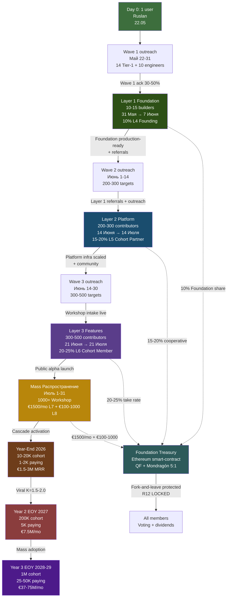
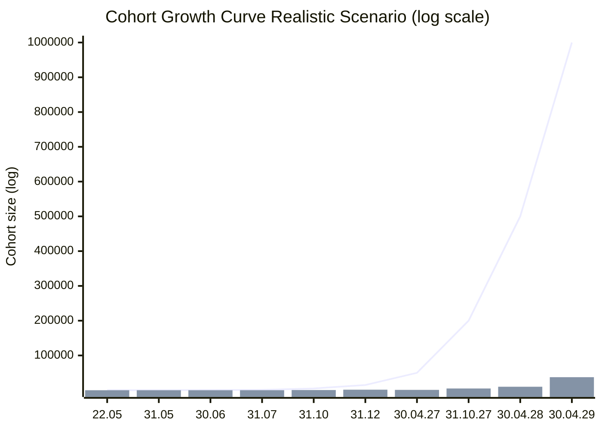
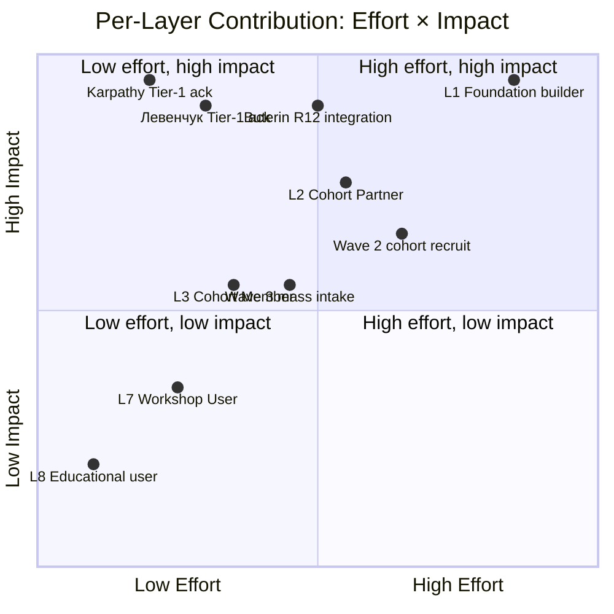

# Phase 7 — Cascade layers (Layer 1 → 2 → 3 → mass Июль)

> **TL;DR (30-60 sec video).** Layer 1 (10-15 Karpathy-tier; 1-1.5 weeks; Founding 10%). Layer 2 (200-300 platform builders; 1 month; Cohort Partner 15-20%). Layer 3 (300-500 feature contributors; 1 month; Cohort Member 20-25%). Июль mass distribution (1000+ Workshop users; €1500/mo L7 service fee). Cohort growth: 22.05 1 → 31.05 ~15 → 30.06 ~200-300 → 31.07 ~1000+ → Year-end 10K+ trajectory. Resource model per-layer aligned с Phase 4 partnership tiers. 3 mermaid: cascade visualization + xychart growth + effort × impact quadrant.

---

## §A Layer 1 — Foundation builders (~10-15 people; 1-1.5 weeks)

### A.1 Cohort composition

**Profile target:** Karpathy-tier engineers + Левенчук cluster + МИМ FPF + Buterin + Anthropic team (Olah / Kaplan if engaged).

**Roster provisional:**
- Andrej Karpathy (LLM cognition substrate; Anthropic adjacent)
- Анатолий Левенчук (МИМ FPF methodology canonical)
- Цэрэн Цэрэнов (МИМ ecosystem coordination)
- Виталик Бутерин (R12 Ethereum substrate)
- Chris Olah (Anthropic interpretability)
- Jared Kaplan (Anthropic scaling)
- Ilshat Gabdulin (МИМ FPF AI-agents)
- Timur Batyrshin (МИМ FPF service ontology)
- Ivan Podobed (МИМ method-engineering canonical)
- Sergey Markov (RU AI Sber)
- Grigory Sapunov (RU AI Berlin)
- + 3-5 cohort slots discovered post Wave 1 reactions

### A.2 Sprint focus

**Foundation layer Week 1 sprint (Phase 5 §B.1):**
- Constitutional substrate finalize
- R12 programmable Ethereum integration spec
- FPF F-G-R operational across substrate
- Wiki v2 scaling prep for Layer 2 onboarding
- Pillar C principles deployment validation
- ROY swarm cloud-ready packaging

### A.3 Effective contribution per person

- **10-20 hours over 1-1.5 weeks** (Layer 1 sprint Week 1)
- High-leverage: substrate review + architecture input + public endorsement (optional)
- L4 Founding Partner tier compensation (10% Foundation institutional share + founding stake)

### A.4 Layer 1 success criteria

- ✅ 10-15 Layer 1 cohort recruited (Май 31)
- ✅ Foundation layer production-ready (Июнь 7)
- ✅ R12 Ethereum integration spec validated
- ✅ Constitutional substrate finalize signed-off by Foundation Council
- ✅ Public endorsement из ≥3 Layer 1 partners (optional but high-leverage)

---

## §B Layer 2 — Platform builders (next month ~200-300 people)

### B.1 Cohort composition

**Profile target:** Wave 2 cohort + invited contributors + extended МИМ + RU AI community + DACH engineers + Western AI cluster.

**Sourcing channels:**
- Wave 1 Tier-1 partner referrals (network effect)
- L2 amplifier coverage (Markov / Sapunov / Lex if engaged) → audience tap
- Workshop intake mechanism applications (post Wave 2 outreach Май 31)
- МИМ ecosystem expansion (Левенчук cluster invitations)
- Telegram channels (МИМ + RU AI) public posts
- LinkedIn DACH AI cluster (Berlin TU Berlin + Munich + Zurich)

### B.2 Sprint focus

**Platform infrastructure Week 2 sprint (Phase 5 §B.2):**
- ROY swarm cloud deployment at scale (Kubernetes / managed runtime)
- Hypothesis arch operational at 200-300 concurrent
- CRM integration (KA-03 + Workshop intake unified)
- Distribution Plan mechanics deployed (daily cadence 15-20 → 50-100/day)
- Voting governance mechanics (Cohort Council on-chain via Ethereum substrate)

### B.3 Effective contribution per person

- **5-15 hours over 1 month** (Layer 2 sprint Week 2)
- Cohort Partner L5 tier compensation (15-20% cooperative share + cooperative shares + Cohort Council voting)
- 3+ months commitment baseline

### B.4 Layer 2 success criteria

- ✅ 200-300 Layer 2 cohort recruited (Июнь 14)
- ✅ Platform infrastructure scaling validated 200-300 concurrent
- ✅ Cohort Council voting governance operational
- ✅ R12 quarterly audit baseline established
- ✅ Workshop intake mechanism live (alpha)

---

## §C Layer 3 — Feature contributors (~300-500 people)

### C.1 Cohort composition

**Profile target:** Wave 3 cohort + community-driven recruitment + Workshop intake graduates + educational product participants.

**Sourcing channels:**
- Layer 2 Cohort Partner referrals (network multiplier)
- Workshop intake mechanism (Phase 5 Week 3 live)
- Wave 3 outreach (Июнь 14-30 send)
- Educational product graduates (Method V2 course completions → cohort invitation)
- Public alpha launch (Июль 1) — open application

### C.2 Sprint focus

**Features Week 3 sprint (Phase 5 §B.3):**
- Workshop intake mechanism (application + interview + Charter)
- Cohort onboarding flow (substrate access + tool templates)
- Education layer integration (Method V2 book + course + Hypothesis arch hands-on training)
- Monetization mechanics deployment (10-25% range + €1500/mo L7)
- Feature feedback loop (cohort feedback → iteration)

### C.3 Effective contribution per person

- **3-10 hours over 1 month** (Layer 3 sprint Week 3)
- Cohort Member L6 tier compensation (20-25% take rate + voting rights vested month 3+)
- 1+ month commitment baseline

### C.4 Layer 3 success criteria

- ✅ 300-500 Layer 3 cohort recruited (Июнь 21)
- ✅ Workshop intake mechanism live (beta)
- ✅ Cohort onboarding flow validated
- ✅ Monetization mechanics deployed (Workshop tier L7 paying users ≥5)
- ✅ Educational products MVP available

---

## §D Июль (Июль 1-31) — Mass distribution

### D.1 Подготовленный фундамент распространяется по миру

**Sprint focus:**
- Cascade activation per Distribution Plan §3 (`decisions/strategic/DISTRIBUTION-PLAN-2026-05-20.md`)
- Blogger outreach + media leverage (L2 amplifier ecosystem mobilized)
- Educational products launch (Method V2 book + course + video series public)
- Workshop intake at scale (1000+ Workshop tier L7)

### D.2 Cascade activation sub-tasks

| Sub-task | Owner | Output |
|---|---|---|
| Daily cadence 50-100/day → 1000+/day | Sales-outreach + Role 5 | Conversion rate 5-10% intake from outreach |
| Blogger coverage launch (Lex / Naval / Markov / Sapunov / Karpathy quote-tweet) | Brigadier + Layer 1 partners | Blog coverage 3-5 major + 10-20 minor |
| Public alpha YouTube channel launch | Role 3 (Video) | YouTube subscriber growth 1-10K |
| Educational products Stripe storefront live | Role 1 (Sales) + Role 2 (Tech) | 50-200 product sales Month 1 |
| Workshop intake at scale | All roles | 100-1000 Workshop users L7 |
| Wave 4-5 outreach launches | Sales-outreach | Tier-1 expansion + L3 institutional |

### D.3 Mass distribution targets Июль 31

- **Cohort growth:** 1000+ contributors (Layer 1 + 2 + 3 + Workshop L7 + Mass L8 educational)
- **Paying users (L7):** 100-1000 Workshop tier paying €1500/mo (= €150K - €1.5M MRR)
- **Educational product sales:** 50-200 sales Month 1 (€100-1000 per product = €5K-200K)
- **Public reach:** 100K-1M aware (Lex podcast / Karpathy tweet / Naval mention triggers)

---

## §E Cohort growth curve assumption

### E.1 Per-milestone projection (Realistic scenario)

| Milestone | Date | Cohort size | Paying users | Revenue MRR (estimate) |
|---|---|---|---|---|
| **22.05** | Day 1 | 1 (Ruslan) | 0 | €0 |
| **31.05** | Wave 1 closure | ~15 founding (Layer 1 candidates) | 0 | €0 |
| **15.06** | MVP alpha | ~100 cohort + 15 founding | 0 | €0 |
| **30.06** | MVP beta + launch ready | ~200-300 cohort + Layer 1 + 2 | 5 paying Workshop L7 | €7.5K MRR |
| **31.07** | Mass distribution Июль | ~1000+ contributors | 25-100 paying | €37.5K-150K MRR |
| **31.10** | Q3 closure | ~5K cohort | 500 paying | €750K MRR |
| **31.12** | Y1 closure | ~10K-20K cohort | 1-2K paying | €1.5-3M MRR |
| **30.04.2027** | Y1 EOY | ~50K cohort | 1K paying | €1.5M/mo |
| **31.10.2027** | Y2 H1 | ~200K | 5K paying | €7.5M/mo |
| **30.04.2028** | Y2 EOY | ~500K | 10K paying | €15M/mo |
| **30.04.2029** | Y3 EOY | **1M cohort** | 25-50K paying | €37-75M/mo |

### E.2 Growth coefficient analysis

- **Май 22 → Май 31:** 1 → 15 (15× over 10 days; Wave 1 cohort recruit)
- **Май 31 → Июнь 30:** 15 → 200-300 (15-20× over 30 days; Layer 2 scale)
- **Июнь 30 → Июль 31:** 300 → 1000+ (3-5× over 30 days; Mass distribution)
- **Июль 31 → Окт 31:** 1000 → 5000 (5× over 90 days; cascade established)
- **Окт 31 → Дек 31:** 5000 → 10-20K (2-4× over 60 days; Y1 EOY momentum)
- **Год 1 → Год 2:** 20K → 200K (10× over 12 months; viral coefficient depends Scenario)
- **Год 2 → Год 3:** 200K → 1M (5× over 12 months; mass adoption)

### E.3 Viral coefficient assumption

- **Year 1 baseline:** K=1.2 (each cohort member brings 1.2 new) → expansion modest
- **Year 2 optimistic:** K=1.5-2.0 (cascade established + Tier-1 endorsement + educational product loop)
- **Year 3 conservative:** K=1.0-1.2 (saturation effect; mass adoption requires institutional partnerships)

---

## §F Resource model per layer (R12 paired-frame)

### F.1 Per-layer compensation structure

| Layer | Take rate | Equity-like | Voting | Commitment | Mondragón ratio |
|---|---|---|---|---|---|
| **Layer 1 (L4 Founding)** | 10% | Founding stake | Founding Council | 6+ months | 5:1 cap enforced |
| **Layer 2 (L5 Cohort Partner)** | 15-20% | Cooperative shares | Cohort Council | 3+ months | 5:1 cap enforced |
| **Layer 3 (L6 Cohort Member)** | 20-25% | Voting rights | Cohort Council (vested mo 3+) | 1+ month | 5:1 cap enforced |
| **Mass (L7 Workshop User)** | Service fee €1500/mo | None | None | Per-engagement | Service relationship |
| **Mass (L8 Educational user)** | Free / €100-1000 per product | None | None | Per-product | Service relationship |

### F.2 Revenue flow

**Each layer revenue contribution → Foundation Treasury → QF distribution:**
- L1 10% Foundation share (small absolute; founding alignment signal)
- L2 15-20% cooperative share (medium absolute; platform builders)
- L3 20-25% take rate (medium-high absolute; feature contributors)
- L7 €1500/mo × N users (high absolute; primary revenue driver)
- L8 €100-1000 per product × N sales (medium-high absolute; secondary revenue driver)

**Treasury distribution via Ethereum smart-contract (Option D Hybrid acked 2026-05-18):**
- QF (Quadratic Funding) pattern для allocation decisions
- Mondragón 5:1 cap encoded
- Fork-and-leave exit tokens
- Per-Clan opt-in via Charter

### F.3 Compensation flow example

**Scenario:** Year 1 EOY €1.5M MRR; €18M ARR.

- **L7 Workshop revenue:** 1K paying × €1500/mo = €1.5M/mo
- **L8 Educational:** 100 product sales/mo × €500 avg = €50K/mo
- **Total MRR ~€1.55M**

**Distribution (cooperative model):**
- L7 service revenue: 100% к Treasury → distributed per QF
- L8 product revenue: 70% к creator (Layer 3 cohort member) + 30% Treasury

**Treasury split:**
- 10% Foundation institutional share (Layer 1 partners)
- 20% Cohort Partner pool (Layer 2 partners; 15-20% range averaged)
- 25% Cohort Member pool (Layer 3 members; 20-25% range averaged)
- 45% Reinvestment / operational reserve

**Mondragón 5:1 check:**
- Highest payout: founding Ruslan + Layer 1 partners ≈ €X/mo
- Lowest payout: Cohort Member L6 ≈ €X/5 minimum
- Smart-contract enforces

---

## §G Mermaid D14 — Layer cascade visualization

*D14 — Layer cascade с full revenue flow + projection к Year 3 1M cohort. Solid arrows = recruitment cascade; dashed arrows = revenue flow к Treasury → distribution к Members (R12 protected).*

---

## §H Mermaid D15 — Cohort growth xychart (log scale)

*D15 — Cohort growth curve Realistic Scenario (Phase 8 §C.B). Line = total cohort size; bars = paying users (Workshop L7+). Log y-axis показывает exponential growth pattern characteristic of viral cascade. Key inflection: Май 31 → Июнь 30 (15→250) = 15× over 30 days; Год 3 finish = 1M cohort + 25-50K paying.*

---

## §I Mermaid D16 — Per-layer effort × impact quadrant

*D16 — Per-layer effort × impact. L1 Foundation builders highest both axes (deepest contribution + highest leverage). Karpathy/Левенчук Tier-1 ack high-impact-low-effort (single endorsement → massive cascade). Wave 2-3 cohort medium-effort-medium-impact. L8 Educational user lowest both (per-engagement transactional).*

---

## §J Phase 7 acceptance criteria

- ✅ Layer 1 (10-15 Karpathy-tier; 10-20h/person; L4 10% take)
- ✅ Layer 2 (200-300 platform builders; 5-15h/person; L5 15-20% take)
- ✅ Layer 3 (300-500 feature contributors; 3-10h/person; L6 20-25% take)
- ✅ Mass distribution Июль (1000+ Workshop L7; €1500/mo service fee)
- ✅ Cohort growth curve 10 milestones (22.05 → 30.04.2029 1M)
- ✅ Viral coefficient assumptions (Y1 K=1.2 / Y2 K=1.5-2.0 / Y3 K=1.0-1.2)
- ✅ Resource model per-layer R12 paired (10/15-20/20-25% / Mondragón 5:1)
- ✅ Treasury distribution Ethereum smart-contract Option D Hybrid
- ✅ 3 mermaid (D14 cascade + D15 xychart + D16 effort × impact quadrant)

---

## §K Handoff to Phase 8

Phase 7 establishes cascade structure + growth projection baseline. Phase 8 ⭐⭐ «Path to 1M users» deepens с 8-tier user pyramid + 4 conversion scenarios + concrete trajectory numbers.

---

*[src: prompts/strategic-plan-near-future-2026-05-21.md §8 Phase 7 + daily-logs/_DAILY-LOG-2026-05-21.md cohort growth assumption + Phase 4 §C partnership tiers + Phase 5 §B layer cascade + decisions/strategic/DISTRIBUTION-PLAN-2026-05-20.md cascade mechanics + CLAUDE.md §4.2 R12 Ethereum substrate Option D Hybrid acked 2026-05-18 + research/unit-econ-deep-dive-2026-05-21/_RECOMMENDATION-MEMO.md DR-26]*
