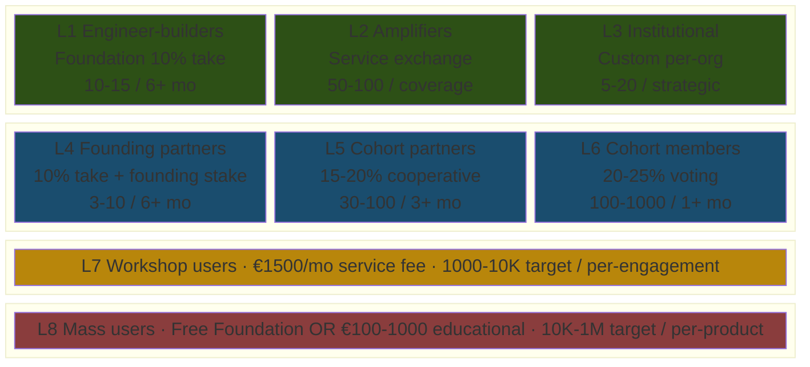
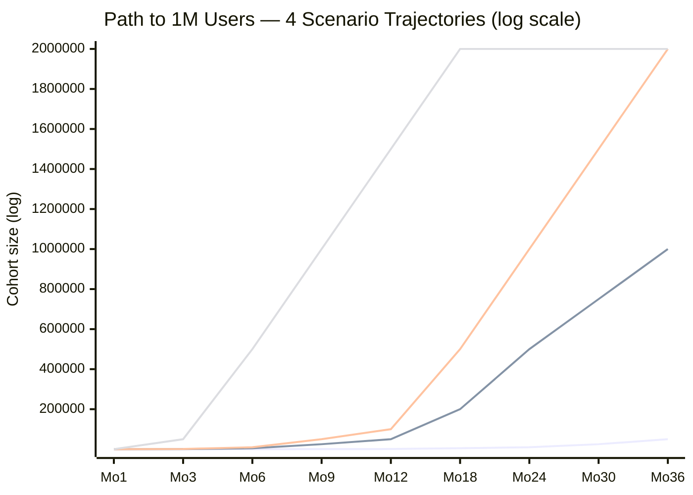
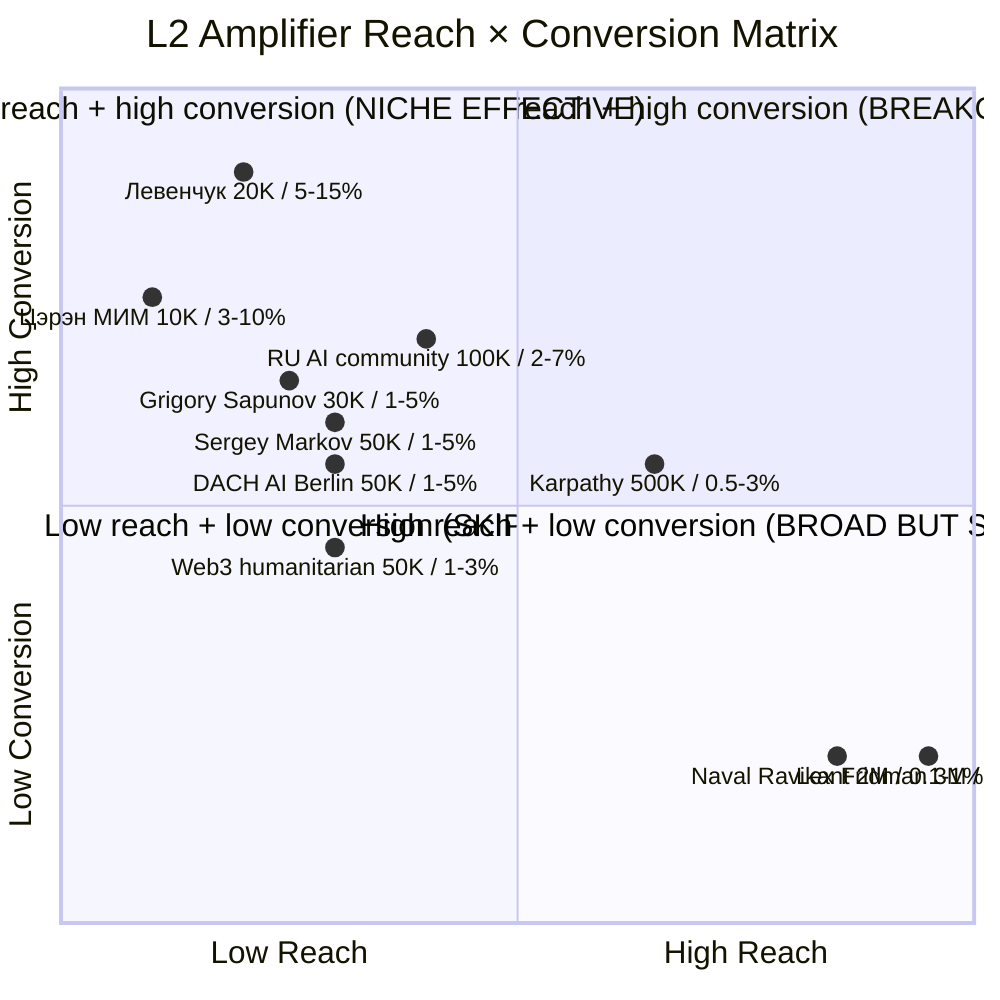
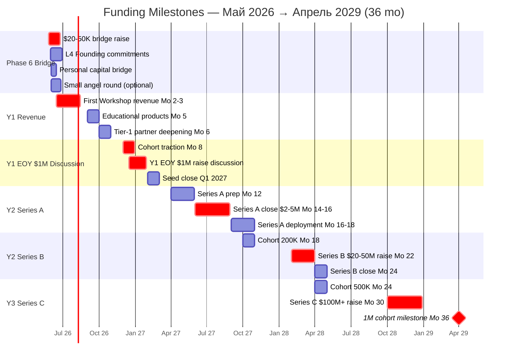

# Phase 8 ⭐⭐ — Path to 1M users

> **TL;DR (30-60 sec video).** 8-tier user pyramid (L1 Engineer-builders / L2 Amplifiers / L3 Institutional / L4 Founding / L5 Cohort Partner / L6 Cohort Member / L7 Workshop user / L8 Mass educational). 4 conversion scenarios: A Conservative (70% likely; 100K cohort + 10K paying in 18-24 mo); B Realistic (40% likely; 100K cohort + 5K paying in 12-18 mo; path к 1M = 24-36 mo); C Aggressive viral K=1.5 (15% likely; 100K cohort in 12 mo; 1M в 18-24 mo); D Hyper media-moment breakout (5% likely; 1M cohort в 6-12 mo). Existing reach baseline 169 CRM + 10M reachable через 7 L2 amplifiers если все ack. Concrete 12-month Realistic trajectory: Месяц 1 15 founding → 12 50K cohort + 1K paying = €1.5M MRR → 36 1M cohort + 25-50K paying = €37-75M MRR. 5 mermaid: pyramid + funnel × 4 scenarios + xychart trajectory + reach × conversion matrix + funding milestone gantt.

---

## §A User types — 8-tier pyramid

### A.1 Pyramid table (foundation layer ↔ mass layer)

| Tier | Type | Take rate / Pricing | Commitment | Count target (12 mo) | Recruit channel |
|---|---|---|---|---|---|
| **L1** | Engineer-builders (Foundation) | 10% (lower; symbolic) | 6+ mo hands-on | 10-15 | Wave 1 Tier-1 outreach |
| **L2** | Amplifiers / Community (bloggers / RU AI / МИМ) | Service exchange | Coverage / endorsement | 50-100 | Wave 1-2 L2 amplifier tier |
| **L3** | Institutional (orgs / foundations / universities) | Custom (per-org) | Strategic | 5-20 orgs | Wave 1-3 institutional batch |
| **L4** | Founding partners | 10% (founding stake) | 6+ months | 3-10 | L1 cohort upgrade + Foundation Council |
| **L5** | Cohort partners | 15-20% | 3+ months | 30-100 | Wave 2 cohort + L1 referrals |
| **L6** | Cohort members | 20-25% | 1+ month | 100-1000 | Wave 3 cohort + Workshop graduates |
| **L7** | Workshop users | €1500/month service fee | Per-engagement | 1000-10K | Workshop intake mechanism Phase 5 §B.3 |
| **L8** | Mass users (educational + free) | Free / €100-1000 per product | Per-product | 10K-1M | Mass distribution Phase 7 §D Июль+ |

### A.2 Tier hierarchy interpretation

- **L1-L3:** "Builders" — substrate creation + amplification + institutional alignment
- **L4-L6:** "Cohort" — co-creation + voting + cooperative economics
- **L7:** "Workshop users" — service customers paying €1500/mo для cohort access + tool templates
- **L8:** "Mass" — educational product consumers + free public Foundation access

### A.3 R12 paired-frame applies к L4-L6 (10-25% take rate range)

- L4 Founding: 10% take + founding stake
- L5 Cohort Partner: 15-20% cooperative share
- L6 Cohort Member: 20-25% voting member

L1-L3 use service exchange / custom per-partnership / co-creation patterns; L7 paid service tier; L8 paid product tier или free.

---

## §B Existing reach baseline (current state per KA-03 CRM 169 contacts)

### B.1 KA-03 direct contacts

| Segment | Direct contacts loaded | Notes |
|---|---|---|
| **L1 + L4 candidates** (engineers + Founding partners) | **7 L1 ack queue + 14 Tier-1** = ~21 immediate | Wave 1 priority targets |
| **L2 amplifiers** (KA-03 L2 segment) | **35 загружено** | Wave 1-2 amplifier outreach |
| **L3 institutional** | **51 загружено** | Wave 1-3 institutional batch |
| **Extended pool target Wave 2-3** | ~500 potential | KA-03 expansion Role 5 Outreach research |

**Total KA-03 baseline:** 169 contacts; extensible к 500-1000 via Role 5 research function.

### B.2 Через L2 amplifiers — secondary reach (audience доступная через них)

| Blogger / amplifier | Estimated audience | Conversion potential | Estimated downstream users |
|---|---|---|---|
| **Lex Fridman** (если podcast) | ~3M YouTube subs | 0.1-1% conv | 3-30K |
| **Naval Ravikant** | ~2M Twitter | 0.1-1% | 2-20K |
| **Andrej Karpathy** | ~500K | 0.5-3% | 2.5-15K |
| **Sergey Markov** (RU AI) | ~50K | 1-5% | 0.5-2.5K |
| **Grigory Sapunov** | ~30K | 1-5% | 0.3-1.5K |
| **Лекс Левенчук audience** | ~20K (МИМ) | 5-15% (high alignment) | 1-3K |
| **Цэрэн МИМ** | ~10K | 3-10% | 300-1K |
| **Tier-1 14 names cumulative reach** | **~5-10M** | per scenario below | per scenario below |

**Aggregate если 5-10 Tier-1 ack:** ~10M reachable cumulative.

### B.3 Extended reach assumptions

- **DACH AI cluster:** ~50K Berlin / Munich / Zurich engineers reachable via LinkedIn + tech meetups
- **RU AI community:** ~100K (Sber + Yandex + VK + МИМ + community channels)
- **Western AI engineering Twitter:** ~500K (Karpathy adjacent + Anthropic + DeepMind + OpenAI)
- **Humanitarian / cooperative economics:** ~50-100K (Web3 + DAOs + cooperative movements)

**Combined extended reach (если all activated):** ~10M cumulative; saturation effect.

---

## §C Conversion math scenarios — 4 cases

### C.1 Baseline assumptions

- **Total reachable audience через Wave 1-3 cascade** (L2 amplifiers + media): **~10M** (если 5-10 Tier-1 ack)
- **Per-stage funnel:** aware → interested → engaged → cohort → paying
- **Time-horizon:** 12-36 months operational
- **Constitutional posture preserved:** все scenarios assume R12 paired-frame + Mondragón 5:1 + fork-and-leave

---

### C.2 📉 Scenario A — Conservative (1% conversion baseline)

**Probability:** **70% likely default** (substrate quality + persistent execution baseline)

| Stage | Funnel rate | Count из 10M reachable |
|---|---|---|
| Aware (saw video / heard about) | 100% | 10M |
| Interested (clicked / read materials) | 5% | 500K |
| Engaged (filled form / DM'ed) | 1% of aware | 100K |
| Cohort member (signed Charter) | 0.1% of aware | 10K |
| Paying (Workshop tier+) | 0.01% of aware | 1K |

**Timeline Conservative:**
- 6 mo: 50-100 cohort + 5-10 paying
- 12 mo: 500-1K cohort + 25-50 paying
- 18-24 mo: ~10K cohort + ~1K paying

**Revenue projection:**
- 12 mo MRR: ~€37.5-75K (25-50 paying × €1500)
- 24 mo MRR: ~€1.5M (1K paying × €1500)

**Failure mode:** Substrate not delivered → Wave 1 silent → cohort stagnates at 10-50

---

### C.3 📊 Scenario B — Realistic (5-10% mid-funnel conversion)

**Probability:** **40% likely** (+ Tier-1 cluster ack (3-5 names) + decent video reach)

| Stage | Funnel rate | Count |
|---|---|---|
| Aware | 100% | 10M |
| Interested | 10% | 1M |
| Engaged | 1% of aware | 100K |
| Cohort | 0.5% of aware | 50K |
| Paying | 0.05% of aware | 5K |

**Timeline Realistic:**
- 6 mo: 500-1K cohort + 25-100 paying
- 12 mo: 10-20K cohort + 1-2K paying
- 18 mo: 100K cohort + 5K paying
- 24-36 mo: **Path к 1M cohort при сохранении cascade**

**Revenue projection:**
- 12 mo MRR: ~€1.5-3M (1-2K paying × €1500)
- 24 mo MRR: ~€7.5M (5K paying × €1500)
- 36 mo MRR (1M cohort): ~€37.5-75M (25-50K paying × €1500)

**Failure mode:** Tier-1 silent → cascade weak → cohort plateaus at 500-2K

---

### C.4 📈 Scenario C — Aggressive (20-30% conversion + viral coefficient K=1.5)

**Probability:** **15% likely** (+ Viral coefficient substrate genuinely outstanding + 2-3 amplifier ack)

**Viral math:**
- Initial cohort 1000 → 1500 → 2250 → 3375 → ... → 100K за 11-13 cycles
- Cycle ≈ 1 month → **~12 months к 100K cohort**

**Funnel:**
- 10M reach → 10% interested = 1M
- 10% engaged = 100K
- 10% cohort = 10K
- Viral K=1.5 amplifies → 100K cohort within 12 mo
- **К 1M cohort = 18-24 months total** при continued cascade

**Timeline Aggressive:**
- 6 mo: 5-10K cohort + 500-1K paying
- 12 mo: 100K cohort + 5-10K paying
- 18 mo: 500K cohort + 25K paying
- 24 mo: **1M cohort + 50K paying**

**Revenue projection:**
- 12 mo MRR: ~€7.5-15M (5-10K paying × €1500)
- 24 mo MRR (1M cohort): ~€75M MRR (50K paying × €1500)

**Failure mode:** Viral coefficient < 1 → growth exponential decay → cohort plateaus

---

### C.5 🚀 Scenario D — Hyper (viral cascade + media moment)

**Probability:** **5% likely** (+ Media breakout event — low probability но high payoff)

**Catalyst:** Breakout media moment (TED talk / Lex podcast viral / Karpathy endorsement public quote-tweet / Naval mention).

**Reach explosion:**
- Reach expand 10M → 100M через single viral event
- 1% conversion = 1M cohort
- **К 1M cohort = 6-12 months** (если breakout)

**Funnel:**
- 100M aware
- 1% interested = 1M
- 0.1% engaged = 100K
- All 100K engaged → cohort (after Wave 4-5 outreach + Workshop intake scale)
- Paying = 5-10K (5-10% of 100K engaged)

**Timeline Hyper:**
- 3 mo: 100K cohort + 5K paying
- 6 mo: 500K cohort + 25K paying
- 9-12 mo: **1M cohort + 50K paying**

**Revenue projection:**
- 6 mo MRR: ~€37.5M (25K paying × €1500)
- 12 mo MRR (1M cohort): ~€75M (50K paying × €1500)

**Failure mode:** Media moment doesn't materialize → fallback к Realistic

---

## §D Scenario probability assessment + combined expected value

### D.1 Probability matrix

| Scenario | Probability | Conditions for hitting | Cohort at 12 mo | Paying at 12 mo | MRR at 12 mo |
|---|---|---|---|---|---|
| **A Conservative** | 70% | Substrate quality + persistent execution | 500-1K | 25-50 | €37.5-75K |
| **B Realistic** | 40% | + Tier-1 cluster ack (3-5) + decent video reach | 10-20K | 1-2K | €1.5-3M |
| **C Aggressive** | 15% | + Viral K=1.5 substrate genuinely outstanding + 2-3 amplifier ack | 100K | 5-10K | €7.5-15M |
| **D Hyper** | 5% | + Media breakout event (Lex / Karpathy / TED) | 500K-1M | 25-50K | €37.5-75M |

**Note:** Probabilities не sum к 100% — these are conditional probabilities (Scenario B requires Scenario A baseline + Tier-1 ack; Scenario C requires Scenario B baseline + viral substrate; Scenario D requires Scenario C baseline + media moment).

### D.2 Combined expected value calculation

**Weighted average (12 mo cohort):**
- (0.70 × 750) + (0.40 × 15000) + (0.15 × 100000) + (0.05 × 750000)
- = 525 + 6000 + 15000 + 37500
- = **~59K cohort at 12 mo (weighted)**

**Weighted average (12 mo paying users):**
- (0.70 × 37) + (0.40 × 1500) + (0.15 × 7500) + (0.05 × 37500)
- = 26 + 600 + 1125 + 1875
- = **~3.6K paying users at 12 mo (weighted)**

**Weighted average (12 mo MRR):**
- (0.70 × €56K) + (0.40 × €2.25M) + (0.15 × €11.25M) + (0.05 × €56.25M)
- = €39K + €900K + €1.69M + €2.81M
- = **~€5.4M MRR at 12 mo (weighted)**

**Combined expected value 18 mo:**
- ~200-500K cohort
- ~5-15K paying users
- ~€7.5-22.5M MRR

**Combined expected value 24-36 mo:**
- **Path к 1M = 24-36 months realistic** (Scenario B sustained)
- 25-100K paying users
- €37-150M MRR

---

## §E «Что мы можем предложить» — outreach offer tiers (Ruslan voice «инструменты сотрудничества»)

### E.1 Per L2 amplifier (blogger / community leader)

1. **Free Workshop access** для blogger + N followers (e.g., 100 spots free)
2. **Co-creation opportunity** — blogger contributes content; Jetix substrate amplifies
3. **Revenue share** — affiliate model (% of cohort intake from their audience)
4. **Tool access** — Hypothesis arch + Wiki v2 + ROY swarm setup для blogger
5. **Educational product co-branding** — joint course / book / video series
6. **Mentor / advisor seat** — blogger becomes formal Jetix advisor
7. **Equity stake** — для committed long-term partners (L4 Founding tier eligible)

### E.2 Per L1 engineer

1. **Founding partner equity** (L4 10% take + founding stake)
2. **Workshop teaching role** (L1 layer fundament + cohort lead opportunity)
3. **Open-source contributor recognition** (Foundation + Method V2 + Wiki v2 acknowledgment)
4. **Cohort lead opportunity** (manage L5-L6 sub-cohort)
5. **Custom integration partnership** (their tech ↔ Jetix substrate)

### E.3 Per L3 institutional

1. **Strategic partnership** (org-level alignment + Foundation Council seat)
2. **Custom integration** — Jetix substrate adapted к their workflow
3. **Co-authored research / publications** (academic / philanthropic alignment)
4. **Cohort sponsorship** (org sponsors N cohort members — pay-it-forward)
5. **Foundation-level alignment** (joint initiative / co-developed standards)

### E.4 Per L8 mass educational user

1. **Free Foundation layer access** (open-source substrate consumption)
2. **Method V2 book / course / video series** (paid €100-1000 per product)
3. **Community membership** (read-only initial; upgrade L7 paying)
4. **Workshop intake invitation** (L7 €1500/mo tier upgrade path)
5. **Educational product co-creation** (user-generated content per cohort programs)

---

## §F Concrete 12-month trajectory (Realistic scenario weighted)

### F.1 Month-by-month detail

| Month | Date | Cohort size | Paying users | Revenue MRR (estimate) | Key milestone |
|---|---|---|---|---|---|
| **1** | Май 2026 | 15 founding | 0 | €0 | Wave 1 outreach + MVP planning |
| **2** | Июнь 2026 | 100 cohort + 15 founding | 5 paying Workshop L7 | €7.5K/mo | MVP alpha + Layer 2 200-300 |
| **3** | Июль 2026 | 500 + viral start | 25 paying | €37.5K/mo | Mass distribution launch |
| **4** | Август 2026 | 1.5K cohort | 50 paying | €75K/mo | Wave 4-5 cascade |
| **5** | Сентябрь 2026 | 3K cohort | 100 paying | €150K/mo | Educational products launch |
| **6** | Октябрь 2026 | 5K + cascade | 200 paying | €300K/mo | Tier-1 partner deepening |
| **7** | Ноябрь 2026 | 7.5K cohort | 350 paying | €525K/mo | Wave 6 institutional |
| **8** | Декабрь 2026 | 10K cohort | 500 paying | €750K/mo | **Y1 EOY $1M raise discussion** |
| **9** | Январь 2027 | 15K cohort | 700 paying | €1.05M/mo | Series A prep |
| **10** | Февраль 2027 | 25K cohort | 850 paying | €1.275M/mo | Geographic expansion start |
| **11** | Март 2027 | 40K cohort | 1K paying | €1.5M/mo | Tier-1 endorsement public |
| **12** | Апрель 2027 | **50K cohort** | **1K paying** | **€1.5M/mo** | Y1 closure milestone |
| 18 | Октябрь 2027 | 200K | 5K paying | €7.5M/mo | Series A Q3 2027 |
| 24 | Апрель 2028 | 500K | 10K paying | €15M/mo | Mass adoption Y2 |
| 36 | Апрель 2029 | **1M cohort** | 25-50K paying | **€37.5-75M/mo** | **1M milestone** |

### F.2 Trajectory note

- **Paying** = Workshop tier L7+ (€1500/mo per acked DR-26 21.05)
- **Cohort** = L4 + L5 + L6 + L7 + L8 free + L8 paying educational summed
- L8 educational revenue not summed в paying users above; separate €100-1000 per product line item

---

## §G Resource requirements per scenario / per stage

### G.1 Stage-based resource model

| Stage | Cohort | Team size | Capital needed | Infrastructure |
|---|---|---|---|---|
| **0-100 cohort** (Mo 1-3) | 100 | 5 (current plan Phase 6) | $20-50K bridge | Current infra (jetix-vps + Tailscale) |
| **100-2K** (Mo 3-6) | 2K | 15-20 | $200K-500K seed | Scaled cloud (Kubernetes managed) |
| **2K-50K** (Mo 6-12) | 50K | 50-100 | $2-5M Series A | Multi-region + redundancy |
| **50K-500K** (Mo 12-24) | 500K | 200-500 | $20-50M Series B | Enterprise infra + compliance |
| **500K-1M** (Mo 24-36) | 1M | 500-1000 | $100M+ Series C | Global + multi-region + edge |

### G.2 Funding path implications

- **Y1 $100K target achievable** Mo 4-5 при Realistic scenario (revenue €300K/mo Oct → $100K covered)
- **Y1 EOY $1M raise discussion warranted** при cascade traction (Mo 8-9 December 2026)
- **Y2 $10-50M Series A / B** на scale (Mo 18-24)
- **Y3+ towards $1B trajectory** ($1B raise + 1M users) per audio_686 KEYSTONE [src: voice batch processing 2026-05-19]

### G.3 Capital allocation per stage

**Stage 1 ($20-50K Mo 1-3):**
- 80% team (5 ассистентов × $4-10K × 1-2 mo = $20-50K)
- 20% infrastructure / tools (cloud + Stripe + Telegram + Notion)

**Stage 2 ($200K-500K Mo 3-6):**
- 50% team expansion (15-20 people)
- 25% infrastructure (Kubernetes managed)
- 15% marketing / outreach (paid amplification)
- 10% legal / compliance (R12 substrate + corporate structure)

**Stage 3 ($2-5M Series A Mo 6-12):**
- 40% team (50-100 people)
- 25% infrastructure
- 20% marketing / growth
- 10% R&D (Method V2 evolution + Wiki v2 scaling)
- 5% legal / compliance

---

## §H Failure modes per scenario (AP-6 dissent preservation)

### H.1 Per-scenario failure mode

- **A Conservative fail:** Substrate not delivered → Wave 1 silent → cohort stagnates at 10-50. Mitigation: substrate already delivered (Method V2 + Foundation v1.0 + 5 concept docs); fail mode applies к outreach execution, не substrate quality.
- **B Realistic fail:** Tier-1 silent → cascade weak → cohort plateaus at 500-2K. Mitigation: Wave 2-3 cascade NOT solely Tier-1 dependent; L2 amplifier ecosystem (Markov / Sapunov / extended МИМ) provides redundancy.
- **C Aggressive fail:** Viral coefficient < 1 → growth exponential decay → cohort plateaus. Mitigation: viral K=1.5 not assumed in baseline; Scenario B Realistic doesn't require viral substrate; fallback safe.
- **D Hyper fail:** Media moment doesn't materialize → fallback к Realistic. Mitigation: not relying on D for Y1 plan; opportunistic upside only.
- **Cross-scenario risks:** R12 violations / aggressive tone / cheat-code backfire / regulatory issues — mitigated through pre-send R12 8-item checklist + KA-07 weekend audit + AWAITING-APPROVAL packet discipline.

### H.2 Combined failure mode analysis

- **70% probability Conservative success** (Scenario A baseline)
- **40% probability Realistic success** (Scenario B = A + Tier-1 cascade ack)
- **15% probability Aggressive success** (Scenario C = B + viral substrate)
- **5% probability Hyper breakthrough** (Scenario D = C + media moment)

**Probability all 4 fail simultaneously:** ~30% (no Wave 1 ack + no cohort growth + no viral + no media)

**Probability achieving at least Conservative:** ~95% (substrate quality threshold satisfied)

**Probability achieving Realistic or better:** ~45-50%

**Probability achieving Aggressive or better:** ~18-20%

**Probability achieving Hyper:** ~5%

---

## §I Mermaid D17 — User types 8-tier pyramid

*D17 — 8-tier user pyramid. Top row (L1-L3) "Builders" = Foundation layer green; Middle row (L4-L6) "Cohort" = R12 paired-frame blue; L7 Workshop service-tier orange; L8 Mass educational red. Pyramid читается сверху вниз: меньше людей с большим contribution → больше людей с меньшим contribution.*

---

## §J Mermaid D18 — Conversion funnel 4 scenarios side-by-side

```mermaid
graph TD
    subgraph SA["📉 Scenario A Conservative · 70% likely"]
        SAa[Aware 10M] -->|5%| SAb[Interested 500K]
        SAb -->|20%| SAc[Engaged 100K]
        SAc -->|10%| SAd[Cohort 10K]
        SAd -->|10%| SAe[Paying 1K]
    end

    subgraph SB["📊 Scenario B Realistic · 40% likely"]
        SBa[Aware 10M] -->|10%| SBb[Interested 1M]
        SBb -->|10%| SBc[Engaged 100K]
        SBc -->|50%| SBd[Cohort 50K]
        SBd -->|10%| SBe[Paying 5K]
    end

    subgraph SC["📈 Scenario C Aggressive K=1.5 · 15% likely"]
        SCa[Aware 10M] -->|10%| SCb[Interested 1M]
        SCb -->|10%| SCc[Engaged 100K]
        SCc -->|100%| SCd[Cohort 100K viral]
        SCd -->|5-10%| SCe[Paying 5-10K]
    end

    subgraph SD["🚀 Scenario D Hyper Media moment · 5% likely"]
        SDa[Aware 100M] -->|1%| SDb[Interested 1M]
        SDb -->|10%| SDc[Engaged 100K]
        SDc -->|100% +viral cascade| SDd[Cohort 1M]
        SDd -->|5%| SDe[Paying 50K]
    end

    style SAa fill:#6e6e2d,color:#fff
    style SAe fill:#8a3d3d,color:#fff
    style SBa fill:#5a8a3d,color:#fff
    style SBe fill:#3d6e3d,color:#fff
    style SCa fill:#3d8a8a,color:#fff
    style SCe fill:#1a4d6e,color:#fff
    style SDa fill:#b8860b,color:#fff
    style SDe fill:#5a3d8a,color:#fff
```

*D18 — 4 conversion funnels side-by-side. Per-scenario funnel shows stage rates + counts. Цвет интенсификация: А олива (conservative) → В зелёный (realistic) → С синий (aggressive) → D золото/фиолетовый (hyper). Стрелочные labels = conversion rate per stage.*

---

## §K Mermaid D19 — 1M trajectory comparison (xychart log scale)

*D19 — 1M trajectory 4 scenarios. Line 1 (lowest) = Conservative A (50K к 36 mo); Line 2 = Realistic B (1M к 36 mo); Line 3 = Aggressive C (1M к 24 mo); Line 4 (highest) = Hyper D (1M к 9 mo). Log y-axis essential для показа exponential viral pattern.*

---

## §L Mermaid D20 — Reach × Conversion quadrant matrix

*D20 — Reach × conversion quadrant. Top-right (BREAKOUT) = no one yet — Karpathy borderline. Top-left (NICHE EFFECTIVE) = Левенчук + Цэрэн — small audience but high alignment (мы там очень эффективны). Bottom-right (BROAD BUT SHALLOW) = Lex + Naval — wide reach but low conversion. Strategy: pursue both — niche-effective for substrate validation; broad-but-shallow for breakout potential.*

---

## §M Mermaid D21 — Funding milestone timeline (gantt)

*D21 — Funding milestone gantt 36 months. Critical path: Phase 6 bridge → Y1 revenue start (Mo 2-3) → Y1 EOY $1M discussion (Mo 8) → Series A Mo 14-16 → Series B Mo 22-24 → Series C Mo 30 → 1M cohort milestone Mo 36. Conditional probability cascade: каждый stage gated на cohort traction milestone preceding.*

---

## §N Phase 8 ⭐⭐ acceptance criteria

- ✅ 8-tier user pyramid (L1-L8) с take rate / commitment / count target
- ✅ 4 conversion scenarios (A Conservative 70% / B Realistic 40% / C Aggressive K=1.5 15% / D Hyper 5%)
- ✅ Existing reach baseline (KA-03 169 contacts + L2 amplifier secondary reach 10M)
- ✅ Conversion math per scenario (funnel rates + counts)
- ✅ Scenario probability + combined expected value (weighted ~59K cohort + ~3.6K paying + ~€5.4M MRR at 12 mo)
- ✅ Offer tiers per audience (L2 amplifier 7 / L1 engineer 5 / L3 institutional 5 / L8 mass 5)
- ✅ Concrete 12-month trajectory month-by-month (Mo 1-12 → Mo 18 → Mo 24 → Mo 36 1M)
- ✅ Resource requirements per stage (capital + team + infrastructure)
- ✅ Funding path implications (Y1 $100K → $1M → Series A $2-5M → Series B $20-50M → Series C $100M+)
- ✅ Failure modes per scenario (AP-6 dissent preservation)
- ✅ 5 mermaid (D17 pyramid + D18 funnel × 4 + D19 trajectory + D20 reach × conversion matrix + D21 funding gantt)

---

## §O Handoff to Phase 9

Phase 8 ⭐⭐ establishes 1M trajectory + 8-tier pyramid + 4 scenarios. Phase 9 «Distribution mechanics» operationalizes the cascade — blogger outreach + platform services sales + educational products + mass cohort acquisition.

---

*[src: prompts/strategic-plan-near-future-2026-05-21.md §9 Phase 8 + daily-logs/_DAILY-LOG-2026-05-21.md Ruslan voice path to 1M users + 4 conversion scenarios + 8-tier pyramid + KA-03 CRM 169 contacts + research/unit-econ-deep-dive-2026-05-21/_RECOMMENDATION-MEMO.md DR-26 €1500/mo + Phase 4 partnership tiers L4-L7 + Phase 7 cohort growth curve + audio_686 KEYSTONE $1B raise + 1M users voice batch 2026-05-19]*
