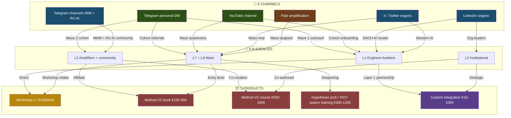
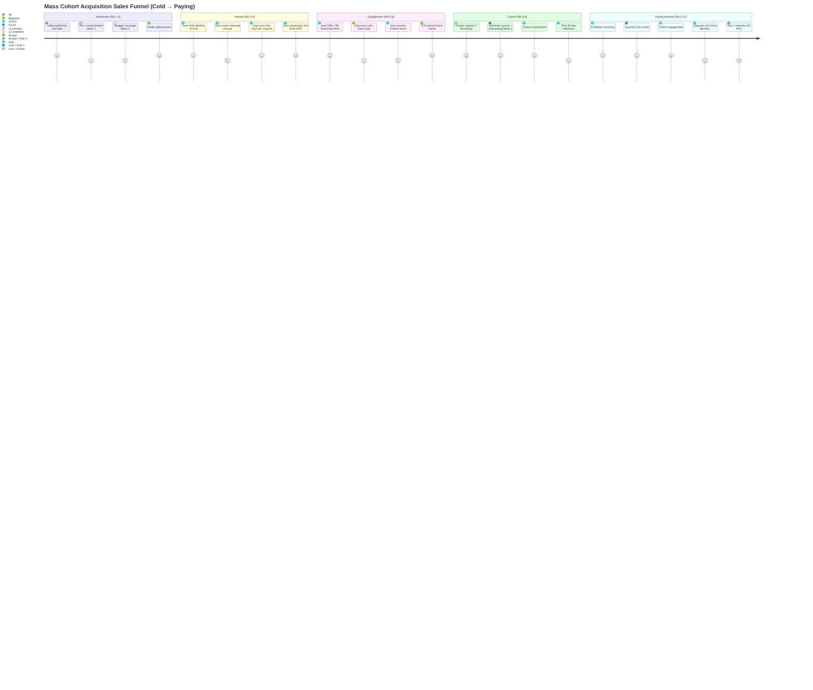

# Phase 9 — Distribution mechanics

> **TL;DR (30-60 sec video).** 4 distribution mechanics: (1) Blogger outreach — KA-03 L2 amplifier tier custom pitch + Workshop access exchange + analytics; (2) Platform services sales — Workshop tier €1500/mo + 1-on-1 advisory + Cohort access + Custom integration; (3) Educational products — Method V2 book/course/video series + Hypothesis arch training + ROY swarm masterclass + FPF training (€100-1000); (4) Mass cohort acquisition Июль+ — Distribution Plan §3 cascade activation + daily cadence ramp 15-20 → 1000+/day + 5-10% conversion target. 2 mermaid: channels × audiences × products matrix + sales funnel journey.

---

## §A Blogger outreach strategy

### A.1 Target list compile

**Sources:**
- KA-03 L2 amplifier tier (35 loaded)
- Wave 1 referrals (L1 partners introduce blogger network)
- Public discovery (Twitter Advanced Search + YouTube subscriber lookup + Telegram channel admin search)
- Industry directories (Influence4You / SocialBakers / equivalent)

**Tier classification:**

| Tier | Audience size | Examples |
|---|---|---|
| **Tier-A bloggers** | 100K-3M | Lex Fridman / Naval Ravikant / Karpathy |
| **Tier-B bloggers** | 30-100K | Markov / Sapunov / Yannic Kilcher / Sergey Ostroumov |
| **Tier-C bloggers** | 5-30K | Левенчук / Цэрэн / Gabdulin / Markov adjacent |
| **Tier-D micro-influencers** | 1-5K | Niche AI + methodology + cooperative economics writers |

### A.2 Per-blogger custom pitch

**Pitch structure:**
1. **Acknowledge content theme** — что они writeur about (proof-of-attention)
2. **Bridge** — где Method V2 / Jetix substrate intersects их audience interest
3. **Offer** (R12 paired):
   - Free Workshop access (L7 €1500/mo waived) для blogger + N followers (e.g., 100 spots)
   - Affiliate revenue share (% of cohort intake from their audience)
   - Co-creation opportunity (joint course / video series / podcast)
   - Tool template setup (Hypothesis arch + Wiki v2 + ROY swarm для personal use)
4. **Ask:** Coverage / endorsement / community amplification + (optional) L4 Founding tier consideration
5. **R12 8-item checklist:** mandatory pre-send

### A.3 Workshop access offer в exchange за coverage

**Specific mechanics:**
- **Blogger reviews substrate** (Method V2 + Jetix MVP)
- **Blogger publishes coverage** (blog post / video / podcast / Twitter thread)
- **Jetix grants free Workshop access** для blogger + N followers (N varies per audience size; e.g., 1% of subscribers up to 1000)
- **Conversion tracking:** unique referral codes per blogger → affiliate dashboard
- **Revenue share Phase 2+:** ~10-15% affiliate (Mondragón 5:1 within cooperative model)

### A.4 Aggregate analytics tracking

**Per-blogger metrics:**
- Coverage published (yes/no + date + format)
- Audience exposure (subscribers / views / engagement)
- Referral codes redeemed (conversion to cohort)
- Cohort progression (L7 paying / L6 cohort member / etc.)
- Lifetime affiliate revenue
- Engagement quality (qualitative comments / feedback)

**Dashboard:** Phase 6 Role 4 (Notion + Hypothesis testing) builds blogger analytics dashboard Week 1-2.

### A.5 Wave timing

- **Wave 1 (Май 22-31):** Tier-1 outreach includes Lex / Naval / Karpathy в Wave 1b (Phase 3 §A.2)
- **Wave 2 (Июнь 1-14):** Tier-B + Tier-C bloggers (Markov / Sapunov / Левенчук / Цэрэн / Gabdulin etc.)
- **Wave 3 (Июнь 14-30):** Tier-D micro-influencers (10-30 names per wave)
- **Wave 4+ (Июль+):** Mass outreach + paid amplification (later — capital-dependent)

---

## §B Platform services sales

### B.1 Service tiers

| Tier | Description | Price | Target audience |
|---|---|---|---|
| **Workshop intake (L7)** | Workshop access + cohort membership + tool templates | **€1500/month** | Mass paying users (1000-10K Y1 EOY) |
| **1-on-1 advisory** | Personalized methodology session с Ruslan / Layer 1 partner | €500-2000/session | High-value individuals / org-leaders |
| **Cohort access (L6 free + paying)** | Cohort membership без Workshop (community + tool templates only) | €100-300/month OR free | Community-driven cohort |
| **Custom integration** | Jetix substrate adapted к partner's workflow / org | €10K-100K/project | L3 institutional / orgs |
| **Foundation Council membership (L4)** | Founding stake + voting + 10% take | Equity-like (not pure cash) | L1 engineers / strategic partners |

### B.2 Pricing baseline (per DR-26 acked 21.05)

- **Workshop €1500/mo:** Acked baseline (DR-26 unit-econ memo)
- **LTV/CAC:** Per DR-26 computed; LTV ~€18K (12-month avg) / CAC ~€500-2000 = 9-36× ratio
- **Payback period:** ~2-4 months
- **Cohort retention:** 60-80% Y1 retention target (industry norm для SaaS / cohort programs)

### B.3 Revenue split per partnership tier (per Phase 4 §C)

- L4 Founding: 10% Foundation share + founding stake
- L5 Cohort Partner: 15-20% cooperative share
- L6 Cohort Member: 20-25% take rate
- L7 Workshop User: 100% service revenue к Treasury (per Phase 7 §F.2 cooperative model)
- L8 Educational user: 70% к creator (Layer 3) + 30% Treasury

### B.4 Sales process

1. **Awareness** (video / blogger coverage / Tier-1 endorsement → user discovers Jetix)
2. **Interest** (Method V2 link / Foundation v1.0 substrate / Wiki v2 explore)
3. **Engagement** (DM / email / Workshop intake form filled)
4. **Discovery call** (15-30 min с Sales lead — Ruslan initial; Phase 6 Role 1 later)
5. **Charter signing** (L7 Workshop tier — service contract; L6 Cohort Member — Charter)
6. **Onboarding Week 1** (substrate access + tool templates + cohort introduction)
7. **Quarterly review** (R12 KA-07 weekend audit + retention + upgrade discussion)
8. **Upgrade path** (L7 → L6 Cohort Member promotion eligibility after 6 months; L6 → L5 Cohort Partner after 3 months active contribution)

---

## §C Educational products

### C.1 Product catalog

| Product | Format | Price | Depth | Output |
|---|---|---|---|---|
| **Method V2 book** | E-book + paperback | €100-300 | 65K words consolidated; canonical methodology | Self-study reader |
| **Method V2 course** | Video + workbook + community | €500-1000 | 8-12 hour course с exercises | Workshop alternative entry |
| **Video series** | YouTube + downloadable | €50-200 | 10-20 part series per topic | Visual learner segment |
| **Hypothesis arch hands-on training** | Live (Zoom) + recorded | €300-800 | 2-day intensive | Layer 3 cohort prep |
| **ROY swarm setup masterclass** | Live (Zoom) + recorded | €500-1200 | 4-hour deep dive | Tech-savvy individuals + small teams |
| **FPF universal language training** | Live + course | €400-1000 | 3-day intensive | Advanced methodology audience |

### C.2 Pricing rationale

- **€100-300 books:** Mass market entry price; brand awareness + initial substrate consumption
- **€500-1000 courses:** Middle-tier; deeper engagement; Workshop alternative entry
- **€300-1200 trainings:** Premium-tier; live interaction + Layer 3 cohort recruit pipeline

### C.3 Production timeline

| Month | Product launch | Owner |
|---|---|---|
| **Mo 3 (Июль)** | Method V2 book MVP | Brigadier-scribe + Layer 1 review + Role 3 (Video) |
| **Mo 4 (Август)** | Video series initial 10 episodes | Role 3 (Video) + Ruslan R1 script |
| **Mo 5 (Сентябрь)** | Method V2 course (8-hour) | Brigadier + Role 1 (Sales) + Role 3 |
| **Mo 6 (Октябрь)** | Hypothesis arch hands-on training | Layer 1 partner-led (Ruslan + 1-2 partners) |
| **Mo 7 (Ноябрь)** | ROY swarm setup masterclass | Role 2 (Tech) + Ruslan R1 |
| **Mo 8 (Декабрь)** | FPF universal language training | Левенчук-collaborative если ack + Ruslan R1 |

### C.4 Revenue projection (Month 3-12)

| Month | Product sales count | Avg price | Revenue MRR |
|---|---|---|---|
| Mo 3 | 30 sales | €150 (book MVP) | €4.5K |
| Mo 4 | 50 sales | €175 | €8.75K |
| Mo 5 | 100 sales | €300 | €30K |
| Mo 6 | 150 sales | €350 | €52.5K |
| Mo 7 | 200 sales | €400 | €80K |
| Mo 8 | 250 sales | €450 | €112.5K |
| Mo 9-12 | 300-400/mo | €500 avg | €150-200K/mo |

**Y1 EOY educational MRR:** ~€150-200K/mo (additional к Workshop L7 revenue).

---

## §D Mass cohort acquisition (Июль+)

### D.1 Distribution Plan §3 cascade activation

Per `decisions/strategic/DISTRIBUTION-PLAN-2026-05-20.md`:

**Cascade activation triggers:**
- "Ебейшая платформа" deliverable 30 Июня complete
- Workshop intake mechanism live + monetization deployed
- Wave 1-3 cohort baseline established (200-500 cohort)
- Video published public alpha YouTube channel
- Tier-1 endorsement secured (≥3 names ack)

**Cascade mechanics:**
1. **Daily cadence ramp:**
   - Wave 1 (Май): 5-15 touches/day
   - Wave 2 (Июнь): 15-50/day
   - Wave 3 (Июнь late): 50-100/day
   - Wave 4+ (Июль+): 100-500/day (Role 5 Outreach research + automation tools)
   - Mass scale (Август+): 500-2000/day (paid amplification optional)

2. **Outreach automation tools:**
   - Telegram bot для DM scaling (Role 2 Tech part build)
   - CRM KA-03 sync mechanism (touch tracking + status updates)
   - Email template engine (per-recipient custom intro generated)
   - LinkedIn / Twitter scheduling

3. **Conversion rate target:** 5-10% intake from outreach (per DR-32 Distribution Plan)

### D.2 Mass acquisition channels

| Channel | Audience | Conversion target | Daily target Июль+ |
|---|---|---|---|
| **Telegram personal DM** | L2 + L1 + cohort referrals | 10-20% | 50-200 |
| **YouTube channel** | Western + RU AI | 1-5% video → cohort | 1K-10K views/day |
| **LinkedIn organic** | DACH + Berlin + international engineers | 2-5% | 100-300 reach |
| **X / Twitter organic** | Western AI cluster | 0.5-3% | 1K-5K reach |
| **Telegram channels (МИМ + RU AI)** | Community-driven | 3-10% | 200-500 reach via channels |
| **Educational product loop** | Book/course buyers | 20-40% → cohort eligibility | 5-30 conversions/day |
| **Paid amplification (optional Mo 6+)** | Targeted ads | 0.5-2% | TBD capital-dependent |

### D.3 Workshop intake mechanism scaling

**Application volume targets:**
- Wave 1-3 (Май-Июнь): 50-200 applications/month
- Wave 4-5 (Июль): 500-2000 applications/month
- Mass (Август+): 2000-10K applications/month
- Y1 EOY: 100K applications cumulative

**Acceptance rate:** 30-50% (selective; ensure alignment + capacity)

**Workshop tier paying conversions:**
- 30-50% acceptance × 30-50% Charter signing = 10-25% net paying conversion
- Application volume × 10-25% = paying user count

### D.4 Cohort retention discipline

- **Quarterly R12 audit** (KA-07 weekend audit per CLAUDE.md `## CRM System`)
- **Retention target Y1:** 60-80% (industry SaaS norm)
- **Churn handling:** Fork-and-leave protection ensures voluntary exit без friction; treasury share preserved
- **Re-engagement:** Lapsed users invited back via educational product loop / Wave 2-3 cohort

---

## §E Mermaid D22 — Distribution channels × audiences × products matrix

*D22 — Distribution matrix: 6 channels × 4 audiences × 5 products. Цвет: зелёный=P1 channel, синий=P2 channel, оранжевый=paid; продукты orange=Workshop, red=educational, purple=custom institutional. Каждое audience → multiple product touchpoints; cohort progression L7→L6→L5→L4 enabled через product engagement deepening.*

---

## §F Mermaid D23 — Sales funnel journey

*D23 — Sales funnel journey: Awareness → Interest → Engagement → Cohort → Paying retained. Scores reflect typical user experience; R12 paired-frame check Mo 3-6 critical gate (cooperative-economics signal validation). Retention 60-80% Y1 industry SaaS norm.*

---

## §G Phase 9 acceptance criteria

- ✅ Blogger outreach strategy (target tiers A-D + custom pitch + Workshop exchange + analytics)
- ✅ Platform services sales (4 service tiers + €1500/mo baseline + LTV/CAC + sales process 8-step)
- ✅ Educational products catalog (6 products + €100-1200 pricing + production timeline + Y1 EOY revenue projection)
- ✅ Mass cohort acquisition Июль+ (Distribution Plan §3 cascade + daily cadence ramp + 5-10% conversion target)
- ✅ Workshop intake mechanism scaling (50-200 → 2000-10K applications/month по Y1 EOY)
- ✅ Cohort retention discipline (R12 KA-07 audit + 60-80% Y1 retention + fork-and-leave protection)
- ✅ 2 mermaid (D22 distribution matrix + D23 sales funnel journey)

---

## §H Handoff to Phase 10

Phase 9 establishes distribution mechanics operational. Phase 10 «Key thesis validation» tests 4 underlying theses (urgency / installation shift / method efficacy / FPF speed) that distribution mechanics rest on.

---

*[src: prompts/strategic-plan-near-future-2026-05-21.md §10 Phase 9 + decisions/strategic/DISTRIBUTION-PLAN-2026-05-20.md DR-32 cascade mechanics + research/unit-econ-deep-dive-2026-05-21/_RECOMMENDATION-MEMO.md DR-26 €1500/mo + Phase 4 partnership tiers + Phase 7 cohort growth + Phase 8 mass acquisition + decisions/JETIX-EDUCATION-LAYER-SYSTEM-THINKING-2026-05-18.md F2 educational layer concept]*
