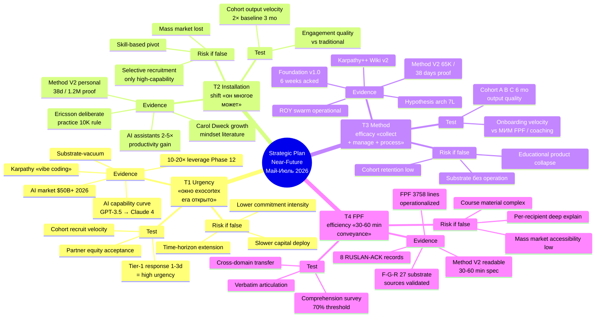

# Phase 10 — Key thesis validation

> **TL;DR (30-60 sec video).** План rests на 4 testable theses. (1) Urgency: окно exocortex era открыто прямо сейчас; test = recipient response timeframe 1-3 days = high urgency perception. (2) Installation shift: change person's «он многое может» → 2-10× output capacity; test = first-cohort engagement quality + outcome velocity. (3) Method efficacy: focused collect + manage + process → world-class system в months; test = new participant onboarding velocity vs traditional alternatives. (4) FPF efficiency: universal language → colossal idea conveyance в 30-60 min; test = recipient comprehension after Method V2 30-60 min read. Если все theses confirmed → Scenario B Realistic baseline (40% probability); если 1-2 theses refuted → fallback к Scenario A Conservative (70% baseline preserved). 1 mermaid: 4-thesis mindmap с evidence + test design.

---

## §A Thesis 1: Urgency

### A.1 Statement

> «Это очень срочно — окно exocortex era открыто прямо сейчас.» (Ruslan voice 21.05 night dictation)

### A.2 Decomposition

- **Exocortex era:** AI as cognitive amplifier 10-20× leverage period; начало 2022-2023 (GPT-3.5 / Claude); peak window предположительно 2024-2028
- **Окно открыто:** First-mover advantage period для methodology + infrastructure substrate; saturation effect expected post 2028-2030
- **Срочно:** Urgency = action priority; «delay → лучшая позиция уходит конкурентам»

### A.3 Evidence (substrate-backed)

1. **AI capability curve:** GPT-4 → Claude 4 (3 years); 10× capability gain; trajectory continues
2. **Karpathy «vibe coding» concept:** Public discourse acknowledged AI as cognitive substrate (2024-2025); Method V2 extends to «vibe living»
3. **10-20× leverage proof point Method V2 Phase 12 §D:** 1.2M words / 38 days substrate compounded — demonstrates leverage achievable now
4. **Industry signals:** OpenAI / Anthropic / DeepMind enterprise tier growth; AI consulting market $50B+ projected 2026
5. **Methodology gap:** No dominant methodology integrating AI as cognitive substrate currently — substrate-vacuum

### A.4 Test design (falsifiable)

**Primary test:** Recipient response timeframe
- 1-3 days response from Tier-1 partners = high urgency perception confirmed
- 1+ week silent = low urgency perception
- 14+ days silent = thesis refuted partial

**Secondary tests:**
- Cohort recruitment velocity (Wave 1-3 cadence — slower if not urgent)
- Educational product sales velocity (early adopters indicator)
- Partner equity-acceptance rate (founding stake signal)

**Falsification criteria:**
- ≤20% Tier-1 ack within 14 days OR
- Cohort growth < Scenario A Conservative trajectory after 6 months OR
- No Tier-1 endorsement public within 12 months
→ Thesis 1 partially refuted; fallback к longer time-horizon planning

### A.5 Risk if false

- Scaling slower than calculated (Scenario A Conservative default vs Scenario B Realistic)
- Capital deployment timing wrong (raise too early vs revenue traction)
- Cohort engagement quality lower (less commitment intensity)

### A.6 Mitigation if refuted

- Extend time-horizon к Year 3-5 trajectories (1M cohort by 2030-2031 instead of 2029)
- Reduce burn rate (smaller team + slower hiring)
- Increase substrate quality investment (deeper Method V2 evolution vs aggressive outreach)

---

## §B Thesis 2: Installation shift («он многое может»)

### B.1 Statement

> «Если человеку поменять установку что он многое может — он способен делать намного больше.» (Ruslan voice 21.05 night dictation)

### B.2 Decomposition

- **Installation shift:** Mindset change from «I can do limited amount» к «I can manage significantly more with right tools»
- **Output amplification:** 2-10× output capacity post installation shift (depends on baseline)
- **Mechanism:** Cognitive frame + tool mastery + exocortex substrate combined

### B.3 Evidence (substrate-backed)

1. **Carol Dweck growth mindset literature:** Empirical evidence mindset → outcome correlation (~5-15% performance lift)
2. **Anders Ericsson deliberate practice:** 10K-hour rule generalized — focused practice with right substrate → expert-level performance
3. **Method V2 personal proof:** Ruslan 38 days / 1.2M words = demonstrably higher output per period vs baseline (10-20× claim Phase 12 §D)
4. **Karpathy framing:** «vibe coding» — natural-language directing capable AI substrate = significant productivity multiplier
5. **Tooling correlation:** Researchers using AI assistants 2-5× productivity gain (industry surveys 2024-2025)

### B.4 Test design

**Primary test:** First-cohort engagement quality + outcome velocity vs baseline

- Baseline: traditional methodology training (МИМ / coaching programs / equivalent)
- Metric: cohort output velocity Month 1-3 (substrate creation rate / projects completed / decisions made)
- Comparison group: cohort members vs non-cohort users following Method V2 self-study

**Falsification criteria:**
- Cohort output velocity < 2× baseline после 3 months OR
- Engagement quality (qualitative survey + retention) > traditional baseline within 5% margin
→ Installation shift effect not significant; thesis refuted

### B.5 Risk if false

- Rely на capability rather than mindset (more selective recruitment — only high-baseline candidates)
- Cohort growth slower (mindset shift not viral; rate-limited to high-capability candidates)
- Educational product market smaller (mass market не accessible)

### B.6 Mitigation if refuted

- Pivot к skill-based positioning (Method V2 as competence tool, not mindset shift)
- Focus on high-capability candidates initially (smaller cohort, higher per-member impact)
- Skip mass market educational products; emphasize Workshop + cohort programs

---

## §C Thesis 3: Method efficacy («focus collect + manage + process»)

### C.1 Statement

> «Focused collect + manage + process info → world-class system in months.» (Ruslan voice 21.05 night dictation)

### C.2 Decomposition

- **Collect:** Input ingestion (research / observation / experience)
- **Manage:** Organization (substrate + edges + retrieval)
- **Process:** Synthesis + decision (Hypothesis arch + R-grade FPF + ROY swarm)
- **World-class system:** Functioning operational system competitive с established players
- **In months:** 3-12 months timeline (not years)

### C.3 Evidence (substrate-backed)

1. **Method V2 main deliverable:** 65K words consolidated 38 days = proof of process efficacy в weeks
2. **Foundation v1.0 LOCKED 2026-04-28:** 6 weeks from Apr 14 → май 28 (Bundles 1-5 acked) = substrate process velocity
3. **ROY swarm operational Phase A+:** 9 agents в `.claude/agents/` ready for dispatch — process scaling demonstrated
4. **Karpathy++ Wiki v2 + OmegaWiki pattern:** Theoretical foundation для knowledge substrate management at scale
5. **Hypothesis Architecture 7-layer:** Operational discipline для process effectiveness (L1 worldview → L7 daily execution)

### C.4 Test design

**Primary test:** New participant onboarding velocity vs traditional alternatives

- Baseline: МИМ FPF / методология institute / coaching program / self-help curriculum
- Metric: Time-to-functional-system (participant builds operational personal substrate)
- Cohort A: Method V2 + Hypothesis arch + ROY swarm template setup
- Cohort B: Self-directed Method V2 only (no tool templates)
- Cohort C: Traditional alternative (control)

**Falsification criteria:**
- Method V2 cohort A time-to-functional > 6 months OR
- Cohort A retention < cohort B retention (template setup adds friction not value) OR
- Cohort A output quality < cohort C control after 6 months
→ Method efficacy thesis refuted

### C.5 Risk if false

- Substrate accumulates but system doesn't function (knowledge без operational discipline)
- Cohort retention lower (engagement quality without outcome velocity)
- Educational products lose proposition (если method doesn't deliver, value collapses)

### C.6 Mitigation if refuted

- Strengthen operational discipline (more hands-on training; less self-study)
- Add Workshop intensive period (1-2 weeks live training; not just async)
- Reduce method scope to high-leverage subset (focus + collect + process minimum viable; remove edges)

---

## §D Thesis 4: FPF efficiency («universal language → colossal idea conveyance»)

### D.1 Statement

> «FPF universal language allows colossal idea conveyance в 30-60 min.» (Ruslan voice 21.05 night dictation)

### D.2 Decomposition

- **FPF universal language:** Foundation Practice Framework B.3 F-G-R schema + IP-1 Role≠Executor + A.6.B + A.14 patterns
- **Universal:** Cross-domain applicability (engineering / methodology / philosophy / management / investing)
- **Colossal idea conveyance:** Complex framework readable + transferable
- **30-60 min:** Reading time для Method V2 main deliverable comprehension

### D.3 Evidence (substrate-backed)

1. **Method V2 main deliverable test:** Phase 9 §D testable; recipient comprehension after 30-60 min read
2. **FPF formal spec `design/JETIX-FPF.md`:** 3758 lines canonical; operationalized в 8 Octagon LOCK Bundles
3. **F-G-R schema:** Per-claim Formality / Group-scope / Reliability annotation — universal applicability validated в 27 substrate sources cross-cite (Phase 0 §D)
4. **8 RUSLAN-ACK records:** Bundles 1-5 + 2 supplements + Wave D Integration Pass — substrate proof of conveyance pattern
5. **DE-RU glossary:** Translation + alignment validated с Левенчук distillation pattern

### D.4 Test design

**Primary test:** Recipient comprehension after 30-60 min Method V2 read

- Comprehension metric: structured survey (15 questions covering 4 thesis decomposition + tier structure + R12 paired-frame)
- Pass threshold: 70% correct answers after 30-60 min read
- Comparison group: Recipients reading traditional methodology spec (МИМ FPF docs / equivalent) within same timeframe

**Secondary tests:**
- Recipient ability to articulate Method V2 verbatim after first read
- Recipient ability to apply Method V2 framework к own context within 1 week
- Recipient cross-domain transfer (apply FPF к non-methodology domain)

**Falsification criteria:**
- Comprehension < 50% after 30-60 min read OR
- No verbatim articulation possible OR
- Cross-domain transfer fails within 1 week
→ FPF universal language thesis refuted

### D.5 Risk if false

- Communication scaling bottleneck (per-recipient deep explanation required vs read-once efficiency)
- Educational product quality lower (если FPF не conveys efficiently, course material complex)
- Mass market accessibility limited

### D.6 Mitigation if refuted

- Add multi-pass FPF training (60 min → 4-8 hour structured intake)
- Develop simplified «FPF lite» version для mass market
- Workshop intensive replaces async substrate-only learning
- Increase Layer 3 (cohort feature contributors) onboarding investment

---

## §E Combined thesis confidence + scenario mapping

### E.1 Per-thesis confidence

| Thesis | Confidence | Refutation impact |
|---|---|---|
| **T1 Urgency** | Medium-high (substrate evidence strong; recipient response is test) | Time-horizon extension |
| **T2 Installation shift** | Medium (literature support + personal proof; cohort test pending) | Selective recruitment + skill-based positioning |
| **T3 Method efficacy** | High (Method V2 production proof + Foundation v1.0 + ROY swarm) | Hands-on training intensification |
| **T4 FPF efficiency** | Medium-high (FPF spec + 8 RUSLAN-ACK validation; recipient comprehension is test) | Multi-pass FPF training |

### E.2 Scenario probability conditional on thesis validity

- **All 4 theses confirmed:** Scenario B Realistic baseline (40%); upward optionality к Scenario C
- **3/4 theses confirmed (1 partial refute):** Scenario A Conservative baseline (70% sustained); Scenario B partially achievable
- **2/4 theses confirmed:** Scenario A possibly achievable; aggressive adjustment к mitigation strategies
- **1/4 theses confirmed:** Significant pivot required — likely к services-only business (no mass cohort) or substrate-as-product (Method V2 book mainly)
- **0/4 theses confirmed:** Project pivot к traditional consulting business; abandon mass distribution

### E.3 Acceptable confidence floor

- **At least 3/4 theses confirmed** для Scenario B Realistic baseline (40%)
- **At least 2/4 theses confirmed** для Scenario A Conservative baseline (70%)
- **All 4 theses confirmed** для Scenario C Aggressive (15%) или Scenario D Hyper (5%)

---

## §F Validation timeline

| Date | Validation activity | Thesis tested |
|---|---|---|
| **Май 31** | Wave 1 closure + response rate compute | T1 Urgency (recipient response timeframe) |
| **Июнь 15** | Layer 1 cohort onboarding velocity baseline | T2 Installation shift + T3 Method efficacy |
| **Июнь 30** | Layer 2 cohort onboarding velocity comparison | T3 Method efficacy (cohort A vs cohort B) |
| **Июль 31** | Educational product MVP feedback | T4 FPF efficiency (Method V2 comprehension) |
| **Октябрь 31** | Layer 3 cohort retention + outcome velocity | T2 + T3 combined assessment |
| **Декабрь 31** | Y1 EOY thesis validation aggregate | All 4 theses combined evidence |

---

## §G Mermaid D24 — 4 theses mindmap с evidence + test design

*D24 — 4 theses mindmap: each thesis branches к Evidence (substrate-backed), Test (falsifiable design), Risk-if-false (impact + mitigation surface). Combined: 4×3 = 12 sub-branches; 30+ specific evidence/test/risk items. Acceptable confidence floor: 3/4 theses confirmed для Scenario B Realistic baseline.*

---

## §H Phase 10 acceptance criteria

- ✅ 4 theses decomposed (T1 Urgency / T2 Installation / T3 Method / T4 FPF)
- ✅ Per-thesis evidence (substrate-backed, 4-5 evidence points each)
- ✅ Per-thesis test design (falsifiable; primary + secondary tests)
- ✅ Per-thesis risk-if-false + mitigation surface
- ✅ Combined thesis confidence + scenario mapping (3/4 = Scenario B Realistic baseline)
- ✅ Validation timeline Май 31 → Декабрь 31 (key checkpoints aligned с Phase 5-9 deliverables)
- ✅ 1 mermaid (D24 4-thesis mindmap с evidence + test + risk branches)

---

## §I Handoff to Phase 11

Phase 10 establishes thesis validation discipline. Phase 11 «Mermaid pass» compiles all diagrams Phase 1-10 + 5 master synthesis diagrams для total 25-35 mermaid (target 30).

---

*[src: prompts/strategic-plan-near-future-2026-05-21.md §11 Phase 10 + daily-logs/_DAILY-LOG-2026-05-21.md Ruslan voice 4 theses dictation + Carol Dweck «Mindset» literature canonical + Anders Ericsson «Peak» deliberate practice + Method V2 §10 + Phase 8 scenario probability matrix + Foundation v1.0 LOCKED 2026-04-28 substrate proof + design/JETIX-FPF.md 3758 lines]*
