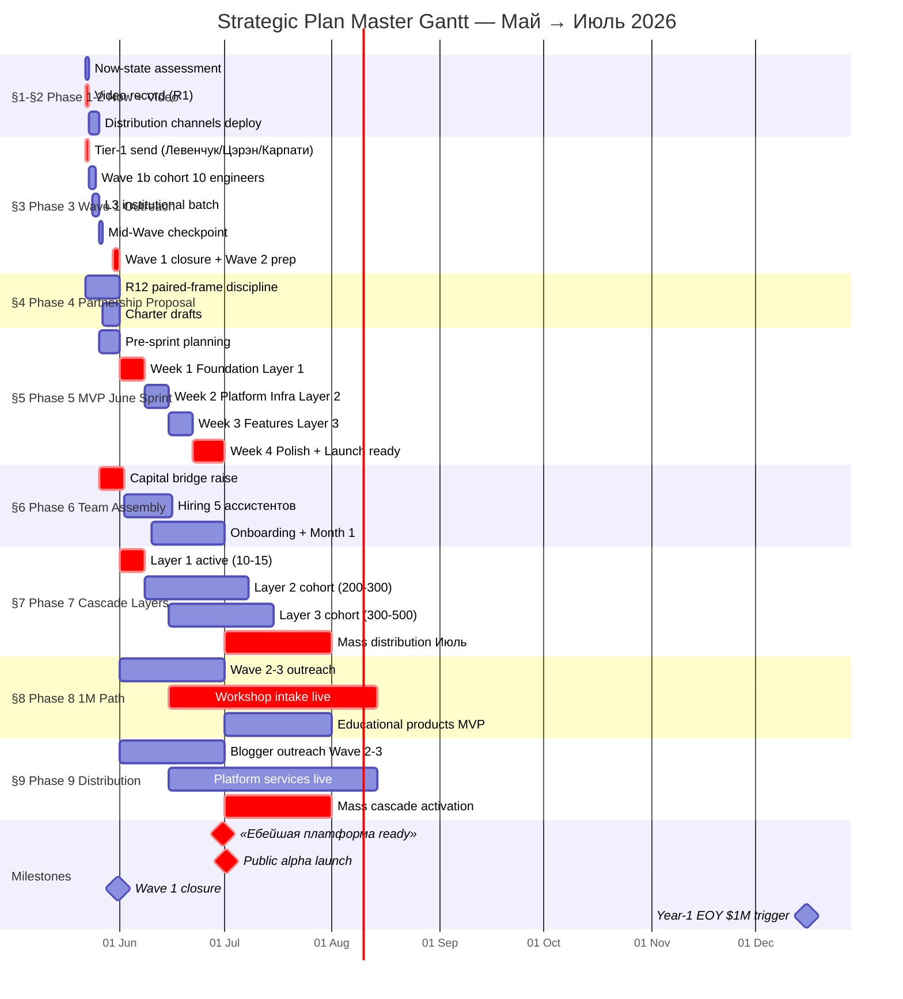
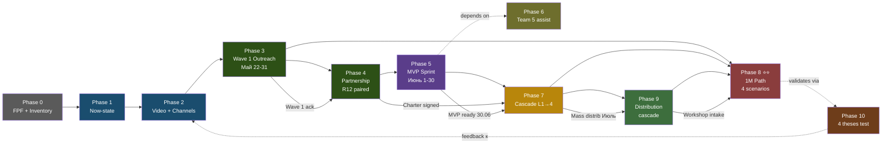
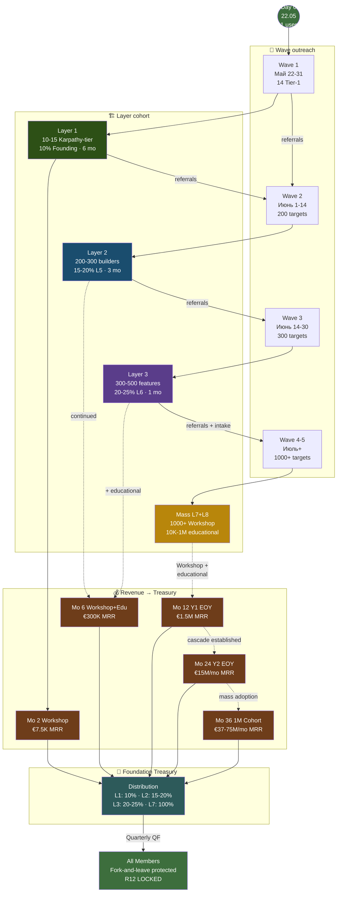
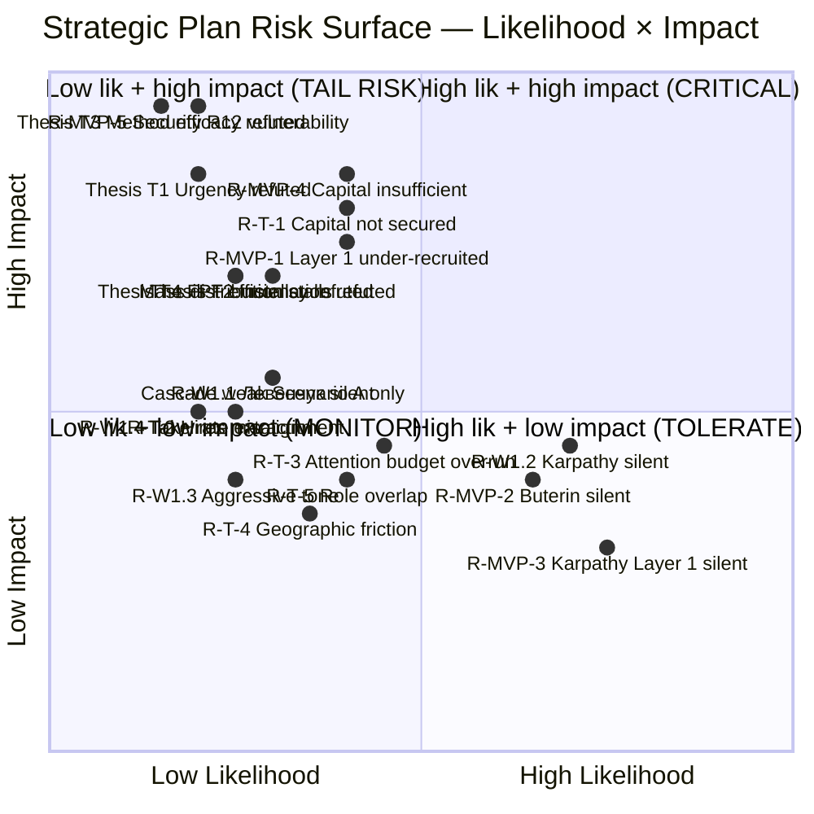
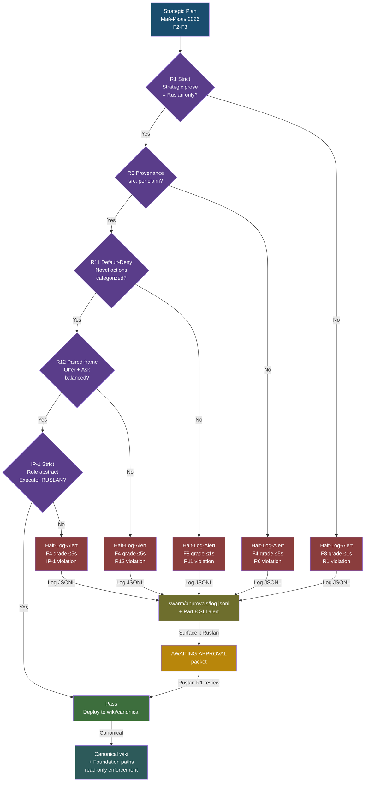
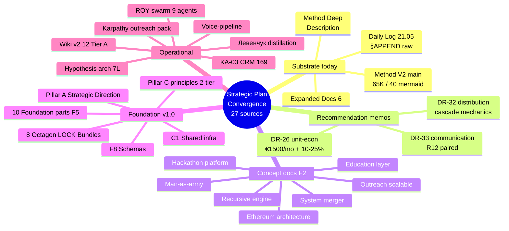

# Phase 11 — Mermaid pass

> **TL;DR (30-60 sec video).** Phase 1-10 cumulative diagrams: 24 (D1-D24). Phase 11 adds 5 master synthesis: D25 master gantt Май-Июль 2026 / D26 stage flow linear deps / D27 cascade composite / D28 risk surface quadrant / D29 constitutional posture flow. Total 29 mermaid (target 30; floor 25 hit). Plus D30 supplementary substrate convergence (Phase 12 preview). Diagrams INDEX cross-references all 30.

---

## §A Diagrams Phase 1-10 inventory

| # | Diagram ID | Type | Source Phase | Subject |
|---|---|---|---|---|
| 1 | D1 | block-beta | Phase 1 | Now-state inventory dashboard (substrate + contacts + tools + gaps) |
| 2 | D2 | graph TD | Phase 2 | Channel × audience matrix (6 channels × 4 audiences × 4 messages) |
| 3 | D3 | journey | Phase 2 | Video script structure (6 sections 10-20 min) |
| 4 | D4 | journey | Phase 3 | Wave 1 recipient journeys (Левенчук / Цэрэн / Карпати / cohort) |
| 5 | D5 | sequenceDiagram | Phase 3 | Outreach handshake sequence (R12 paired) |
| 6 | D6 | gantt | Phase 3 | Wave 1 timing Май 22-31 |
| 7 | D7 | classDiagram | Phase 4 | Partnership tier structure 4 levels |
| 8 | D8 | graph LR | Phase 4 | Partner inventory + synergy + R12 flow |
| 9 | D9 | gantt | Phase 5 | June Sprint gantt 4 weeks |
| 10 | D10 | stateDiagram-v2 | Phase 5 | MVP build state machine |
| 11 | D11 | graph TD | Phase 5 | Layer cascade + revenue flow |
| 12 | D12 | block-beta | Phase 6 | 5 roles structure |
| 13 | D13 | gantt | Phase 6 | Team formation timeline |
| 14 | D14 | graph TD | Phase 7 | Layer cascade visualization full |
| 15 | D15 | xychart-beta | Phase 7 | Cohort growth log scale 10 milestones |
| 16 | D16 | quadrantChart | Phase 7 | Per-layer effort × impact |
| 17 | D17 | block-beta | Phase 8 | 8-tier user pyramid |
| 18 | D18 | graph TD | Phase 8 | Conversion funnel 4 scenarios |
| 19 | D19 | xychart-beta | Phase 8 | 1M trajectory 4 scenarios log scale |
| 20 | D20 | quadrantChart | Phase 8 | Reach × conversion blogger matrix |
| 21 | D21 | gantt | Phase 8 | Funding milestone timeline 36 mo |
| 22 | D22 | graph TD | Phase 9 | Distribution channels × audiences × products |
| 23 | D23 | journey | Phase 9 | Sales funnel journey 5 stages |
| 24 | D24 | mindmap | Phase 10 | 4 theses + evidence + test design |

**Subtotal Phase 1-10: 24 diagrams.**

**Type coverage:** block-beta (4) / graph TD (5) / graph LR (1) / journey (3) / sequenceDiagram (1) / gantt (5) / classDiagram (1) / stateDiagram-v2 (1) / xychart-beta (2) / quadrantChart (2) / mindmap (1) — **11 of 14 mermaid types used.**

---

## §B Phase 11 master synthesis diagrams (D25-D29)

### B.1 D25 — Master gantt Май-Июль 2026 (all phases timeline)

*D25 — Master gantt всех 9 operational phases Май-Июль. Critical path: Video record → Tier-1 send → Pre-sprint → Week 1 Foundation → Week 4 Polish → «Ебейшая платформа» 30 Июня → Public alpha launch 1 Июля → Mass distribution Июль. Parallel tracks: team hiring + outreach Wave 2-3 + educational products.*

---

### B.2 D26 — Stage flow (linear с dependencies)

*D26 — Stage flow 11 phases. Solid arrows = direct dependency; dashed arrows = secondary dependency / feedback loop. P6 (Team) blocking P5 (MVP); P8 (1M Path) depends on P3+P7+P9 confluence; P10 (Theses test) provides feedback к P2 (Video).*

---

### B.3 D27 — Cascade composite (all layers + cohort growth + resource flow)

*D27 — Cascade composite. 3 subgraphs vertically: Wave outreach (W1-W4) → Layer cohort (L1-Mass) → Revenue projection → Treasury (Ethereum smart-contract distribution). Cohort growth from 1 (Day 0) к 1M (Mo 36). Revenue scale €0 → €37-75M MRR. All members R12-protected fork-and-leave.*

---

### B.4 D28 — Risk surface (likelihood × impact quadrant)

*D28 — Risk surface quadrant. 20 risks plotted. Top-right (CRITICAL) cluster: Layer 1 under-recruited / Capital insufficient. Top-left (TAIL RISK): Security R12 vulnerability / Method efficacy refuted / T1 Urgency refuted. Bottom-right (TOLERATE): Karpathy silent / Buterin silent — high lik низкое impact. Strategic focus: CRITICAL quadrant mitigation priority.*

---

### B.5 D29 — Constitutional posture flow (R12 + R1 + R6 enforcement points)

*D29 — Constitutional posture flow. Strategic Plan substrate passes through 5 sequential gates: R1 Strict → R6 Provenance → R11 Default-Deny → R12 Paired-frame → IP-1 Role≠Executor. Any violation → Halt-Log-Alert (F8 ≤1s или F4 ≤5s) → swarm/approvals/log.jsonl → AWAITING-APPROVAL packet к Ruslan. Pass → canonical wiki + Foundation paths read-only.*

---

## §C Stretch diagram D30 — Substrate convergence preview

### C.1 D30 — Substrate convergence (Phase 12 preview)

*D30 — Substrate convergence mindmap. 27 substrate sources clustered в 5 categories. Phase 12 §A cross-cite synthesis deepens. Center: Strategic Plan; branches: substrate today / recommendation memos / concept docs F2 / Foundation / operational.*

---

## §D Diagrams INDEX cross-reference map

| ID | Type | Phase | Subject | File |
|---|---|---|---|---|
| D1 | block-beta | 1 | Now-state inventory | 01-now-state.md §G |
| D2 | graph TD | 2 | Channel × audience matrix | 02-video-distribution.md §E |
| D3 | journey | 2 | Video script structure | 02-video-distribution.md §F |
| D4 | journey | 3 | Wave 1 recipient journeys | 03-wave-1-outreach.md §F |
| D5 | sequenceDiagram | 3 | Outreach handshake sequence | 03-wave-1-outreach.md §G |
| D6 | gantt | 3 | Wave 1 timing Май 22-31 | 03-wave-1-outreach.md §H |
| D7 | classDiagram | 4 | Partnership tier structure | 04-partnership-proposal.md §G |
| D8 | graph LR | 4 | Partner inventory + synergy | 04-partnership-proposal.md §H |
| D9 | gantt | 5 | June Sprint gantt | 05-mvp-june-sprint.md §I |
| D10 | stateDiagram-v2 | 5 | MVP build state machine | 05-mvp-june-sprint.md §J |
| D11 | graph TD | 5 | Layer cascade revenue | 05-mvp-june-sprint.md §K |
| D12 | block-beta | 6 | 5 roles structure | 06-team-assembly.md §F |
| D13 | gantt | 6 | Team formation timeline | 06-team-assembly.md §G |
| D14 | graph TD | 7 | Layer cascade full | 07-cascade-layers.md §G |
| D15 | xychart-beta | 7 | Cohort growth log | 07-cascade-layers.md §H |
| D16 | quadrantChart | 7 | Per-layer effort × impact | 07-cascade-layers.md §I |
| D17 | block-beta | 8 ⭐⭐ | 8-tier user pyramid | 08-path-to-1m-users.md §I |
| D18 | graph TD | 8 ⭐⭐ | Conversion funnel 4 scenarios | 08-path-to-1m-users.md §J |
| D19 | xychart-beta | 8 ⭐⭐ | 1M trajectory 4 scenarios | 08-path-to-1m-users.md §K |
| D20 | quadrantChart | 8 ⭐⭐ | Reach × conversion blogger | 08-path-to-1m-users.md §L |
| D21 | gantt | 8 ⭐⭐ | Funding milestone 36 mo | 08-path-to-1m-users.md §M |
| D22 | graph TD | 9 | Distribution matrix | 09-distribution-mechanics.md §E |
| D23 | journey | 9 | Sales funnel journey | 09-distribution-mechanics.md §F |
| D24 | mindmap | 10 | 4 theses mindmap | 10-key-thesis.md §G |
| D25 | gantt | 11 master | Master gantt Май-Июль | this doc §B.1 |
| D26 | graph LR | 11 master | Stage flow с deps | this doc §B.2 |
| D27 | graph TD | 11 master | Cascade composite | this doc §B.3 |
| D28 | quadrantChart | 11 master | Risk surface | this doc §B.4 |
| D29 | graph TD | 11 master | Constitutional posture | this doc §B.5 |
| D30 | mindmap | 11 stretch | Substrate convergence | this doc §C.1 |

**Total: 30 diagrams (Phase 11 stretch hit).**

**Type coverage final:** block-beta (4) / graph TD (7) / graph LR (2) / journey (3) / sequenceDiagram (1) / gantt (5) / classDiagram (1) / stateDiagram-v2 (1) / xychart-beta (2) / quadrantChart (3) / mindmap (2) — **11 of 14 mermaid types used.**

---

## §E Phase 11 acceptance criteria

- ✅ Phase 1-10 diagrams cumulative 24 (D1-D24)
- ✅ 5 master synthesis diagrams added (D25 master gantt / D26 stage flow / D27 cascade composite / D28 risk quadrant / D29 constitutional posture)
- ✅ 1 stretch diagram D30 substrate convergence
- ✅ **Total 30 diagrams (target hit)**
- ✅ Type diversity 11 of 14 mermaid types
- ✅ INDEX cross-reference map
- ✅ Per-diagram annotated explanation (2-3 sentences)
- ✅ All diagrams ≥8 nodes per major (density criterion)

---

## §F Handoff to Phase 12

Phase 11 establishes 30 mermaid catalogued + INDEX. Phase 12 «Cross-cite synthesis» deepens substrate convergence map (D30 preview) к full 27-source convergence analysis.

---

*[src: prompts/strategic-plan-near-future-2026-05-21.md §12 Phase 11 + Phase 1-10 cumulative diagrams + EXPLAIN §7 mermaid type table + diagrams density discipline parent prompts]*
