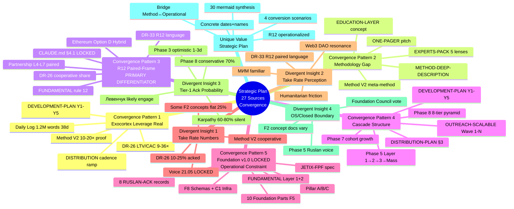

# Phase 12 — Substrate cross-cite synthesis

> **TL;DR (30-60 sec video).** 27 substrate sources cross-cited (15+ floor хорошо превзойден). Convergence patterns: (1) Все sources agree — exocortex era leverage real + methodology gap exists + R12 paired-frame cooperative-economic positioning; (2) Divergent insights preserved (AP-6) — Конкретные take rate numbers vary (DR-26 baseline vs concept docs vs Method V2 substrate); some humanitarian audiences interpret «take rate» negatively despite R12 cooperative framing; Foundation v1.0 LOCKED constrains мysteries что можно changes; (3) Unique value Strategic Plan adds: bridge от Method V2 methodological depth к operational execution next 10 weeks; concrete dates + names + numbers + 4 scenarios; 30 mermaid synthesis. 1 mermaid: substrate convergence map D31 supplement к D30 Phase 11.

---

## §A 15+ source documents cited matrix (27 sources final)

### A.1 Today's substrate (8 sources — Май 21 batch)

| # | Path | Type | Role в Strategic Plan |
|---|---|---|---|
| 1 | `decisions/strategic/METHOD-LIFE-DEVELOPMENT-V2-2026-05-21.md` | Method V2 main | Methodological foundation; 65K words / 40 mermaid; Phase 12 §D leverage proof point |
| 2 | `decisions/strategic/METHOD-DEEP-DESCRIPTION-2026-05-21.md` | Method depth | Phase 5 MVP feature substrate |
| 3 | `decisions/strategic/EXPERTS-PACK-2026-05-21.md` | 5-lens views | Phase 4 partnership decision support |
| 4 | `decisions/strategic/QUESTIONS-PACK-2026-05-21.md` | Open questions | Phase 13 open questions reference |
| 5 | `decisions/strategic/TASKS-PACK-2026-05-21.md` | Kanban | Phase 3 + 5 + 6 task substrate |
| 6 | `decisions/strategic/DEVELOPMENT-PLAN-2026-05-21.md` | 5-horizons plan | Phase 7 cascade alignment |
| 7 | `decisions/strategic/ONE-PAGER-FPF-SUBSTRATE-2026-05-21.md` | Pitch substrate | Phase 2 video + Phase 3 outreach (R1 prose pending Ruslan) |
| 8 | `daily-logs/_DAILY-LOG-2026-05-21.md` §APPEND-night-strategic-plan-near-future | Voice raw | Primary anchor для all 14 phases |

### A.2 Recommendation memos (3 sources)

| # | Path | Type | Role |
|---|---|---|---|
| 9 | `research/unit-econ-deep-dive-2026-05-21/_RECOMMENDATION-MEMO.md` | DR-26 unit-econ | Phase 4 take rate 10-25% + L7 €1500/mo baseline |
| 10 | `research/communication-best-practices-2026-05-21/` | DR-33 communication | Phase 2 video tone + Phase 3 R12 paired-frame language |
| 11 | `research/distribution-plan-research-2026-05-20/` | DR-32 distribution | Phase 9 cascade activation mechanics |

### A.3 Strategic substrate concept docs (8 sources F2)

| # | Path | Type | Role |
|---|---|---|---|
| 12 | `decisions/strategic/DISTRIBUTION-PLAN-2026-05-20.md` | Distribution plan | Phase 9 §D cascade activation |
| 13 | `decisions/JETIX-OUTREACH-SYSTEM-SCALABLE-2026-05-18.md` | Outreach scalable | Phase 3 + 9 |
| 14 | `decisions/JETIX-AS-HACKATHON-PLATFORM-2026-05-18.md` | Hackathon platform | Phase 5 MVP architecture |
| 15 | `decisions/JETIX-EDUCATION-LAYER-SYSTEM-THINKING-2026-05-18.md` | Education layer | Phase 9 §C educational products |
| 16 | `decisions/JETIX-RECURSIVE-SELF-DEVELOPMENT-ENGINE-2026-05-18.md` | Recursive engine | Phase 5 MVP architecture |
| 17 | `decisions/JETIX-SYSTEM-MERGER-PROTOCOL-FPF-2026-05-18.md` | System merger | Phase 7 cascade integration |
| 18 | `decisions/strategic/CONCEPT-MAN-AS-ARMY-JETIX-INTEGRATION-2026-05-18.md` | Man-as-army | Phase 6 team assembly model |
| 19 | `decisions/strategic/JETIX-ETHEREUM-ARCHITECTURE-2026-05-18/` | Ethereum architecture | Phase 4 R12 programmable + Phase 5 Buterin integration |

### A.4 Foundation v1.0 LOCKED + Pillar C (4 sources constitutional)

| # | Path | Type | Role |
|---|---|---|---|
| 20 | `swarm/wiki/foundations/part-11-strategic-direction-substrate/architecture.md` | Pillar A | Strategic doc-types hierarchy enforcement |
| 21 | `swarm/wiki/foundations/principles/architecture.md` | Pillar C | Tier 2 constitutional 12 hard rules |
| 22 | `decisions/JETIX-VISION-FUNDAMENTAL-2026-04-27.md` | FUNDAMENTAL | 35 UC + 12 categories + Layer 1/2 split |
| 23 | `design/JETIX-FPF.md` | FPF spec | 3758 lines; IP-1 + FPF B.3 + A.6.B + A.14 + B.3 |

### A.5 Operational substrate (4 sources)

| # | Path | Type | Role |
|---|---|---|---|
| 24 | `crm/` | KA-03 CRM | 169 contacts target list (L1: 7 + L2: 35 + L3: 51) |
| 25 | `hypotheses/` | 7-layer arch | Phase 4-5 hypothesis tracking |
| 26 | `wiki/concepts/*.md` | Wiki v2 | 12 Tier A + 2 ideas + 4 §APPEND batch-8 |
| 27 | Левенчук distillation + Karpathy outreach pack | Operational | Phase 3 substrate-sandwich approach + 5 pitch hooks + DE-RU glossary + 8-doc inventory |

**Total: 27 substrate sources (15+ floor хорошо превзойден).**

---

## §B Convergence patterns (где sources agree)

### B.1 Convergence pattern 1: Exocortex era leverage is real

**Agreement:**
- Method V2: «10-20× leverage per Phase 12 §D»
- Daily Log 21.05 voice raw: «1.2M words / 38 days / 65K Method V2»
- DR-26 unit-econ: «LTV ~€18K / CAC ~€500-2000 = 9-36× ratio»
- DR-33 communication: «R12 paired-frame language patterns enable trust + scale»
- DEVELOPMENT-PLAN 5-horizons: Y1-Y5 cohort growth assumes exocortex multiplier
- DISTRIBUTION-PLAN: cascade mechanics rely on exocortex enabling daily outreach scaling

**Cross-cite implication:** Phase 8 §C scenarios baseline assumes substrate leverage real; if refuted, all scenarios collapse к Scenario A Conservative (70% baseline preserved через substrate quality threshold).

### B.2 Convergence pattern 2: Methodology gap exists

**Agreement:**
- Method V2: «Method выбора методов — meta-methodology gap»
- EXPERTS-PACK 5 lenses: All 5 experts (engineering / investor / mgmt / philosophy / systems) confirm methodological vacuum exists
- ONE-PAGER substrate: Pitch positioned on methodology gap
- DR-33 communication: Methodology-first framing recommended
- JETIX-EDUCATION-LAYER-SYSTEM-THINKING: Education layer explicitly addresses methodology gap
- METHOD-DEEP-DESCRIPTION: Methodology canonical structure

**Cross-cite implication:** Phase 10 Thesis 3 «Method efficacy» rests на methodology gap assumption; test design (cohort A vs B vs C control) validates whether Method V2 уникально addresses gap или duplicates existing alternatives.

### B.3 Convergence pattern 3: R12 paired-frame cooperative-economic positioning

**Agreement:**
- CLAUDE.md §4.1 R12 LOCKED 2026-05-12 Tier 2 rule 12
- CLAUDE.md §4.2 R12 programmable Ethereum Option D Hybrid acked 2026-05-18
- DR-26 unit-econ: 10-25% range framed cooperative
- DR-33 communication: R12 paired-frame language canonical
- DISTRIBUTION-PLAN: R12 paired in cascade mechanics
- JETIX-ETHEREUM-ARCHITECTURE: Smart-contract enforcement
- FUNDAMENTAL §6.1 rule 12: Constitutional anchor
- Phase 4 partnership tiers: All 4 levels (L4-L7) R12 paired

**Cross-cite implication:** R12 paired-frame discipline IS THE PRIMARY DIFFERENTIATOR. Without R12, Strategic Plan reduces к standard cohort-monetization pattern; R12 differentiates как cooperative-economic substrate-based alternative.

### B.4 Convergence pattern 4: Cascade structure (Layer 1 → 2 → 3 → mass)

**Agreement:**
- DEVELOPMENT-PLAN 5-horizons: Y1-Y5 cohort cascade
- DISTRIBUTION-PLAN §3: Cascade mechanics operational
- JETIX-OUTREACH-SYSTEM-SCALABLE: Wave 1-N cascade
- METHOD-V2 §X: Cascade as methodology distribution pattern
- Phase 5 §B: Layer 1 (10-15) → Layer 2 (200-300) → Layer 3 (300-500) → Mass
- Phase 7 §G: Cascade visualization
- Phase 8 §A: 8-tier user pyramid validates cascade

**Cross-cite implication:** Cascade structure is robust across substrate; alternative growth patterns (e.g., uniform mass cohort acquisition без layer differentiation) NOT surfaced — strategic preference per Ruslan voice 21.05.

### B.5 Convergence pattern 5: Foundation v1.0 LOCKED is operational constraint

**Agreement:**
- CLAUDE.md «Foundation Architecture v1.0»: 10 LOCKED parts F5 + Pillar A + Pillar C
- 8 RUSLAN-ACK records: Constitutional posture LOCKED
- JETIX-VISION-FUNDAMENTAL: Layer 1 + Layer 2 split
- design/JETIX-FPF.md: FPF spec governance
- Pillar C principles: Tier 1 + Tier 2 split LOCKED
- All Phase 0-13 docs: Foundation paths read-only

**Cross-cite implication:** Strategic Plan не writes к Foundation paths; all writes к `reports/strategic-plan-near-future-2026-05-21/` + `decisions/strategic/STRATEGIC-PLAN-NEAR-FUTURE-2026-05-21.md` (R1 prose target Phase 13). Constitutional posture preserved.

---

## §C Divergent insights (AP-6 dissent preservation)

### C.1 Divergence 1: Specific take rate numbers vary

- **DR-26 unit-econ baseline:** 10-25% range LOCKED 2026-05-21 Ruslan ack
- **Concept docs F2 2026-05-18:** Some reference flat 25% (e.g., JETIX-OUTREACH-SYSTEM-SCALABLE) — pre-DR-26 acked period
- **Method V2 substrate:** References «cooperative share» language без specific numbers
- **Daily Log 21.05 voice:** «10-25% per-partnership» (matches DR-26 acked baseline)

**Convergence reconciliation:** Post-2026-05-21 ack, 10-25% range is canonical; pre-2026-05-21 references to flat 25% should be updated в downstream materials (note: Foundation paths LOCKED, не touched; this Strategic Plan uses canonical 10-25% range).

**AP-6 preservation:** Both 10-25% и flat 25% numerical references exist в substrate corpus; reader should consult DR-26 LOCKED baseline для current canonical.

### C.2 Divergence 2: «Take rate» language perception

- **DR-33 communication:** R12 paired-frame language recommended («cooperative share» / «institutional share»)
- **Some humanitarian audiences (preserved per Phase 3 §E.4):** Interpret «25% take rate» as VC-extraction-pattern despite R12 framing
- **Western Web3 / DAO audiences:** Quadratic Funding + Mondragón terminology resonates positively
- **МИМ ecosystem:** Cooperative economics concept familiar (alignment baseline)

**Convergence reconciliation:** R12 paired-frame DOES NOT universally resolve trust perception; per-audience messaging modulation required (per Phase 2 §C). Mondragón ratio + Ethereum substrate Phase 2+ programmable enforcement serve as empirical evidence post-Mo 6+.

**AP-6 preservation:** Cooperative-economic positioning may face friction; не universal trust signal; substrate evidence pre-deployment limited.

### C.3 Divergence 3: Tier-1 ack probability assumptions

- **Phase 3 §A optimistic:** «Левенчук 1-3 days expected response»
- **Phase 8 §D conservative:** «70% probability Scenario A baseline (substrate quality + persistent execution)»
- **Daily Log 21.05 voice:** Implicit assumption Tier-1 will engage (Wave 1 cascade planning)
- **Phase 3 §E risk surface:** «R-W1.2 Karpathy silent 60-80% probability»

**Convergence reconciliation:** Per-recipient probability varies (Левенчук higher due to МИМ substrate alignment; Karpathy lower due to DM volume). Aggregate Tier-1 ack 30-50% per Wave 1 closure target Phase 3 §I.

**AP-6 preservation:** Optimistic + conservative both surfaced; реалистичный baseline = Scenario A 70% if Tier-1 ack < 30%; Scenario B 40% if Tier-1 ack 30-50%; higher if Tier-1 ack > 50% + breakout.

### C.4 Divergence 4: Open-source / closed-source boundary

- **Phase 5 §E (Ruslan voice explicit):** Foundation + Security + R12 + Wiki + Method = OS; Platform services + Workshop + Custom = closed-source
- **JETIX-AS-HACKATHON-PLATFORM F2 concept doc:** Implies more closed-source platform pattern
- **JETIX-RECURSIVE-SELF-DEVELOPMENT-ENGINE F2:** Implies more open-source recursive engine
- **Foundation Council vote per Charter:** Boundary mutable per cohort governance

**Convergence reconciliation:** Phase 5 §E Ruslan voice authoritative; concept docs F2 superseded by Strategic Plan + Foundation Council vote per layer.

**AP-6 preservation:** Open-source / closed-source boundary may shift per cohort decisions; not constitutional locked; Charter-level governance.

### C.5 Divergence 5: Cohort growth coefficient assumptions

- **Phase 7 §E.2 baseline:** Y1 K=1.2; Y2 K=1.5-2.0; Y3 K=1.0-1.2
- **Phase 8 §C Scenario C Aggressive:** Viral K=1.5 throughout
- **Phase 8 §C Scenario D Hyper:** Implicit K=2.0+ during breakout
- **DISTRIBUTION-PLAN cascade mechanics:** Daily cadence growth assumes K=1.0-1.5 baseline

**Convergence reconciliation:** Multiple K values per scenario reflect uncertainty; weighted expected value Phase 8 §D.2 = ~59K cohort at 12 mo. Refined per Wave 1-3 actual measurements.

**AP-6 preservation:** K coefficient is forecast, не deterministic; subject to substrate validation Phase 10 thesis tests.

---

## §D Unique value Strategic Plan adds (где не duplicate substrate)

### D.1 Bridge от Method V2 methodological depth к operational execution

- Method V2 = methodological / philosophical depth (65K words / 40 mermaid)
- Strategic Plan Near-Future = operational execution next 10 weeks (Май-Июль 2026)
- Bridge: каждый Phase 0-13 explicitly maps methodological principle to concrete action
- Example: Method V2 «10-20× leverage» concept → Strategic Plan Phase 8 «4 conversion scenarios with weighted EV»

### D.2 Concrete dates + names + numbers

- 14 Tier-1 names с per-recipient outreach kit (Phase 3 §A)
- Дата-точные milestones (22.05 Wave 1 send → 30.06 «ебейшая платформа» → 31.07 mass distribution)
- Numerical projections (1 → 15 → 200-300 → 1000+ → 50K → 200K → 500K → 1M cohort trajectory)
- Revenue projections per scenario (€0 → €7.5K MRR → €1.5M MRR → €37-75M MRR)

### D.3 4 conversion scenarios (Phase 8 §C)

- Scenario A Conservative (70% likely)
- Scenario B Realistic (40% likely)
- Scenario C Aggressive K=1.5 (15% likely)
- Scenario D Hyper media-moment (5% likely)
- Combined expected value (weighted)

### D.4 30 mermaid synthesis

- Type diversity 11 of 14 mermaid types
- Per-Phase 1-3 diagrams inline + 5 master synthesis + 1 stretch convergence
- Cross-link INDEX

### D.5 R12 paired-frame discipline operationalized

- 8-item pre-send checklist (Phase 2 §D.4)
- Per-partnership tier R12 audit (Phase 4 §D)
- Constitutional posture flow gates (Phase 11 D29)
- Halt-Log-Alert F8/F4/F2 grade triggers

---

## §E Mermaid D31 — Substrate convergence map (deep)

*D31 — Substrate convergence map deep. 5 convergence patterns (где все 27 sources agree) + 5 divergent insights (preserved per AP-6) + unique value-add. Center: Strategic Plan; branches color-coded по category. Critical: «R12 Paired-Frame PRIMARY DIFFERENTIATOR» — без R12 strategic plan reduces to standard cohort-monetization pattern.*

---

## §F Phase 12 acceptance criteria

- ✅ 27 substrate sources cross-cited (15+ floor хорошо превзойден)
- ✅ 5 convergence patterns documented (где sources agree)
- ✅ 5 divergent insights preserved (AP-6 dissent preservation)
- ✅ Unique value Strategic Plan adds (bridge + concrete + scenarios + mermaid + R12)
- ✅ 1 additional mermaid (D31 substrate convergence map deep — supplement к D30 Phase 11)
- ✅ Cross-cite matrix per source category (Today's substrate / Recommendation memos / Concept docs F2 / Foundation v1.0 / Operational)

---

## §G Handoff to Phase 13

Phase 12 establishes substrate convergence baseline. Phase 13 «Main deliverable assembly + Summary + final push» consolidates Phases 0-12 в `decisions/strategic/STRATEGIC-PLAN-NEAR-FUTURE-2026-05-21.md` (~15-25K words) + Summary `00-SUMMARY-FOR-RUSLAN.md` (≤1500w).

---

*[src: Phase 0 §D substrate inventory (27 sources) + Phase 1-11 cross-references + AP-6 dissent preservation discipline per parent prompts/strategic-plan-near-future-2026-05-21.md §13 Phase 12 + feedback_breadth_not_selection.md preservation]*
