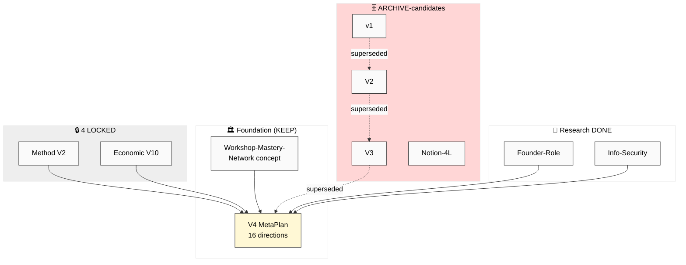

# 📊 Phase 7 — Mermaid Suite + Master Synthesis

> 10 диаграмм RP-1..RP-10 (≥8 mandate exceeded). Все в `diagrams/*.mmd` + inline ниже. Style per
> `swarm/wiki/operations/mermaid-style-guide-2026-05-07.md` (theme:base + #000 text + color-coded ≥10 nodes).
> Index: `diagrams/_INDEX.md`.

---

## §1 RP-1..RP-10 inline + filename refs

### RP-1 — Substrate overview (`diagrams/RP-1-substrate-overview.mmd`)
Sprint 25-28.05 substrate map: ~29 docs × категории × supersession.

*(Полная версия с Ops/Notion/Voice кластерами — `.mmd` файл.)*

### RP-2 — Voice batch 16 flow (`diagrams/RP-2-voice-batch-16-flow.mmd`)
voice → extract O-207..218 → dedup → R12 (de-escalation) → integration. **Inline в main doc §1.**

### RP-3 — Doc re-audit verdict tree (`diagrams/RP-3-doc-reaudit-verdict-tree.mmd`)
4D-роль decision tree → KEEP(16)/REFINE(5)/MERGE(3)/DEFER(1)/ARCHIVE(4)/LOCKED(4). **Inline в main doc §3.**

### RP-4 — 16 directions current state (`diagrams/RP-4-16-directions-current-state.mmd`)
16 dirs × maturity + #17 + 5 shared blockers. **Inline в main doc §4.**

### RP-5 — What-we-can-do-now timeline (`diagrams/RP-5-what-we-can-do-now-timeline.mmd`)
28-29.05 / неделя / месяц / квартал. **Inline в main doc §5.**

### RP-6 — Strategic sessions graph (`diagrams/RP-6-strategic-sessions-graph.mmd`)
22 Q × cluster-sessions × data-needs. **Inline в main doc §6.**

### RP-7 — Blockers map (`diagrams/RP-7-blockers-map.mmd`)
blockers × directions × severity. **Inline в main doc §7.**

### RP-8 — Resource allocation flow (`diagrams/RP-8-resource-allocation-flow.mmd`)
Ruslan time × €34k × 17 ROY → outputs → Express. **Inline в main doc §5.**

### RP-9 — R12 surfaces heat v16 (`diagrams/RP-9-r12-surfaces-heat-v16.mmd`)
batch-16 surfaces + cross-batch de-escalation + #1 latent risk. **Inline в main doc §9.**

### RP-10 — Execution recommit loop (`diagrams/RP-10-execution-recommit-loop.mmd`)
voice → re-plan → sessions → decide → execute → Express → review → loop. **Inline в main doc §8.**

---

## §2 Master matrix (16 directions × Wave × R12 × maturity × resource-need × can-do-now)

| # | Direction | Wave | R12 | Maturity | Resource-need | Can-do-NOW? |
|---|---|---|---|---|---|---|
| 1 | 🧪 Метод | 2 | мягкий | READY/DRAFT pub | Ruslan video + prose | ✅ видео A + finalize public |
| 2 | 🚀 Платформа | 2 | fork | READY (built) | Ruslan UX + 1 trial | ✅ walkthrough + Дмитрий trial |
| 3 | 💼 Бизнес | 3 | govern | CONCEPT (legal) | Steuerberater + lawyer (€) | 🟡 Steuerberater outreach + Charter draft |
| 4 | 💰 Заработок | 1 | STRICT | READY ✅ | Ruslan selling-time | ✅ discovery calls + #4 polish |
| 5 | 👥 Партнёры | 1 | STRICT | READY/WIP mentor | Ruslan outreach + mentor | ✅ Kaiser + advisor + Tseren |
| 6 | 📜 Видение | 1 | мягкий | DRAFT (R1-prose) | Ruslan R1-prose | 🟡 видео A + Vision skeleton (prose pending) |
| 7 | 🎓 Образование | 3 | uplift | DRAFT curriculum | Ruslan video B + pedagogy | 🟡 видео B + cohort outline |
| 8 | ⚖️ R12 | 1 | объект | READY/DRAFT pub | Ruslan якорь + AI draft | ✅ Anti-Dark-Patterns audit + doctrine→Charter |
| 9 | 📋 Правила | 3 | углы 3/4 | DRAFT | Ruslan value-author | 🟡 Свод draft (AI) + Klan Charter skeleton |
| 10 | 💎 Ценности | 1→3 | A1-3/7 | READY/DRAFT pub | Ruslan R1-prose | 🟡 триада reflection (R1) + skeleton |
| 11 | 📜 Master Plan | 2→4 | won't | CONCEPT pub | Ruslan R1 + sessions | 🟡 Part1-2 skeleton (sessions-dep) |
| 12 | 🏛️ Мастерская | 2 | fork | CONCEPT | AI draft + (space=Run) | 🟡 Workshop public desc (online-first) |
| 13 | 🎯 Мастерство | 3 | uplift | READY/CONCEPT wrap | AI draft + #15 gate | 🟡 public desc; skill-tree gated |
| 14 | 🌍 Сеть+Кланы | 3→4 | PRIMARY | CONCEPT (no clans) | AI Charter + (clans=Run) | 🟡 Klan Charter template (concept) |
| 15 | 🎮 Геймификация | 2→3 | HIGHEST | CONCEPT (gate first) | AI audit + R1 meaning | ✅ Anti-Dark-Patterns audit (= build brakes) |
| 16 | 🏆 Хакатоны | 1→2 | STRICT | READY/DRAFT playbook | AI playbook + (people=Q3) | ✅ playbook draft + first-event design |
| 17 | 🔐 Security | candidate | claim-ladder | RESEARCH DONE | Build-P0 sprint (~€20-30/mo) | ✅ Build-P0 + status R1 |

**Чтение матрицы:** ✅ can-do-NOW (8 dirs: #1/#2/#4/#5/#8/#15-audit/#16/#17) = всё, что движется СЕЙЧАС solo+AI без новых людей. 🟡 = частично (нужна R1-prose ИЛИ Wave 3 people ИЛИ € для legal). Wave-1 cluster (#4/#5/#8/#16) + #1/#2 = выходной фронт; #15 «can-do» = построить R12-тормоза (не game-mechanics).

---

## §3 Cross-diagram reading guide

- **Для «где мы»:** RP-1 (substrate) + RP-4 (directions state).
- **Для «что чистить»:** RP-3 (verdict tree).
- **Для «что делать»:** RP-5 (timeline) + RP-8 (resource flow) + master matrix §2.
- **Для «что обсудить»:** RP-6 (sessions graph).
- **Для «что мешает»:** RP-7 (blockers map).
- **Для R12:** RP-9 (de-escalation + latent risk).
- **Для «как зацикливать»:** RP-10 (recommit loop).
- **Для voice-16:** RP-2 (flow).

---

*Phase 7 closure. 10 mermaid RP-1..RP-10 (mandate ≥8 exceeded), все ≥10 nodes, mandated style. Master matrix
16 dirs × Wave × R12 × maturity × resource × can-do-now (8 ✅ can-do-NOW). Index в diagrams/_INDEX.md. Next:
Phase 8 SUMMARY + main doc + INDEX (final push).*
