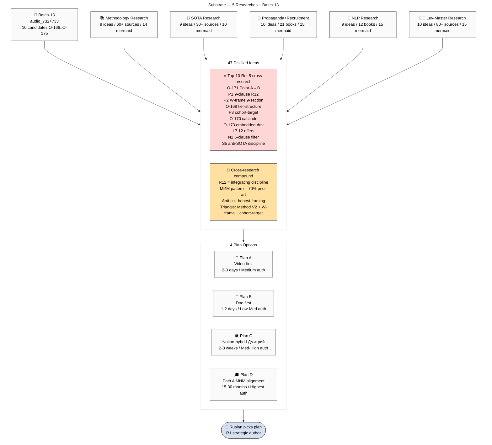

# D01 — Research Synthesis Network

> 5 strategic researches + batch-13 + lev-master → 47 distilled ideas → 4 plan options. Per Phase 2 §6 cross-research compound findings.

```mermaid
%%{init: {'theme':'base','themeVariables':{'primaryTextColor':'#000','textColor':'#000','lineColor':'#333','primaryBorderColor':'#333','primaryColor':'#fafafa'}}}%%
graph TD
    subgraph SUBSTRATE[Substrate — 5 Researches + Batch-13]
        Batch13[📼 Batch-13<br/>audio_732+733<br/>10 candidates O-166..O-175]
        Methodology[📚 Methodology Research<br/>9 ideas / 60+ sources / 14 mermaid]
        SOTA[🎯 SOTA Research<br/>9 ideas / 30+ sources / 10 mermaid]
        Propaganda[📢 Propaganda+Recruitment<br/>10 ideas / 21 books / 15 mermaid]
        NLP[🧠 NLP Research<br/>9 ideas / 12 books / 15 mermaid]
        LevMaster[👨‍🏫 Lev-Master Research<br/>10 ideas / 80+ sources / 15 mermaid]
    end

    subgraph DISTILL[47 Distilled Ideas]
        TopRel5[⭐ Top-10 Rel-5 cross-research<br/>O-171 Point-A→B<br/>P1 9-clause R12<br/>P2 W-frame 9-section<br/>O-168 tier-structure<br/>P3 cohort-target<br/>O-170 cascade<br/>O-173 embedded-dev<br/>L7 12 offers<br/>N2 5-clause filter<br/>S5 anti-SOTA discipline]
        Compound[🔗 Cross-research compound<br/>R12 = integrating discipline<br/>МИМ pattern = 70% prior art<br/>Anti-cult honest framing<br/>Triangle: Method V2 + W-frame + cohort-target]
    end

    subgraph PLANS[4 Plan Options]
        PlanA[🎥 Plan A<br/>Video-first<br/>2-3 days / Medium auth]
        PlanB[📄 Plan B<br/>Doc-first<br/>1-2 days / Low-Med auth]
        PlanC[🛠️ Plan C<br/>Notion-hybrid Дмитрий<br/>2-3 weeks / Med-High auth]
        PlanD[🎓 Plan D<br/>Path A МИМ alignment<br/>15-30 months / Highest auth]
    end

    Ruslan([👤 Ruslan picks plan<br/>R1 strategic author])

    Batch13 --> DISTILL
    Methodology --> DISTILL
    SOTA --> DISTILL
    Propaganda --> DISTILL
    NLP --> DISTILL
    LevMaster --> DISTILL

    DISTILL --> PLANS

    PLANS --> Ruslan

    style TopRel5 fill:#ffd6d6
    style Compound fill:#ffe0a0
    style Ruslan fill:#d6e0f0
    style PlanA fill:#fafafa
    style PlanB fill:#fafafa
    style PlanC fill:#fafafa
    style PlanD fill:#fafafa
```
