# D02 — 4 Plans Flow Comparison

> Plan A/B/C/D sequence visualization + critical combinations per Phase 3 §5.

```mermaid
%%{init: {'theme':'base','themeVariables':{'primaryTextColor':'#000','textColor':'#000','lineColor':'#333','primaryBorderColor':'#333','primaryColor':'#fafafa'}}}%%
graph LR
    subgraph PA[Plan A Video-first]
        A1[A1 Core ideas]
        A2[A2 Recording setup]
        A3[A3 Script]
        A4[A4 Record V1]
        A5[A5 Edit]
        A6[A6 R12 check]
        A7[A7 Post + landing copy]
        A8[A8 Wave 1 send]
        A1 --> A2 --> A3 --> A4 --> A5 --> A6 --> A7 --> A8
    end

    subgraph PB[Plan B Doc-first]
        B1[B1 Central doc<br/>Conversion Funnel]
        B2[B2 Tier 1-pager]
        B3[B3 Welcome-frame]
        B4[B4 Message variants]
        B5[B5 Discovery script]
        B6[B6 R12 check]
        B7[B7 Wave 1 send]
        B1 --> B2 --> B3 --> B4 --> B5 --> B6 --> B7
    end

    subgraph PC[Plan C Notion-hybrid Дмитрий]
        C1[C1 Notion template]
        C2[C2 Claude Code setup]
        C3[C3 Handoff session]
        C4[C4 Daily check-in window]
        C5_7[C5-C7 5-7 days trial]
        C8[C8 Feedback session]
        C9[C9 Iterate template]
        C10[C10 Formal offer]
        C11[C11 Same loop Сева]
        C12[C12 Trial evidence synthesis]
        C1 --> C2 --> C3 --> C4 --> C5_7 --> C8 --> C9 --> C10
        C10 --> C11 --> C12
    end

    subgraph PD[Plan D Path A МИМ]
        D1[D1 Aisystant ack]
        D2[D2 Subscribe + download]
        D3[D3 Phase 4 enhancement]
        D4[D4 Path A vs B choice]
        D5[D5 Wave 1 Левенчук]
        D6[D6 Response]
        D7[D7 T0+T1 offers]
        D8[D8 R0 6 weeks]
        D9[D9 R1 6 weeks]
        D10[D10 R1-R10 15-30mo]
        D1 --> D2 --> D3 --> D4 --> D5 --> D6 --> D7
        D2 --> D8 --> D9 --> D10
    end

    Start([🌅 Production Day 24.05<br/>Plan choice]) --> PA
    Start --> PB
    Start --> PC
    Start --> PD

    style A4 fill:#ffd6d6
    style B1 fill:#ffd6d6
    style C1 fill:#ffd6d6
    style C3 fill:#ffd6d6
    style D5 fill:#ffd6d6
    style Start fill:#d6e0f0
```

## Recommended combinations per Phase 3 §5

| Combo | Days | Speed-to-outreach |
|---|---|---|
| Plan B → Plan A (sequential) | Day 1 docs / Day 2-3 video | Medium |
| Plan C parallel + Plan B sequential | C Days 1-9 / B Days 2-3 | Medium |
| Plan D parallel + Plan A+B short-term | D long-term / A+B short | Mixed |
| **B + C parallel + D-D1 ack (default suggestion)** | **B Day 1-2 / C Day 1-17 / D-D1 Day 1 only** | Balanced |
