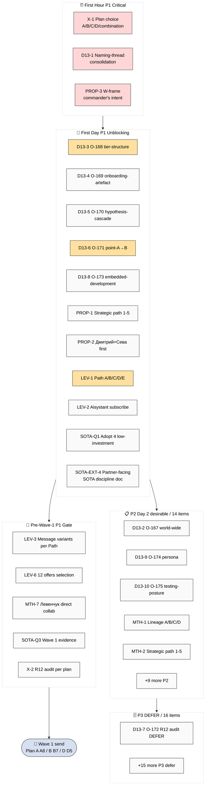

# D03 — Ack Queue Priority

> 47 acks consolidated; P1 first-hour + first-day sequence + dependency graph. Per Phase 4 §10.

## Priority distribution

| Priority | Count | Description |
|---|---|---|
| P1 | 17 items | First-hour + first-day immediate; gates Production Day execution |
| P2 | 14 items | Day 2 desirable; next-day if no |
| P3 | 16 items | Defer / DEFER unless triggered |
| **Total** | **47 acks** | Cross-source consolidated |

## P1 sequence (per Phase 4 §10.1-10.3)

1. **X-1** Plan choice (60min)
2. **D13-1** Naming-thread (pre-Шаг 2 blocker)
3. **PROP-3** Welcome-frame commander's intent (Ruslan R1 only)
4-9. D13-3/4/5/6/8 batch-13 Tier A promote
10-12. PROP-1 + PROP-2 + LEV-1
13. LEV-2 Aisystant subscription
14-15. SOTA-Q1 + SOTA-EXT-4
16-18. LEV-3 + LEV-6 + MTH-7 (pre-Wave-1)
19. SOTA-Q3 evidence ack
20. X-2 R12 audit (auto-fire)
