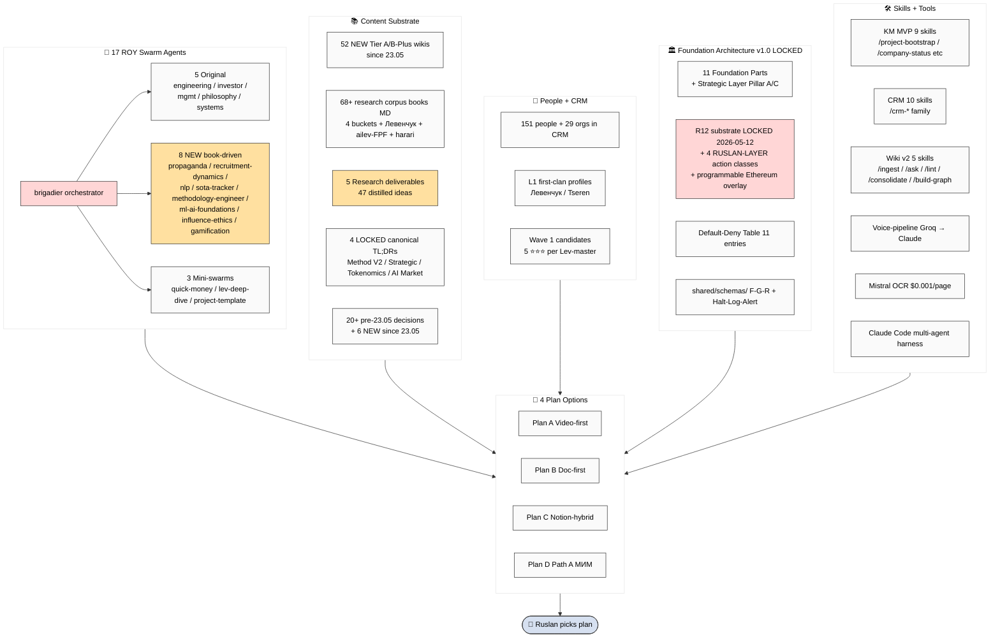

# D04 — Resources / Capabilities Map

> Aggregate view: 17 ROY + 52 NEW wikis + 68+ books + 5 researches + 4 LOCKED canonical + CRM 151 + Foundation 11 + Skills + Tools + R12 substrate. Per Phase 5.

## Resource → Plan matching matrix (per Phase 5 §14)

See `reports/synthesis-execution-plans-2026-05-24/05-resources-capabilities-map.md` §14 for full 17-row × 4-plan matrix.
