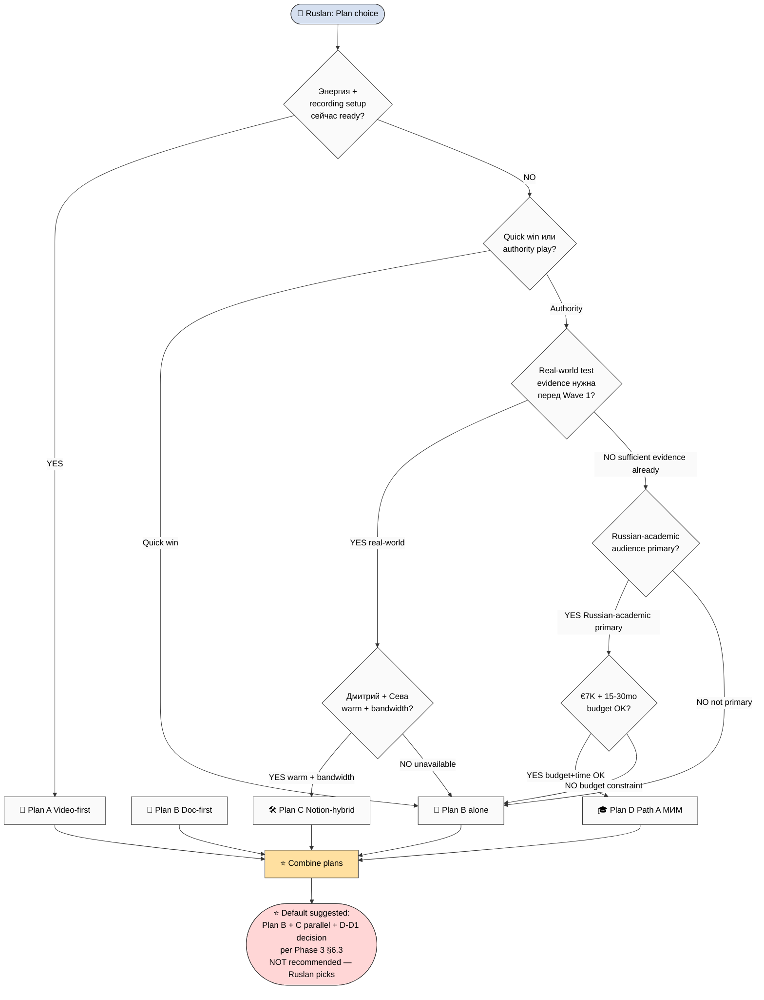

# D05 — Decision Matrix

> Decision framework для Ruslan picks. Per Phase 3 §6.

## Per-dimension scoring matrix (per Phase 3 §6.1)

| Dim | A | B | C | D |
|---|---|---|---|---|
| Speed-to-outreach | 4/5 | 5/5 | 2/5 | 1/5 |
| Authority | 3/5 | 3/5 | 4/5 | 5/5 |
| R12 cleanliness | 4/5 | 5/5 | 5/5 | 4/5 |
| Cost | 4/5 | 5/5 | 3/5 | 1/5 |
| Energy | 2/5 | 4/5 | 4/5 | 2/5 |
| Reversibility | 3/5 | 5/5 | 4/5 | 2/5 |
| Long-term compound | 3/5 | 3/5 | 4/5 | 5/5 |

## Question prompts (per Phase 3 §6.2)

1. Энергия + recording setup сейчас? → YES → Plan A; NO → Plan B
2. Дмитрий + Сева warm + bandwidth? → YES → Plan C add
3. €7K budget + 15-30mo commit OK? → YES → Plan D add
4. Quick win или authority play? → Quick → A/B; Authority → C+D
5. Real-world test evidence нужна перед Wave 1? → YES → Plan C first
6. Russian-academic audience primary? → YES → Plan D high priority

Brigadier surfaces — **Ruslan picks** per Pillar C Tier 2 rule 1.
