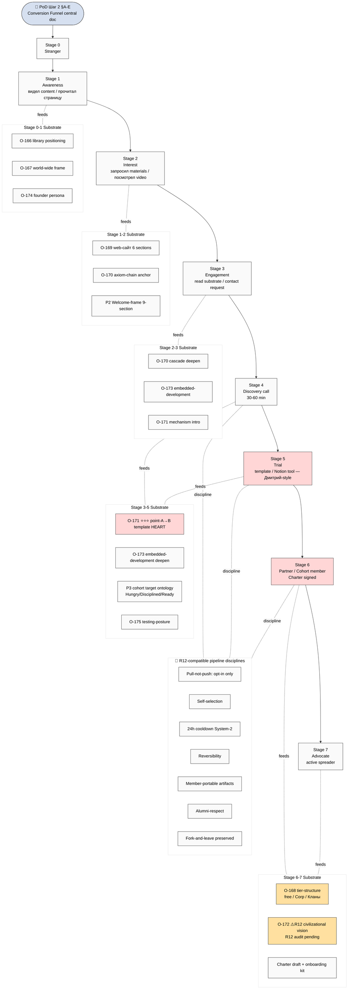

# D06 — Funnel Integration

> PoD 24.05 Шаг 2 Conversion Funnel (Stranger → Cohort Member) с substrate mapping per batch-13 Phase 4 + Propaganda P4 R12-compatible pipeline + cohort-target-ontology O-161/O-162. Per Phase 2 §6.5 + batch-13 Phase 4 integration mapping.

## Per-stage 4-cell (per audio_732+733 + Propaganda P3 + P4)

| Stage | Делать | Уметь | Принести | Зачем им это |
|---|---|---|---|---|
| 0-1 Stranger/Awareness | Прочитать положение | Различить «работающее» | – | Доступ к «только работающему» |
| 1-2 Interest | Запросить materials | Self-onboard через сайт | – | Clarity «как можно быстрее» |
| 2-3 Engagement | Принять axiom | Применить «ответственная info-переработка» | – | «Эффективное развитие в 10 раз» |
| 3-5 Discovery/Trial | Описать точку А → Б | Адопт template (point-A→B + daily reporting + time tracking) | Свой intellect + responsibility + дисциплина | Освобождение intellect/attention → 10x efficiency |
| 5-6 Partner/Кланы | Pay membership / Sign Charter | Создать платформу improved | %-share revenue + audience + skill + time | Free=life / Corp=monetization / Кланы=co-create + ownership |
| 7 Advocate | Spread world-wide regardless of locality | – | – | Mutual benefit: лучше система → лучше работает он |

## Plan A/B/C/D × Funnel coverage

| Plan | Stages covered immediately |
|---|---|
| Plan A Video-first | Stages 0-3 (video distribution) + Stage 4 (discovery call follow-up) |
| Plan B Doc-first | Stages 0-7 (full funnel doc + per-stage docs) |
| Plan C Notion-hybrid | Stages 3-7 deep test (Дмитрий-Сева actual trial) |
| Plan D Path A МИМ | Stages 6-7 partnership-tier (long-term Wave 1 institutional) |
