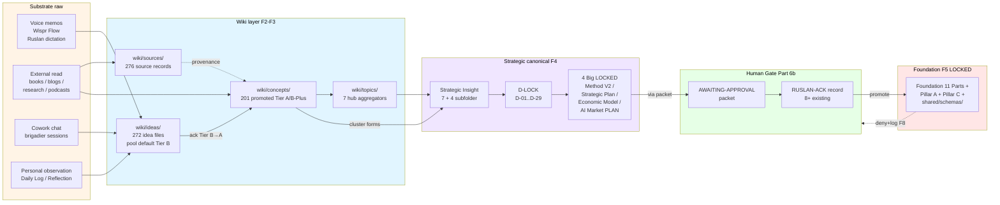
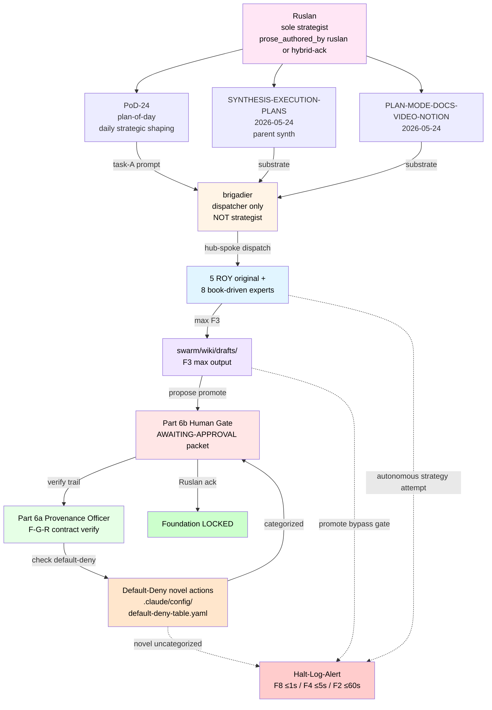
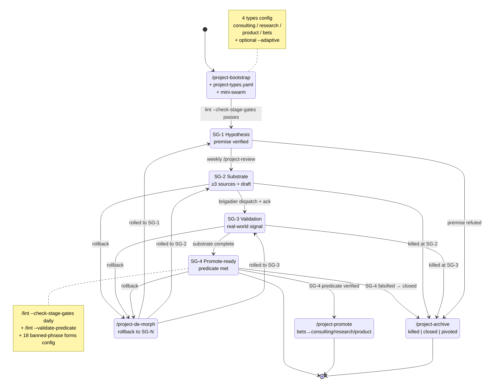
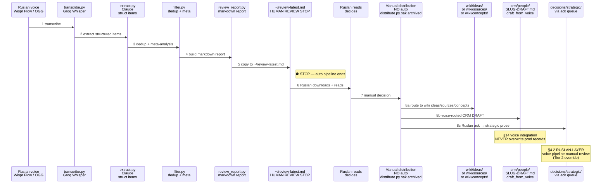
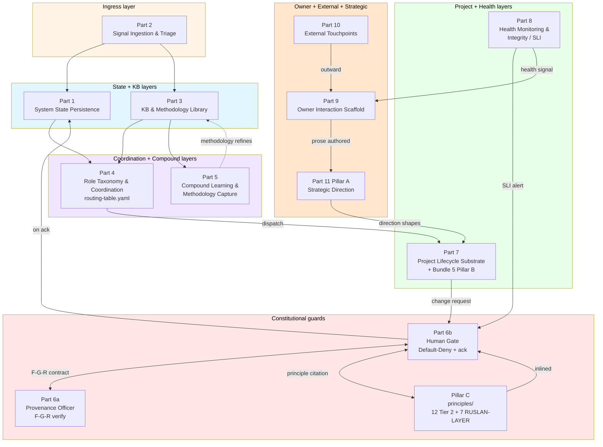

# 📊 Phase 4-supplement — 5 Deep Mermaid + ICP × Doc Cross-Map

> **Цель:** дать визуально-полный adequate map (что-с-чем-связано / как работает)
> + накидать ICP × doc / как использовать (базово). NOT new docs — synthesis из
> Phase 0-3 inventory. R1 surface.

---

## §1 Diagram 5 — Doc lifecycle pipeline (raw → LOCKED)

**Что это значит:** ни одно утверждение в Foundation НЕ попадает туда минуя
Human Gate (Part 6b). Идея → wiki → strategic → packet → ack → LOCK. Каждый
уровень = другая F-grade (F2 idea → F3 concept → F4 strategic → F5 foundation).

---

## §2 Diagram 6 — Authority + Provenance chain (Ruslan-only strategic prose)

**Что это значит:** Ruslan ЕДИНСТВЕННЫЙ strategist (FUNDAMENTAL §6.1 rule 1).
Brigadier ≠ strategist — routing-only. Experts max F3 draft. Любая попытка
agent-pending стратегической прозы или novel uncategorized action = Halt-Log-Alert
(fail-loud). Provenance Officer (Part 6a) verify-y F-G-R trail каждого
promoted claim.

---

## §3 Diagram 7 — KM MVP project lifecycle (Stage-Gates SG-1 → SG-4)

**Что это значит:** projects = first-class entities с reversibility built-in
(de-morph). 4 типа per `project-types.yaml`. Каждый SG имеет predicate
verifiable через CI lint. quick-money-brigadier — instance этого pattern'а.

---

## §4 Diagram 8 — Voice → KB → Strategic data flow (with review gates)

**Что это значит:** voice → KB pipeline = автоматическая ДО `~/review-latest.md`
+ ручная после. Никакого auto-distribute (Ruslan-acked discipline `distribute.py.bak`
archived). CRM voice integration = DRAFT-only (никогда не overwrite prod). Это
foundation constitutional `voice-pipeline-manual-review.md` override.

---

## §5 Diagram 9 — Foundation 11 Parts interaction wiring

**Что это значит:** Foundation = не плоский список 11 Parts, а wired graph.
Сигнал входит через Part 2 → state/KB (1, 3) → coordination (4, 5) → projects (7)
→ через guards (6a, 6b, Pillar C) → owner (9) → strategic (11) → обратно
направление в projects. Health (8) — cross-cutting SLI. External (10) =
outward-facing edge.

---

## §6 ICP × Doc cross-map (кому полезно + как использовать базово)

> **Источники:** `crm/icp.md` (4 commercial ICPs) + `decisions/strategic/lock-entries/D-22-icp-5-criteria-direction-of-life.md` (D-22 startupper-mindset filter — Wave-1.4 pending) + Phase 3 audience archetypes (8 strategic).

### §6.1 4 Commercial ICPs (CRM canonical)

| ICP | Кто | Что им полезно из inventory | Как использовать базово |
|---|---|---|---|
| **ICP 1 — Recruiting agencies** (5-50 чел, DE/EU) | HR-агентства, in-house HR; боль: 40-80% кандидатов AI-generated, нет AI screening | **Quick-money brigadier substrate** (`swarm/wiki/operations/quick-money/`) + **CRM templates** (`crm/_templates/person.md` + `org.md` для HR-contacts) + **PARTNER-OFFERING-HUMAN-LANG** (root) + **AI Market PLAN Stage 1** | Open Quick-Money MOC → ICP 1 leads tracking. CRM templates персонализируют outreach. Partner Offering = P1 ready для cold DM. AI Market PLAN = «нач разговор о positioning AI как electricity» |
| **ICP 2 — Foreign biz in Germany** (US/UK/IL/EE, 5-100 чел, DE-entry) | Tech компании на DE-рынок; боль: GmbH 5 мес, payroll, GDPR | **PARTNER-OFFERING (P1)** + **AI Market PLAN (P2)** + **`crm/orgs/` templates** + **Jetix Workshop Concept** (как workshop для немец. бюрократии automation) | CRM org for каждой компании → tag «foreign-biz-DE». Workshop Concept как фреймворк для 1-day GmbH-automation session. AI Market PLAN positions «AI как electricity» — bypass language barrier |
| **ICP 3 — Инфобизнес** (russophone, course creators, €50K-€2M) | Онлайн-школы, коучи; боль: потолок времени, контент-производство, поддержка | **Method V2 main** + **Hypothesis system** (11 skills) + **R12 paired-frame template** (`wiki/concepts/r12-paired-frame-template.md`) + **First Clan Charter** (для community-tier conversion) | Method V2 = доказательство методологической глубины (Ruslan ≠ просто AI-консультант). Hypothesis system = product-feature замена их хаоса. R12 template = ethical anti-extraction differentiator vs «обычные курсы». Charter = upsell path в Clan-tier |
| **ICP 4 — Online business** (e-commerce/SaaS/agencies, €100K-€5M) | Боль: разрозн. AI experiments, 300+ apps, ROI неясный | **AI Market PLAN Stage 1+2** + **Foundation Part 7 Project Lifecycle** + **KM MVP skills** (`/project-bootstrap`, `/project-review`, `/company-status`) + **Strategic Plan Near-Future** | AI Market PLAN = thought-leadership content для LinkedIn / blog. Foundation Part 7 + KM skills = «вот как мы organize AI projects» — methodological credibility. Company-as-code от D-25 LOCK = differentiation для tech-CTOs (Karpathy-tier overlap) |

### §6.2 D-22 ICP filter (5-criteria + direction-of-life axis)

**D-22 (scaffold-pending-review):** ICP filter поверх 11 archetypes (D-07) =
**startupper-mindset + entrepreneurial azart + stable + adequate + upward-direction**
(vertical axis: development vs degradation).

**Self-selection через «самая большая авантюра века».**

| Criterion | Source | Cross-cite from inventory |
|---|---|---|
| Startupper-mindset | D-22 candidate | Wiki concept `wiki/concepts/engineering-faith.md` |
| Entrepreneurial azart | D-22 candidate | Wiki concept `wiki/concepts/aggression-through-internal-safety.md` |
| Stable | D-22 candidate | Wiki concept `wiki/concepts/adekvatnaya-kartina-mira-na-3-urovnyakh-...` |
| Adequate | D-22 candidate | RUSLAN-NOTES-EDU-PARADIGM §2 «adequate intellect» (NEW 2026-05-24) |
| Upward-direction (dev vs degradation) | D-22 candidate | Wiki concept `wiki/concepts/development-promotion-mode-transition.md` (O-160) |

**Кому это полезно:** Ruslan selecting partners для **Clan-tier** (A-COHORT
audience). Этот filter = upstream фильтр перед любой коммерческой ICP 1-4. 
Если человек не проходит D-22, no Clan offer — может остаться commercial ICP.

### §6.3 Strategic audience archetypes (8 from Phase 3 — non-commercial tiers)

| Archetype | Best entry-docs | Как использовать базово |
|---|---|---|
| **A-LEV** Левенчук / MIM-inner | Method V2 main + LEVENCHUK-MASTER-QUALIFICATION + LEVENCHUK-SYSTEMS-THINKING-SYNTHESIS | 1-1 conversation: «вот наш read of вашей school. Вот overlap. Вот orthogonal addition» |
| **A-MIM** Aisystant students | Method V2 main + Research Methodology main | Cohort-tier offer: «free Workshop slot для MIM students who pass D-22» |
| **A-KARP** Karpathy-tier engineers | Foundation Part 3 + Part 5 + Jetix as Hackathon Platform | Repo-as-corpus demo (4,697 *.md visible). LLM-native KB structure. Engineering-faith concept |
| **A-DMITRIY** humanitarian Tier 2 | PARTNER-OFFERING + DMITRIY-CALL-PLAN + VISION FUNDAMENTAL + AI Market PLAN | 1-1 conversation flow: AI Market analogy → Vision → Partner Offering. Mentor-brief template для warm-intro |
| **A-COHORT** Clan member | First Clan Charter + VISION FUNDAMENTAL + Tokenomics Variants + Workshop Concept | Onboarding sequence: Charter read → 1-1 alignment → Workshop participation → Token economics intro |
| **A-EXTERNAL** general | README + PARTNER-OFFERING (P1) + AI Market PLAN | Top-of-funnel: landing → video (planned Plan A) → Partner Offering |
| **A-ROY** swarm internal | CLAUDE.md + Foundation 11 + routing-table.yaml | Brigadier dispatch + R12 paired-frame check + provenance trail |
| **A-RUSLAN** personal P4 | PoD-NN + Daily Log + Reflection Inbox | Private reflection + decision tracking; NEVER shared outward |

---

## §7 Diagram 10 — ICP × Doc routing (visual map)

```mermaid
flowchart TB
    subgraph COMM[" Commercial ICPs CRM canonical"]
        I1[ICP 1<br/>Recruiting DE/EU]
        I2[ICP 2<br/>Foreign biz DE]
        I3[ICP 3<br/>Infobiz russophone]
        I4[ICP 4<br/>Online biz]
    end

    subgraph FILTER[" D-22 ICP filter scaffold"]
        D22[5 criteria +<br/>direction-of-life axis]
    end

    subgraph STRAT[" Strategic audiences Phase 3"]
        ALEV[A-LEV]
        AMIM[A-MIM]
        AKARP[A-KARP]
        ADMI[A-DMITRIY]
        ACOH[A-COHORT]
        AEXT[A-EXTERNAL]
    end

    subgraph DOCS_P1[" P1 public"]
        D_README[README]
        D_PARTNER[PARTNER-OFFERING]
    end

    subgraph DOCS_P2[" P2 landing"]
        D_METHOD[Method V2 main]
        D_AIMKT[AI Market PLAN]
        D_HACK[Jetix as Hackathon]
        D_EDU[Jetix Education Layer]
        D_NAV[Navigation Guide DRAFT]
        D_ONE[One-Pager FPF]
        D_CHARTER[First Clan Charter]
        D_WORK[Workshop Concept]
    end

    subgraph DOCS_P3[" P3 NDA-tier"]
        D_FOUND[Foundation 11+Pillar A+C]
        D_VISION[VISION FUNDAMENTAL]
        D_TRM[TRM Model]
        D_RESEARCH[5 research mains]
        D_ETH[Ethereum Architecture]
        D_TOKEN[Tokenomics Variants]
    end

    I1 --> D_PARTNER
    I1 --> D_AIMKT
    I2 --> D_PARTNER
    I2 --> D_AIMKT
    I2 --> D_WORK
    I3 --> D_METHOD
    I3 --> D_CHARTER
    I4 --> D_AIMKT
    I4 --> D_METHOD

    I1 -.->|qualifies| D22
    I2 -.->|qualifies| D22
    I3 -.->|qualifies| D22
    I4 -.->|qualifies| D22

    D22 -->|passes| ACOH
    D22 -.->|fails| COMM

    ALEV --> D_METHOD
    ALEV --> D_RESEARCH
    AMIM --> D_METHOD
    AMIM --> D_EDU
    AKARP --> D_FOUND
    AKARP --> D_HACK
    ADMI --> D_PARTNER
    ADMI --> D_AIMKT
    ADMI --> D_VISION
    ACOH --> D_CHARTER
    ACOH --> D_TRM
    ACOH --> D_TOKEN
    ACOH --> D_ETH
    AEXT --> D_README
    AEXT --> D_PARTNER

    style COMM fill:#fff4e6,color:#000
    style FILTER fill:#ffe6e6,color:#000
    style STRAT fill:#e1f5ff,color:#000
    style DOCS_P1 fill:#ccffcc,color:#000
    style DOCS_P2 fill:#e6ffe6,color:#000
    style DOCS_P3 fill:#f0e6ff,color:#000
```

**Что это значит:** одна и та же inventory (~250 strategic + 130+ tools) даёт
**4 entry-points для commercial ICPs** + **6 entry-points для strategic
audiences** + **D-22 filter** как gate в Clan-tier. Same substrate, different
routing per archetype.

---

## §8 Quick-use cheatsheet (по запросу «как использовать базово»)

### §8.1 Если нужно cold-DM HR-agency (ICP 1):

1. Open `crm/_templates/person.md` → fill для contact
2. Read `PARTNER-OFFERING-HUMAN-LANG-2026-05-22.md` → outline для DM
3. Use `decisions/strategic/AI-MARKET-ELECTRICITY-ANALOGY-PLAN-2026-05-22.md` §1-§3 для hook
4. Push `/crm-add` + `/crm-touch` → CRM update

### §8.2 Если нужно MIM-student outreach (A-MIM):

1. Read `decisions/strategic/LEVENCHUK-MASTER-QUALIFICATION-RESEARCH-2026-05-23.md` §08 jetix-offer-to-mim
2. Use `decisions/strategic/_templates/mentor-brief.md.template` для warm-intro
3. Cross-cite `decisions/strategic/RESEARCH-METHODOLOGY-2026-05-24.md` §08 jetix-lens
4. Offer: free Workshop slot + Charter consideration

### §8.3 Если нужно 1-1 с Дмитрием (A-DMITRIY):

1. Read `decisions/strategic/DMITRIY-CALL-PLAN-2026-05-22.md` (28 KB plan)
2. Pre-send `PARTNER-OFFERING-HUMAN-LANG-2026-05-22.md` (P1 ready)
3. Mid-call refer `decisions/strategic/AI-MARKET-ELECTRICITY-ANALOGY-PLAN-2026-05-22.md`
4. Post-call: `/crm-touch` + new CRM record + `decisions/strategic/TRIPLE-ROLE-PARTNER-2026-05-22.md` consideration

### §8.4 Если нужно Cohort onboarding (A-COHORT):

1. Share `decisions/JETIX-FIRST-CLAN-CHARTER-2026-05-12.md` (50 KB)
2. Run D-22 5-criteria filter
3. If pass → introduce `decisions/JETIX-VISION-FUNDAMENTAL-2026-04-27.md` (P3 — 1-1 share)
4. Workshop participation via `decisions/JETIX-WORKSHOP-CONCEPT-2026-04-30.md`
5. Eventually: `decisions/strategic/ECONOMIC-MODEL-TOKENOMICS-2026-05-22.md` + `TOKENOMICS-VARIANTS-2026-05-22.md`

### §8.5 Если нужно engineer-tier (A-KARP):

1. Open repo URL (4,697 *.md visible — repo-as-corpus demo)
2. Point to `CLAUDE.md` + `swarm/wiki/foundations/part-3-knowledge-base-methodology-library/architecture.md`
3. Share `decisions/strategic/JETIX-AS-HACKATHON-PLATFORM-2026-05-18.md`
4. Reference `swarm/wiki/operations/claude-code-os-mastery.md`

### §8.6 Если нужно Левенчук-tier (A-LEV):

1. Open `decisions/strategic/LEVENCHUK-MASTER-QUALIFICATION-RESEARCH-2026-05-23.md`
2. Read §01 article-verbatim-decode + §05 mim-ecosystem-map
3. Position: «вот наш read вашей school + overlap + orthogonal addition» (Method V2 §J meta-method composition)
4. Offer: free `levenchuk-deep-dive-brigadier` mini-swarm output (current stub)

---

## §9 Phase 4-supplement closure

- ✅ 5 new mermaid diagrams (doc lifecycle / authority-provenance / KM MVP / voice-flow / Foundation wiring) → **total в Task A = 9 mermaid** (4 main + 5 supplement)
- ✅ ICP × doc cross-map для 4 commercial ICPs + D-22 filter + 8 strategic audiences
- ✅ Quick-use cheatsheet 6 scenarios (ICP 1 cold-DM / MIM outreach / Dmitriy 1-1 / Cohort onboarding / engineer-tier / Левенчук-tier)
- ✅ Diagram 10 — visual ICP × doc routing map
- ✅ R1 surface (синтез из Phase 0-3 inventory; нет нового content interpretation за пределы Phase 3 matrix dimensions)

**Status:** ready для Plan B Phase 1 execution (Charter L4-L7) — теперь viscially clear какой doc для какого ICP.

---

*Phase 4-supplement closure 2026-05-24. Per Ruslan voice ack «4-5 mermaid +
ICP кому полезно + базово как». Push денежно — все 5 + ICP + cheatsheet в один doc.*
