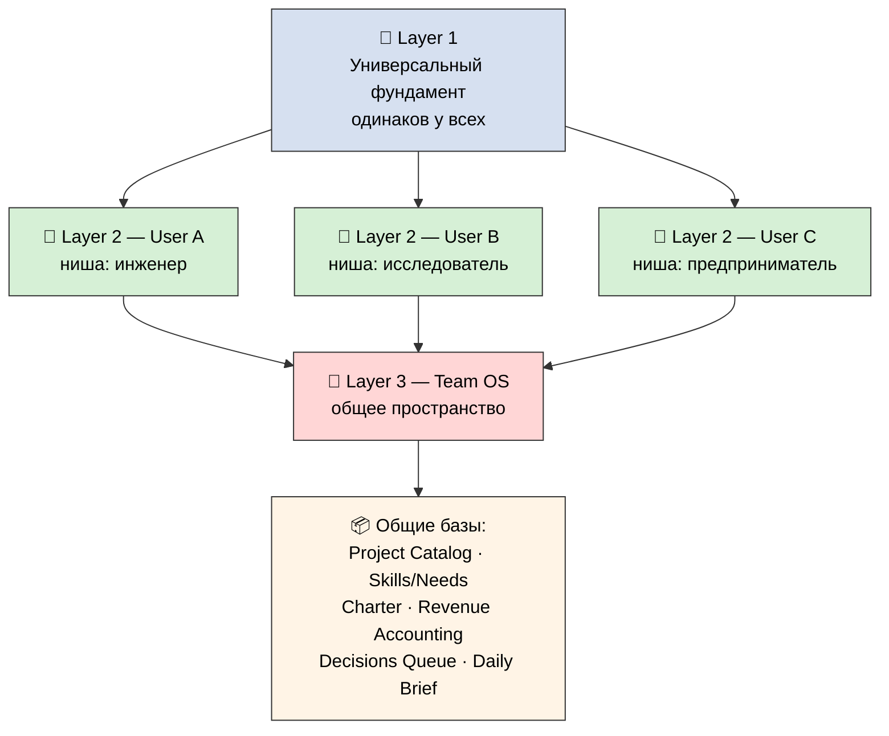
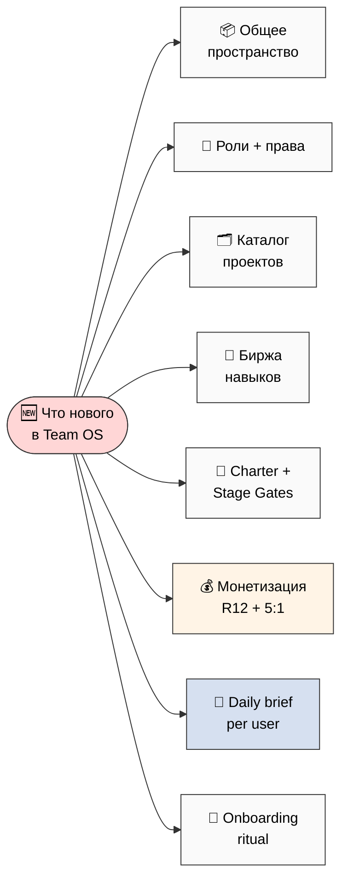

# Phase 1 — Что такое Team OS (слой совместной работы)

> **Простыми словами.** Personal OS — это система **одного человека**. Team OS — это то,
> что появляется, когда несколько таких людей решают работать вместе. Он не заменяет
> личные системы — он их **соединяет** и добавляет сверху общее пространство: роли, общие
> проекты, биржу навыков, деньги, ежедневный обход Claude Code за каждого. Этот документ
> объясняет, что именно добавляется, что остаётся как было, и когда Team OS вообще нужен
> (а когда лучше остаться одному).

---

## §1 🏗️ Три слоя — одна картинка

Всё держится на трёх слоях. Это важно понять до деталей:

| Слой | Что это | Чьё | Пример |
|---|---|---|---|
| **Layer 1 — Универсальный фундамент** | Базовые кирпичи Personal OS, одинаковые у всех | общий | Daily Log, Projects, Knowledge, CRM — структура, которую не трогают |
| **Layer 2 — Ниша под себя** | Тот же фундамент, настроенный под конкретного человека | личное | инженер крутит под код-ревью; гуманитарий — под отношения и смысл |
| **Layer 3 — Team OS (этот документ)** | Слой совместной работы поверх личных систем | командное | общее пространство + роли + проекты + биржа + деньги + daily brief |

**На пальцах:** Layer 1 и 2 — это «твоя квартира» (личная система). Layer 3 — это «двор и
правила соседства», когда вы с соседями решили вместе построить детскую площадку (общий
проект). Твоя квартира остаётся твоей. Двор — общий, и там есть договорённости.

---

## §2 Что такое Team OS (один абзац)

**Team OS = слой совместной работы.** Когда N человек, у каждого из которых есть свой
Personal OS, объединяются — Team OS соединяет их личные рабочие пространства в **общее
командное пространство** и добавляет туда то, чего в личной системе нет по определению:
**роли** (кто за что отвечает в совместном проекте), **каталог общих проектов** (можно
смотреть, фильтровать, присоединяться, предлагать новые), **биржу навыков** («что я могу
дать / что мне надо» + механизм подбора пар), **шаблоны монетизации** (как честно делим
деньги, когда совместно зарабатываем), **Charter** (договор команды) и **ежедневный обход
Claude Code за каждого человека** (раз в день CC приносит персональную подборку:
знакомства, пробелы в навыках, подходящие проекты, находки из интернета). Личные данные
при этом остаются личными — в общее пространство уходит только то, что человек сам решил
расшарить.

[src: prompt §2.A + JETIX-WORKSHOP-CONCEPT Workshop-Phase-2/3]

---

## §3 ✅ Что остаётся из Personal OS (наследуем, не строим заново)

Team OS не выкидывает личную систему — он её **переиспользует**. Вот что переходит без
изменений у каждого участника:

| Что наследуем | Как используется в Team OS |
|---|---|
| **Личные базы** (Daily Log / Projects / Knowledge: Concepts-Sources-Claims-Hypotheses / Ideas Bank / CRM / Reviews / Strategic / Life Pulse / Reference) | У каждого свой набор — это его **приватное** пространство. В команду уходит только расшаренное |
| **Frontmatter mirror discipline** | Метаданные в каждой записи → по ним работает синк Personal ↔ Shared и подбор на бирже |
| **Voice intake DRAFT-only** | Голос → черновик. Никогда не перезаписывает «боевое» авто. Daily brief наследует этот принцип 1:1 |
| **Claude Code integration** | Файлы = «правда», Notion = витрина. Это основа daily CC pass |
| **Fork-friendly Layer 1 + Layer 2** | Layer 1 универсальный + Layer 2 ниша. Team OS добавляет Layer 3 — тоже копируемый и форкаемый |
| **Filesystem = source of truth** (Global Rule 4) | При конфликте: для личных данных — личный файл главнее; для общих — общий. Notion везде остаётся витриной |

**Вывод:** примерно 80% того, чем человек уже пользуется в личной системе, остаётся как
есть. Team OS — это **добавка сверху**, а не новая система.

[src: prompts/personal-os-notion-template-plan-2026-05-24.md Layer 1+2 + CLAUDE.md §4.2 Global Rule 4]

---

## §4 🆕 Что нового появляется в Team OS

Восемь вещей, которых в личной системе нет:

1. **Общее командное пространство** (Shared workspace) — отдельный Notion-workspace со
   своими **общими** базами, видимый всем участникам по их правам.
2. **Слой ролей + прав** — каждый участник в каждом проекте носит роль (Управляющий,
   Инвестор, Исполнитель, Советник, …). Роль определяет, что он видит и что может менять.
3. **Project Catalog DB** — каталог совместных проектов: смотреть открытые, фильтровать по
   типу/навыкам, присоединяться, предлагать новый.
4. **Skills/Needs Marketplace DB** — биржа: каждый пишет «что могу дать» (навыки, время,
   капитал, сеть, наставничество) и «что мне надо». Система подбирает пары.
5. **Charter + Stage Gates lighter** — договор для совместного проекта (ценности,
   управление, деньги, R12-границы) + облегчённые контрольные точки SG-1…SG-4.
6. **Шаблоны монетизации** — revenue share, типы инвесторов, учёт вклада. С обязательным
   R12-чеком и потолком неравенства 5:1.
7. **Daily CC pass per user** — личный ежедневный брифинг от Claude Code: знакомства +
   пробелы навыков + находки на бирже + новые проекты + интернет. Всё — **черновик**.
8. **Onboarding ritual** — вход нового участника: первая неделя по шагам + гайд по роли +
   R12-этика + (опционально) общая сессия для сплочения когорты.

[src: prompt §2.C]

---

## §5 🤔 Когда хватает одного Personal OS, а когда нужен Team OS

Важная честная развилка (это **AP-6**: «один, без команды» — полностью валидный путь, не
второсортный):

| Хватает Personal OS (одному) | Нужен Team OS (вместе) |
|---|---|
| Ведёшь свою жизнь и день | Совместный проект на 2+ человек |
| Соло-проекты | Когортная программа (мастерская, резиденция) |
| Личное обучение и навыки | Формирование партнёрства |
| Свои гипотезы и эксперименты | Сценарии с делёжкой дохода (revenue share) |
| Личные финансы и здоровье | Совместная ответственность и подотчётность |

**Правило большого пальца:** если деньги и решения — только твои, оставайся в Personal OS.
Как только появляется **общий котёл** (деньги, время нескольких людей, общий результат) —
включается Team OS, потому что нужны роли, учёт вклада и договор о делёжке.

**Не наоборот:** Team OS не «лучше» Personal OS. Он просто решает другую задачу. Многие
участники бо́льшую часть времени живут в личной системе и заходят в командную только под
конкретный совместный проект.

[src: prompt §2.D + AP-6 dissent preservation]

---

## §6 🌱 Fork-friendly: Team OS тоже копируется и настраивается

Как Personal OS делится на Layer 1 (универсальный) + Layer 2 (ниша), так и Team OS:

- **Layer 1 Team OS — универсальный фундамент команды:** роли, каталог проектов, биржа,
  Charter, R12-границы. Это копируется любой группой без изменений.
- **Layer 2 Team OS — ниша когорты:** под конкретный тип сообщества. Например:
  - «образовательная когорта» (мастерская + наставники + студенты),
  - «исследовательский коллектив» (общие гипотезы + соавторство статей),
  - «стартап-команда основателей» (доли + спринты + инвесторы).
- **Несколько Team OS у одного человека:** один участник может быть одновременно в
  нескольких командных пространствах (PM в одном, Контрибьютор в другом, Советник в
  третьем) — у каждого свой Charter и свой учёт вклада.

Это значит: когда Team OS-шаблон готов, его можно **раздать партнёрам** (Wave 1), и каждый
форкнет под свою группу — ровно как с личным шаблоном. Никакого lock-in: форкнул, ушёл,
работаешь самостоятельно (R12 fork-and-leave на уровне всего шаблона).

[src: prompt §2.E + r12-anti-extraction §2 fork-and-leave]

---

## §7 К Phase 2

Понятно: **что** такое Team OS, **что** в нём остаётся из личной системы и **что** нового.
Дальше — самый технический вопрос: **как именно** N личных Notion-пространств соединяются
с одним общим — права доступа, синхронизация, изоляция личных данных. Это Phase 2
(multi-tenant архитектура).

*Phase 1 closure 2026-05-24. Layer 3 = collaboration поверх Personal OS Layer 1+2. 8 новых
сущностей. AP-6: single Personal OS — валидный путь. Fork-friendly на уровне команды.
Style: PARTNER-OFFERING-HUMAN-LANG.*
