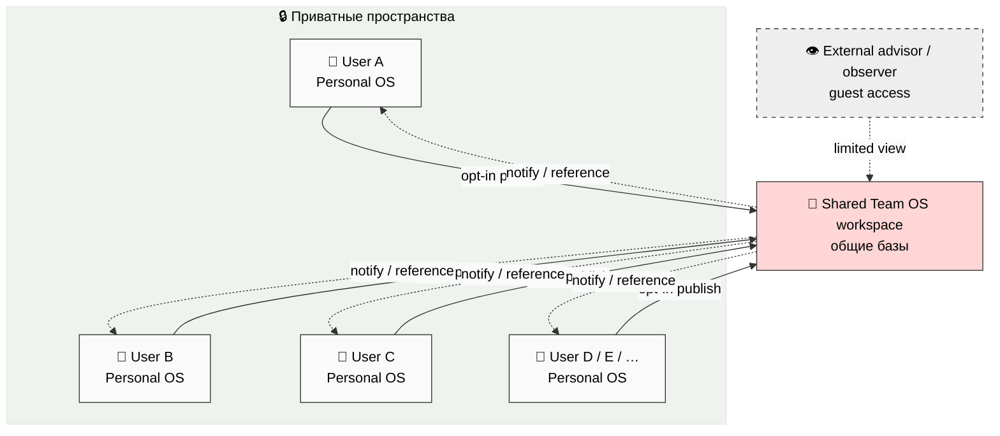
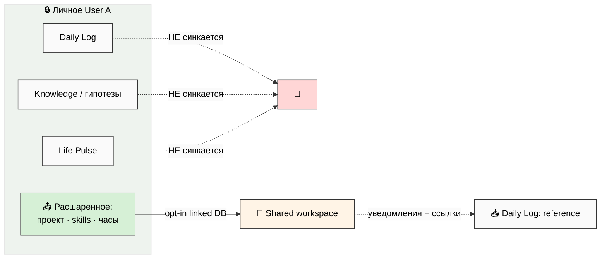

# Phase 2 — Как соединяются личные системы в общую ⭐⭐⭐

> **Простыми словами.** Самый технический вопрос: у каждого участника своё личное
> Notion-пространство (приватное), а есть одно общее командное. Как их соединить так,
> чтобы (а) общие проекты были видны всем по их правам, (б) личные данные **не утекали**
> в команду без явного согласия, и (в) при конфликте было понятно, чья версия главнее.
> Этот документ — топология, права доступа (полная матрица), синхронизация и изоляция
> данных. С опорой на родные возможности Notion — без самописной инфраструктуры там, где
> Notion и так умеет.

---

## §1 🗺️ Топология — кто с кем соединён

Каждый участник держит **своё** Personal OS пространство (приватное). Между ними —
**одно общее** Team OS пространство. Соединение — **избирательное** (selective sync):
наверх уходит только то, что человек сам опубликовал.

**Ключевой принцип (направление потока):** стрелка «вверх» (Personal → Shared) — всегда
**по решению человека** (opt-in publish). Стрелка «вниз» (Shared → Personal) — это
**уведомления и ссылки** (мой проект обновился; меня упомянули), а не копирование чужих
личных данных.

[src: prompt §3.A + Part 10 §C3 owner-initiated only]

---

## §2 🧩 Родные возможности Notion — что используем (а не пишем сами)

Принцип инженерной экономии: **Notion уже умеет 90% нужного**. Самописные скрипты — только
там, где Notion не покрывает (двусторонний синк с файлами-правдой и подбор на бирже).

| Возможность Notion | Как используем в Team OS |
|---|---|
| **Team plan / Teamspace** | База общего пространства. Один Teamspace = одна команда (Clan) |
| **Guest access** | Внешние советники / наблюдатели — временный ограниченный доступ без полного членства |
| **Linked databases** | Личная запись → ссылка в общей базе (без полного копирования). Так проект «виден», но живёт у владельца |
| **Page permissions** | Права на страницу: read / comment / edit / full access |
| **Database permissions** | Права на базу по роли (PM / Investor / Contributor / …) |
| **Synced blocks** | Подписанный личный Charter ↔ отражение в общем Team Charter (один источник, два места) |
| **Comments** | Родной канал обсуждения проекта — без внешнего чата |
| **Mentions (@)** | Прямое уведомление участника |
| **Database views + filters** | «Открытые проекты», «мои проекты», «по навыкам» — без кода |

**Что Notion НЕ покрывает (нужны helper-скрипты, описаны в §6):** двусторонний синк
«файлы-правда ↔ Notion-витрина», подбор пар на бирже, ежедневный брифинг. Их **описываем**,
но в этом плане **не создаём** (R11).

[src: prompt §3.B + Personal OS Notion-MVP-bypass pattern]

---

## §3 🔐 Матрица прав — кто что видит и меняет (полная)

Главный артефакт фазы. Строки = общие базы, столбцы = 10 ролей. Значения:
**EDIT** (создавать/менять) · **COMMENT** (только комментировать) · **VIEW** (только
читать) · **VOTE** (право голоса в решениях) · **OVERSIGHT** (надзор/аудит) ·
**NONE** (нет доступа). «(own)» = только свои строки/проект.

| База \ Роль | PM | Inv-Cap | Inv-Time | Inv-Net | Contributor | Advisor | Facilitator | Mentor | Observer | Steward |
|---|---|---|---|---|---|---|---|---|---|---|
| **Project Catalog** | EDIT (own proj) | VIEW+COMMENT | VIEW+COMMENT | VIEW | VIEW | VIEW | VIEW | VIEW | VIEW | EDIT |
| **Skills/Needs** | EDIT (own) | EDIT (own) | EDIT (own) | EDIT (own) | EDIT (own) | EDIT (own) | EDIT (own) | EDIT (own) | VIEW | VIEW |
| **Project Workspaces** | EDIT (own proj) | VIEW (own stake) | EDIT (assigned) | VIEW | EDIT (assigned) | COMMENT | EDIT (sessions) | COMMENT | VIEW | VIEW |
| **Charter** | VIEW | VIEW | VIEW | VIEW | VIEW | VIEW | VIEW | VIEW | VIEW | EDIT |
| **Revenue Accounting** | EDIT (own proj) | VIEW (own stake) | VIEW (own stake) | VIEW (own stake) | VIEW (own contrib) | NONE | NONE | NONE | NONE | OVERSIGHT (all) |
| **Contribution Ledger** | EDIT (own proj) | VIEW (own) | EDIT (own hours) | VIEW (own) | EDIT (own tasks) | VIEW (own) | EDIT (own sessions) | VIEW (own) | NONE | OVERSIGHT (all) |
| **Decisions Queue** | EDIT (own proj) | VOTE | VOTE | VOTE | COMMENT | COMMENT | COMMENT | COMMENT | NONE | OVERSIGHT |
| **R12 Audit Log** | VIEW (own proj) | VIEW (own) | VIEW (own) | VIEW (own) | VIEW (own) | VIEW (own) | VIEW (own) | VIEW (own) | NONE | EDIT (all) |
| **Daily Brief** (per-user) | own only | own only | own only | own only | own only | own only | own only | own only | own only | own only |
| **Onboarding / Guides** | VIEW | VIEW | VIEW | VIEW | VIEW | VIEW | VIEW | VIEW | VIEW | EDIT |

**Как читать матрицу — три правила:**

1. **Управляющий (PM) силён только в СВОЁМ проекте.** В чужих проектах он рядовой
   участник. Это hub-and-spoke из Foundation Part 4: PM = единый диспетчер **на проект**,
   не на всю команду.
2. **Деньги видны только свои.** Revenue Accounting: каждый видит **свою** долю и
   **свой** вклад; полная картина всех проектов — только у Steward (надзор) и PM (по
   своему проекту). Никаких скрытых сплитов: внутри проекта ledger прозрачен для участников
   этого проекта.
3. **Steward — единственная сквозная роль.** Он редактирует Charter и R12 Audit Log,
   надзирает за всеми Decisions и Revenue. Но **не голосует** в проектных решениях и
   **не получает** проектную долю (чтобы не было конфликта интересов — см. Phase 3).

[src: prompt §3.C + Part 4 hub-and-spoke L8 + R12 transparent ledger]

---

## §4 🔄 Синхронизация — что куда течёт

Четыре направления, каждое со своим правилом:

### §4.A Personal → Shared (вверх) — только opt-in

Человек **сам** решает, что опубликовать. Опубликовать можно: проект (как запись в
Catalog), своё предложение на бирже (Skills/Needs), часы работы (в Contribution Ledger
своего проекта). Механизм Notion — **linked database**: запись остаётся у владельца,
наверх уходит ссылка. Личный Daily Log, Knowledge, приватные гипотезы — **не уходят
никогда** без явного действия.

### §4.B Shared → Personal (вниз) — уведомления и ссылки

Сверху приходят: уведомления (мой проект сменил стадию; меня @упомянули; голосование
открыто), ссылки на общие записи (новый проект в каталоге подходит под мой профиль).
В личный Daily Log это попадает как **reference-запись**, не как полная копия чужих данных.

### §4.C Конфликт-резолюция — чья версия главнее

Наследуем Global Rule 4 (filesystem = source of truth) + 5 стратегий Part 10:

| Что | Главнее |
|---|---|
| **Личные данные** (мой Daily Log, мои гипотезы) | личный файл/пространство (parent-wins) |
| **Общие данные** (Charter, Revenue split, Decision) | общее пространство (fork-wins для shared) |
| **Спорный случай** | `pending-review` → Steward смотрит, **спросить, не угадывать** |

**Табу:** молчаливая авто-перезапись. Если синк не уверен — он ставит `pending-review`, а
не затирает. (Это прямой перенос voice DRAFT-only дисциплины на синк.)

### §4.D Изоляция данных — красная линия

- Личный Daily Log / Knowledge / приватные гипотезы / Life Pulse → **НИКОГДА** не
  авто-синкаются в команду без явного действия пользователя.
- Брифинг User A **не раскрывает** приватные данные User B (см. Phase 6 §G).
- Steward имеет **аудит-доступ** к Revenue/Decisions/R12, но **не** к чужим личным базам
  (Daily Log, гипотезы) — надзор за деньгами и этикой, не за личной жизнью.

[src: prompt §3.D + Part 10 §I.1 5 reconciliation strategies + Global Rule 4 + voice DRAFT-only]

---

## §5 🌐 Внешние люди — советники, гости, наблюдатели

Не каждый, кто взаимодействует с командой, — полноправный член. Три уровня внешнего
доступа (наследуем Part 10 RT-1/RT-2 + consent discipline):

| Уровень | Кто | Доступ | Согласие |
|---|---|---|---|
| **Guest (read-only)** | внешний советник, потенциальный член | VIEW Catalog + Marketplace; без денег и решений | guest-link, отзывается в 1 клик |
| **Observer (member)** | пред-онбординг, «присматривается» | роль Observer (см. Phase 3) | мягкий вход |
| **Steward audit** | надзор за R12 | OVERSIGHT, не личные данные | по Charter |

**Правило Part 10 L8:** любая внешняя запись (например, синк в Linear/GitHub партнёра)
проверяет `consent_recorded_at`; нет согласия → HALT + stop_gate. В Team OS это значит:
нельзя авто-постить о человеке/проекте наружу без зафиксированного согласия.

[src: Part 10 RT-2 §L5/L8 consent + guest access]

---

## §6 🛠️ Helper-скрипты — что нужно (описываем, НЕ создаём)

То, что Notion сам не умеет. **Это спецификация, не код** (R11 — Phase 6 детализирует
daily brief; реальные скрипты создаются на этапе реализации Week 6-7):

| Скрипт | Назначение | Дисциплина |
|---|---|---|
| `tools/team_os_sync.py` | Двусторонний синк Personal ↔ Shared по frontmatter | файлы-правда; `pending-review` при конфликте; никогда не затирает молча |
| `tools/team_os_invite.py` | Онбординг нового участника в Teamspace | проверка согласия; выдача прав по роли |
| `tools/team_os_marketplace_match.py` | Подбор пар: Skills offer × Needs / Projects | только DRAFT-предложения, не авто-действия |
| `tools/team_os_daily_brief.py` | Ежедневный брифинг per user | DRAFT-only; opt-in внешних источников; без cross-user утечки |

Все четыре — **config-driven** (никаких хардкод-путей), идемпотентные, без хранения
API-ключей в коде (ключи в `private/<service>-auth.yaml` per Part 10).

[src: prompt §3.E + R11 Default-Deny + Part 10 auth externalised]

---

## §7 К Phase 3

Топология, права, синк и изоляция понятны. Дальше — **детальная спецификация 10 ролей**:
что каждая роль делает, что видит и меняет (из матрицы выше), как считается её вклад,
какая дефолтная доля и какой у неё R12-риск. Это Phase 3.

*Phase 2 closure 2026-05-24. Топология N Personal OS ↔ 1 Shared. 9 родных возможностей
Notion. Полная матрица 10 баз × 10 ролей. 4 направления синка + конфликт-резолюция +
изоляция (личное не утекает). 3 уровня внешнего доступа. 4 helper-скрипта (спека, не код).
engineering-expert + systems-expert lens. Style: PARTNER-OFFERING-HUMAN-LANG.*
