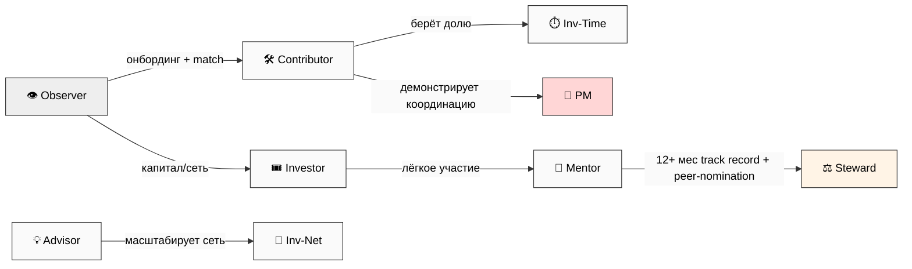

# Phase 3 — 10 ролей и их права ⭐⭐⭐

> **Простыми словами.** Когда люди работают над общим проектом, у каждого — роль. Роль
> отвечает на четыре вопроса: что человек **делает**, что он **видит и может менять**, как
> считается его **вклад** и какую **долю** он по умолчанию получает. Здесь — 10 готовых
> ролей, которые можно брать «из коробки», у каждой полная карточка (минимум 6 атрибутов).
> Плюс — как переходят между ролями и что роль ≠ конкретный человек.

---

## §1 ⚠️ Важно: роль — это не человек (IP-1)

**Роль = абстрактная функция** («Управляющий проектом»). **Человек = тот, кто эту роль
исполняет** («User A в проекте X»). Это разные вещи, и мы их не смешиваем:

- Роли в этом документе — **без имён** (Layer 3, абстрактный уровень).
- Конкретные привязки «кто какую роль играет» — это **Layer 2 instance overlay**,
  отдельный слой, где появляются имена.
- Один человек может носить **разные роли в разных проектах** (см. §13).
- Роль может переходить от одного человека к другому со временем — это нормально и
  заложено в дизайн (см. §12 переходы).

Зачем так строго: чтобы власть была привязана к **функции**, а не к личности. Тогда роль
ротируется, и никто не становится «незаменимым навсегда» — это анти-культовая защита.

[src: Part 4 IP-1 Role≠Executor L1 STRICT + prompt §4.D]

---

## §2 📋 Все 10 ролей — обзорная таблица

| # | Роль | В двух словах | Дефолтная доля | R12-риск |
|---|---|---|---|---|
| 1 | **Project Manager (PM)** | координатор одного проекта | 10-20% / проект | СРЕДНИЙ |
| 2 | **Investor Capital (Inv-Cap)** | вкладывает деньги | 20-40% капитальной части | **ВЫСОКИЙ** |
| 3 | **Investor Time (Inv-Time)** | вкладывает часы/навыки | трудовая часть | НИЗ-СРЕДН |
| 4 | **Investor Network (Inv-Net)** | вкладывает сеть/аудиторию | 3-10% за весомое интро | СРЕДНИЙ |
| 5 | **Contributor** | исполнитель задач | почасовка или доля | НИЗКИЙ |
| 6 | **Advisor** | лёгкий советник | 0.5-2% или ретейнер | НИЗКИЙ |
| 7 | **Facilitator** | ведущий сессий/когорты | за сессию + бонус | СРЕДНИЙ |
| 8 | **Mentor** | долгосрочный наставник | ретейнер за engagement | **ВЫСОКИЙ** |
| 9 | **Observer** | смотрит, ещё не участвует | — | НИЗКИЙ |
| 10 | **Steward** | следит за честностью (R12) | плоский ретейнер | МЕТА |

Эти 10 — **baseline (минимум-максимум)**. Можно начать с 7 (без Inv-Net / Facilitator /
Mentor) и добрать остальные. Это одно из решений §9.E (Руслан выбирает: 7 / 10 / другое).

**Связь со словарём CRM:** роли наследуют 24-ролевый словарь CRM (advisory: mentor /
advisor / facilitator / consultant; capital: investor; team: cofounder / hire). Team OS —
операционализация этого словаря под совместный проект.

[src: prompt §4.A + crm/_schema/roles.yaml 24 roles]

---

## §3 Role 1 — Project Manager (PM)

| Атрибут | Значение |
|---|---|
| **Сфера (scope)** | Координатор **одного** конкретного проекта. Один проект = один PM (hub-and-spoke) |
| **Права** | EDIT Project Workspace (свой) + EDIT Decisions Queue (свой проект) + VIEW все общие базы |
| **Что производит** | Скорость проекта / продвижение по Stage Gates / всплытие блокеров |
| **Единицы вклада** | Часы PM-координации → в Contribution Ledger |
| **Дефолтная доля** | 10-20% проекта (обсуждается в Charter) |
| **R12-аудит** | **СРЕДНИЙ** — координирующая власть. Защита: **ротация PM** + клаузула Charter «нет PM-на-всю-жизнь» |
| **Опора фундамента** | Part 4 «manager» role abstract; единый диспетчер на проект |

**На пальцах:** PM — это «дирижёр» одного проекта. Он силён внутри своего проекта и рядовой
в чужих. Главный риск — что координатор начнёт «держать власть»; поэтому роль ротируется.

---

## §4 Role 2 — Investor Capital (Inv-Cap)

| Атрибут | Значение |
|---|---|
| **Сфера** | Денежный инвестор в конкретный проект |
| **Права** | VIEW+COMMENT Project + Revenue Accounting (своя доля) + VOTE Decisions |
| **Что производит** | Развёртывание капитала + финансовая дисциплина |
| **Единицы вклада** | Сумма денег × срок → доля вклада |
| **Дефолтная доля** | Капитальная часть дохода проекта (≈20-40% по размеру вклада) |
| **R12-аудит** | **ВЫСОКИЙ** — контроль через капитал. Защита: **Mondragón 5:1 cap обязателен** + fork-and-leave + 30-дневное окно выхода |
| **Парный эксперт** | influence-ethics-expert auto-pair (деньги = высокий риск) |

**На пальцах:** дал деньги — получаешь долю и право голоса. Но даже самый крупный
инвестор **не может** забрать больше 5× минимальной доли в проекте (потолок неравенства).
И никто не «заперт» — можно выйти с долей.

**⚠️ Мэппинг к канонической модели:** в Economic V10 «Investor» — **единая** роль (25%
→ stake + voting + dividends). Team OS раскладывает её на 4 «вкуса вклада» (капитал/время/
сеть/знание) для удобства учёта. Это операционная декомпозиция, не новая экономика.

---

## §5 Role 3 — Investor Time (Inv-Time)

| Атрибут | Значение |
|---|---|
| **Сфера** | Инвестор времени/навыков — отработанные часы трекаются |
| **Права** | EDIT (назначенная задача) + VIEW Revenue Accounting (своя доля) + VOTE Decisions |
| **Что производит** | Отработанные часы + качество навыка |
| **Единицы вклада** | Часы × ставка навыка (self-declared + peer-validated) |
| **Дефолтная доля** | Трудовая часть дохода (per Economic V10 worker share) |
| **R12-аудит** | **НИЗ-СРЕДНИЙ** — защита от переработки: **потолок ≤50 ч/нед** (анти-эксплуатация) |
| **Опора** | Levenchuk МИМ: качество часа растёт с уровнем (Работник → Специалист → Мастер) |

**На пальцах:** вкладываешь время и навык — получаешь долю пропорционально. Защита от
«а поработай-ка 80 часов в неделю»: жёсткий потолок часов.

---

## §6 Role 4 — Investor Network (Inv-Net)

| Атрибут | Значение |
|---|---|
| **Сфера** | Инвестор сети / аудитории / знакомств |
| **Права** | VIEW Project + Revenue Accounting (своя доля) + VOTE Decisions |
| **Что производит** | Сделанные интро / предоставленный доступ к аудитории |
| **Единицы вклада** | Плоская пред-договорённая доля ИЛИ трек «интро-доставлено» |
| **Дефолтная доля** | 3-10% за весомое интро (обсуждается в Charter) |
| **R12-аудит** | **СРЕДНИЙ** — риск «выжать чужую аудиторию». Защита: R12 paired-frame обязателен + анти-audience-extraction клаузула |
| **Опора** | T2 партнёрский тип (ресурсы/аудитория/каналы) из EXECUTION-PLAN |

**На пальцах:** привёл нужных людей или дал доступ к аудитории — получаешь долю. Красная
линия: нельзя «доить» чужую аудиторию — интро должны быть в интересах обеих сторон.

---

## §7 Role 5 — Contributor

| Атрибут | Значение |
|---|---|
| **Сфера** | Активный исполнитель (без капитальной/сетевой доли — чистая работа) |
| **Права** | EDIT (назначенная задача) + VIEW Project + Marketplace + COMMENT Decisions |
| **Что производит** | Выполнение задач |
| **Единицы вклада** | Задачи × сложность × качество |
| **Дефолтная доля** | Почасовая ставка ИЛИ доля проекта (Charter) |
| **R12-аудит** | **НИЗКИЙ** — стандартная «рабочая» роль, R12 paired-frame baseline |
| **Переход** | Contributor → Inv-Time (если начинает брать долю) / → PM (после демонстрации координации) |

**На пальцах:** делаешь конкретную работу — получаешь оплату или долю. Самая
«низкорисковая» роль и самый частый вход в команду.

---

## §8 Role 6 — Advisor

| Атрибут | Значение |
|---|---|
| **Сфера** | Лёгкая консультативная роль (1-2 ч/мес на проект) |
| **Права** | VIEW Project + Marketplace + COMMENT Decisions |
| **Что производит** | Стратегический совет / всплытие блокеров |
| **Единицы вклада** | Проведённые сессии |
| **Дефолтная доля** | 0.5-2% плоско ИЛИ ретейнер за сессию |
| **R12-аудит** | **НИЗКИЙ** — защита от scope creep (советник не лезет в управление) |
| **Опора** | CRM роль `advisor`; T1 методологический партнёр |

**На пальцах:** даёшь совет редко и по делу. Граница: советник советует, а не управляет.

---

## §9 Role 7 — Facilitator

| Атрибут | Значение |
|---|---|
| **Сфера** | Ведущий мастерской / когортной сессии |
| **Права** | EDIT (сессии) + VIEW Project + Marketplace + COMMENT Decisions |
| **Что производит** | Качество сессий + вовлечённость когорты |
| **Единицы вклада** | Проведённые сессии × обратная связь участников |
| **Дефолтная доля** | За сессию + (опционально) бонус за прогресс когорты |
| **R12-аудит** | **СРЕДНИЙ** — власть ведущего. Защита: **нет культовых динамик** + Schelling-чек Charter (см. Phase 7) |
| **Опора** | Workshop concept (facilitator структура); Gamified Platform анти-секта |

**На пальцах:** ведёшь живые сессии для группы. Главный риск — ведущий с харизмой легко
скатывается в «гуру». Поэтому жёсткий анти-культовый чек.

---

## §10 Role 8 — Mentor

| Атрибут | Значение |
|---|---|
| **Сфера** | Долгосрочное сопровождение (3-12 мес на менти) |
| **Права** | VIEW+COMMENT Personal OS менти (**с согласия менти**) + VIEW Shared |
| **Что производит** | Прогресс навыков менти + поддержка жизненного направления |
| **Единицы вклада** | Месяцы × уровень глубины (Tier 1 ~1 ч/мес / Tier 2 ~4 ч/мес / Tier 3 еженедельно) |
| **Дефолтная доля** | Ретейнер за engagement (без доли проекта, пока не перейдёт в Contributor/PM) |
| **R12-аудит** | **ВЫСОКИЙ** — наставническая власть. Обязательный R12 boundary list: **нет извлечения / нет эксклюзивного lock-in / fork-and-leave / потолок 12 мес** |
| **Опора** | Tyson Mentorship Pattern (depth not width — 1-2 топ-наставника); CRM `mentor` |

**На пальцах:** ведёшь одного-двух человек глубоко и долго. Огромная сила влияния →
огромная ответственность: нельзя привязывать менти к себе эксклюзивно, нельзя извлекать
из доверия, отношения имеют срок и пересматриваются.

---

## §11 Role 9 — Observer

| Атрибут | Значение |
|---|---|
| **Сфера** | Только просмотр (потенциальный член / любопытный / пред-онбординг) |
| **Права** | VIEW Project Catalog + VIEW Marketplace. **Нет** Decisions, **нет** Revenue Accounting |
| **Что производит** | Ничего (пассивная роль) |
| **Единицы вклада** | Н/Д |
| **Дефолтная доля** | Н/Д |
| **R12-аудит** | **НИЗКИЙ** |
| **Переход** | Observer → Contributor / Investor / … после пред-онбординга + match на бирже |

**На пальцах:** «зашёл осмотреться». Видит витрину, но не участвует в деньгах и решениях.
Это безопасная прихожая перед полноценным входом.

---

## §12 Role 10 — Steward (хранитель честности / R12)

| Атрибут | Значение |
|---|---|
| **Сфера** | Сквозной контроль соблюдения R12 и Charter по всему командному пространству |
| **Права** | EDIT Charter + OVERSIGHT всех Decisions + VIEW Revenue (все проекты) + EDIT R12 Audit Log |
| **Что производит** | Нарушения R12 остановлены быстро (≤5 сек грейд F4); Charter-комплаенс проверен |
| **Единицы вклада** | Проведённые R12-аудиты × пойманные нарушения |
| **Дефолтная доля** | **Плоский ретейнер** (НЕ доля проекта — чтобы не было конфликта интересов) |
| **R12-аудит** | **МЕТА** — сам Steward должен **ротироваться** + иметь peer-Steward проверку + не может само-продвигаться |
| **Опора** | influence-ethics-expert аналог на уровне людей; Pillar C R12 enforcement cell |

**На пальцах:** Steward — это «омбудсмен» команды. Его задача — ловить ситуации, где
кого-то «доят» или запирают, и останавливать их. Чтобы он сам не стал источником власти —
он не голосует в проектах, не берёт проектную долю, ротируется и проверяется напарником.

---

## §13 🔄 Переходы между ролями

Роли — не пожизненные. Типичные траектории (диаграмма TM-3 в Phase 8):

- **Observer → Contributor / Investor** — после онбординга + match на бирже
- **Contributor → Inv-Time** — когда начинает брать долю вместо почасовки
- **Contributor → PM** — после 3-месячного track record + Steward review
- **Advisor → Inv-Net** — если масштабирует ценность своей сети
- **Inv-Cap → Mentor** — лёгкое долгосрочное участие
- **Mentor → Steward** — после 12+ мес track record + peer-Steward номинация + R12-аудит pass

Эта лестница перекликается с **8-уровневой МИМ-лестницей Левенчука** (Ученик → … →
Реформатор → Революционер): рост по агентности, масштабу и методологической дисциплине.
Team OS-роли — практическое воплощение того же принципа на уровне команды.

[src: prompt §4.B + Levenchuk МИМ 8-level + Tyson mentorship]

---

## §14 🎭 Один человек — несколько ролей (multi-hat)

Участник может носить **разные роли в разных проектах одновременно**:

- User A = **PM** в Проекте 1 + **Contributor** в Проекте 2 + **Advisor** в Проекте 3.
- По **каждому** проекту — отдельный учёт вклада и отдельные права.
- Никакой «глобальной власти»: сильный PM в одном проекте — рядовой участник в другом.

Это прямое следствие IP-1 (роль ≠ человек) и hub-and-spoke (единый диспетчер **на проект**,
не на всю систему). Так власть остаётся распределённой, а не концентрируется на одном лице.

[src: prompt §4.C + Part 4 hub-and-spoke]

---

## §15 🏛️ Конституционные опоры (зачем именно так)

- **IP-1 STRICT** — роли абстрактны (Layer 3); конкретные люди = Layer 2 instance overlay,
  отдельный слой. Никаких имён в ролях.
- **Hub-and-spoke (Part 4)** — PM = единый диспетчер **на проект**. Ячейки/участники не
  координируют через голову PM в его проекте, но PM не правит чужими проектами.
- **R12 встроен в каждую роль** — у каждой роли в карточке есть строка «R12-аудит» с
  уровнем риска и защитой. Высокий риск (Inv-Cap, Mentor) → auto-pair influence-ethics +
  обязательные защиты (Mondragón cap, fork-and-leave, потолок срока).
- **Ротация власти** — PM, Facilitator, Steward — все ротируются. «Нет роли на всю жизнь».

---

## §16 К Phase 4

Роли есть. Дальше — **где люди и проекты находят друг друга**: каталог проектов, биржа
навыков «что могу дать / что надо» и механизм подбора пар. Это Phase 4 (marketplace).

*Phase 3 closure 2026-05-24. 10 ролей × ≥7 атрибутов каждая (scope/права/output/единицы
вклада/доля/R12-аудит/опора). Обзорная таблица + 4-vs-3 investor мэппинг к V10. Переходы
(mermaid + МИМ 8-level). Multi-hat. IP-1 STRICT + hub-and-spoke + R12-в-каждой-роли +
ротация. methodology-engineer + mgmt-expert lens. Style: PARTNER-OFFERING-HUMAN-LANG.*
