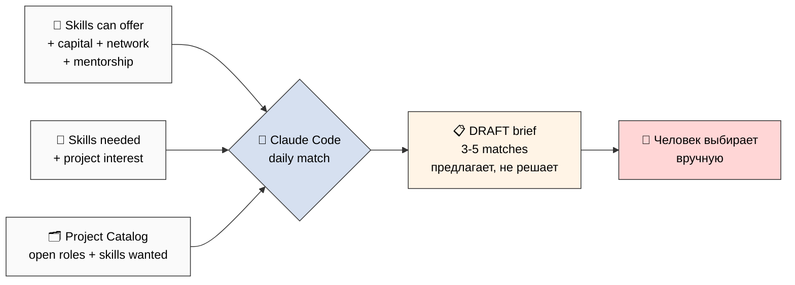
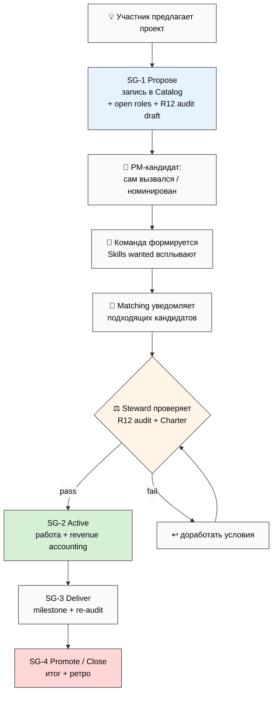

# Phase 4 — Биржа: где люди и проекты находят друг друга ⭐⭐⭐

> **Простыми словами.** Чтобы команда работала, нужно две вещи: (1) **каталог проектов** —
> что вообще делается, куда можно вписаться, что предложить новое; и (2) **биржа навыков** —
> каждый пишет «что могу дать» и «что мне надо», а система подбирает пары. Здесь — точные
> схемы обеих баз (какие поля, какие виды), механизм подбора, путь нового проекта от идеи
> до запуска, и список ловушек, которых избегаем.

---

## §1 🗣️ Как мы это называем (язык имеет значение)

Прежде чем схемы — про **рамку**. Биржа Team OS — это **НЕ «доска вакансий»** и **НЕ
«фриланс-биржа»**. Разница в одном слове, но она принципиальна:

| ❌ Так НЕ говорим | ✅ Так говорим |
|---|---|
| «вакансия», «наняться» | «открытая роль в проекте», «вписаться» |
| «исполнитель за деньги» | «со-участник с долей или оплатой» |
| «продай свои навыки» | «что можешь дать команде» |
| «закрыть позицию» | «найти, кого не хватает» |

Почему: «доска вакансий» включает мышление «работодатель ↔ наёмник» — а это ровно та
иерархия, которую Team OS заменяет кооперативной (75-90% человеку, потолок 5:1, выход с
долей). Рамка «что могу дать / что нужно проекту» держит **равенство сторон**. Это R12 на
уровне языка: формулировка не должна склонять к извлечению.

[src: prompt §5.E + nlp-expert framing + Partnership Model «co-founder not B2B»]

---

## §2 🗂️ Project Catalog DB — каталог проектов

Главная база, где видны все совместные проекты. Полная схема полей:

| Поле | Тип | Заметки |
|---|---|---|
| **Title** | Text | обязательно |
| **Type** | Select | consulting / research / product / bets / cohort / community (наследует KM MVP 4 типа + 2 новых) |
| **Stage** | Select | SG-1 propose / SG-2 active / SG-3 deliver / SG-4 promote (Stage Gates lighter) |
| **Status** | Select | open / forming / active / paused / closed-won / closed-lost / archived |
| **Project Manager** | Relation → User | 1 PM на проект |
| **Active team** | Relation → Users (multi) | текущие участники |
| **Open roles needed** | Multi-select | каких ролей не хватает [PM/Inv-Cap/Inv-Time/Inv-Net/Contributor/Advisor/Facilitator/Mentor] |
| **Skills wanted** | Multi-select | каких навыков не хватает (из taxonomy) |
| **Monetization terms** | Rich text | revenue share / Mondragón-чек / ссылка на Charter |
| **R12 audit status** | Select | passed / pending / failed + дата аудита |
| **Time commitment** | Select | 1-2ч/нед / 3-5ч/нед / 10+ч/нед / full-time |
| **Duration** | Select | 1-3 мес / 3-12 мес / 12+ мес / ongoing |
| **CTA join** | Text | как выразить интерес (мягкий заход, не «откликнуться») |
| **Description** | Rich text | абзац + ссылка на Stage-Gate predicate |

### Виды (Views):

- **Все открытые** (фильтр status = open ИЛИ forming)
- **По типу** (4-6 колонок)
- **По нужным навыкам** (фильтр под моё предложение на бирже)
- **По стадии** (kanban SG-1…SG-4)
- **Новые** (последние 7 дней)
- **Мои проекты** (фильтр по моим relations)

[src: prompt §5.A + KM MVP project types + Stage Gates]

---

## §3 🛒 Skills Offer/Need Marketplace DB — биржа навыков

По одной строке на участника: что он готов дать и что ищет.

| Поле | Тип | Заметки |
|---|---|---|
| **User** | Relation → self | self-reference |
| **Skills can offer** | Multi-select | что приношу (из taxonomy) |
| **Time availability** | Number (ч/нед) | сколько времени |
| **Capital availability** | Select | none / <€1K / €1-10K / €10-100K / €100K+ (можно скрыть) |
| **Network value** | Rich text | какие сети / каналы / аудитории |
| **Mentorship offered** | Multi-select | в каких доменах готов наставлять |
| **Skills needed** | Multi-select | что хочу подучить |
| **Project interest** | Multi-select | какие типы проектов привлекательны |
| **Monetization preference** | Select | revenue share / почасовка / гибрид / волонтёрство |
| **Active until** | Date | когда обновить (свежесть записи) |

**Дисциплина свежести:** запись «протухает» через срок (Active until), чтобы биржа не
забивалась устаревшими предложениями. Перед протуханием — напоминание в daily brief.

**Приватность:** Capital availability можно показывать диапазоном или скрыть. Никто не
обязан раскрывать точные суммы — это согласуется с изоляцией данных Phase 2.

[src: prompt §5.B]

---

## §4 🎯 Механизм подбора пар (matching)

Подбор делает **ежедневный обход Claude Code** (детально — Phase 6). Раз в день CC
сопоставляет:

| Что × что | → Что находит |
|---|---|
| Мои **Skills offer** × все Projects **Skills wanted** | проекты, куда я подхожу |
| Мои **Skills needed** × все Users **Skills can offer** | потенциальные наставники / соавторы |
| Моя **Capital availability** × Projects, ищущие **Inv-Cap** | возможности вложиться |
| Моя **Network value** × Projects, ищущие **Inv-Net** | где пригодятся мои интро |
| Моё **Mentorship offered** × Users **Mentorship needed** | кому я могу быть наставником |

**Результат — DRAFT в daily brief.** Не авто-действие, не «вас записали в проект». CC
**предлагает**, человек **выбирает**. Это R12: система открывает возможности, но не
толкает и не решает за человека.

[src: prompt §5.C + R12 DRAFT-only]

---

## §5 🚀 Путь нового проекта (proposal flow)

От идеи до запуска — через облегчённые контрольные точки:

1. **SG-1 Propose** — участник создаёт запись в Catalog: что за проект, какие роли нужны,
   черновик R12-аудита.
2. **PM определяется** — кто-то вызывается координатором (или его номинируют).
3. **Команда формируется** — нужные навыки всплывают, matching уведомляет кандидатов.
4. **Steward-гейт** — проверка R12-аудита + Charter-комплаенс перед запуском.
5. **SG-2 Active** — работа пошла, учёт вклада начался.
6. **SG-3 Deliver / SG-4 Promote** — milestone, ре-аудит, итог + ретроспектива.

[src: prompt §5.D + Stage Gates lighter (Phase 5 §E детализирует)]

---

## §6 🎲 Schelling-слой: мягкая координация (без принуждения)

Биржа умеет не только подбирать 1:1, но и **подсвечивать точки схождения** (focal points
по Шеллингу) — без насильной группировки:

- «**3 других участника** тоже хотят выучить навык X — можно собрать учебную группу»
- «**2 активных проекта** ищут похожие навыки — есть смысл объединить усилия»
- «Пульс когорты: **60% участников** копают гипотезу Y — кто-то мог бы стать PM
  совместного исследования»

Это из инсайта Gamified Platform: **мягкие сигналы координации**, которые показывают, где
люди уже сходятся, и дают им самим решить, объединяться ли. Никакого «вы назначены в
группу». Это R12-выровненная геймификация: усиливает agency, а не заменяет его.

**Чего избегаем (из анти-механик Gamified Platform):** pay-to-win (деньги ≠ преимущество в
подборе), изолированные соло-челленджи, бейджи ради бейджей.

[src: prompt §5 + STRATEGIC-INSIGHT-GAMIFIED-PLATFORM Schelling + 7 retention механик + анти-механики]

---

## §7 ⚠️ Ловушки биржи (anti-patterns)

- ❌ **Витринные навыки** — раздутые списки умений ради красоты («знаю всё»). Защита:
  peer-validation ставки навыка (см. Inv-Time), свежесть записи.
- ❌ **Рамка «доска вакансий»** — Team OS ≠ биржа найма (см. §1). Защита: язык
  «дать/нужно», не «вакансия/наняться».
- ❌ **Пере-матчинг** — CC пушит слишком много нерелевантных пар → шум. Защита: лимит
  3-5 предложений в день, фильтр по релевантности.
- ❌ **Преждевременный пропуск R12-аудита** на «очевидных» проектах. Защита: Steward-гейт
  обязателен **до** SG-2 для любого проекта с деньгами.

[src: prompt §5.E]

---

## §8 К Phase 5

Люди и проекты находят друг друга. Главный вопрос дальше — **как они делят деньги честно**:
шаблоны revenue share, 4 типа инвесторов, учёт вклада, Charter, Stage Gates и сквозной
R12-чек на каждый шаблон. Это Phase 5 — самая ответственная часть (influence-ethics-expert
включается автоматически).

*Phase 4 closure 2026-05-24. Язык «дать/нужно» не «вакансия». Project Catalog DB 14 полей +
6 видов. Skills/Needs DB 10 полей + свежесть + приватность капитала. Matching 5 сопоставлений
→ DRAFT (предлагает не решает) + mermaid. Proposal flow SG-1…SG-4 + Steward-гейт mermaid.
Schelling мягкая координация + анти-pay-to-win. 4 ловушки. nlp + gamification lens. Style:
PARTNER-OFFERING-HUMAN-LANG.*
