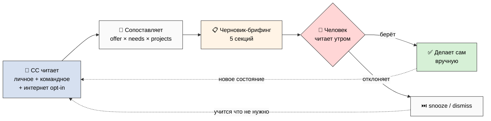

# Phase 6 — Что Claude Code делает за каждого раз в день ⭐⭐

> **Простыми словами.** Самая «вкусная» фича. Раз в день Claude Code делает обход за
> каждого участника: читает его личную систему и общее пространство, и приносит
> персональную подборку — с кем познакомиться, что подучить, какие проекты подходят, что
> нового в интернете по его темам. Это **всегда черновик**: CC ничего не делает за человека
> (не пишет сообщения, не записывает в проекты, не меняет навыки). Человек читает утром,
> выбирает что взять, делает сам. Как голосовой ввод — DRAFT-only.

---

## §1 🔄 Цикл одного дня (обратная связь без принуждения)

Это кибернетическая петля: система **наблюдает** состояние человека и команды,
**сопоставляет**, **предлагает** — а человек **решает**. Петля замыкается на человеке, не
на автомате.



[src: prompt §7 + Foundation Part 5 compound learning + systems-expert feedback loops]

---

## §2 📖 Что CC читает (раз в день, за одного человека)

Четыре источника, по убыванию приватности:

**1. Личная система участника** (с его согласия, настроено при онбординге):
- Активные проекты (топ-5)
- Активные гипотезы (топ-5)
- Записи на бирже offer/need (за 30 дней)
- Цели / POINT B
- Энергия / тренды пульса (Life Pulse)

**2. Командное состояние участника:**
- Активные роли в проектах
- Ожидающие решения (Decisions Queue)
- Активность на бирже

**3. Общее командное пространство:**
- Новые проекты (за 7 дней)
- Новые записи на бирже (за 7 дней)
- Изменения Charter / governance

**4. Внешнее (опционально, per-user opt-in):**
- Интернет-источники по темам гипотез человека (RSS / поиск / arxiv)
- События / конференции под его профиль
- Книги / статьи под текущие пробелы в навыках

[src: prompt §7.A]

---

## §3 📋 Что CC производит — черновик-брифинг

Персональный ежедневный брифинг (~300-500 слов), 5 секций:

```
📅 Ежедневный брифинг — [ИМЯ] — ГГГГ-ММ-ДД

🤝 3-5 знакомств
- @Другой участник (навыки X / проекты под твою потребность Y)
- ...

🎯 2-3 пробела в навыках
- На основе активного Проекта Z тебе пригодился бы навык A
- ...

🔄 3-5 находок на бирже
- Твоё предложение X подходит Проекту Y (открыта роль Inv-Time)
- Твою потребность Z закрывает участник W
- ...

🚀 1-3 новых проекта
- Проект [NAME] (Тип, Стадия) — открыта роль [role] под твои навыки
- ...

📖 1-3 находки из интернета (опционально)
- Статья: "..." (под гипотезу [name])
- Книга: "..." (под пробел в навыке [name])
- Событие: "..." (под профиль)

✅ Действия (ЧЕРНОВИК — посмотри и выбери)
- [ ] Написать @User про Проект [NAME]
- [ ] Обновить предложение навыка [skill]
- [ ] Прочитать статью [link]
```

**Объём по умолчанию:** 3-5 знакомств, 2-3 пробела, 3-5 находок на бирже, 1-3 проекта,
1-3 интернет-находки. Лимиты — чтобы не было шума (анти-пере-матчинг из Phase 4).

[src: prompt §7.B]

---

## §4 🚫 DRAFT-only — железная дисциплина

Самое важное правило фазы. CC **никогда** не делает действий за человека:

| ❌ CC НЕ делает | ✅ CC делает |
|---|---|
| не пишет сообщения участникам | предлагает «можешь написать @User» |
| не записывает в проект автоматически | показывает «подходит роль X» |
| не меняет навыки на бирже | напоминает «обнови предложение» |
| не отправляет ничего наружу | оставляет ссылку для ручного действия |

Человек читает брифинг утром → **выбирает** что взять → делает **сам**. Можно отклонить,
отложить (snooze), настроить под себя. Это прямой перенос **voice DRAFT-only** дисциплины:
машина готовит черновик, человек решает. R12: brief усиливает agency, не заменяет её.

[src: prompt §7.C + voice canon DRAFT-only + R12]

---

## §5 ⏰ Частота

- **По умолчанию:** 1 раз в день (утро)
- **Опционально:** недельный дайджест (воскресенье) — паттерны за 7 дней
- **Opt-out:** можно поставить на паузу / отключить полностью

Это одно из решений §9.E (Руслан выбирает: полный ежедневный / облегчённый 3×/нед).

[src: prompt §7.D]

---

## §6 🎲 Schelling-слой: подсветка точек схождения

Брифинг умеет показывать не только пары 1:1, но и **где когорта уже сходится** — мягкие
сигналы координации (focal points по Шеллингу), без насильной группировки:

- «**3 других участника** тоже хотят выучить навык X — можно собрать учебную группу»
- «**2 активных проекта** ищут похожие навыки — есть смысл объединиться»
- «Пульс когорты: **60%** копают гипотезу Y — кто-то мог бы стать PM совместного ресёрча»

Это из инсайта Gamified Platform: показываем, где люди уже сходятся, и даём им **самим**
решить. Никакого «вы назначены в группу». R12-выровненная геймификация: усиливает
координацию, не принуждает к ней.

**Soft-constraints (мягкие ограничения):** брифинг уважает «focus budget» — не вываливает
30 пунктов. Лимит 3-5 на секцию = anti-overload (из retention-механики «soft constraints /
energy gates» Gamified Platform).

[src: prompt §7.E + STRATEGIC-INSIGHT-GAMIFIED-PLATFORM Schelling + soft-constraints]

---

## §7 🛠️ Реализация (спека, НЕ создаём)

Описание для этапа реализации (Week 7), не код (R11):

- `tools/team_os_daily_brief.py` — главный скрипт
- Читает: Notion API (релевантные базы) + личные файлы (источник правды)
- Опционально: RSS / arxiv API / web search (per-user opt-in для внешних источников)
- Выход: страница «Daily Brief» в личном пространстве участника (DRAFT) + email (опционально)
- **Без хранения API-ключей в коде** (ключи в `private/`, per Global Rule 6)
- Config-driven, идемпотентный

[src: prompt §7.F + R11 + Global Rule 6]

---

## §8 🔒 Приватность и R12 в брифинге

Красные линии (наследуют изоляцию данных Phase 2):

- CC читает личную систему участника **только с его согласия** (настройка при онбординге)
- Внешние источники — **opt-in** per user
- **Нет cross-user утечки:** брифинг User A **не раскрывает** приватные данные User B.
  Если в брифинге A упомянут B — только то, что B сам **опубликовал** (его offer на бирже),
  не его личный Daily Log / гипотезы
- Steward имеет **аудит-доступ** (проверить, что брифинги не нарушают R12), но **не**
  granular cross-user просмотр личных данных

**На пальцах:** брифинг знает про тебя только то, что ты разрешил, и про других — только то,
что они сами выставили на витрину. Ничьи личные данные не «протекают» через чужой брифинг.

[src: prompt §7.G + Phase 2 data isolation + R12]

---

## §9 К Phase 7

Ежедневный обход спроектирован — с DRAFT-only дисциплиной и защитой приватности. Дальше —
**как новый человек входит в систему**: первая неделя по шагам, гайд по каждой роли,
этический документ про R12, ритуал онбординга. Это Phase 7 (recruitment-dynamics-expert
включается автоматически — формирование когорты).

*Phase 6 closure 2026-05-24. Цикл дня = кибернетическая петля замкнутая на человеке +
mermaid. CC читает 4 источника (личное/командное/общее/интернет-opt-in). Брифинг 5 секций
+ пример формата + лимиты anti-noise. DRAFT-only железно (НЕ/делает таблица). Частота 1×/день
+ недельный дайджест + opt-out. Schelling подсветка схождений + soft-constraints. Спека
скрипта (не код R11). Приватность: нет cross-user утечки + Steward аудит не granular.
gamification + systems lens. Style: PARTNER-OFFERING-HUMAN-LANG.*
