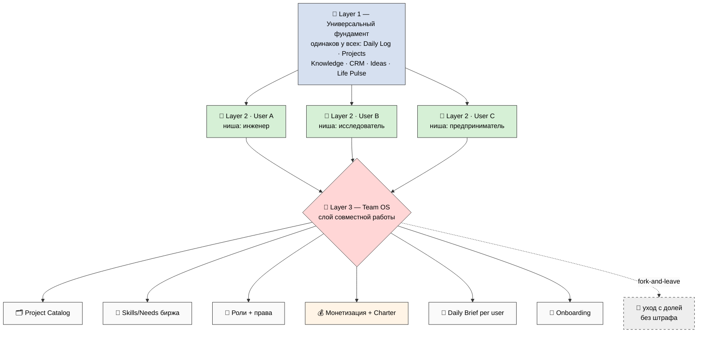
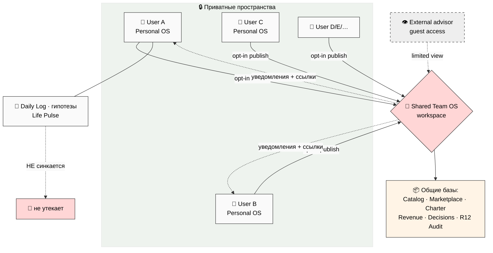
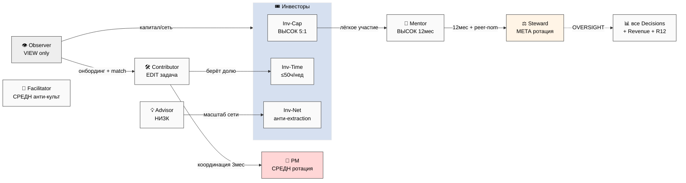
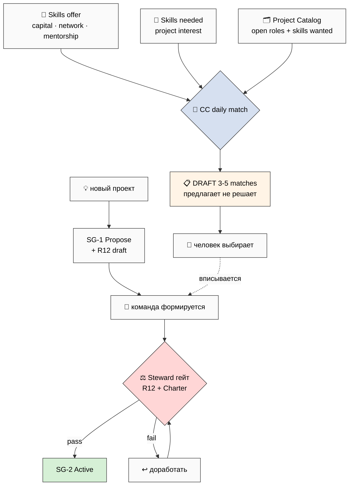
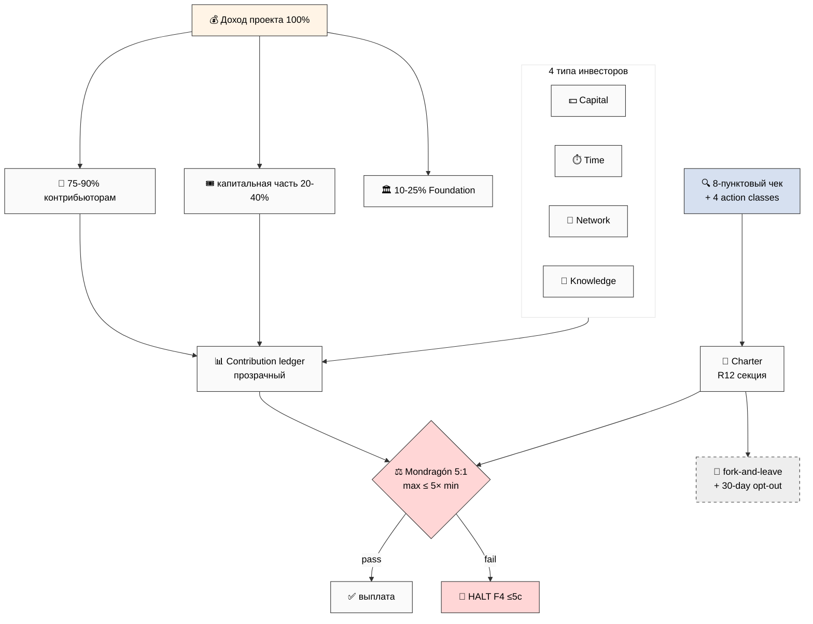
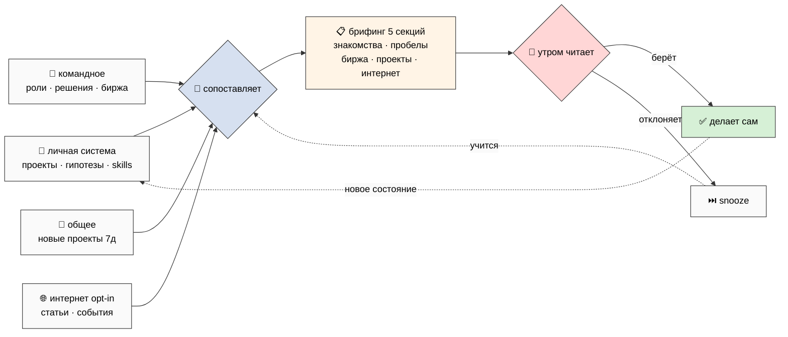
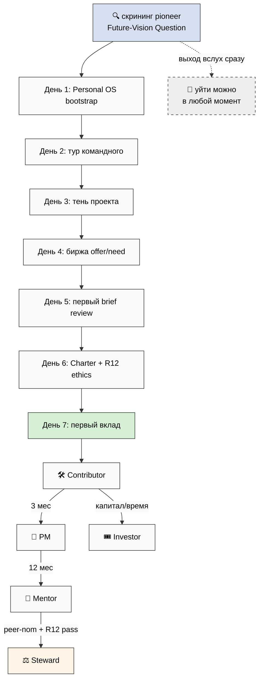

# Phase 8 — 7 схем Team OS (TM-1…TM-7)

> Светлый фон, читаемые без расширений, 12-22 узла каждая. Эти же схемы встроены в
> Main-документ. Каталог — `diagrams/_INDEX.md`.

---

## TM-1 — Три слоя архитектуры (Layer 1 + Layer 2 + Layer 3)

---

## TM-2 — Multi-tenant топология (N Personal OS ↔ Shared)

---

## TM-3 — 10 ролей + права + переходы

---

## TM-4 — Поток биржи (Catalog + Skills/Needs + matching + proposal)

---

## TM-5 — Решётка монетизации (4 инвестора + revenue + Charter + R12)

---

## TM-6 — Цикл ежедневного брифинга (read → produce → DRAFT → review)

---

## TM-7 — Онбординг + переходы во времени

*Phase 8 mermaid closure — 7 схем TM-1…TM-7, светлый фон, 12-22 узла каждая.*
