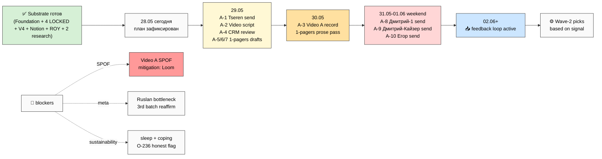

# 📋 Summary для Руслана — Action Plan 28.05

> **Ты слушаешь.** Три твоих голосовых 15:43 разобраны + интегрированы с substrate Sprint 25-27.05.
> Этот документ — пересказ что выяснилось + что делать + что блокирует. 15-20 мин чтения.
> Полная версия — `decisions/strategic/ACTION-PLAN-OUTREACH-FOCUS-2026-05-28.md`.

---

## Один абзац (если читаешь только это)

Substrate готов. Documents переходим в режим good-enough (per твои слова «нехуй дрочиться»). За
выходные пакуем essence-set (Video A «грубо» + 3 одностраничника: что мы предлагаем / charter-floor /
R12) и шлём 4-5 первых сообщений (Tseren — единственный existing-ready; Дмитрий-humanitarian;
Дмитрий-Кайзер; Егор Гиренко из Strategy Club). Цель — собрать обратную связь от умных людей, не
sale. **Top action прямо сейчас: Tseren letter polish + send (1-2h)** — это ломает «external-zero»
streak. **Top blocker: Video A не записан**, mitigation — Loom fallback OR text-only Tseren первым.
**Спать перед video-day обязательно** — твоё honest признание (O-236) что coping mechanisms «уже не
сильно помогают».

---

## Что нового в batch-17 (vs batch-16)

5 главных сдвигов:

1. **Outreach calendar конкретный.** Завтра (29.05) пакуем info → послезавтра (30.05) видео →
   выходные (31.05-01.06) плотный outreach. До этого было абстрактное «следующая неделя execute».

2. **Outreach контакты названы.** Дмитрий ×2 (humanitarian + Кайзер) + Егор Гиренко + 5-10 «довольно
   мощных». До этого был только Kaiser-first.

3. **Документы deprioritized.** «Нехуй дрочиться» — глубокая полировка отложена. Essence-set = Video
   A + 1-pagers + базовая концепция, good-enough для outreach. Глубокую полировку «более умные люди
   потом переделают». Это снимает накопление-trap (substrate уже плотный — пора Express, не Capture).

4. **Фундамент гранулирован 6 components.** Юридический + финансовый + документальный + команда +
   роли + обмен платежных средств. Можно сделать за 1 неделю если люди с опытом подключатся; без —
   2-3 недели. Главный вопрос для разговора с Дмитрием: «что значит этот фундамент / как сделать
   реально плотно / воронки».

5. **Energy frame re-stoked.** «Голод» как daily filter — каждое решение фильтровать через него.
   НЕ паника batch-15; structured mobilization with batch-16 calendar. Plus честный flag (O-236) что
   coping mechanisms (sleep deficit + курение) «уже не сильно помогают» — sustainability marker.

**Bottleneck reaffirm 3-й раз подряд** (b15 → b16 → b17) — ты сам узкое горлышко. Это stable
structural signal (6-й батч founder-transition arc подряд) — кандидат на Strategic Reflection prose
(R1, твоё письмо).

---

## Документы: 3 кучи

**🔴 CRITICAL (на этой неделе, ≤1.5 дней работы суммарно):**
1. **Tseren letter polish + send** (1-2h, ты) — ✅ draft готов; нужен Ruslan-prose tone pass + paste в Telegram
2. **Video A «грубо»** (half-day, ты) — script ~1-2h + запись one-take + minimal trim + upload
3. **Onboarding 1-pager** (2-3h, CC draft + R pass) — single page «что Jetix даёт партнёру/клиенту»
4. **Charter floor 1-pager** (2-3h, CC draft + R pass) — триада + R12 + уважение + fork-and-leave
5. **R12 публичное 1-pager** (2-3h, CC draft + R pass) — почему R12 не MLM, простым русским

**🟡 WAVE-1 enable (next 30 дней):** #4 Заработок polish · #5 Партнёры spec · #16 Хакатоны playbook
(SCC autonomous run, 1 day) · Klan Charter template (SCC, 1 day) · Anti-Dark-Patterns audit
materialized (R12 gate для game-mechanics + own-awards — half-day) · Build-P0 security sprint
(~€20-30/мес, 3-5d) · doctrine O-193 → Charter (1-2h) · Steuerberater outreach 1-2 vendors Берлин
(2-3h).

**🟢 DEFER (20 items в substrate, не блокирует outreach):** Master Plan Part 3-4 ($1T / NS) ·
game-mechanics implementation · cohort curriculum · first клан · on-chain R12 · и т.д. Per memory:
Network State trigger = $100K + 20+ workshops.

---

## Что делать (топ-15 actions, ordered by outreach unlock speed)

**P0 (24-48h, разблокирует first send):**
- A-1 Tseren send (1-2h) — единственный existing-ready
- A-2/A-3 Video A script + record (half-day total)
- A-4 CRM Wave-1 review (1-2h) — disambig Egor/Igor + add Прапион если найдёшь
- A-5/A-6/A-7 — 3 одностраничника в параллель (CC draft + R pass)

**P1 (3-5 days, разблокирует material для outreach):**
- A-8 Дмитрий-humanitarian send
- A-9 Дмитрий-Кайзер send (dual ask: advisor OR referral)
- A-10 Егор Гиренко send (Strategy Club)
- A-12 Дмитрий-talk prep (fundament 6 Q doc)

**P2 (Wave-1 enable, 7-30 дней):**
- A-13 Anti-Dark-Patterns audit MATERIALIZED (CC swarm, half-day)
- A-15 #4 Заработок polish (3-4h)
- A-17 Steuerberater outreach (2-3h)
- A-14 Build-P0 security sprint (3-5d, background)

**Критический путь:** A-1 → A-2 → A-3 → 1-pagers → 3 sends. **Длительность: 2-3 actual дня** (ты ~6h/day focused + CC parallel).

**Single-point-of-failure:** Video A recording. Mitigation = «грубо» + Loom fallback OR text-only Tseren.

---

## Outreach plan кратко

**Кому шлём (4-6 первых, weekend window):**
1. Tseren (МИМ Managing Partner) — answer на cold reject + voice-pipeline 1-2 страницы; draft READY
2. Дмитрий-humanitarian — Notion trial offer + feedback ask; LOW commit
3. Дмитрий Кайзер — dual ask: «помоги fundament-вопросы зафиксировать» OR «дай человека под крылышко»; cash-not-equity
4. Егор Гиренко (Strategy Club) — strategic consulting frame
5. Прапион (R12-bridge) — **GAP: не в CRM**, надо добавить first (defer P1)
6. Левенчук — defer (MIM-context sensitive, Aisystant нужен)

**Engineer-tier defer:** Karpathy / Buterin / Olah / Kaplan / Markov / Sapunov — нет channel; после Video A traction.

**Что говорим (frames per archetype):**
- Methodology — «extension + voice-pipeline; substrate open repo; не push»
- R12-bridge — «anti-extraction + Mondragón 5:1; structurally different from MLM»
- Engineers — «ROY 17 + FPF + Programmable Ethereum overlay»
- Sponsors/advisors — «Workshop + Hackathon platform; advisor scoped cash-not-equity»
- Tester — «trial offer; feedback critical для Build→Run gate»

**Universal NO:** «семья / захват / голод» recruitment framing · «самая безопасная сеть» superlative · push / FOMO · sales-pitch.

**Universal YES:** Substance > marketing · Founder-as-Exhibit · free goodbye · concrete artefact link.

---

## R1 decisions — 10 must-ack

1. Tseren send tomorrow OR ждать Video A? (recommend: ship)
2. Egor/Igor disambig — confirm Egor target?
3. Прапион CRM add — find contact OR defer P1?
4. Левенчук timing — first wave OR defer?
5. Outreach mode — solo OR CC drafts → paste?
6. Cash-not-equity advisory budget — €X/мес reasonable?
7. Video A fallback OK? (Loom 3-5 мин если record не вышло)
8. Sleep gate ACK? 7+h обязательно перед video day
9. Docs-deprioritized scope — все? OR keep CRITICAL polish?
10. Anti-Dark-Patterns audit — параллельно SCC OR после feedback?

---

## Mermaid overview

---

## Что ждёт ack

Прочитай 10 R1 вопросов выше. **Минимум для unblock:** ACK #1 (Tseren send), #7 (Video A fallback
OK), #8 (sleep gate). Остальные можно ack как идёшь.

После ack — top action picked → выполняешь A-1 → Tseren letter в Telegram → first feedback loop
active в течение 24-48h.

---

*Summary closure ≤1200 слов. Substantive, не MAX-density per Ruslan downshift. 10 R1 decisions
surface. R12 SATISFIED. Voice DRAFT-only. Pool result. Главное: SUBSTRATE ГОТОВ, ВЫХОДНЫЕ —
OUTREACH; bottleneck = ты сам (3-batch reaffirm); сон обязательно.*
