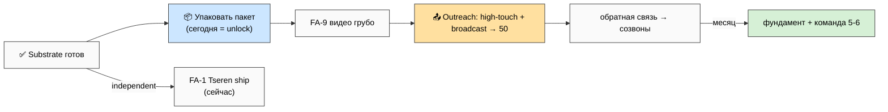

# 📋 Summary для Руслана — Voice Batch 18 + Forward Action Plan

> Прочитал твои 3 заметки (29.05 16:03, ~13 мин), вытянул все инсайты, собрал план действий. Ниже —
> три вещи: **что нового**, **что делаем дальше**, **какие документы упаковываем**. Без воды.

---

## 1. Что нового дали 3 заметки (6 сдвигов)

1. **3P-призма (продукты / процессы / проекты).** Новая рамка: смотреть на всё через эти три слова;
   жизнь каждого человека = его главный продукт; «ты управляющий своей жизнью, но другие люди/системы
   тоже хотят ею управлять». → Беру это как **точку входа в Overview** для партнёра («вот через какую
   призму смотреть»).

2. **Партнёрский pitch стал конкретным.** Ты проговорил что именно говорить Дмитрию-гуманитарщине и
   Дмитрий Кайзеру: «вот вся система, надо построить хороший фундамент (технический + финансовый +
   юридический), помоги проработать быстрее + опиши кто нужен». ⚠️ Один момент по R12: фразу «станешь
   миллионером, построишь корпорацию» в материалы НЕ кладу — это обещание богатства за рекрутинг, риск.
   Вместо — «вот чем полезно тебе и аудитории, обсудим честное партнёрство».

3. **«50 сообщений до конца недели».** Вчера было «4-6 первых отправок» — теперь 50. Это в 8-12 раз
   больше. Решаю это **двумя уровнями**: 4-6 персональных high-touch (Tseren / Дмитрий ×2 / Егор) +
   массовый канал (1-2 общих видео + пост в Mastrik club + 5-10 «мощных»). НЕ 50 одинаковых DM — это
   спам и репутационный риск. **Вопрос к тебе:** ок tiered, или хочешь по-другому?

4. **All-in / можно не работать.** Ты сказал «следующую неделю можно вообще не работать, Jobcenter не
   смотрим, деньги получим от партнёров». Это серьёзное личное-финансовое решение — вынес отдельным
   **R1 (твоё решение) + sustainability gate**: сначала проверь runway (на сколько хватает денег), и
   держим outreach в рамке «собираю обратную связь», а не «спасите деньгами».

5. **Месяц + команда 5-6 + делегировать всю рутину.** «Всё можно собрать за месяц если дать деньги +
   умного человека (команда 5-6); всё что можно отдать/рутинизировать — на хуй всё». → Делаю карту
   делегирования (что отдать) + очередь найма.

6. **Геймификация — конкретные механики.** Кубки, NFT, достижения как в Strava/играх. Это продолжение
   твоей идеи про награды (b17). → Перед любой реализацией прогоняю через **аудит анти-тёмных-паттернов
   (#15)** — чтобы не превратить в vanity-метрики / залипательную петлю. Механики в партнёрский пакет
   пока НЕ кладу (только упоминание концепта).

**Главный вывод:** сегодняшняя цель (упаковка базовых документов) — правильная. Нельзя идти к 50 людям
без пакета. **Упаковка = разблокировка всего остального.**

---

## 2. Что делаем дальше (top actions, по порядку)

**Сегодня:**
- **FA-1 — отправить письмо Tseren.** Черновик готов, не зависит от пакета, ломает «ноль наружу» прямо
  сейчас. Отправляй «грубо», не полируй до идеала. (1-2ч, ты)
- **FA-2 → FA-8 — упаковать пакет** из 5 базовых документов (см. п.3). Я (Cloud Cowork) делаю черновики,
  ты проходишь прозой по ключевым. (полдня-день параллельно)

**Завтра-послезавтра:**
- **FA-9 — записать 1-2 общих видео «грубо»** (one-take). Это разблокирует массовый уровень outreach.
  ⚠️ Сначала выспись (7+ч) — это обязательное условие.
- **FA-12/13/14 — high-touch отправки:** Дмитрий-гуманитарщина + Дмитрий Кайзер (разговор про фундамент
  + advisor) + Егор (стратегическое управление).
- **FA-15 — массовый канал:** пост в Mastrik club + видео + 5-10 «мощных» → к цели 50.

**Фоном (параллельно, я делаю):**
- **FA-17** — аудит анти-тёмных-паттернов (gate для геймификации).
- **FA-18** — карта делегирования + очередь найма.
- **FA-19** — решение all-in (твоё, surface).

**Критический путь:** упаковка пакета → видео → high-touch отправки → обратная связь (~2-3 рабочих дня).
**Узкое место:** запись видео (как и вчера). Запасной вариант: Loom 3-5 мин или текст + пакет.

---

## 3. Какие документы упаковываем (партнёрский пакет)

5 базовых (первый показ) + 2 для углубления. Цель — «вот что строю, вот как устроено». НЕ продажа.

| # | Документ | Что | Время |
|---|---|---|---|
| **P-1** | **Jetix Overview** (через 3P-призму) | «Что это»: мастерская + сеть + метод | 2-3ч |
| **P-2** | **Метод** | «Как работаем» с информацией/методами/AI | 2-3ч |
| **P-3** | **16 directions карта** | «Масштаб + структура» | 1-2ч |
| **P-4** | **Ценности + R12 обещание** | «Что гарантирую» (anti-extraction + fork-and-leave + уважение) | 2-3ч |
| **P-5** | **Как участвовать** | «Твоя роль» + как войти/выйти | 2ч |
| P-6 | Видео-обзор 1-2 «грубо» | async (= FA-9) | полдня |
| P-7 | Fundament status | для разговора с Дмитрием (что есть/строим/где помощь) | 1ч |

**Путь чтения для партнёра (~15 мин):** Overview (что) → Метод (как) → 16 directions (масштаб) →
Ценности (доверие) → Как участвовать (роль) → дальше видео / разговор про фундамент, или «free goodbye».

**Где живёт:** папка `partner-package/` в repo (источник) + Notion-страница (для удобного показа) +
ссылка на видео.

---

## 4. Что от тебя нужно (8 решений — см. §5 main doc)

Главные: (1) tiered 50-msgs ок? (2) all-in — проверил runway? (3) Tseren сегодня? (4) «миллионер» НЕ в
материалах — confirm? (5) геймификация через #15 audit — ок gate?

---

*Summary closure. Полная версия — `decisions/strategic/FORWARD-ACTION-PLAN-2026-05-29.md`. Voice insights
— `VOICE-BATCH-18-INSIGHTS-2026-05-29.md`. Pool result — читаешь → ack решения → идёшь выполнять. Foundation
не тронут.*
