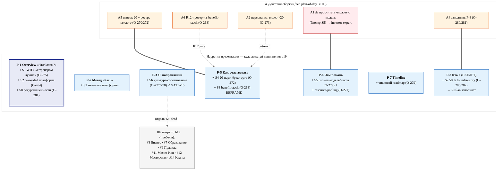

# B19-2 — куда дополнения b19 ложатся в нарратив презентации

```mermaid
%%{init: {'theme':'base','themeVariables':{'background':'#ffffff','primaryTextColor':'#000','textColor':'#000','lineColor':'#666','primaryBorderColor':'#333','primaryColor':'#fafafa','fontFamily':'Inter, system-ui, sans-serif'}}}%%
graph TB
    subgraph NARR["🎤 Нарратив презентации — куда ложатся дополнения b19"]
        direction TB
        P1["<b>P-1 Overview</b> «Что/Зачем?»<br/>+ S1 WHY «с тренером лучше» (O-275)<br/>+ S2 two-sided платформа (O-264)<br/>+ S8 рекурсия ценности (O-281)"]
        P2["<b>P-2 Метод</b> «Как?»<br/>+ S2 механика платформы"]
        P3["<b>P-3 16 направлений</b><br/>+ S6 культура-соревнование (O-277/278) ⚠️GATE#15"]
        P5["<b>P-5 Как участвовать</b><br/>+ S4 20-партнёр когорта (O-272)<br/>+ S3 benefit-stack (O-268) 🔶REFRAME"]
        P6["<b>P-6 Чем помочь</b><br/>+ S5 бизнес-модель/числа (O-279) ⭐<br/>+ resource-pooling (O-271)"]
        P7["<b>P-7 Timeline</b><br/>+ числовой roadmap (O-279)"]
        P8["<b>P-8 Кто я</b> (СКЕЛЕТ)<br/>+ S7 500h founder-story (O-280/282)<br/>← Ruslan заполняет"]
    end

    subgraph ACT["⚙️ Действия сборки (feed plan-of-day 30.05)"]
        direction TB
        A1["A1 ⚠️ просчитать числовую модель<br/>(блокер S5) → investor-expert"]
        A2["A2 персонализ. видео ×20 (O-273)"]
        A4["A4 заполнить P-8 (O-280/281)"]
        A5["A5 список 20 + ресурс каждого (O-270/272)"]
        A6["A6 R12-проверить benefit-stack (O-268)"]
    end

    A1 ==> P6
    A4 ==> P8
    A5 ==> P5
    A6 -.->|R12 gate| P5
    A2 -.->|outreach| P5

    GAP["📌 НЕ покрыто b19 (пробелы):<br/>#3 Бизнес · #7 Образование · #9 Правила<br/>#11 Master Plan · #12 Мастерская · #14 Кланы"]
    P3 -. отдельный feed .-> GAP

    classDef pdoc fill:#e3f2fd,stroke:#1565c0,color:#000
    classDef pwhy fill:#e8eaf6,stroke:#283593,color:#000,stroke-width:3px
    classDef act fill:#fff3e0,stroke:#e65100,color:#000
    classDef block fill:#ffebee,stroke:#c62828,color:#000
    classDef gap fill:#f5f5f5,stroke:#999,color:#000

    class P1 pwhy
    class P2,P3,P5,P6,P7,P8 pdoc
    class A2,A4,A5,A6 act
    class A1 block
    class GAP gap
```
