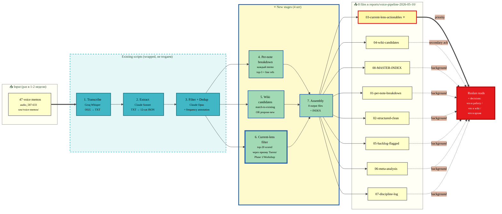

# 🎬 Voice Pipeline Plan — на человеческом языке

> **Что это.** Сопроводительный документ к [PLAN.md](PLAN.md) (PLAN — техничный, на CC языке). Здесь то же самое, но **на человеческом** + **схема как работает** + **before/after сравнение**. Чтобы ты прочитал и решил — ack или нет.

---

## 🟢 TL;DR — суть плана в 3 предложениях

1. **Старый pipeline сломался** на последнем прогоне (01.05): выдал 1 MB каши с дубликатами 5-10×, потому что filter.py упал на batch 13 из 17, и финальный dedup не запустился.
2. **Новый pipeline = 7 шагов** где первые 3 это existing скрипты обёрнутые правильно (transcribe → extract → filter), а **4 новых стадии** (per-note breakdown / wiki candidates / current-lens filter / multi-output assembly) дают **8 чистых файлов** вместо одной каши.
3. **Главная фича для тебя** — `03-current-lens-actionables.md` — топ-20 items отфильтрованных через **«призму текущего фокуса»** (Цэрэн / видео / Phase 1 / 1A/1B / Workshop / TRM) с scoring formula. Это и есть то что тебе **сразу в работу**.

---

## 🔴 ЧТО БЫЛО ДО (review_2026-05-01-*) — почему «каша»

### 7 конкретных проблем что нашёл server CC:

| # | Проблема | Что произошло |
|---|---|---|
| W.1 | **Дубликаты 5-10×** | filter.py упал на batch 13/17 (rate limit), partial-save survived но финальный merge не запустился. Items #1, #11, #134 — одинаковый текст, повторённый 3× в одной таблице. ≈100+ identical items в 3,109 rows |
| W.2 | **Provenance opaque** | Citations типа `audio_393@09-04-2026_04-00-41` существуют, но **нельзя кликнуть** — нет ссылки на строку в transcript, нет audio timestamp. STRUCTURED variant добавил line refs только для 5 тем |
| W.3 | **Категории incomplete** | 12 категорий extract, но **«Решения» никогда не имели свою top-level view**, **«claim»** не было как отдельная категория, **«contradiction»** есть только в meta-analysis aggregate |
| W.4 | **Per-memo group abandoned** | 1 MB файл = 3,109 строк сплющены в одну гигантскую таблицу из 197 memos. Discovery = grep only. DEEP variant имел per-memo § но не масштабировался |
| W.5 | **Нет frequency signal** | Если «Описать целевых людей» появилось в 8 memos за 5 дней — это **сильный сигнал**. Текущий pipeline трактует каждое появление как **изолированную строку**. Тебе невозможно увидеть «эта тема всплывает 8 раз» |
| W.6 | **CRM auto-drafts засоряют** | extract.py auto-генерирует `crm/people/<slug>-DRAFT.md` для любого имени в memo. И это **смешано с реальным content review** — Ilon Mask draft + Dima draft появляются вперемешку с ideas |
| W.7 | **DEEP scale-break** | DEEP вариант (112 KB для 10 memos) показал правильную структуру, но линейный scale на 197 memos = ~2 MB. Unreadable |

### Цена — Ruslan получал каша + терял время + пропускал важное

---

## 🟢 ЧТО БУДЕТ ПОСЛЕ (новый pipeline) — 7 stages → 8 files

### Stage-by-stage на человеческом:

| # | Stage | Что делает | Главное отличие |
|---|---|---|---|
| 1 | **Transcribe** | OGG voice → TXT transcripts (Groq Whisper) | Existing — wrap. Idempotent (skip если уже сделано) |
| 2 | **Extract** | TXT → structured items по 12 категориям (JSON) | Existing — wrap. **Validator** добавляет `nothing-extractable` если memo пустой |
| 3 | **Filter + Frequency** | Dedup + аннотация «item появился в memos: [список]» | **Improved** — frequency annotation = знаешь что часто всплывает |
| 4 | **Per-note breakdown** ⭐NEW | Каждый memo получает свою §-секцию: timestamp, длина, top-3 items, link на line в transcript | Cleaner navigation — листаешь по memo, не grep'ишь 1 MB |
| 5 | **Wiki candidates** ⭐NEW | Каждый relevant item: `match-to-existing` (с path к wiki page) ИЛИ `propose-new` (с новым slug) | **НИКОГДА не пишет в wiki/ автоматически** — только candidate список → отдельный твой ack |
| 6 | **Current-lens filter** ⭐⭐⭐NEW | Топ-20 items scored через 4-component formula | **Главная фича** — сразу видишь что в работу под текущий фокус |
| 7 | **Multi-output assembly** | Собирает 8 output файлов из всех предыдущих stages | Вместо «1 MB каша» — 8 отдельных clean файлов |

### Stage 6 формула scoring (важная, понимать):

```
relevance = 0.40 × keyword_match
          + 0.35 × semantic_distance
          + 0.15 × workshop_element_weight
          + 0.10 × recency_vs_canonical
```

**Threshold ≥0.60** — items ниже отсеиваются.

**Lens anchors (через что фильтруем):**
- 🔴 Tier 1 (high relevance) — `Tseren / Цэрэн / видео Цэрэну / synergy / ШСМ / Levenchuk / $100K / Phase 1 / Workshop / TRM / Foundation v1.0 / 1A / 1B / 8-step roadmap / L0-L5 / Mittelstand / Reed's Law`
- 🟡 Tier 2 (medium) — methodologies / AI leverage / KM / client engagement / partner role
- 🟢 Tier 3 (low) — long-term vision / anti-pattern / personal development

Каждый top-N item получает: **provenance + score breakdown + 1-sentence rationale + linkage к шагу 1-8 roadmap**.

---

## 📦 8 DELIVERABLE FILES — что в каждом

```
reports/voice-pipeline-2026-05-10/
├── PLAN.md                          (technical plan от server CC)
├── EXPLAINED-FOR-RUSLAN.md          (этот файл)
├── 00-MASTER-INDEX.md               👈 старт навигации
├── 01-per-note-breakdown.md         👈 каждый memo с top-3 + line refs
├── 02-structured-clean.md           👈 deduplicated by category
├── 03-current-lens-actionables.md   ⭐⭐⭐ TOP-20 для тебя СРАЗУ
├── 04-wiki-candidates.md            👈 match-to-existing / propose-new
├── 05-backlog-flagged.md            👈 deferred + CRM drafts (no auto-promote)
├── 06-meta-analysis.md              👈 themes / contradictions / patterns
└── 07-discipline-log.md             👈 quality criteria pass/fail
```

**Total ≤500 KB** (vs 1 MB каша). Каждый файл scoped + navigable.

**Что ты будешь читать:**
1. **00-MASTER-INDEX** — 1 paragraph per file → ориентируешься
2. **03-current-lens-actionables** ⭐ — 20 items для immediate work (видео Цэрэну + Phase 1)
3. **04-wiki-candidates** — что добавить в wiki (твой ack отдельно)
4. **06-meta-analysis** — паттерны / темы / контрадикции
5. (Optional) **01-per-note-breakdown** — если хочешь deep dive по конкретному memo
6. (Optional) **05-backlog-flagged** — что отложил и почему

---

## 🎨 Как работает pipeline — диаграмма



---

## 🟡 7 Open Questions — что решать перед Phase 2

Server CC задаёт 7 вопросов с **defaults**. Можешь сказать «**all defaults**» или override отдельные.

| # | Вопрос | Default | Альтернативы | Trade-off |
|---|---|---|---|---|
| §6.1 | Top-N в current-lens? | **20** | 10 (tighter) / 50 (broader) | 20 fits ~15 KB, 50 risks dup с structured-clean |
| §6.2 | Wiki match threshold? | **0.7** | 0.5 (more matches, false positives) / 0.85 (fewer, near-only true) | 0.7 hits ≥30% match target |
| §6.3 | Consensus threshold (frequency)? | **≥3 memos** | ≥2 (noisier) / ≥5 (only strong) | ≥3 captures persistent thinking |
| §6.4 | Verbatim quotes vs summaries? | **Top-3 summaries + 1 quote если memo >5 min** | Summaries-only (smaller) / DEEP-style all quotes (larger 150 KB risk) | Default = ≤80 KB cap |
| §6.5 | Audio timestamps (e.g. `18:12-18:47`)? | **NO** для Phase 2 | YES (требует modify transcribe.py — out of scope) | Phase 3 extension если хочешь позже |
| §6.6 | CRM auto-drafts? | **List в backlog, не auto-promote** | Aggressive sweep + delete unused drafts | Default conservative — твоё решение что делать |
| §6.7 | Idempotency на restart? | **Resume** (existing partial-save) | `--restart` flag для clean run | Resume saves time |

### 💡 Моя рекомендация — «**all defaults**»

Все 7 default'ов разумны. Особенно **§6.5 NO для audio timestamps** — это потребует modify transcribe.py (out of scope), Phase 3 если нужно. И **§6.4 default** = balance между readability и size cap.

**Если что-то менять** — обращу внимание:
- §6.1 — может стоит поднять до 30 если у тебя много накопилось ideas (47 memos = 300-1500 raw items)
- §6.6 — если знаешь что CRM drafts мусор → можно aggressive sweep

Но default'ы безопасны.

---

## ⏱️ Time / Size Budget

- **Phase 1 (planning):** ✅ done (5 min 54 sec)
- **Phase 2 execution:** 1.75-3 hours autonomous
  - Stage 1 (transcribe): 10-25 min (idempotent skip если cached)
  - Stage 2 (extract): 15-35 min
  - Stage 3 (filter + dedup): 15-25 min
  - Stage 4 (per-note breakdown): 20-35 min
  - Stage 5 (wiki candidates): 20-35 min
  - Stage 6 (current-lens filter): 15-25 min
  - Stage 7 (assembly + INDEX): 10-15 min
- **Total deliverable folder:** ≤500 KB (vs 1 MB каша)

---

## ✅ Constitutional check (важное про дисциплину)

| Anchor | Что значит |
|---|---|
| **Tier 2 R1** (no AI strategizing) | AI extracts + structures. **AI не decide** что в работу — **ты решаешь**. Phase 2 outputs = scribing artifacts |
| **Tier 2 R2** (no architectural changes без gate) | **Two-gate workflow:** Phase 1 ack → Phase 2 → ack → optional merge. Wiki writes = **третий ack** отдельно |
| **Tier 2 R6** (provenance) | Каждый item cited к memo:line. discipline-log final |
| **Append-only** | Existing review_2026-05-01-*.md preserved — НЕ удаляются |
| **Default-Deny** | Без твоего ack — Phase 2 НЕ запустится. Без ack wiki candidates — wiki НЕ обновится |

**Главное для тебя:** wiki/ **НИКОГДА не пишется автоматически**. CC только генерирует **список proposals** в `04-wiki-candidates.md`. Ты читаешь → ack → потом merge.

---

## 🟢 Что нужно от тебя сейчас

### Простой вариант (рекомендую):

```
ack — execute plan, all defaults
```

→ Server CC запускает Phase 2 (1.75-3 hours autonomous).

### Если хочешь override:

```
ack — execute plan
§6.1 → N=30
§6.6 → aggressive sweep CRM drafts
all other defaults
```

### Если хочешь iterate plan:

Скажи что менять / что добавить в дизайне → я передам server CC → он revise → re-ack.

---

## 📋 Что будет после Phase 2

1. CC pushes 7 новых файлов в `reports/voice-pipeline-2026-05-10/` на свою ветку
2. CC signals тебе с branch + commit SHA + self-eval verdict
3. Я подтяну → дам тебе compact verdict (что в `03-current-lens-actionables.md` — топ items для immediate work)
4. Ты читаешь → решаешь:
   - Что в видео Цэрэну (по current-lens items)
   - Что в wiki (ack `04-wiki-candidates.md` items)
   - Что в backlog (мониторишь `05-backlog-flagged.md`)
5. Едем делать видео + wiki updates + plan на ближайшее будущее

---

**Готов отвечать вопросы или передавать ack-команду server CC.**
