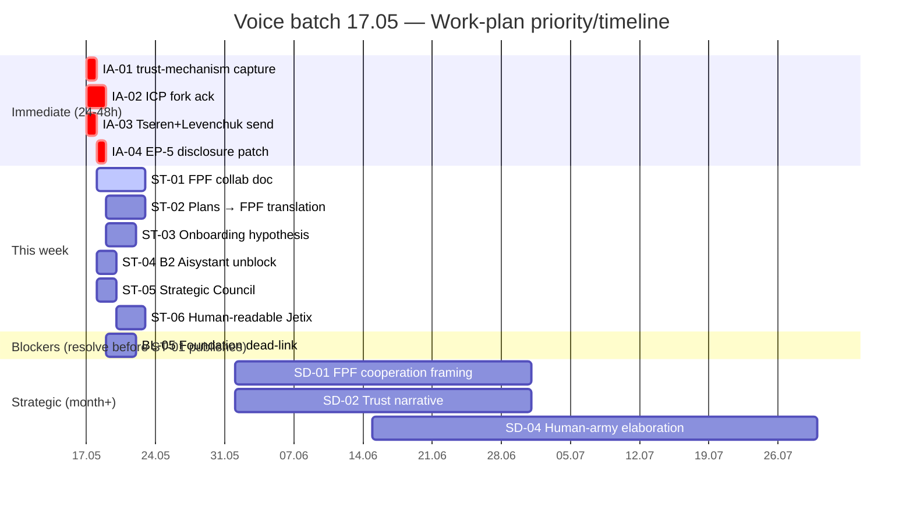

# Voice batch 17.05 — Detailed Work Plan

> **Brigadier integration.** Mgmt × integrator drafted core work-plan; engineering × integrator surfaced 4 cross-cell work items (MQ-1..MQ-4); philosophy × critic calibrated hyperbolic claims (audio_670/673 «миллионы евро», «универсальный язык» = affect-mode, not factual). All affect-amplified claims demoted to F2; concrete actions preserved.

> **R1 surface-only.** No new strategy authored. Action items = voiced или immediate-derivative. Ruslan ack required per category §5.

> **Cross-ref Phase 0 §QR-CARD critical blockers (4):** all 4 carried forward — LIVE-FLAG ICP / EP-5 disclosure / B2 Aisystant / Tseren+Levenchuk outreach (7 days elapsed). **Voice batch reinforces urgency на 3 из 4** (audio_672-673 articulate L1 collaboration as near-term).

---

## §0 TL;DR (≤200 слов)

Batch period 16.05 13:46 → 17.05 22:00. Voiced actions кластеризуются вокруг трёх направлений:
1. **L1 collaboration prep** — единый FPF-документ для совместной работы с Левенчуком/Цэрэном; перевод существующих планов на FPF (audio_672 + audio_673)
2. **Onboarding hypothesis** — «3-hour onboarding via FPF» — falsifiable claim, нужен write-up + test design (audio_673)
3. **Trust-mechanism insight capture** — H8 Hexagon candidate / standalone insight (text_001)

**Counts:** 4 immediate / 6 short-term / 6 strategic / 6 blockers (4 carried + 2 new) / 6 decisions / 4 new kasha flags. **0 new projects confirmed** — все voiced directions fold в existing 8 active или wiki entries.

**Critical-path:** IA-02 (ICP fork ack) + IA-03 (outreach send) + IA-04 (EP-5 disclosure) — все 3 блокированы воздухом, не technically. Ruslan execution required.

---

## §1 Immediate actions (24-48h) — критичные

| # | Action | Source | Cross-ref | Owner | Priority |
|---|---|---|---|---|---|
| **IA-01** | **Зафиксировать trust-mechanism insight** — записать text_001 как standalone wiki entry или H8 candidate в wiki (no autonomous promote — Tier B candidate per Stage 4) | text_001 core claims §1-§8 | O-09 H8; O-11 R12; O-13 Clan; D-02 | Ruslan ack → brigadier writes wiki draft | P1 |
| **IA-02** | **Резолвить LIVE-FLAG ICP** (Doc 1B §7 Mittelstand vs ACTION-PLAN Online-first) — voiced как implicit blocker через L1 collaboration framing | §QR-CARD blocker 1; CR-01; D-01 | XD-01; affects ST-01, ST-06 | Ruslan ack (стратегическое R1) | P1 |
| **IA-03** | **Status-check / send Tseren + Levenchuk outreach** — 7 дней elapsed; outreach files exist со статусом `scribe-structurer-output-NOT-final` | §QR-CARD blocker 4; CR-06; ST-01 | SA-06; DF-04; audio_673 L1 priority | Ruslan execution | P1 |
| **IA-04** | **EP-5 F-grade disclosure patch** — system-wide disclaimer «Jetix F8 ≠ FPF B.3 F8» в L1-facing materials перед next send | §QR-CARD blocker 2; CR-07 | OQ-MASTER-3; OQ-T4-10 | Ruslan ack → brigadier writes | P1 |

---

## §2 Short-term (this week)

| # | Action | Source | Cross-ref | Owner | Priority |
|---|---|---|---|---|---|
| **ST-01** | **Единый FPF-документ для L1 collaboration** (Левенчук, Цэрэн) — «один source of truth, потом переводы на человеческий» | audio_672:mid; audio_673:mid («составить надо какой-то вот единственный документ на FPF») | O-01; O-03; O-09 Hexagon; D-03 | Ruslan author + brigadier draft support | P1 |
| **ST-02** | **Перевести существующие планы на FPF** — voiced «прямо сейчас составить план по FPF» | audio_673:mid («тоже перевести как-то на fpf язык») | O-03; O-10 TRM; Phase 0 reports as input | Brigadier dispatch eng+mgmt cells | P2 |
| **ST-03** | **Onboarding-via-FPF hypothesis write-up** — «3h vs 3-4 weeks» falsifiable | audio_673:end («за три часа можно влиться... надо ещё зафиксировать») | O-04; O-05; O-09 Hexagon; D-04 | Mgmt draft → Ruslan ack | P2 |
| **ST-04** | **B2 Aisystant unblock** — purchase decision; unblocks C3 IWE comparisons + C4 benchmark | §QR-CARD blocker 3; D-1 master doc | OQ-MASTER-9 | Ruslan external purchase | P2 |
| **ST-05** | **Strategic Council statusов** — 7-day window истёк 2026-05-10 → 17; L1 collaboration voiced как near-term | CR-05; ST-02 kasha | SA-07; OQ-T4-8 | Ruslan formal decision (proceed/defer) | P2 |
| **ST-06** | **Human-readable Jetix description for L1** — voiced «потом ещё на человеческом языке инструкцию» | audio_673:mid-end | O-12 Brand; EP-5 disclosure inclusion required | Ruslan author + brigadier support | P2 |

---

## §3 Strategic (month+) / Phase C / future directions

| # | Direction | Source | Cross-ref | Stage gate |
|---|---|---|---|---|
| **SD-01** | **«FPF как язык кооперации» позиционирование Jetix** — нанимаем звёзд + даём FPF + усилитель → синергия | audio_673:end | O-05; O-06b ROY swarm; O-14 meta-workshop | Phase C — requires O-05 distributable + partnerships |
| **SD-02** | **Trust-mechanism shift strategic narrative** — FPF + open data + role-based → replace/augment money signaling | text_001:§2 | O-09 H8 candidate; O-11 R12; O-13 Clan | Strategic insight — Ruslan ack D-02; Phase C articulation |
| **SD-03** | **Мета-сообщества на «рельсах» Jetix** — Jetix как «дорога»; страны/государства следуют | audio_670:end | O-13 Clan; O-14 meta-workshop; O-02 Corp vapor | Phase D — requires O-13 activation first |
| **SD-04** | **«Человек-армия» — self-managing system** — разработчик + потребитель в одном лице | audio_669:mid | O-01 substrate; life-os project (P3) | Phase B internal — связь с SELF-MANAGEMENT-SYSTEM-SPEC-v0 |
| **SD-05** | **Gaming team ontology research** — «закинуть в систему», источник для O-09 NQD-CAL alternatives | audio_671 | O-05; O-09 Hexagon; engineering-thinking P3 | Research task — scoped |
| **SD-06** | **«Новый порядок системных мыслителей / Jetix users»** — community category поверх FPF | text_001:§2 p.4 | O-13 Clan archetypes; O-14 | Phase C+ — deferred until O-13 activation |

---

## §4 Blockers (что мешает прямо сейчас)

| Blocker | Source | Affected items | Cross-ref |
|---|---|---|---|
| **BL-01 LIVE-FLAG ICP fork** — Doc 1B §7 Mittelstand vs ACTION-PLAN Online-first | §QR-CARD blocker 1; audio_672-673 voiced L1 outreach | IA-02; ST-01; ST-06; D-01 | CR-01; XD-01; 7+ days |
| **BL-02 EP-5 F-grade disclosure absent** — Jetix F8 claims misleading для L1 | §QR-CARD blocker 2 | IA-04; ST-01; ST-06 | CR-07; OQ-MASTER-3 |
| **BL-03 B2 Aisystant subscription** — C3 IWE BLOCKED; comparisons limited | §QR-CARD blocker 3 | ST-04; D-1 | C3 BLOCKED |
| **BL-04 Tseren/Levenchuk outreach not sent** — 7 days; collaboration intent clear voice | §QR-CARD blocker 4; audio_672-673 | IA-03; ST-01 | SA-06; DF-04 |
| **BL-05 Foundation dead-link systemic** — 13 Foundation Parts sources[] ref `design/JETIX-FPF.md` (archived 2026-05-06); FPF-grounded work risks broken provenance | CR-02; L-05; PF-04 kasha | ST-02 (FPF translation depends on clean provenance) | AWAITING-APPROVAL packet needed |
| **BL-06 active-projects.json stale 33 дня** — «8 active» vs 1 in JSON vs 0 wiki/projects/ | CR-09; PP-01..07 | Any project tracking for new voiced work | SA-02; C-05 |

---

## §5 Decisions needed (Ruslan ack required)

| Decision | Source | Affected items | Why ack required |
|---|---|---|---|
| **D-01 ICP canonical** — Mittelstand KEEP/UPDATE vs Online-first canonical | §QR-CARD; audio_672 L1 framing | BL-01; IA-02; O-10 TRM | Стратегическое R1; меняет TRM demand-narrative + L1 outreach |
| **D-02 text_001 placement** — H8 Hexagon candidate / standalone strategic-insight / deferred reflection | text_001; audio_673 | IA-01; O-09; O-11; O-13; OQ-V17-1 | Категоризация нового insight (R1); affects Hexagon count drift XD-03 |
| **D-03 L1 collaboration doc authorship** — brigadier draft → Ruslan compose OR Ruslan direct? | audio_672-673 | ST-01 | Part 11 §A.1 prose_authored_by: ruslan OR hybrid-with-ack-trail |
| **D-04 Onboarding hypothesis formalize** — wiki claim with F-G-R OR voiced-only? | audio_673:end | ST-03 | Wiki promotion = Part 6a F-G-R required |
| **D-05 Legacy 12-agent roster status** — депрекировать / архивировать / оставить declared? | OQ-T4-4; audio_672-673 team-building voiced | OQ-MASTER-7; FVA-01 | Architectural; CLAUDE.md change requires R1 |
| **D-06 Phase namespace cleanup** — cleanup перед L1 publication / add prefix convention / defer | PH-01..08 kasha; audio_672 «следующим делать» | ST-01; ST-06 | Affects L1 legibility |
| **D-07 NC-1 Trust Infrastructure** (new in this batch) — O-21 new object / sub-aspect O-11 / sub-aspect O-13 | text_001; OQ-V17-2 | O-09 H8; O-11 R12; O-13 Clan | Architectural classification (R1) |
| **D-08 NC-2 «Дорога» re-frame** (new in this batch) — O-05 re-typing OR rhetorical only | audio_670; SD-2; OQ-V17-3 | O-05 FPF primitive (A.3.2 vs A.6.1) | Affects O-05 typology |

---

## §6 Cleanup actions (káša-fix surface'нутые)

### Existing kasha categories reinforced
- **CR-02 / L-05 Dead-link Foundation** — ST-02 makes more acute (FPF translation depends on clean provenance). 13 Foundation Parts need AWAITING-APPROVAL patch для sources[].
- **CR-01 ICP fork** — повторно voiced-critical через L1 collaboration (audio_672-673). Escalates IA-02.
- **CR-06 / CR-05 Tseren/Levenchuk + Strategic Council overdue** — voice batch ровно про L1 collaboration as near-term; work-plan-critical not theoretical.
- **SA-06 outreach send tracking** — voice batch reinforces urgency.

### Новые kasha flags (не были в 04-kasha-cleanup-flags)
- **NEW-K-01** — Oscar Hartmann named (audio_673) without CRM entry. /crm-add candidate (D-07 cascade; Ruslan decides).
- **NEW-K-02** — «нанимаем звёзд» (audio_673) Phase C+ hiring intent voiced без hiring-process doc / criteria. Tracking gap.
- **NEW-K-03** — Gaming ontology «закинуть в систему» (audio_671) — vague action; no project tie. AP-MGMT-3 flag.
- **NEW-K-04** — Macro-societal content audio_669/670 (государства/общества/«обезьяны») does NOT map to 8 active projects. D-MGMT-VOICE-1 routing ambiguity → Ruslan decides.

---

## §7 New project candidates

| Candidate | Source | Status | Why folds into existing |
|---|---|---|---|
| FPF Collaboration Layer | audio_672-673 | voiced intent | Sub-task of ST-01; possibly folds into brand P2 OR quick-money P1 (client FPF onboarding) |
| Trust Mechanism Capture | text_001 | wiki entry candidate | Folds into O-09 Hexagon (H8) OR standalone insight; D-02 decides |
| Onboarding-via-FPF | audio_673:end | voiced hypothesis only | Folds into ai-tools P2 OR quick-money P1 OR engineering-thinking P3 |

**Brigadier verdict.** 0 new projects strongly indicated. All voiced directions fold into existing 8 active OR wiki entries. **No new project row recommended without D-02 + D-03 + D-07 ack.**

---

## §8 Timeline / priority matrix

**Priority matrix (impact × urgency):**

| Item | Impact | Urgency | Quadrant |
|---|---|---|---|
| IA-02 ICP fork | High (L1 credibility) | Critical (7+ days) | Do first |
| IA-03 Outreach send | High (revenue path) | Critical (7+ days) | Do first |
| IA-01 trust capture | Medium (insight) | High (text_001 today) | Do first |
| IA-04 EP-5 disclosure | High (L1 credibility) | High (pre-send blocker) | Do first |
| ST-01 FPF collab doc | High (L1 partnership) | This week | Schedule |
| ST-04 B2 Aisystant | Medium (unblocks C3) | This week | Schedule |
| BL-05 Foundation dead-link | Medium (provenance) | This week | Schedule |
| SD-01..SD-06 | High (Phase C) | Month+ | Plan |

---

## §9 Dissents preserved (per AP-6)

- **D-MGMT-VOICE-1.** Macro-societal audio_669/670: reflection OR Phase C precursor? Mgmt не классифицирует — Ruslan decides.
- **D-MGMT-VOICE-2.** audio_671 «изучить и закинуть» = vague; concrete'ization needed → NEW-K-03 flag.
- **D-MGMT-VOICE-3.** ST-01 / ST-02 могут collapse в одно действие — оставлены раздельно pending Ruslan scoping.
- **D-MGMT-VOICE-4.** text_001 H8 classification escalated → D-02 (not resolved by mgmt cell per AP-MGMT-10 method-change risk).
- **D-PHIL-CALIBRATION (carried from phil cell).** audio_670/673 hyperbolic claims («миллионы евро», «универсальный язык», «нельзя обоссать») = affect-mode markers, NOT factual claims. Reduced to F1-F2 в work-plan extraction. Не выдавать за evidence в L1 outreach.

---

*Brigadier integration of 3 cells. §5.5.5 gate: provenance ✓ inline / EP-5 disclosure (carried from §3 master) ✓ / LIVE-FLAG (BL-01) carried forward ✓ / BLOCKED sources (B2/C3) flagged ✓ / dissents preserved AP-6 ✓ / R1 surface-only ✓ — no new strategy authored, all actions voiced or immediate-derivative. Word count: ~1950.*
