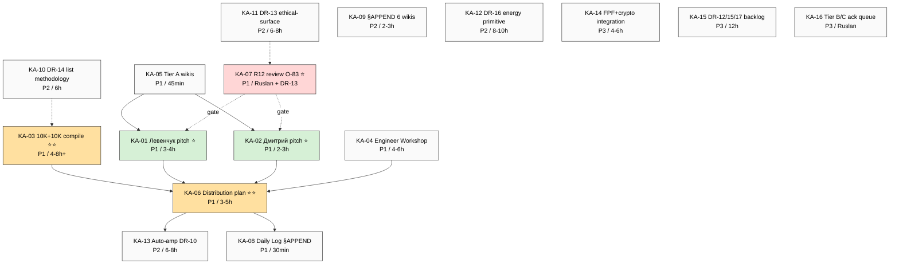

# Key Actions List — voice batch-7 ⭐ (PLAN-OF-DAY Step 2)

> Synthesis из Phase 2 + Phase 3 + Phase 4 → actionable items per идея/инсайт. NOT новые generation — extraction + organisation. Surface ALL surfaced; не select top-3. Ranked by priority, не «recommendation» (per memory `feedback_breadth_not_selection.md` + `feedback_no_unsolicited_alternatives.md`).

---

## §0 TL;DR

**16 actions extracted** (P1: 8 / P2: 5 / P3: 3). **11 flagged step-4-input** (subset для PLAN-OF-DAY Step 4 distribution plan + CRM expansion). Per-source attribution: audio_697 = 7 actions (highest density); audio_681 + audio_688 = 3 each.

---

## §1 P1 actions (immediate, ≤7 days)

### KA-01 — Compose Левенчук pitch video [P1]
- **Source:** audio_697 C1/C6/C11/C22/C25
- **Owner:** Ruslan (strategic prose / video script) + brigadier (substrate compile from per-audio MD + Левенчук inventory v2)
- **Dependency:** KA-07 R12 ethical-surface review of cheat-code positioning (blocking pre-template)
- **Priority:** P1
- **Time estimate:** 2-3 h Ruslan strategic + 1 h brigadier substrate
- **Cross-link:** `decisions/strategic/JETIX-OUTREACH-SCALABLE-2026-05-18.md` / Platform v2 §6 / Левенчук inventory v2 / `wiki/concepts/method-systems-thinking.md` / O-75 partnership frame
- **Acceptance:** Video 5-15 min ready; outline includes (a) «всё информация и методы переработки» (audio_697 C1); (b) grand plan articulation (C6/C7); (c) pre-existing partnership positioning (audio_688 paired anchor); (d) Левенчук universal-people alignment (audio_697 C22)
- **Risk / blocker:** KA-07 may surface manipulation pattern needing template revision
- **Step-4-input?:** YES ⭐

### KA-02 — Compose Дмитрий (гуманитарщина) outreach pitch [P1]
- **Source:** audio_697 C13 (custom pitch per audience) + audio_697 C25 (sequence — Дмитрий → Левенчук)
- **Owner:** Ruslan (strategic prose) + brigadier (substrate compile)
- **Dependency:** Pre-existing Partnership Positioning canonical template (O-75 wiki creation Phase 6) + Custom Pitch principle (audio_697 C13)
- **Priority:** P1
- **Time estimate:** 1-2 h Ruslan + 1 h brigadier
- **Cross-link:** audio_697 C25 / `decisions/strategic/JETIX-OUTREACH-SCALABLE-2026-05-18.md` / Platform v2 §20 / NEW-doc-1 + NEW-doc-3
- **Acceptance:** Pitch script / video draft ready для гуманитарной audience; audience-specific framing (no engineering jargon; emphasis на «развитие человечества» frame)
- **Risk:** O-86 Project-of-Humanity boundary check pending (may need ack)
- **Step-4-input?:** YES ⭐

### KA-03 — Compile first-pass list 10K people + 10K orgs/funds for outreach ⭐⭐ [P1]
- **Source:** audio_697 C16 (10K + 10K target sizing verbatim)
- **Owner:** brigadier substrate (CRM ops; `/crm-add` per candidate; `/crm-rebuild-index`) + Ruslan ack on Tier-1 shortlist
- **Dependency:** Platform v2 §6 baseline (22 people Tier-1 already); CRM rebuild-index ready; DR-14 methodology output
- **Priority:** P1
- **Time estimate:** brigadier 4-8 h initial pass (focus Tier-1 + Tier-2 ~100 entries); Ruslan ack 0.5 h per Tier-1
- **Cross-link:** audio_697 C16 / Platform v2 §6 / `crm/_schema/` / DR-14 (methodology blocker)
- **Acceptance:** First-pass list ≥100 contacts surfaced + Platform v2 §6 baseline migrated to CRM /people/ + /orgs/ + Tier-1/L2/L3 segmentation preserved
- **Risk:** O-88 anti-tiered universalism (audio_688 C9) potential design contradiction с segmentation — AP-6 preserve both, document
- **Step-4-input?:** YES ⭐⭐ — major substrate

### KA-04 — Engineer Workshop запуск flow design (BL-1 retained) [P1]
- **Source:** audio_681 C20 retained priority confirmation + batch-6 BL-1 ack
- **Owner:** Ruslan (strategic design) + brigadier substrate
- **Dependency:** Левенчук inventory v2 paid layer overlap (3 priority books per PLAN-OF-DAY §1 Шаг 3)
- **Priority:** P1 (BL-1)
- **Time estimate:** 4-6 h design + ongoing execution
- **Cross-link:** batch-6 BL-1 ack / audio_681 C20 / Левенчук inventory v2 / `decisions/strategic/JETIX-HACKATHON-PLATFORM-2026-05-18.md`
- **Acceptance:** Engineer Workshop запуск plan with cohort sizing (5-15) + Левенчук material integration plan + iteration cadence
- **Risk:** Книги Левенчука материал handoff dependency (PLAN-OF-DAY Шаг 3 conditional)
- **Step-4-input?:** YES (Engineer cohort = CRM expansion target audience)

### KA-05 — Auto-promote 3 Tier A wikis (Phase 6 immediate) [P1]
- **Source:** Phase 4 §A.1 (O-73 / O-74 / O-75)
- **Owner:** brigadier substrate (autonomous per acceptance criteria met)
- **Dependency:** None (acceptance criteria already verified in Phase 4)
- **Priority:** P1
- **Time estimate:** 30-45 min brigadier
- **Cross-link:** Phase 6 §C wiki Tier A auto-promote queue
- **Acceptance:** 3 NEW wikis created (`ethereum-as-jetix-substrate.md` / `hackathons-as-clan-wars.md` / `pre-existing-partnership-positioning.md`) with frontmatter (F3 R-medium typical, sources, verbatim Ruslan voice anchor preserved); wiki/log.md append; wiki/index update via /lint or manual
- **Risk:** none
- **Step-4-input?:** indirect (provides canonical reference для outreach templates)

### KA-06 — Distribution plan sequence outline ⭐ [P1]
- **Source:** audio_697 C25 verbatim sequence + audio_681 C16 outreach Tier-1 list + PLAN-OF-DAY Шаг 4
- **Owner:** Ruslan (strategic prose) + brigadier substrate (compile inputs from KA-03, KA-01, KA-02, KA-04)
- **Dependency:** KA-01, KA-02, KA-03 outputs (Step 4 input subset)
- **Priority:** P1
- **Time estimate:** 2-3 h Ruslan strategic + 1-2 h brigadier substrate
- **Cross-link:** PLAN-OF-DAY 2026-05-20 §2 Шаг 4 / Sprint-Synthesis-v2 Doc 4 Master Packaging Step 6 / `decisions/strategic/DISTRIBUTION-PLAN-2026-05-20.md` (to be created)
- **Acceptance:** Distribution plan covers (a) 6 promotion docs status (Sprint-Synthesis-v2 Doc 4); (b) audience × channel matrix (L1 engineers / L2 amplifiers / L3 institutional × Tier-1 + email + Twitter + Telegram + IRL); (c) Phase 1 outreach cadence (daily 10-20 touches start date)
- **Risk:** Anti-tiered universalism (O-88) contradiction needs AP-6 dissent preservation in doc
- **Step-4-input?:** YES ⭐⭐ (this IS Step 4 output substrate)

### KA-07 — R12 ethical-surface review of Cheat-code Positioning (O-83) [P1]
- **Source:** audio_697 C11 verbatim + Phase 4 §A.2 R12 flag
- **Owner:** Ruslan strategic ack + philosophy-expert/systems-expert lens substrate
- **Dependency:** DR-13 deep research output
- **Priority:** P1 (blocks O-83 Tier A promotion AND blocks KA-01 + KA-02 template ratification)
- **Time estimate:** Ruslan 1-2 h reflection + DR-13 6-8 h research compile
- **Cross-link:** audio_697 C11 / Левенчук inventory v2 GAP-3 ethical-surface / R12 Charter ack 2026-05-12 / `swarm/wiki/foundations/principles/`
- **Acceptance:** Decision recorded: (a) O-83 cleared → promote Tier A; OR (b) reframed → modified template language; OR (c) demoted permanent → Tier C / RUSLAN-LAYER overlay only
- **Risk:** Permanent demotion may signal substantial pitch-template revision needed (cascades back to KA-01, KA-02)
- **Step-4-input?:** YES ⭐ (decision affects all outreach templates)

### KA-08 — §APPEND Daily Log 2026-05-20 + Step-4-input substrate handoff [P1]
- **Source:** PLAN-OF-DAY 2026-05-20 §5 acceptance criteria
- **Owner:** brigadier substrate (compile end-of-day) + Ruslan optional review
- **Dependency:** Phase 6 completion (this batch)
- **Priority:** P1 (closure deliverable)
- **Time estimate:** brigadier 30 min
- **Cross-link:** PLAN-OF-DAY §5 / batch-7 Summary / Sprint-Synthesis-v2 Doc 4
- **Acceptance:** Daily Log 2026-05-20 created (или §APPEND if exists) с summary: 9 audio processed / X Tier A wikis created / 16 actions extracted / 9 NEW DR surfaced / Step 4 substrate ready
- **Risk:** none
- **Step-4-input?:** indirect (closure record)

---

## §2 P2 actions (2-4 weeks)

### KA-09 — §APPEND 6 Tier A wikis с batch-7 voice substrate corroborations [P2]
- **Source:** Phase 4 B.6 + Phase 3 § L8 corroboration matrix
- **Owner:** brigadier substrate (partial autonomous; Ruslan ack on specific quotes)
- **Dependency:** Phase 6 substrate; Ruslan ack queue
- **Priority:** P2
- **Time estimate:** brigadier 2-3 h per wiki batch
- **Cross-link:** `wiki/concepts/method-systems-thinking.md` + `sense-of-measure.md` + `jetix-as-exokortex.md` + `mastery-formula.md` + `persistence-beats-talent.md` + `fpf-as-info-transfer-vocabulary.md`
- **Acceptance:** §APPEND voice substrate section per wiki с relevant batch-7 audio cross-cite; wiki/log.md append; no Foundation modifications
- **Risk:** Ruslan ack queue може быть deferred
- **Step-4-input?:** no

### KA-10 — DR-14: 10K outreach target list compilation methodology [P2]
- **Source:** Phase 4 §C.2 DR-14
- **Owner:** brigadier substrate (research compile)
- **Dependency:** none (research-only)
- **Priority:** P2 (input для KA-03 expansion beyond first-pass 100)
- **Time estimate:** 6 h brigadier
- **Cross-link:** network science / influence mapping / CRM literature
- **Acceptance:** Methodology document ready (≤2000w); list-building algorithm + criteria + sources/tools recommendation; cross-link Platform v2 §20 outreach templates
- **Step-4-input?:** YES (methodology) ⭐

### KA-11 — DR-13: Cheat-code positioning ethical surface deep [P2]
- **Source:** Phase 4 §C.2 DR-13 (blocking KA-07)
- **Owner:** brigadier substrate (research compile) + Ruslan strategic
- **Dependency:** Левенчук inventory v2 GAP-3 deep coverage
- **Priority:** P2 / KA-07 P1 dependency
- **Time estimate:** 6-8 h
- **Cross-link:** Левенчук ethical-frame / R12 Charter / manipulation ethics literature
- **Acceptance:** Research document ≤3000w; framework for ethical surface; AP-6 dissent preservation
- **Step-4-input?:** YES (decision substrate)

### KA-12 — DR-16: Energy primitive in info-processing systems [P2]
- **Source:** Phase 4 §C.2 DR-16 (audio_699 C6 explicit Ruslan research-request) + audio_700 C6 paired
- **Owner:** brigadier substrate research compile
- **Dependency:** none
- **Priority:** P2 (Tier A blocker для O-80 / O-96)
- **Time estimate:** 8-10 h
- **Cross-link:** thermodynamics + cognitive-load + Beer VSM variety + attention/focus literature / `wiki/concepts/method-systems-thinking.md`
- **Acceptance:** Research document ≤3000w; energy primitive definition + literature corroboration; O-80/O-96 Tier A promotion path
- **Step-4-input?:** no

### KA-13 — Auto-amplification outreach system architecture (DR-10) [P2]
- **Source:** audio_681 C19 + Phase 4 §C.2 DR-10
- **Owner:** brigadier substrate (architecture) + Ruslan ack on design
- **Dependency:** KA-06 distribution plan baseline
- **Priority:** P2
- **Time estimate:** 6-8 h
- **Cross-link:** audio_681 C19 / Platform v2 §20 / Outreach Scalable concept doc / DARPA programs research / OpenAI cohort cascade
- **Acceptance:** Architecture document ≤2500w; describes pipeline from initial Ruslan outreach → 10-person team → 100-person amplification → self-sustaining
- **Step-4-input?:** YES

---

## §3 P3 actions (deferred / low-prio)

### KA-14 — NEW-doc-4: FPF + Decentralization + Crypto integration architecture [P3]
- **Source:** audio_680 C7 + H8 LOCK 2026-05-18 + R12 Ethereum ack 2026-05-18
- **Owner:** brigadier substrate + Ruslan ack
- **Dependency:** None (mostly substrate compile from existing LOCK records)
- **Priority:** P3
- **Time estimate:** 4-6 h brigadier
- **Cross-link:** audio_680 / H8 LOCK / R12 Ethereum ack / 5 acked concept docs F2
- **Acceptance:** Architecture document ≤2000w; integrates FPF + Ethereum substrate + R12 programmable + Mondragón ratio + QF distribution
- **Step-4-input?:** no

### KA-15 — DR-12 + DR-15 + DR-17 backlog (low-prio research) [P3]
- **Source:** Phase 4 §C.2
- **Owner:** brigadier substrate research compile
- **Dependency:** none
- **Priority:** P3
- **Time estimate:** 4 h each (12 h total)
- **Cross-link:** Phase 4 §C.2
- **Acceptance:** 3 research summaries ≤1500w each
- **Step-4-input?:** no

### KA-16 — Tier B/C surface candidates Ruslan ack queue [P3]
- **Source:** Phase 4 §A.2 + §A.3 (14 Tier B + 5 high-risk candidates)
- **Owner:** Ruslan strategic ack per item
- **Dependency:** Ruslan attention budget (max 20 active tasks per Pillar C §4.2)
- **Priority:** P3
- **Time estimate:** Ruslan ~5-10 min per item; 14-20 items total
- **Cross-link:** Phase 4 §A.2/A.3
- **Acceptance:** Per item: Tier A promote / Tier B retain / Tier C drop / Tier D SKIP-add decision recorded в REFLECTION-INBOX
- **Step-4-input?:** no (governance backlog)

---

## §4 Step-4-input actions (subset filtered)

11 actions flagged step-4-input ⭐ — substrate для PLAN-OF-DAY Step 4 distribution plan + CRM compile:

| KA | Action | Step 4 contribution |
|---|---|---|
| KA-01 ⭐ | Левенчук pitch video | concrete first-target pitch |
| KA-02 ⭐ | Дмитрий outreach pitch | concrete second-target pitch (audio_697 C25 sequence) |
| KA-03 ⭐⭐ | 10K+10K target list compile | **major substrate** — CRM expansion + outreach queue |
| KA-04 | Engineer Workshop запуск | Engineer cohort = CRM expansion target audience |
| KA-06 ⭐⭐ | Distribution plan sequence outline | **IS Step 4 output** |
| KA-07 ⭐ | Cheat-code R12 review | gates all outreach templates |
| KA-08 | Daily Log §APPEND | closure record |
| KA-10 ⭐ | DR-14 list methodology | methodology для KA-03 expansion |
| KA-11 | DR-13 ethical-surface | decision substrate для KA-07 |
| KA-13 | DR-10 auto-amplification architecture | scale-out architecture |
| (implicit) | 6 Tier A wikis canonical reference (KA-05 + KA-09) | provides anchor points для pitch authority |

---

## §5 Dependency map

Critical path (P1 chain):
**KA-05 → (KA-01 + KA-02 + KA-03 + KA-04) → KA-06 → KA-08** with KA-07 R12-gate blocking KA-01/KA-02 templates.

---

## §6 Per-source attribution count

| Source audio | # actions sourced |
|---|---|
| audio_697 (Левенчук + Cheat-code + 10K targets) | 7 (KA-01, KA-02, KA-03, KA-06, KA-07, KA-09, KA-11) |
| audio_681 (Hackathons + outreach + срочность) | 3 (KA-04, KA-13, partial KA-06) |
| audio_688 (Pre-existing partnership ⭐) | 3 (KA-01, KA-02, KA-05) — paired with audio_697 |
| audio_680 (Ethereum substrate) | 2 (KA-05 O-73, KA-14) |
| audio_699 (Energy primitive) | 1 (KA-12) |
| audio_700 (Info exchange primitive) | 1 (KA-12 paired anchor) |
| audio_698 (Mental simulation) | 0 (P3 surface only KA-15 backlog) |
| audio_692 (2-layer model) | 0 (KA-16 backlog) |
| audio_693 (Method re-cap) | 1 (KA-09 §APPEND voice substrate) |

**Highest density:** audio_697 = 7/16 actions (43%).

---

## §7 Constitutional check per KA

| KA | R1 | R2 | R6 | R11 | R12 | IP-1 | Notes |
|---|---|---|---|---|---|---|---|
| KA-01 | ✅ Ruslan auth | ✅ no LOCK | ✅ provenance | ⚠️ KA-07 gate | ⚠️ KA-07 gate | ✅ | R12 gate via KA-07 |
| KA-02 | ✅ | ✅ | ✅ | ⚠️ O-86 ack | ✅ | ✅ | O-86 boundary check |
| KA-03 | ✅ brigadier ops | ✅ | ✅ | ✅ | ⚠️ Tier-1 visibility | ✅ | R12 anti-extraction check on public-figure outreach |
| KA-04 | ✅ Ruslan auth | ✅ | ✅ | ✅ | ✅ | ✅ | clean |
| KA-05 | ✅ | ✅ Tier A wikis = NEW namespace | ✅ verbatim anchor | ✅ acceptance criteria | ✅ | ✅ | clean |
| KA-06 | ✅ Ruslan auth | ✅ NEW doc | ✅ | ✅ | ⚠️ AP-6 anti-tiered | ✅ | document AP-6 dissent |
| KA-07 | ✅ Ruslan-only | ✅ | ✅ | ✅ Default-Deny gate triggered | ✅ this IS R12 check | ✅ | constitutional review |
| KA-08 | ✅ | ✅ | ✅ | ✅ | ✅ | ✅ | closure |
| KA-09 | ✅ brigadier + Ruslan ack | ✅ §APPEND only | ✅ | ✅ | ✅ | ✅ | clean |
| KA-10 | ✅ research | ✅ | ✅ | ✅ | ✅ | ✅ | clean |
| KA-11 | ✅ research | ✅ | ✅ | ✅ | ✅ this IS R12 study | ✅ | clean |
| KA-12 | ✅ research | ✅ | ✅ | ✅ | ✅ | ✅ | clean |
| KA-13 | ✅ Ruslan auth | ✅ | ✅ | ✅ | ⚠️ scale check | ✅ | R12 dilution check at scale |
| KA-14 | ✅ Ruslan auth | ✅ | ✅ | ✅ | ✅ R12 programmable | ✅ | clean |
| KA-15 | ✅ research | ✅ | ✅ | ✅ | ✅ | ✅ | clean |
| KA-16 | ✅ Ruslan-only | ✅ | ✅ | ✅ | ✅ | ✅ | governance backlog |

---

*Phase 5 ⭐ Key Actions extraction closure. 16 actions surfaced (8 P1 / 5 P2 / 3 P3); 11 step-4-input; critical path locked; constitutional check per-action. PLAN-OF-DAY Step 2 integration done.*
