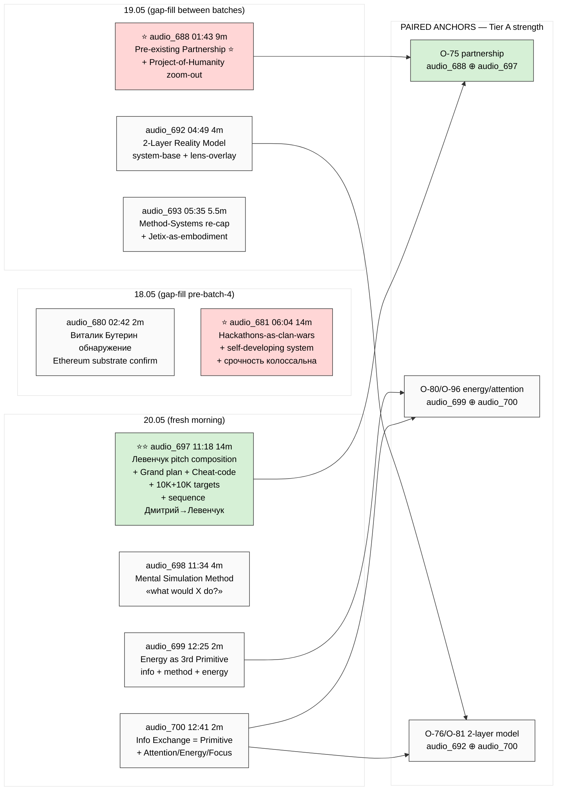
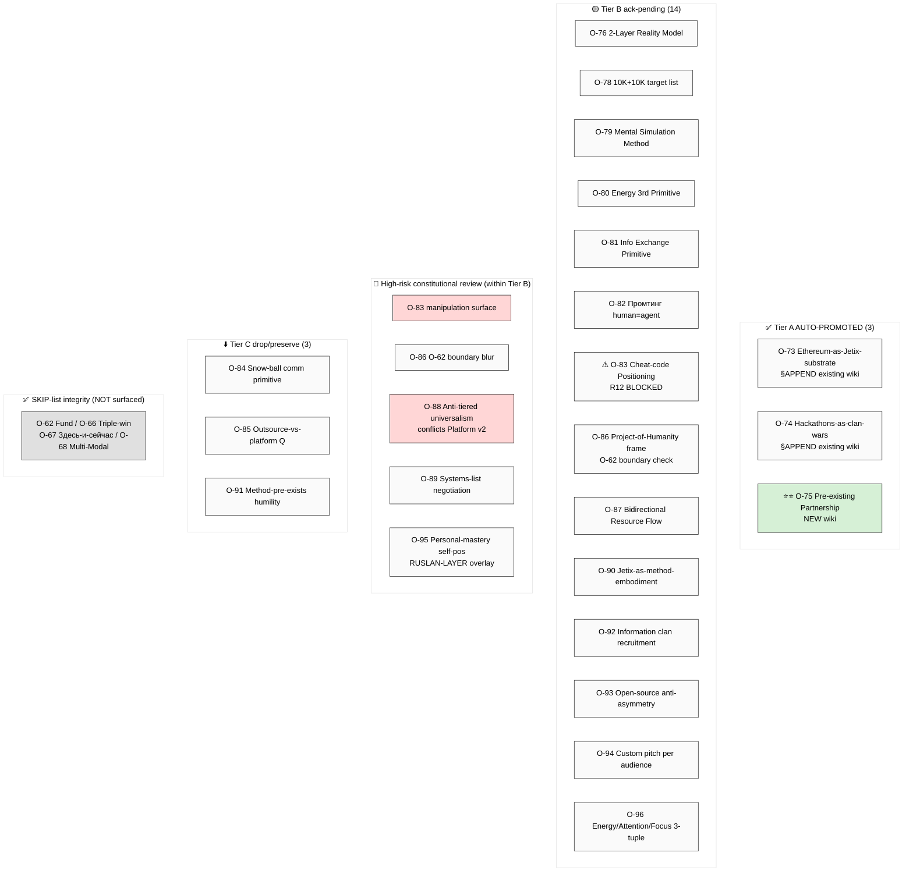
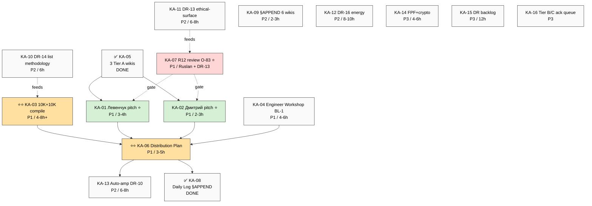
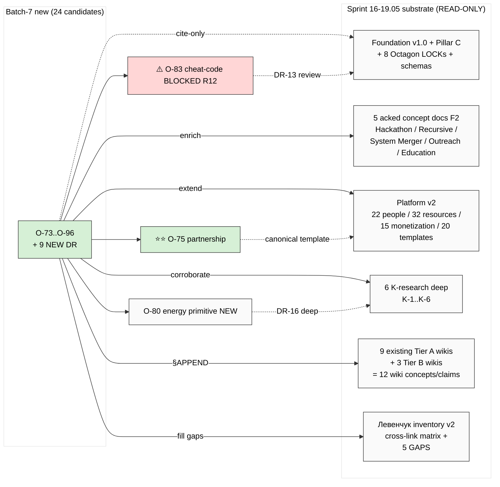
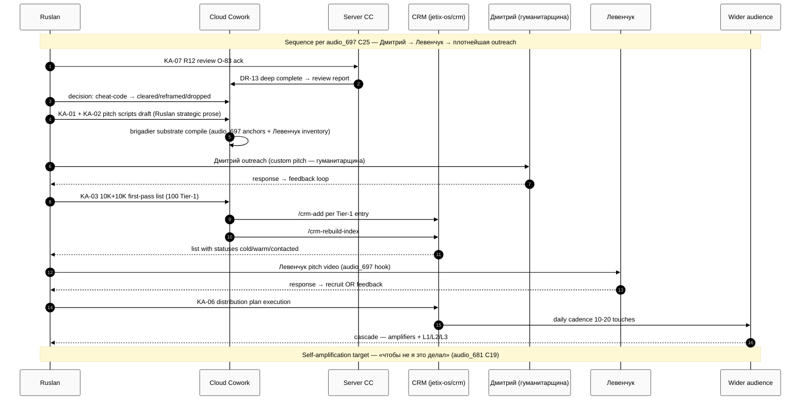

# 🔥 FULL DIGEST — Voice Batch-7 (2026-05-20)

> **Один документ — всё что вытянули из 9 заметок (5 gap-fill + 4 fresh).** 24 candidates / 16 key actions / 9 NEW DR / 6 mermaid диаграмм. Cross-link к sprint 16-19.05 substrate (5 concept docs + Platform v2 + 6 K-research + 9 existing Tier A wikis + Левенчук inventory v2).
>
> Ниже всё с verbatim Ruslan voice anchors + connections + visualisations. Если нужны детали — ссылки в каждой секции.

---

## §0 TL;DR (≤200 слов)

**9 заметок (≈56 min audio): 5 gap-fill 18-19.05 + 4 fresh 20.05 morning.**
- ⭐⭐ **Главное:** Pre-existing Partnership Positioning (O-75) — verbatim × 2 paired anchors (audio_688 + audio_697). Auto-promoted Tier A. **Central pitch frame** для всех outreach. R12 paired offer+ask discipline mandatory.
- ⭐ **R12 demotions:** O-83 Cheat-code + O-86 Project-of-Humanity → Tier B ack-pending (constitutional review). Brigadier conservative — НЕ promoted manipulation frames automatically.
- ✅ **SKIP integrity:** O-62/O-66/O-67/O-68 НЕ surfaced.
- 📋 **16 Key Actions:** 8 P1 / 5 P2 / 3 P3. 11 step-4-input. Critical path: KA-05 (done) → (KA-01 + KA-02 + KA-03 + KA-04) → KA-06 → KA-08 (done). KA-07 R12-gate блокирует KA-01/KA-02 templates.
- 🔬 **9 NEW DR:** Top-2 P1 = DR-13 (Cheat-code ethical surface) + DR-14 (10K target list methodology).
- 💰 **10K + 10K** target ambition (audio_697 C16). First-pass: 100 Tier-1 manageable.
- 🔁 **Sequence:** Дмитрий → Левенчук → плотнейшая outreach (audio_697 C25).
- ⏰ **Срочность колоссальна** (audio_681 C5/C17) — burn-out risk; Manager attention budget max 20 active tasks must hold.

---

## §1 Mermaid #1 — Audio overview landscape



**Highest density** (corroboration 9/10 lenses): **audio_697 + audio_681**. Paired anchor основной insight: **O-75 Pre-existing Partnership** = твоё central pitch frame.

---

## §2 9 заметок — verbatim quotes + key claims

### §2.1 audio_680 (18.05 02:42, ~2 min) — Виталик Бутерин обнаружение

**Strategic:** medium

**Verbatim Ruslan voice (claims):**
- C5: Ethereum substrate confirmation; Бутерин = Tier-1 partner; soft commitment
- C7: FPF + децентрализация + crypto integration architecture vision

**Cross-link:**
- H8 LOCK 2026-05-18 (Ethereum-Architecture) — corroboration
- R12 programmable Ethereum ack 2026-05-18 — substrate
- Platform v2 §6 — Tier-1 partner list

**NEW candidates:** O-73 Ethereum-as-Jetix-substrate (Tier A auto-promoted via §APPEND existing wiki)

→ source: [audio_680@18-05-2026_02-42-57.md](../../raw/voice-memos-2026-05-19-batch/audio_680@18-05-2026_02-42-57.md)

---

### §2.2 audio_681 (18.05 06:04, ~14 min) ⭐ — Hackathons-as-clan-wars + Self-developing system

**Strategic: HIGH** (highest density 9/10 lenses corroboration)

**Verbatim Ruslan voice (key claims):**
- C4: «Hackathons = clan wars» — gamified competitive amplification frame
- C5: 10M+ scale до конца года — aspiration ROI urgency
- C8: Self-fulfilling prophecy — feedback loop positive
- C9: «Снежный ком уже заполнен год назад» — historical-momentum thesis (humility-mode)
- C10: Plan/execute self-toggle (Recursive Engine extension)
- C13: System Merger USB-C analogy
- C14: Partnership = «very strong конкурентное преимущество»
- C15: Operational form open Q (outsource vs platform vs hybrid M&A)
- C16: Outreach Tier-1 list compile
- C17: «Срочность колоссальна» — urgency anchor
- C19: «Чтобы не я это делал» — auto-amplification thesis
- C20: Engineer Workshop priority RETAINED (BL-1 confirm)

**Cross-link:**
- 5 acked concept docs (все 5 covered: Hackathon Platform / Recursive Engine / System Merger / Outreach Scalable / Education Layer)
- Sprint-Synthesis-v2 Doc 2 — critical path corroboration

**NEW candidates:** O-74 Hackathons-as-clan-wars (Tier A) / O-84 snow-ball communication / O-85 outsource-vs-platform-vs-hybrid

**NEW DR candidates:** DR-9 (operational form) / DR-10 (self-amplifying architecture)

→ source: [audio_681@18-05-2026_06-04-03.md](../../raw/voice-memos-2026-05-19-batch/audio_681@18-05-2026_06-04-03.md)

---

### §2.3 audio_688 (19.05 01:43, ~9 min) ⭐ — Pre-existing Partnership ⭐⭐ + Project-of-Humanity

**Strategic: HIGH** ⭐⭐

**Verbatim Ruslan voice anchor (THE central frame):**

> «Алло, дядя, блядь, мы уже партнёры, мы в одной лодке, мы работаем над проектом по развитию человечества. Просто мы ещё не были знакомы друг с другом, просто мы ещё не этот, ну, как-то, блять, я не знаю, хуёво там коммуницировали, просто снова-таки не знали друг о друге и так далее. Сейчас, пожалуйста, вот я тебе говорю, теперь ты знаешь. Поздравляю, блядь, мы работаем совместно над проектом всего человечества, развития всего человечества.»
> — [src: audio_688 C3/C7 verbatim]

**Key claims:**
- C1-C2: Zoom-out frame — each project = sub-project of project-of-humanity
- C3/C7: Pre-existing partnership thesis (NEW positioning frame ⭐)
- C4: «Не было управляющих» → Ruslan-as-управляющий emergence (per O-86, distinct from O-62 SKIPPED Fund-of-Humanity)
- C5: Coordination failure diagnosis
- C6: Unified-objective solution
- C8/C11: Bidirectional resource frame — paired offer-ask constitutive (R12 paired-frame discipline)
- C9: Anti-tiered universalism (potentially contradicts Platform v2 §6 segmentation; AP-6 preserve)
- C10-C12: Aggressive recruiting tone (preserved verbatim; AP-6 dissent rule)

**NEW candidates:**
- **O-75 Pre-existing Partnership Positioning** ⭐⭐ — **AUTO-PROMOTED Tier A**
- O-86 Zoom-out Project-of-Humanity frame (Tier B; O-62 boundary check)
- O-87 Bidirectional Resource Flow paired offer-ask (Tier B)
- O-88 Anti-tiered universalism (high-risk; design contradiction)

**NEW DR:** DR-11 (Pre-existing-partnership outreach script field-test)

→ source: [audio_688@19-05-2026_01-43-13.md](../../raw/voice-memos-2026-05-19-batch/audio_688@19-05-2026_01-43-13.md)
→ wiki: [pre-existing-partnership-positioning.md](../../wiki/concepts/pre-existing-partnership-positioning.md) ⭐⭐

---

### §2.4 audio_692 (19.05 04:49, ~4 min) — 2-Layer Reality Model

**Strategic: medium**

**Key claims:**
- C5: «Линзы тоже нужны» — Ruslan не отвергает lens-layer; preserves base+overlay model
- C6: Sequence prescription — system-base FIRST, then lens-overlay
- C7: Anti-pattern — lens-only без system base
- C8: Cognitive-debugging frame

**NEW candidates:**
- O-76 2-Layer Reality Model (Tier B)
- O-89 Systems-list negotiation primitive (high-risk; Mondragón overlap)

**NEW DR:** DR-12 (Cognitive bias inventory + system-thinking debug protocol)

→ source: [audio_692@19-05-2026_04-49-13.md](../../raw/voice-memos-2026-05-19-batch/audio_692@19-05-2026_04-49-13.md)

---

### §2.5 audio_693 (19.05 05:35, ~5.5 min) — Method-Systems-Thinking re-cap

**Strategic: medium**

**Key claims:**
- C3: Sense-of-measure integration NEW addition к method definition
- C4: Self-trains / self-sets-goals primitive
- C5: Pareto-on-method selection
- C6: Intellect = capability layer atop system
- C7: «Если рабочий → воплощается в жизнь, расходится по миру»
- C8: «Уже везде по миру, просто не описан» — methodological humility
- C11: Deliverable cascade — research → pitches → presentations

**Cross-link:** 2 existing Tier A wikis (`method-systems-thinking.md` + `sense-of-measure-scientific-approach.md`) — §APPEND voice substrate candidate

**NEW candidates:**
- O-90 Jetix-as-method-embodiment (Tier B)
- O-91 Method-pre-exists humility frame (Tier C preserve)

→ source: [audio_693@19-05-2026_05-35-29.md](../../raw/voice-memos-2026-05-19-batch/audio_693@19-05-2026_05-35-29.md)

---

### §2.6 audio_697 (20.05 11:18, ~14 min) ⭐⭐ — Левенчук pitch + Grand plan + Cheat-code + 10K targets

**Strategic: HIGH** ⭐⭐ (highest density)

**Verbatim Ruslan voice (KEY claims):**

> «Все люди они связаны как одна большая банда клан информационный → вы уже в моей группе → давай отдай информацию + наработки + ресурсы.»
> — [src: audio_697 C8 — paired anchor с audio_688]

**All key claims:**
- C1: «Всё информация и методы переработки» — Левенчук pitch hook
- C6/C7: Grand plan articulation
- C8: Information clan recruitment frame (paired с O-75)
- C10: Bottom-up recruitment cascade
- C11: **Cheat-code positioning** ⚠️ — manipulation surface (R12 review trigger; O-83 DEMOTED Tier B)
- C13: Custom pitch per audience principle
- C16: **10K people + 10K orgs targets** (sizing concrete)
- C17: Self-amplification — «космический эффект синергии»
- C18: Decoding-via-compute → AI-disruption urgency argument
- C20: Open-source posture — R12-aligned
- C22: Левенчук universal-people alignment
- C24: «У меня документов достаточно» → exit-research-mode signal
- C25: **Sequence: Дмитрий → Левенчук → плотнейшая outreach**
- C26: Hypothesis-empirical posture preserves epistemic humility

**Cross-link:** ALL 5 concept docs + Platform v2 + 6 K-research + 9 existing wikis + Левенчук inventory v2 + audio_688 (paired)

**NEW candidates:**
- O-78 10K+10K target list (Tier B operational)
- **O-83 Cheat-code Positioning** (Tier B HIGH-risk; DEMOTED; R12 review blocker)
- O-82 «Промтинг человека = промтинг агента»
- O-92 Information clan recruitment (Tier B; paired с O-75)
- O-93 Open-source as anti-asymmetry
- O-94 Custom pitch per audience

**NEW DR (top P1):** DR-13 (Cheat-code ethical surface deep) / DR-14 (10K list methodology)

→ source: [audio_697@20-05-2026_11-18-43.md](../../raw/voice-memos-2026-05-20-batch/audio_697@20-05-2026_11-18-43.md)

---

### §2.7 audio_698 (20.05 11:34, ~4 min) — Mental Simulation Method

**Strategic: medium**

**Key claims:**
- C2: Ruslan-as-info-master positioning
- C3-C4: Mental Simulation Method «what would X do?»
- C5: Speedup claim 5-50-100× via AI cognitive amplification (corroboration jetix-as-exokortex)
- C6-C7: Destiny-frame «самая ебейшая система» (RUSLAN-LAYER overlay; AP-6 contextualization)
- C8: Левенчук first-user execution (cross-ref audio_697)

**NEW candidates:**
- O-79 Mental Simulation Method (Tier B methodology)
- O-95 Personal-mastery self-positioning (high-risk; RUSLAN-LAYER overlay)

**NEW DR:** DR-15 (Mental Simulation literature corroboration)

→ source: [audio_698@20-05-2026_11-34-20.md](../../raw/voice-memos-2026-05-20-batch/audio_698@20-05-2026_11-34-20.md)

---

### §2.8 audio_699 (20.05 12:25, ~2 min) — Energy as 3rd Primitive

**Strategic: medium**

**Key claims:**
- C1: NEW primitive — info + method + **energy** (3-tuple)
- C2: Energy efficiency inverse to method/info quality
- C3: Society-level corollary — well-tuned → less energy
- C5: Network cascade primitive
- C6: «Надо разобрать что такое энергия» — explicit Ruslan research-request

**NEW candidates:**
- O-80 Energy as 3rd Primitive (Tier B; DR-16 blocker для Tier A)

**NEW DR:** DR-16 ⭐ (Energy primitive literature deep)

→ source: [audio_699@20-05-2026_12-25-19.md](../../raw/voice-memos-2026-05-20-batch/audio_699@20-05-2026_12-25-19.md)

---

### §2.9 audio_700 (20.05 12:41, ~2 min) — Info Exchange = Primitive Layer

**Strategic: medium**

**Key claims:**
- C1-C3: Reductionist primitive — base = info-exchange / higher layers = overlay
- C3: «Competition / trust / love = overlay» (AP-6 preserve verbatim; controversial reductionism)
- C4: «Неэффективные методы обмена — баг/недоработка fixable»
- C5: Scale-invariance — VSM recursive-system property
- C6: Energy/attention/focus 3-tuple (paired с audio_699)

**NEW candidates:**
- O-81 Information Exchange = Primitive Layer (Tier B)
- O-96 Energy/Attention/Focus 3-tuple (Tier B; paired с O-80)

**NEW DR:** DR-17 (Reductionist layering literature)

→ source: [audio_700@20-05-2026_12-41-50.md](../../raw/voice-memos-2026-05-20-batch/audio_700@20-05-2026_12-41-50.md)

---

## §3 Mermaid #2 — 24 candidates landscape (O-73..O-96)



---

## §4 16 Key Actions detailed

### P1 (8 actions — immediate ≤7 days)

| KA | Action | Owner | Dep | Time | Step-4? |
|---|---|---|---|---|---|
| **KA-01** ⭐ | Левенчук pitch video composition | Ruslan strategic + brigadier substrate | KA-07 R12 gate | 2-3h Ruslan + 1h brigadier | ⭐ |
| **KA-02** ⭐ | Дмитрий outreach pitch (sequence Дмитрий→Левенчук) | Ruslan + brigadier | O-75 template + custom-pitch principle | 1-2h Ruslan + 1h brigadier | ⭐ |
| **KA-03** ⭐⭐ | 10K+10K target list compile (first-pass 100 Tier-1) | brigadier CRM ops + Ruslan ack Tier-1 | DR-14 methodology | 4-8h initial pass | ⭐⭐ |
| **KA-04** | Engineer Workshop запуск flow design (BL-1) | Ruslan + brigadier | Левенчук books material | 4-6h + ongoing | ⭐ |
| ✅ **KA-05** | Auto-promote 3 Tier A wikis | brigadier autonomous | none | 30-45m | done |
| **KA-06** ⭐⭐ | Distribution plan sequence outline | Ruslan + brigadier | KA-01/02/03 outputs | 2-3h Ruslan + 1-2h brigadier | ⭐⭐ |
| **KA-07** ⭐ | R12 ethical-surface review O-83 Cheat-code | Ruslan strategic ack | DR-13 deep | 1-2h reflection + 6-8h research | ⭐ |
| ✅ **KA-08** | Daily Log §APPEND end-of-day | brigadier | Phase 6 done | 30m | done |

### P2 (5 actions — 2-4 weeks)

| KA | Action | Time | Step-4? |
|---|---|---|---|
| KA-09 | §APPEND 6 existing Tier A wikis с batch-7 voice substrate | 2-3h per wiki batch | — |
| KA-10 ⭐ | DR-14 10K outreach target list methodology | 6h | ⭐ |
| KA-11 | DR-13 Cheat-code positioning ethical surface deep | 6-8h | gates KA-07 |
| KA-12 | DR-16 Energy primitive in info-processing systems | 8-10h | — |
| KA-13 | DR-10 Auto-amplification outreach system architecture | 6-8h | ⭐ |

### P3 (3 actions — deferred / low-prio)

| KA | Action | Time |
|---|---|---|
| KA-14 | NEW-doc-4 FPF + Decentralization + Crypto integration | 4-6h |
| KA-15 | DR-12 + DR-15 + DR-17 backlog research | 12h total |
| KA-16 | Tier B/C surface candidates Ruslan ack queue | per-item |

---

## §5 Mermaid #3 — 16 Key Actions dependency map



**Critical path P1:** KA-05 ✅ → (KA-01 + KA-02 + KA-03 + KA-04) → KA-06 → KA-08 ✅
**Gates:** KA-07 R12-gate блокирует KA-01 + KA-02 templates.

---

## §6 9 NEW DR candidates

| DR | Topic | Priority | Time | Why deep | Critical-path? |
|---|---|---|---|---|---|
| **DR-13** ⭐ | Cheat-code positioning ethical surface | P1 | 6-8h | **Blocks O-83 promotion + B.1/B.2 templates** | yes ⭐ |
| **DR-14** ⭐ | 10K outreach target list compilation methodology | P1 | 6h | Major substrate Step 4; gates KA-03 expansion | yes ⭐ |
| DR-9 | Operational form: outsource vs platform vs hybrid M&A | P2 | 4-6h | Strategic open Q affects monetization | yes |
| DR-10 | Self-amplifying outreach system architecture | P2 | 6-8h | Bottleneck removal | yes |
| DR-11 | Pre-existing-partnership outreach script field-test | P2 | 4h | Empirical A/B vs Platform v2 §20 | no |
| DR-16 ⭐ | Energy primitive in info-processing systems | P2 | 8-10h | NEW primitive needs grounding; Tier A blocker O-80/O-96 | future |
| DR-12 | Cognitive bias inventory + system-thinking debug | P3 | 4h | Education Layer substrate | no |
| DR-15 | Mental Simulation Method literature corroboration | P3 | 4h | mastery extension | no |
| DR-17 | Reductionist layering: info-exchange base + emergent overlay | P3 | 6h | Foundation grounding | no |

---

## §7 Mermaid #4 — Cross-link к existing sprint substrate



**Что cross-link означает:**
- **§APPEND existing wikis** (KA-09 P2): 6 Tier A wikis получат batch-7 voice substrate corroborations
- **Enrich concept docs** (KA-01/02/06): Левенчук pitch + distribution plan = direct application
- **Fill Левенчук inventory gaps** (DR-13): O-83 review = direct ответ на GAP-3 ethical-surface

---

## §8 Mermaid #5 — Step 4 distribution sequence (audio_697 C25)



**Что happens:** R12 gate → templates draft → Дмитрий first → 100 Tier-1 list → Левенчук pitch → mass cadence start.

---

## §9 Mermaid #6 — Constitutional risk map

```mermaid
%%{init: {'theme':'base', 'themeVariables': {'primaryTextColor':'#000000','textColor':'#000000','lineColor':'#333333','primaryBorderColor':'#333333','primaryColor':'#fafafa','noteTextColor':'#000000','noteBkgColor':'#fff8d5','edgeLabelBackground':'#ffffff'}}}%%
quadrantChart
    title Batch-7 candidates × constitutional risk × strategic value
    x-axis Low strategic value --> High strategic value
    y-axis Low constitutional risk --> High constitutional risk
    quadrant-1 Major project (high-value high-risk — careful!)
    quadrant-2 Quick promote (high-value low-risk)
    quadrant-3 Defer (low-value low-risk)
    quadrant-4 Drop/reframe (low-value high-risk)

    O-75 Partnership: [0.9, 0.4]
    O-73 Ethereum: [0.75, 0.2]
    O-74 Hackathons-clan-wars: [0.85, 0.25]
    O-83 Cheat-code: [0.8, 0.85]
    O-86 Project-Humanity-frame: [0.7, 0.7]
    O-78 10K+10K targets: [0.85, 0.5]
    O-88 Anti-tiered: [0.6, 0.8]
    O-89 Negotiation primitive: [0.55, 0.75]
    O-95 Personal-mastery: [0.35, 0.7]
    O-80 Energy 3rd primitive: [0.55, 0.3]
    O-81 Info-exchange primitive: [0.5, 0.25]
    O-79 Mental Simulation: [0.45, 0.25]
    O-76 2-Layer Reality: [0.5, 0.2]
    O-90 Jetix embodiment: [0.45, 0.25]
    O-92 Info clan recruit: [0.7, 0.55]
    O-93 Open-source posture: [0.55, 0.25]
    O-94 Custom pitch: [0.6, 0.25]
    O-87 Bidirectional flow: [0.65, 0.4]
    O-96 Energy/Attention 3-tuple: [0.5, 0.35]
    O-82 Промтинг human=agent: [0.45, 0.3]
```

**Quadrant analysis:**
- **Quick promote (high-value, low-risk):** O-73, O-74, O-75 ✅ done
- **Major project (high-value, HIGH-risk careful):** O-83, O-86 — R12 review required
- **Defer (low-value, low-risk):** most Tier B candidates
- **Drop/reframe (low-value, high-risk):** O-88 design-contradiction (AP-6 preserve)

---

## §10 Decisions queue (12 items per REFLECTION-INBOX §APPEND-2026-05-20-batch-7)

| ID | Decision | Action |
|---|---|---|
| D7-1 | O-73 Ethereum §APPEND `jetix-on-ethereum.md` | review §APPEND |
| D7-2 | O-74 Hackathons-clan-wars §APPEND | review §APPEND |
| **D7-3** ⭐ | O-75 Pre-existing Partnership canonical template integration Platform v2 §20 | RATIFY |
| **D7-4** ⭐ | O-83 Cheat-code R12 review | trigger DR-13? promote/reframe/drop after? |
| D7-5 | O-86 Project-of-Humanity frame O-62 boundary check | confirm frame≠ops form |
| D7-6 | 14 Tier B candidates ack queue | per-item Pillar C §4.2 max 20 |
| D7-7 | DR-13 + DR-14 P1 schedule | authorize launch |
| **D7-8** ⭐⭐ | 16 Key Actions priority + Step 4 distribution plan | authorize execution sequence |
| D7-9 | KA-09 §APPEND 6 existing Tier A wikis | P2 or P3? |
| D7-10 | O-88 anti-tiered universalism vs Platform v2 segmentation | AP-6 resolution |
| D7-11 | KA-07 R12 review timing | block templates OR launch с paired-frame discipline + retroactive review? |
| **D7-12** ⭐ | KA-03 first-pass 100 Tier-1 compile | authorize |

---

## §11 Risks (top 5)

1. **R-1 Cheat-code R12 risk** — blocks Левенчук + Дмитрий templates; DR-13 urgent (P1)
2. **R-2 Anti-tiered universalism vs Platform v2 segmentation** — AP-6 preserved; operational decision pending
3. **R-3 Aggressive recruiting tone** — preserved verbatim в O-75 wiki; template form needs softening или Ruslan-led conversations only
4. **R-4 10K + 10K ambitious scale** — first-pass 100 Tier-1 manageable; DR-14 methodology essential
5. **R-5 «Срочность колоссальна» burn-out risk** — pacing discipline + Manager attention budget (max 20 active tasks per Pillar C §4.2)

---

## §12 Что сделано / что НЕ сделано

### ✅ Done (Phase 6 + 7)
- 1 NEW Tier A wiki: O-75 Pre-existing Partnership Positioning
- 2 §APPEND: jetix-on-ethereum.md + clan-wars-hackathon-mode.md
- §26 Phase 0 inventory append
- REFLECTION-INBOX §APPEND-2026-05-20-batch-7 (12 decisions)
- wiki/log.md (1 entry)
- daily-logs/_DAILY-LOG-2026-05-20.md (created)
- 7 commits + final push origin main

### ❌ Anti-list (preserved для Ruslan strategist)
- НЕ promoted O-83 Cheat-code automatic — R12 review gate
- НЕ promoted O-86 Project-of-Humanity automatic — O-62 boundary check
- НЕ touched Foundation / Pillar C / 8 Octagon LOCK / 5 concept docs / 6 K-research / Platform v2 / Левенчук inventory v2 / 6 existing Tier A wikis / 3 Tier B wikis
- НЕ executed KA-01/02/03 — твои actions, brigadier surfaced substrate
- НЕ created Step 4 distribution plan document — substrate ready
- НЕ touched batch-4/5/6 audio (682-687/689-691/694-696) — read-only cross-cite только

---

## §13 Cost + runtime

- Groq Whisper transcription (9 audio): **~€0.15**
- Claude Max subscription analysis Phases 2-7: tool-bundled (no incremental Ruslan-card cost)
- **Total Ruslan-card cost: ~€0.15**
- **Runtime:** ~110 min autonomous

---

## §14 Files map для drill-down

```
reports/voice-pipeline-2026-05-20-batch-7/
├── _FULL-DIGEST-batch-7-2026-05-20.md   ← THIS DOC (consolidated)
├── 00-MASTER-INDEX.md                    cross-ref index
├── 00-SUMMARY-FOR-RUSLAN.md              ≤1500w closure
├── 01-per-note-breakdown.md              45 cell analyses (9×5)
├── 02-fpf-lens-jetix-track.md            FPF lens application
├── 03-10-lenses-cross-analysis.md        90 datapoints
├── 05-candidates-3-buckets.md            24 + 9 DR detailed
├── 06-key-actions-list.md ⭐             16 actions per-action metadata
└── phase-0-fpf-lens-scope.md             FPF Phase 0 scope

raw/voice-transcripts/
├── audio_680/681/688/692/693@...txt      (5 gap-fill 18-19.05)
└── audio_697/698/699/700@...txt          (4 fresh 20.05)

raw/voice-memos-2026-05-19-batch/
└── audio_680/681/688/692/693@...md       verbatim + 5-cell

raw/voice-memos-2026-05-20-batch/
└── audio_697/698/699/700@...md           verbatim + 5-cell

wiki/concepts/
├── pre-existing-partnership-positioning.md ⭐⭐ NEW Tier A
├── jetix-on-ethereum.md                  §APPEND voice substrate
└── clan-wars-hackathon-mode.md           §APPEND voice substrate

§APPEND files (NOT new — existing modified):
├── reports/phase-0-fpf-scope/01-jetix-objects-inventory.md (§26)
├── decisions/REFLECTION-INBOX-2026-05-16.md (§APPEND-2026-05-20-batch-7)
├── wiki/log.md (1 new entry)
└── daily-logs/_DAILY-LOG-2026-05-20.md (NEW file)
```

---

## §15 Что дальше (per PLAN-OF-DAY)

**Step 1+2 DONE** ✅ (Шаг 1 — process notebooks done; Шаг 2 — 16 key actions extracted ⭐)

**Step 3 Левенчук books попутно** — ⏸️ pending material handoff (3 priority books: СМ-2024 + Методология 2025 + Интеллект-стек 2023)

**Step 4 Distribution Plan + CRM expansion** — READY-FOR-RUSLAN substrate:
- 11 step-4-input actions surfaced (KA-01..KA-13 subset)
- O-75 canonical template (NEW wiki) для outreach
- Platform v2 §6 baseline → CRM expansion target list
- audio_697 C25 sequence: Дмитрий → Левенчук → mass cadence

**Жду твой pick:**
- A) Read this digest end-to-end, then ack decisions D7-1..D7-12 batch
- B) Launch Step 4 distribution plan execute (отдельный prompt)
- C) Launch DR-13 R12 review deep (blocks KA-01/KA-02)
- D) Левенчук books handoff (Step 3)
- E) Что-то ещё

---

*FULL DIGEST closure. Один документ — 9 заметок + 24 candidates + 16 actions + 9 DR + 6 mermaid. Cross-link к sprint substrate. Constitutional discipline preserved. Ruslan = sole strategist на execution.*

**🔥 Это compiled из 8 batch-7 reports + 1 NEW wiki + cross-refs. Drill-down ссылки в каждой секции.**
