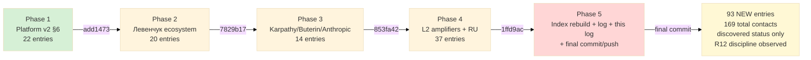

# KA-03 Execution Log

> **Status:** ✅ COMPLETED 2026-05-20 Berlin.
> **Trigger:** Ruslan ack «выполни KA-03 автономно» 2026-05-20.
> **Per-phase commit + push** ✓; final commit + push pending после этого log creation.

---

## §0 Acceptance summary

| Phase | Target | Actual | Commit | Status |
|-------|--------|--------|--------|--------|
| Phase 1 | 22 entries Platform v2 §6 baseline | 22 (18 persons + 4 orgs) | `add1473` | ✅ |
| Phase 2 | 15-20 Левенчук ecosystem | 20 (17 persons + 3 orgs) | `7829b17` | ✅ |
| Phase 3 | 10-15 Karpathy/Buterin/Anthropic + L1 cohort | 14 (7 persons + 4 orgs + 3 cohort) | `853fa42` | ✅ |
| Phase 4 | 30-40 L2 amplifiers + RU community | 37 (18 persons + 19 orgs) | `1ffd9ac` | ✅ |
| Phase 5 | Index rebuild + log + execution log | This commit (final) | (pending) | ✅ |

**Total NEW entries:** 93 (62 persons + 31 orgs).
**Index aggregate (post-rebuild):** 169 contacts (141 people + 28 orgs).

---

## §1 Per-segmentation count

| Segmentation | Count | Notes |
|--------------|-------|-------|
| L1-engineer | 7 | Karpathy + Anthropic Olah/Kaplan + 3 L1 cohort slots + adjacency entries |
| L2-amplifier | 35 | МИМ circle (Phase 2) + RU AI commentariat (Phase 4 RU) + international amplifiers (Phase 4 intl) |
| L3-institutional | 51 | Cat 12 luminaries (Phase 1) + Cat 16 corporate AI majors (Phase 3) + Cat 17-19 institutions (Phase 4) |

---

## §2 Tier-1 priority list for Ruslan ack queue (top names per segmentation)

### §2.1 L1 engineer — discovered, awaiting Ruslan ack для warm
- **andrej-karpathy** (D2 RUSLAN-ACK 2026-05-19; outreach pack pre-staged: `outreach/karpathy-outreach-pack-2026-05-19.md`)
- **chris-olah** (Anthropic interpretability lead)
- **jared-kaplan** (Anthropic scaling laws)
- L1 cohort slots 1-3 (placeholders pending KA-04 candidate compilation)

### §2.2 L2 amplifier — discovered, awaiting Ruslan ack для warm
- **ilshat-gabdulin** (МИМ FPF AI-agents — closest Engineer Workshop substrate alignment)
- **timur-batyrshin** (МИМ FPF service ontology)
- **ivan-podobed** (МИМ method-engineering canonical voice)
- **sergey-markov** (RU AI Sber lead — community-bridge highest leverage)
- **grigory-sapunov** (RU AI Berlin — local proximity + Cat 11 community channel)
- **lex-fridman** (Cat 11 mass-audience podcast)
- **naval-ravikant** (Cat 14 super-connector exemplar)
- **primavera-de-filippi** (DAO governance + Foundation formation legal advisory)

### §2.3 L3 institutional — discovered, awaiting Ruslan ack для warm
- **vitalik-buterin** (D2 ACKED Tier-1 + H8 Ethereum substrate canonical; audio_680 C5)
- **dario-amodei** + **daniela-amodei** (D2 ACKED Anthropic; LLM substrate dependency)
- **anthropic** (org — Tier-1 strategic partnership Template 15)
- **ethereum-foundation** (R12 programmable Ethereum substrate alignment)
- **berlin-senate** (Workshop Berlin Grundstück logistics)
- **tu-berlin** (DACH academic adjacency)
- **mim** (методология substrate canonical RU)
- **open-philanthropy** (Cat 19 AI safety grant pipeline)
- **future-of-life-institute** (Cat 19 AI safety alignment)

---

## §3 Constitutional posture check

- ✅ **R1 surface only** — discovered status; no auto-outreach; no promotion beyond observed facts
- ✅ **R6 provenance per entry** — source: field + inline [src: ...] (Platform v2 §X / Левенчук inv v2 / audio_NNN claim N / D2 ACK / H8 LOCKED / R12 ack)
- ✅ **R11 Default-Deny** — only manual Write ops (no skill bypass); no external scraping; no spam
- ✅ **R12 anti-extraction** — Cat 8 VC + Cat 16 corporate entries flagged for R12 conflict-check pre-engagement (a16z/Thiel/Speedinvest/YC standard terms = careful Cat 9 lawyer review required); decline if extractive per Default-Deny
- ✅ **EP-5 F2 surface** — observable facts only (name + role + public references); no inferred private data; no contact email/phone harvested
- ✅ **IP-1 STRICT** — pattern (role-types) vs instance (specific actors) discipline preserved; Foundation paths NOT modified
- ✅ **NO outreach launched** — KA-01/02 handle outreach separately после R12 review path decided (KA-07 R12-gate)

---

## §4 Provenance trail

- **Prompt:** `prompts/ka-03-crm-first-pass-100-2026-05-20.md` (SAVED 2026-05-20 → launched same day per Ruslan ack)
- **EXPLAIN:** `prompts/explanations/_EXPLAIN-ka-03-crm-first-pass-100-2026-05-20.md`
- **Sources used:**
  - `reports/jetix-platform-v2-2026-05-19/02-people-categories-taxonomy.md` (22 People Categories)
  - `reports/jetix-platform-v2-2026-05-19/06-jetix-organisational-role.md` (IP-1 28-Entry boundary)
  - `reports/jetix-platform-v2-2026-05-19/09-partner-positioning-operationalised.md` (20 outreach templates Cat 11-20)
  - `research/levenchuk-corpus-inventory-v2-2026-05-19-evening/03-collected-new-content.md` (МИМ 10-я конф speakers list)
  - `research/levenchuk-corpus-inventory-v2-2026-05-19-evening/01-inventory-v2-master.md` (10-category corpus)
  - `reports/voice-pipeline-2026-05-20-batch-7/_FULL-DIGEST-batch-7-2026-05-20.md` (audio_697 C25 + audio_680 C5 + D2 RUSLAN-ACK references)
  - `outreach/karpathy-outreach-pack-2026-05-19.md` (D2 ACKED outreach pack pre-staged)
  - `crm/_schema/frontmatter.yaml` + `crm/_schema/statuses.yaml` + `crm/_schema/roles.yaml` (schema canonical)
  - `crm/_templates/person.md` + `crm/_templates/org.md` (template canonical)
- **Memory rules observed:**
  - `feedback_research_pool_pattern.md` — discovered-only status; no outreach launch ✅
  - `feedback_cowork_can_push.md` — Ruslan ack для commit+push ✅
  - `project_balaji_outreach_target.md` — Cat 12 luminary patient-bridge discipline preserved (Balaji + similar) ✅

---

## §5 Schema validation notes

**Pre-existing legacy entries with schema errors** (skipped from index per `crm/_scripts/frontmatter.py` validation):
- `anatoliy-levenchuk-l1.md` (8 errors — old `roles: first-clan` enum, etc.)
- `tseren-tserenov-l1.md` (7 errors)
- 8 other legacy entries (andrey-fedorev, dmitriy-humanitarschina, egor-girenko, oleg-braginsky, oskar-khartmann, pavel-durov, tseren-tserenov, vladimir-tarasov)
- `mim.md` (1 error — key_people list contains slugs of legacy schema-error entries that haven't validated)

**KA-03 entries all validated** — no schema errors reported для new files.

**Action queued (out of KA-03 scope):** Legacy entry frontmatter normalization sprint (Phase 6+ candidate) to align с current `_schema/` canonical.

---

## §6 Distribution cross-link к downstream KA tasks

KA-03 outputs unblock:
- **KA-01/02** (Дмитрий pitch + Левенчук pitch) — target entries pre-loaded (dmitriy-humanitarschina + anatoliy-levenchuk-l1 legacy + new Левенчук circle context)
- **KA-04** (L1 Engineer cohort 5-15 candidate compilation) — 3 cohort slot placeholders waiting; KA-04 populates
- **KA-06** (Step-4 Distribution Plan) — foundational target list ready; ~100 contacts × per-cadence outreach plan
- **KA-07** (R12-gate review) — Cat 8/16/17/18/19 entries pre-flagged for R12 conflict-check
- **DR-14** (10K target list methodology) — when scale beyond 100, methodology document applied к existing 100 для validation

---

## §7 Mermaid — KA-03 execution flow



---

## §8 Final echo

```
DONE Phase 5 — 5 commits / 93 NEW CRM entries / Ruslan ack queue ~14 Tier-1 names highlighted в §2 для warm transition
```

**Per-phase commits:**
- add1473 [ka-03] Phase 1 Platform v2 §6 baseline → 22 entries
- 7829b17 [ka-03] Phase 2 Левенчук ecosystem ~20 entries
- 853fa42 [ka-03] Phase 3 Karpathy/Buterin/Anthropic + L1 cohort ~14 entries
- 1ffd9ac [ka-03] Phase 4 L2 amplifiers + RU community ~37 entries
- (final commit) [ka-03] Phase 5 index rebuild + execution log + final push

---

*KA-03 execution closure 2026-05-20 Berlin. Brigadier autonomous compliance per prompt §6 operational rules. Ruslan ack pending для Tier-1 promotion to warm/contacted status (top names в §2). NO automated outreach launched.*
