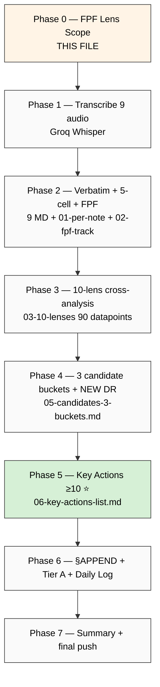

# Phase 0 — FPF Lens Scope (Batch-7)

> Foundation-Pillar-Frame (FPF) per `design/JETIX-FPF.md` B.3 explicit declaration before substrate processing. Per memory `feedback_fpf_lens_first.md`.

---

## §1 Object

**Voice Batch-7 corpus** = 9 Ruslan voice notes (mixed gap-fill 18-19.05 + fresh 20.05 morning), totalling ~56 min strategic dictation substrate. Specifically:

| # | Audio | Date | Time | Duration ~ | Role |
|---|---|---|---|---|---|
| 1 | audio_680 | 18.05 | 02:42 | 2 min | gap-fill pre-batch-4 |
| 2 | audio_681 | 18.05 | 06:04 | 14 min ⭐ | gap-fill pre-batch-4 (long deep) |
| 3 | audio_688 | 19.05 | 01:43 | 9 min | gap-fill between batch-4/5 |
| 4 | audio_692 | 19.05 | 04:49 | 4 min | gap-fill between batch-5 audio_691/693 |
| 5 | audio_693 | 19.05 | 05:35 | 5.5 min | gap-fill before batch-6 audio_694 |
| 6 | audio_697 | 20.05 | 11:18 | 14 min ⭐ | NEW (long deep) |
| 7 | audio_698 | 20.05 | 11:34 | 4 min | NEW |
| 8 | audio_699 | 20.05 | 12:25 | 2 min | NEW |
| 9 | audio_700 | 20.05 | 12:41 | 2 min | NEW |

**Total: ~56 min / 11.9 MB / 9 files.**

---

## §2 FPF layer

- **B.3 F-grade surface:** F2 verbatim (Ruslan voice direct quotes) + F2-F4 brigadier substrate analysis.
- **IP-1 strict:** Foundation роли = U.Episteme; Ruslan = instance owner; processing this corpus = abstraction substrate; NOT executor binding.
- **A.6.B append-only:** new namespace `reports/voice-pipeline-2026-05-20-batch-7/`; existing canonical docs §APPEND only.
- **A.14 provenance:** R6 per claim — `[src: audio_NNN claim N]` mandatory.
- **B.3 cross-link = mapping:** corroboration к existing substrate (5 concept docs + Platform v2 + 6 K-research + 9 Tier A/B wikis + Левенчук inventory v2 + Sprint-Synthesis-v2).

---

## §3 Acceptance predicate

Phase 0 + 7 phases complete WHEN:

1. ✅ 7 phases all commit'нуты per-phase + pushed
2. ✅ 9 transcripts generated (Phase 1)
3. ✅ 9 verbatim+5-cell per-audio MD generated (Phase 2) → 45 cell analyses в `01-per-note-breakdown.md`
4. ✅ 90 datapoints (9×10 lenses) в `03-10-lenses-cross-analysis.md` (Phase 3)
5. ✅ 3 candidate buckets surfaced (Phase 4) с NEW DR candidates
6. ✅ **≥10 key actions** extracted с per-action metadata (Phase 5) — P1/P2/P3 ranked + Step-4-input flagged subset
7. ✅ §APPEND inventory §26 + REFLECTION-INBOX + wiki/log + Daily Log §APPEND-batch-7 (Phase 6)
8. ✅ Tier A wikis auto-promoted IF acceptance criteria (verbatim Ruslan voice + ≥2 cross-batch corroboration) met; ELSE demoted к Tier B ack-pending
9. ✅ Summary ≤1500w (Phase 7) + final push origin main

**Refuted IF:**
- Any audio mis-attributed (wrong audio_NNN tag)
- Key actions count < 10
- LOCK content (Foundation / Pillar C / 8 Octagon / 5 concept docs F2 / 6 K-research / Platform v2 / Левенчук inventory v2 / Sprint-Synthesis-v2 / 6 existing Tier A wikis + 3 Tier B wikis) modified outside §APPEND
- Strategic prose written by brigadier (R1 violation)
- SKIP-list O-62 (Fund-of-Humanity) / O-66 (Triple-win) / O-67 (Здесь-и-сейчас) / O-68 (Multi-Modal) автономно promoted to Tier A

---

## §4 Constitutional posture (per-rule)

| Rule | Posture | Application |
|---|---|---|
| **R1** AI does NOT strategize | surface only | brigadier surfaces options; Ruslan = sole strategist; verbatim quotes preserve Ruslan voice |
| **R2** AI does NOT execute architectural decisions автономно | read-only LOCK | Foundation/Pillar C/8 Octagon LOCK/9 wikis/5 concept docs = read-only cross-cite; only §APPEND voice substrate sections |
| **R6** No unstructured long-term memory aggregation | provenance per claim | `[src: audio_NNN claim N]` mandatory per claim |
| **R11** Default-Deny novel actions | active | SKIP-list (O-62/O-66/O-67/O-68) honored — if повторно surface → flag bucket A.3 high-risk SKIP-confirmed; NO autonomous promotion |
| **R12** Anti-extraction | surface-check | per-monetization/distribution claim → flag if extraction pattern detected |
| **IP-1** Role≠Executor STRICT | enforced | substrate = U.Episteme abstract; Ruslan = RUSLAN-LAYER instance |
| **EP-5** F-grade explicit | enforced | F2 verbatim / F2-F4 substrate analysis explicit per claim |
| **FPF lens FIRST** | enforced | this Phase 0 file = lens-FIRST mandate |
| **append-only** | enforced | new namespace + §APPEND existing |
| **AP-6** dissent preservation | enforced | if Ruslan surface conflicting positions across audio → preserve both, не resolve автономно |

---

## §5 SKIP-list honor

Per PLAN-OF-DAY + batch-6 ack:

- ❌ **O-62 Fund-of-Humanity** — acked SKIP 19.05 evening (constitutional review pending)
- ⏸️ **O-66 Triple-win positioning** — additional gate required
- ⏸️ **O-67 «Здесь-и-сейчас» systemic pause** — additional gate required
- ⏸️ **O-68 Multi-modal methods palette** — additional gate required

**If повторно surface** в batch-7 → flag в bucket A.3 (high-risk SKIP-confirmed) с verbatim quote preservation, NO autonomous promotion.

---

## §6 LOCK-preservation manifest (read-only cross-cite source)

Files NEVER modified outside §APPEND substrate sections:

- `swarm/wiki/foundations/` (Parts 1-11 + principles/) — Foundation v1.0 LOCKED 2026-04-28
- `decisions/JETIX-VISION-FUNDAMENTAL-2026-04-27.md`
- `design/JETIX-FPF.md`
- `shared/schemas/`
- `.claude/config/default-deny-table.yaml`
- `decisions/strategic/JETIX-HACKATHON-PLATFORM-2026-05-18.md`
- `decisions/strategic/JETIX-RECURSIVE-ENGINE-2026-05-18.md`
- `decisions/strategic/JETIX-SYSTEM-MERGER-2026-05-18.md`
- `decisions/strategic/JETIX-OUTREACH-SCALABLE-2026-05-18.md`
- `decisions/strategic/JETIX-EDUCATION-LAYER-2026-05-18.md`
- `reports/sprint-synthesis-v2-2026-05-19-evening/` (4 docs)
- `research/levenchuk-corpus-inventory-v2-2026-05-19-evening/`
- `wiki/concepts/fpf-as-info-transfer-vocabulary.md`
- `wiki/concepts/mastery-formula.md`
- `wiki/concepts/persistence-beats-talent.md`
- `wiki/concepts/method-systems-thinking.md`
- `wiki/concepts/jetix-as-exokortex.md`
- `wiki/concepts/sense-of-measure.md`
- 3 batch-6 Tier B wikis (intellect-5-functional-skills / learning-knowledge-understanding-trichotomy / recursive-supportive-control-pattern)
- 8 Octagon LOCK records (H1-H8)

---

## §7 Batch-7 special: 9 audio (not 5) — scope expansion

EXPLAIN говорил «5 audio» в TL;DR но §1 Что у нас есть СЕЙЧАС перечисляет 9 (5 gap-fill 18-19.05 + 4 fresh 20.05). Ruslan ack-expanded scope per batch-7 deep-analysis prompt §1 table. **9 audio confirmed** как actual batch-7 scope.

Implication:
- 9 × 5 cell analyses = **45 cells** (not 25) в `01-per-note-breakdown.md`
- 9 × 10 lenses = **90 datapoints** (not 50)
- Per-source attribution table в `06-key-actions-list.md` § 6 → 9 rows
- Cost re-estimate: still <€4.5 (Whisper transcription cheap; analysis Claude tokens scale linear)

---

## §8 Process flow (7-phase pipeline)

---

*Phase 0 closure 2026-05-20. Acceptance predicate locked. Proceed Phase 1 — transcribe 9 audio.*
