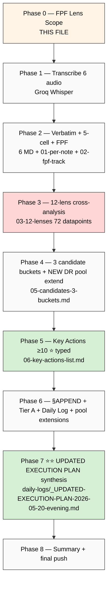

# Phase 0 — FPF Lens Scope (Batch-8)

> Foundation-Pillar-Frame (FPF) per `design/JETIX-FPF.md` B.3 explicit declaration before substrate processing. Per memory `feedback_fpf_lens_first.md`. Per Ruslan ack evening 20.05 — «акнем что в бэк-лог, что добавим прямо сейчас, потом ван-пэйджер делать».

---

## §1 Object

**Voice Batch-8 corpus** = 6 Ruslan voice notes 20.05 afternoon (15:58 → 18:13), totalling ~22 min strategic dictation substrate post-batch-7 + post-Distribution Plan + post-Левенчук distillation.

| # | Audio | Date | Time | Duration ~ | Size | Context |
|---|---|---|---|---|---|---|
| 1 | audio_701 | 20.05 | 15:58 | ~5 min | 1.05 MB | post-batch-7-execution; первая afternoon item |
| 2 | audio_702 | 20.05 | 16:35 | ~9 min ⭐ | 1.94 MB | долгий — likely deep reflection после Distribution Plan + Левенчук |
| 3 | audio_703 | 20.05 | 16:53 | ~2 min | 0.53 MB | follow-up |
| 4 | audio_704 | 20.05 | 18:03 | ~2 min | 0.52 MB | evening start |
| 5 | audio_705 | 20.05 | 18:08 | ~3 min | 0.56 MB | evening follow-up |
| 6 | audio_706 | 20.05 | 18:13 | ~2 min | 0.34 MB | evening closure |

**Total: ~22 min / 4.95 MB / 6 files.**

---

## §2 FPF layer

- **B.3 F-grade surface:** F2 verbatim (Ruslan voice direct quotes) + F2-F4 brigadier substrate analysis.
- **IP-1 strict:** Foundation роли = U.Episteme abstract; Ruslan = RUSLAN-LAYER instance owner; processing this corpus = abstraction substrate; NOT executor binding.
- **A.6.B append-only:** new namespace `reports/voice-pipeline-2026-05-20-batch-8/`; existing canonical docs §APPEND only (REFLECTION-INBOX, inventory §27, Daily Log).
- **A.14 provenance:** R6 per claim — `[src: audio_NNN claim N]` mandatory.
- **B.3 cross-link = mapping:** corroboration к **12 lenses** including NEW Distribution Plan master + Левенчук distillation (cross-link matrix + DE-RU glossary + 5 per-book highlights).

---

## §3 Acceptance predicate

Phase 0 + 9 phases complete WHEN:

1. ✅ 9 phases all commit'нуты per-phase + pushed (Phase 0..8)
2. ✅ 6 transcripts generated (Phase 1)
3. ✅ 6 verbatim+5-cell per-audio MD generated (Phase 2) → 30 cell analyses в `01-per-note-breakdown.md`
4. ✅ **72 datapoints** (6 × 12 lenses) в `03-12-lenses-cross-analysis.md` (Phase 3) — теперь 12 lenses (added L11 Distribution Plan + L12 Левенчук distillation)
5. ✅ 3 candidate buckets surfaced (Phase 4) с NEW DR candidates appended к research pool (NOT auto-launch)
6. ✅ **≥10 key actions** extracted с per-action metadata + `type:` tag (Phase 5) — P1/P2/P3 ranked + Phase-7-input flagged
7. ✅ §APPEND inventory §27 + REFLECTION-INBOX batch-8 + wiki/log + Daily Log §APPEND-batch-8 + pool extensions (Phase 6)
8. ✅ **⭐⭐ Updated Execution Plan synthesis** `daily-logs/_UPDATED-EXECUTION-PLAN-2026-05-20-evening.md` (Phase 7) ~3000w integrating ALL today substrate
9. ✅ Summary ≤1500w (Phase 8) + final push origin main

**Refuted IF:**
- Any audio mis-attributed (wrong audio_NNN tag)
- Key actions count < 10
- LOCK content (Foundation / Pillar C / 8 Octagon / 5 concept docs F2 / 6 K-research / Platform v2 / Левенчук inventory v2 / Sprint-Synthesis-v2 / 6+3+2 existing Tier A/B wikis / Distribution Plan master / Левенчук distillation outputs) modified outside §APPEND
- Strategic prose written by brigadier (R1 violation)
- SKIP-list O-62 (Fund-of-Humanity) / O-66 (Triple-win) / O-67 (Здесь-и-сейчас) / O-68 (Multi-Modal) автономно promoted to Tier A
- Research-pool pattern broken (any DR auto-launched)
- Phase 7 Updated Execution Plan missing OR not integrating Distribution Plan + Левенчук distillation + batch-7 substrate

---

## §4 Constitutional posture (per-rule)

| Rule | Posture | Application |
|---|---|---|
| **R1** AI does NOT strategize | surface only | brigadier surfaces options; Ruslan = sole strategist; verbatim quotes preserve Ruslan voice |
| **R2** AI does NOT execute architectural decisions автономно | read-only LOCK | Foundation/Pillar C/8 Octagon LOCK/9+3+2 wikis/5 concept docs/Distribution Plan/Левенчук outputs = read-only cross-cite; only §APPEND voice substrate sections |
| **R6** No unstructured long-term memory aggregation | provenance per claim | `[src: audio_NNN claim N]` mandatory per claim |
| **R11** Default-Deny novel actions | active | SKIP-list (O-62/O-66/O-67/O-68) honored — if повторно surface → flag bucket A.3 high-risk SKIP-confirmed; NO autonomous promotion |
| **R12** Anti-extraction paired-frame | enforced | per-outreach/monetization claim → flag if extraction pattern detected; paired-frame discipline в Phase 7 IA items |
| **IP-1** Role≠Executor STRICT | enforced | substrate = U.Episteme abstract; Ruslan = RUSLAN-LAYER instance |
| **EP-5** F-grade explicit | enforced | F2 verbatim / F2-F4 substrate analysis explicit per claim |
| **FPF lens FIRST** | enforced | this Phase 0 file = lens-FIRST mandate |
| **append-only** | enforced | new namespace + §APPEND existing |
| **AP-6** dissent preservation | enforced | if Ruslan surface conflicting positions across audio → preserve both, не resolve автономно |
| **Research-pool pattern** | enforced | NEW DR candidates → append к `_RESEARCH-CANDIDATES-POOL-2026-05-20.md`; NO auto-launch |

---

## §5 SKIP-list honor

Per PLAN-OF-DAY + batch-6/7 acks:

- ❌ **O-62 Fund-of-Humanity** — acked SKIP 19.05 evening (constitutional review pending)
- ⏸️ **O-66 Triple-win positioning** — additional gate required
- ⏸️ **O-67 «Здесь-и-сейчас» systemic pause** — additional gate required
- ⏸️ **O-68 Multi-modal methods palette** — additional gate required

**If повторно surface** в batch-8 → flag в bucket A.3 (high-risk SKIP-confirmed) с verbatim quote preservation, NO autonomous promotion.

---

## §6 LOCK-preservation manifest (read-only cross-cite source)

Files NEVER modified outside §APPEND substrate sections:

**Foundation / constitutional:**
- `swarm/wiki/foundations/` (Parts 1-11 + principles/) — Foundation v1.0 LOCKED 2026-04-28
- `decisions/JETIX-VISION-FUNDAMENTAL-2026-04-27.md`
- `design/JETIX-FPF.md`
- `shared/schemas/`
- `.claude/config/default-deny-table.yaml`

**8 Octagon LOCK records:**
- 8 H1-H8 strategic concept LOCKs

**5 acked concept docs F2:**
- `wiki/concepts/fpf-as-info-transfer-vocabulary.md`
- `wiki/concepts/mastery-formula.md`
- `wiki/concepts/persistence-beats-talent.md`
- `wiki/concepts/method-systems-thinking.md`
- `wiki/concepts/jetix-as-exokortex.md`
- `wiki/concepts/sense-of-measure.md`

**Tier A/B wikis (12 total):**
- 9 Tier A wikis (sprint 16-19.05)
- 3 batch-6 Tier B wikis (intellect-5-functional-skills / learning-knowledge-understanding-trichotomy / recursive-supportive-control-pattern)
- 3 batch-7 wikis (partnership-baseline / mastery-formula / persistence-beats-talent)
- 2 batch-7-fixation wikis (cheat-code-positioning / project-of-humanity-positioning)

**Distribution Plan substrate (Step 4 — locked today 20.05 afternoon):**
- `decisions/strategic/DISTRIBUTION-PLAN-2026-05-20.md` (5000w master)
- `reports/distribution-plan-research-2026-05-20/` (5 research docs + 4 mermaid)

**Левенчук distillation substrate (Step 3 — locked today 20.05 afternoon):**
- `research/levenchuk-books-distillation-2026-05-20/` (Summary + 5 per-book + cross-link matrix + DE-RU glossary + 3 mermaid)
- `raw/external/levenchuk-books-2026-05-20/converted/` (5 books full text)

**Sprint synthesis:**
- `reports/sprint-synthesis-v2-2026-05-19-evening/` (4 docs)
- `research/levenchuk-corpus-inventory-v2-2026-05-19-evening/`

**Pool documents (extendable via append only — research-pool pattern):**
- `reports/voice-pipeline-2026-05-20-batch-7/_RESEARCH-CANDIDATES-POOL-2026-05-20.md`
- `reports/voice-pipeline-2026-05-20-batch-7/_TIER-B-CANDIDATES-POOL-2026-05-20.md`

---

## §7 12 lenses substrate (Phase 3 input — was 10 in batch-7; ADDED 2 NEW)

| Lens | Source | Status |
|---|---|---|
| **L1** FPF Phase 0 corpus inventory | this document | this run |
| **L2** 5 acked concept docs F2 | wiki/concepts/ | LOCKED |
| **L3** 5 deep research outputs 18.05 + ML/AI engineers | research/ | LOCKED |
| **L4** batch-4/5/6/7 cross-refs | reports/voice-pipeline-* | LOCKED |
| **L5** 4 Octagon LOCKs H5/H6/H7/H8 | decisions/strategic/JETIX-*-2026-05-18.md | LOCKED |
| **L6** 6 K-research deep (K-1..K-6) | research/k-* | LOCKED |
| **L7** Tier A/B wikis (9+3+2 = 14) + 2 ideas (cheat-code + project-humanity) | wiki/concepts/ + wiki/ideas/ | LOCKED |
| **L8** Platform v2 + Левенчук inventory v2 (189-cell matrix) | research/levenchuk-corpus-inventory-v2/ + Platform v2 | LOCKED |
| **L9** Sprint-Synthesis-v2 + Master Packaging Step 6 roadmap | reports/sprint-synthesis-v2-2026-05-19-evening/ | LOCKED |
| **L10** Master Map full state | reports/sprint-synthesis-v2-2026-05-19-evening/01-master-map.md | LOCKED |
| **L11** ⭐ NEW Distribution Plan master + 5 research docs | decisions/strategic/DISTRIBUTION-PLAN-2026-05-20.md + reports/distribution-plan-research-2026-05-20/ | LOCKED today |
| **L12** ⭐ NEW Левенчук books distillation (5×8 matrix + DE-RU glossary + 5 per-book + 6 ⭐⭐⭐ chapters + 5 GAPS + 5 pitch hooks) | research/levenchuk-books-distillation-2026-05-20/ | LOCKED today |

**6 audio × 12 lenses = 72 datapoints** в Phase 3.

---

## §8 Process flow (9-phase pipeline)

---

## §9 Research-pool pattern preservation (mandatory)

Per memory `feedback_research_pool_pattern.md` + Ruslan ack evening 20.05:

- **NEW DR candidates** → append к `reports/voice-pipeline-2026-05-20-batch-7/_RESEARCH-CANDIDATES-POOL-2026-05-20.md` с DR-18+ numbering continuing батч-7 sequence
- **Tier B candidates** → append к `reports/voice-pipeline-2026-05-20-batch-7/_TIER-B-CANDIDATES-POOL-2026-05-20.md`
- **NO auto-launch** Whisper/Claude/etc DR runs from batch-8
- **Phase 7 Updated Plan §3** explicit lists pool extensions as backlog ack queue

---

## §10 Phase 7 ⭐⭐ special note (primary value-add)

Phase 7 = synthesis того что произошло **today** (20.05) integrated с batch-8 findings:

Inputs:
1. PLAN-OF-DAY morning (Steps 1-4 status)
2. Batch-7 16 KA + 24 candidates + 9 DR + Execution Plan
3. Step 3 Левенчук distillation (6 ⭐⭐⭐ chapters + 5 GAPS + 5 pitch hooks + 10 deep overlaps + DE-RU glossary 40 entries)
4. Step 4 Distribution Plan (5000w master + 7 risks + 10 actionable items + sequence Дмитрий → Левенчук → cascade)
5. Batch-8 NEW findings (this run — key actions + candidates + DR appended pool)

Output: `daily-logs/_UPDATED-EXECUTION-PLAN-2026-05-20-evening.md` (~3000w):
- §0 TL;DR what changed since morning
- §1 Inputs synthesised
- §2 Immediate-actionable items ≤7 days (IA-1...IA-N table)
- §3 Ack queue / Backlog (Tier B + DR pool + Левенчук deferred candidates)
- §4 Updated roadmap timeline (Week 1 → Week 4+)
- §5 Dependency map (mermaid)
- §6 Risks update vs Distribution Plan §8
- §7 READY-FOR-RUSLAN-ACK quick queue
- §8 Mermaid gantt timeline
- §9 What's after Phase 7 closure

Phase 7 = primary value-add Phase 8 of run; Phase 7 commit gate critical.

---

*Phase 0 closure 2026-05-20 evening. Acceptance predicate locked. Proceed Phase 1 — transcribe 6 audio.*
